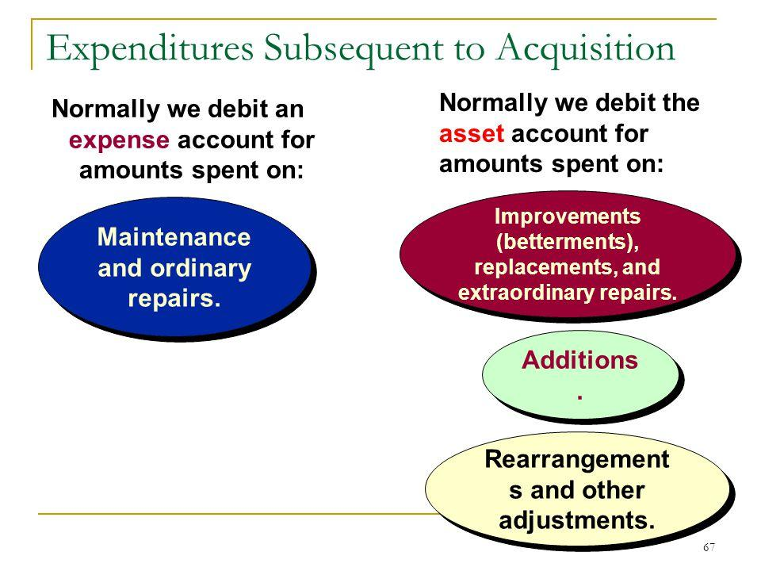

## Table of Contents

## What are extraordinary repairs?

Extraordinary repairs are major fixes or improvements made to a property that go beyond regular maintenance. These repairs are not done often and can be very expensive. They are usually needed to fix big problems or to make the property last longer. For example, replacing the roof of a building or fixing the foundation would be considered extraordinary repairs.

These types of repairs are different from ordinary repairs, which are smaller and done more often. Ordinary repairs might include things like painting walls or fixing a leaky faucet. Extraordinary repairs can affect the value of the property and might be done to make it more attractive to buyers or tenants. Because they are costly and not routine, they are often planned carefully and may require special funding or loans.

## How do extraordinary repairs differ from ordinary repairs?

Extraordinary repairs are big fixes or improvements to a property that are not done often. They cost a lot of money and are needed for big problems or to make the property last longer. For example, replacing a whole roof or fixing the foundation of a building are extraordinary repairs. These repairs can change how much the property is worth and might be done to make it more appealing to buyers or renters. Because they are expensive and not routine, people usually plan them carefully and might need special money or loans to pay for them.

Ordinary repairs, on the other hand, are smaller and done more often. They are part of regular upkeep and don't cost as much. Examples of ordinary repairs include painting walls, fixing a leaky faucet, or replacing a broken window. These repairs keep the property in good shape but don't usually change its value a lot. They are expected and budgeted for as part of normal maintenance costs.

## What is the purpose of extraordinary repairs?

Extraordinary repairs are done to fix big problems with a property or to make it last longer. These repairs are not done often and can be very expensive. For example, if the roof of a building is old and leaking, an extraordinary repair would be to replace the whole roof. This kind of repair is needed when something important is broken and needs to be fixed to keep the building safe and usable.

Another reason for extraordinary repairs is to make the property more valuable or attractive to buyers or renters. If a building's foundation is weak, fixing it can make the building worth more money. These repairs are planned carefully because they cost a lot and are not part of regular maintenance. People might need to get special loans or save up money to pay for them.

## Can you explain the mechanism behind extraordinary repairs?

Extraordinary repairs are big fixes or improvements to a property that are not done very often. They are needed when something important, like the roof or the foundation, is broken and needs to be fixed to keep the building safe and usable. These repairs are different from the small fixes, like painting or fixing a leaky faucet, that are done more often. Because extraordinary repairs are big and expensive, people usually plan them carefully and might need special money or loans to pay for them.

The process of doing an extraordinary repair starts with figuring out what needs to be fixed. This might involve hiring experts to check the property and tell what needs to be done. Once the problem is clear, people make a plan and a budget for the repair. They might need to get special permits or approvals before starting the work. Then, they hire workers or a company to do the repair. After the repair is done, people check to make sure everything is fixed right and the property is safe again.

## What are the typical costs associated with extraordinary repairs?

Extraordinary repairs can cost a lot of money because they are big fixes or improvements to a property. The cost can change a lot depending on what needs to be fixed. For example, replacing a whole roof might cost between $5,000 and $10,000 or even more, depending on the size of the roof and the materials used. Fixing a building's foundation can cost even more, sometimes tens of thousands of dollars, because it involves heavy machinery and a lot of work.

Because these repairs are so expensive and not done often, people usually need to plan carefully and might need to get special loans or save up money to pay for them. The cost can also include things like hiring experts to check the property, getting permits, and paying workers to do the repair. All these costs add up, making extraordinary repairs a big financial decision.

## Who typically performs extraordinary repairs?

Extraordinary repairs are usually done by professional workers or companies that have the right skills and tools. For example, if a building needs a new roof, a roofing company would be hired to do the job. These professionals know how to fix big problems like roofs, foundations, or major plumbing issues, and they have the equipment needed to do the work safely and correctly.

Sometimes, property owners might need to hire experts to check the property first and figure out what needs to be fixed. These experts could be engineers, architects, or building inspectors. Once they know what the problem is, they can help plan the repair and make sure it's done right. This way, the property stays safe and usable after the big repair is finished.

## What are some common examples of extraordinary repairs in residential properties?

Extraordinary repairs in residential properties are big fixes that are not done often. They can be very expensive and are needed to fix major problems or to make the property last longer. Some common examples include replacing the whole roof of a house. This is needed when the roof is old and leaking, and it can cost a lot of money. Another example is fixing the foundation of a house. If the foundation is weak or damaged, it needs to be repaired to keep the house safe and stable. This kind of repair can also be very costly and might need special equipment and workers.

Other examples of extraordinary repairs include replacing major plumbing systems, like the main water or sewer lines. If these systems are old and breaking down, they need to be replaced to keep the house working properly. Another big repair is fixing or replacing a damaged structural wall. If a wall is holding up the house and it's damaged, it needs to be fixed to keep the house safe. These repairs are not part of regular maintenance and can change how much the house is worth.

## How are extraordinary repairs accounted for in financial statements?

Extraordinary repairs are big fixes to a property that are not done often and can be very expensive. When a company or a person does an extraordinary repair, they need to show it in their financial statements. In accounting, these repairs are usually added to the value of the property. This is because they make the property last longer or fix big problems. For example, if a company replaces the roof of their building, the cost of the new roof would be added to the building's value on the balance sheet.

The cost of extraordinary repairs is not treated as an expense right away. Instead, it is spread out over the time the repair is expected to last. This is called depreciation. If the new roof is expected to last 20 years, the cost of the roof would be divided by 20 and that amount would be taken out of the property's value each year. This way, the cost of the repair is matched with the time it helps the property. This helps give a clearer picture of the company's financial health over time.

## What are the tax implications of extraordinary repairs for property owners?

When property owners do extraordinary repairs, it can affect their taxes. If the repair adds value to the property or makes it last longer, the cost of the repair can be added to the property's value on the tax return. This is called capitalizing the cost. Instead of taking the whole cost as an expense right away, the owner can spread it out over the years the repair is expected to last. This is called depreciation. By doing this, the owner can reduce their taxable income a little bit each year instead of all at once.

However, not all extraordinary repairs can be capitalized. If the repair just fixes something that was broken but doesn't add value or extend the life of the property, it might be treated as a regular repair expense. In this case, the owner can take the whole cost as an expense on their tax return in the year the repair was done. This can lower their taxable income for that year. It's important for property owners to keep good records and maybe talk to a tax professional to make sure they are doing their taxes the right way.

## How do extraordinary repairs impact the value of a property?

Extraordinary repairs can make a property worth more money. When you fix big problems like a leaky roof or a weak foundation, the property becomes safer and more usable. This makes it more attractive to buyers or renters, which can increase its value. For example, if you replace an old roof with a new one, people might be willing to pay more for the house because they won't have to worry about fixing the roof themselves.

However, the cost of these repairs can be high, and it might take time to see the value go up. If you spend a lot of money on an extraordinary repair, you might not get all that money back right away when you sell or rent the property. But over time, as people see that the property is well-maintained and has no big problems, its value can go up. So, even though extraordinary repairs are expensive, they can be a good investment in the long run.

## What are the legal considerations when undertaking extraordinary repairs?

When doing big repairs on a property, there are some legal things to think about. You might need to get permits from the local government before you start. These permits make sure the work is done safely and follows the rules. If you don't get the right permits, you could get in trouble and have to pay fines. Also, if you live in a place with a homeowners association, they might have rules about what kind of repairs you can do and how they should look. You need to check these rules before starting any work.

Another important thing is to make sure the workers you hire have the right licenses and insurance. This protects you if something goes wrong during the repair. If someone gets hurt or the property gets damaged, the insurance can help pay for it. Also, if you're renting out the property, you need to look at your lease agreement. It might say who is responsible for paying for big repairs. If you don't follow the lease, you could end up in a legal fight with your tenant.

## How can technology and innovation improve the process of extraordinary repairs?

Technology and innovation can make big repairs easier and better. New tools and machines help workers do their jobs faster and more accurately. For example, drones can check roofs and hard-to-reach places without anyone having to climb up. This makes the work safer and quicker. Also, special software can help plan the repairs and keep track of costs, making sure everything stays on budget and on time. These technologies can save money and make the repair process smoother.

Innovative materials can also help with big repairs. New types of roofing materials are stronger and last longer than old ones, so they don't need to be replaced as often. Smart home technology can spot problems early, like leaks or cracks, before they become big issues. This means repairs can be done before they turn into expensive problems. Using technology and new ideas can make big repairs less of a headache and help keep properties in good shape for longer.

## What is the understanding of extraordinary repairs?

Extraordinary repairs are significant expenditures incurred by businesses to extend the life and functionality of an asset beyond its original capacity. Unlike routine maintenance, which primarily focuses on preserving the current operational status of an asset, extraordinary repairs enhance and prolong the asset’s utility and efficiency. Consequently, these repairs are capitalized rather than expensed, influencing the asset's book value and the financial statements over several periods.

The decision to undertake extraordinary repairs is often guided by a cost-benefit analysis that weighs the expense of the repair against the potential benefits of extending the asset’s service life. For example, determining whether to replace a piece of equipment or upgrade its major components involves assessing the financial implications of extending its usability versus acquiring a new asset. This strategic decision-making aims to enhance long-term value and reduce the need for frequent asset replacements.

Capitalizing extraordinary repairs has significant accounting implications. Instead of expensing the costs in the current financial period, these expenses are added to the asset’s value on the balance sheet, thereby increasing the asset’s book value. This capitalization allows businesses to depreciate the repair costs over the remaining useful life of the asset. The following formula represents how to adjust the depreciation schedule:

$$
\text{New Annual Depreciation Expense} = \frac{\text{Original Cost} + \text{Cost of Repairs}}{\text{Revised Remaining Useful Life}}
$$

For example, consider a delivery truck with an original cost of $50,000 and a remaining useful life of 5 years. If an engine replacement costing $10,000 is classified as an extraordinary repair, the cost is capitalized. Assuming the repair extends the truck's useful life by another 3 years, the new annual depreciation expense becomes:

$$
\text{New Annual Depreciation Expense} = \frac{50,000 + 10,000}{8} = 7,500
$$

Historically, significant repairs or replacements, such as an engine rebuild for vehicles, substantial structural work on buildings, or major updates to machinery, are categorized as extraordinary repairs. These examples highlight the focus on prolonging asset effectiveness and improving operational capabilities, providing strategic financial tools for firms to enhance asset utility without immediate cash outflows reflected in operating expenses. Understanding and effectively managing extraordinary repairs are vital for businesses aiming to optimize asset performance and extend operational efficiency.

## What is the impact of capital improvements?

Capital improvements are significant modifications made to an asset, designed to enhance its value, functionality, or efficiency. These improvements stand apart from routine maintenance, as they are anticipated to provide benefits over an extended period and are therefore capitalized. This means they are reported as fixed assets on the company's balance sheet, allowing the cost of improvements to be spread over the asset's useful life through depreciation. This differs from routine maintenance costs, which are expensed in the period incurred.

The benefits of capital improvements are manifold. By investing in building extensions, organizations can increase their operational capacity. Technological upgrades can enhance productivity and efficiency, translating into cost savings and increased profitability in the long run. Renovations, meanwhile, can significantly boost a company's compliance with evolving regulations and improve the workplace environment, thus enhancing employee satisfaction.

An essential element to consider in capital improvements is their potential to impact a firm's financial ratios and overall financial health. For example, an increase in fixed assets may affect the asset turnover ratio, a measure of the company’s ability to generate sales from its assets:

$$
\text{Asset Turnover Ratio} = \frac{\text{Net Sales}}{\text{Average Total Assets}}
$$

A higher asset turnover ratio is often desirable as it indicates efficient use of assets. Thus, businesses aiming for long-term gains should strategically plan capital improvements to optimize resource allocation. By doing so, they can ensure that such investments yield returns that justify the initial capital outlay.

Incorporating capital improvements also requires thoughtful financial and strategic planning. Understanding the potential impact of these changes allows businesses to make informed decisions about resource allocation. This strategic foresight is crucial for maintaining a competitive edge and ensuring sustained growth. As businesses evolve alongside technological advancements and regulatory requirements, capital improvements become pivotal in maintaining relevance and achieving long-term organizational success.

## References & Further Reading

[1]: Bergstra, J., Bardenet, R., Bengio, Y., & Kégl, B. (2011). ["Algorithms for Hyper-Parameter Optimization."](https://dl.acm.org/doi/10.5555/2986459.2986743) Advances in Neural Information Processing Systems 24.

[2]: ["Advances in Financial Machine Learning"](https://www.amazon.com/Advances-Financial-Machine-Learning-Marcos/dp/1119482089) by Marcos Lopez de Prado

[3]: ["Evidence-Based Technical Analysis: Applying the Scientific Method and Statistical Inference to Trading Signals"](https://www.amazon.com/Evidence-Based-Technical-Analysis-Scientific-Statistical/dp/0470008741) by David Aronson

[4]: ["Machine Learning for Algorithmic Trading"](https://github.com/stefan-jansen/machine-learning-for-trading) by Stefan Jansen

[5]: ["Quantitative Trading: How to Build Your Own Algorithmic Trading Business"](https://www.amazon.com/Quantitative-Trading-Build-Algorithmic-Business/dp/1119800064) by Ernest P. Chan