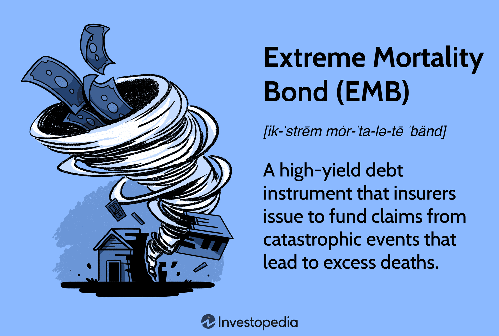

In today's complex financial landscape, managing risk in the insurance and investment sectors is crucial. Extreme Mortality Bonds (EMBs) have emerged as a fascinating intersection of insurance, financial securities, and algorithmic trading. These bonds provide insurance companies with a financial mechanism to manage liabilities that arise from catastrophic mortality events. By transferring some of the risks associated with extreme events like pandemics or large-scale natural disasters to the capital markets, insurance firms can maintain fiscal stability during challenging periods.

EMBs are designed to address specific scenarios where traditional insurance and reinsurance strategies may be inadequate due to the sheer scale and unpredictability of the risks involved. These events can severely impact not just human life but also the economic structures dependent on insurability and risk management. Consequently, the role of EMBs extends beyond mere financial instruments; they serve as strategic hedges against risks that could otherwise jeopardize the solvency of insurance providers.



In understanding the intricacies of these bonds, it is essential to acknowledge the inherent risks that come with them. EMBs offer substantial potential returns, a key feature that attracts investors who seek diversification and high yields. However, these returns are coupled with significant risk exposure, primarily due to their dependence on extreme mortality triggers, which are, by nature, highly unpredictable.

The integration of advanced algorithmic trading strategies has become increasingly relevant in managing the volatilities associated with EMBs. Algorithmic trading can enhance the precision and responsiveness of trading activities related to these high-risk securities. By analyzing extensive datasets, algorithms can detect trends and anomalies, providing insights that aid in predicting potential market movements and managing EMB risks effectively. The application of machine learning and artificial intelligence further refines these predictive capabilities, offering a sophisticated toolkit for navigating the complexities of EMB investing.

As we examine the role of EMBs within the insurance industry, it is evident that they represent an innovative solution to managing risks associated with extreme mortality events. By leveraging robust trading technologies and advanced risk management practices, they offer a unique opportunity for insurers and investors to engage with an asset class that balances high returns with strategic risk mitigation.

## Table of Contents

## Understanding Extreme Mortality Bonds

Extreme Mortality Bonds (EMBs) are a specialized type of high-yield debt instrument that serve an essential function for insurance companies in managing risks associated with catastrophic events leading to large-scale mortality. As a subset of catastrophe bonds, EMBs are crafted specifically to address scenarios resulting in an unusual increase in death rates, thus providing a vital financial buffer.

These bonds are engineered to activate in response to significant mortality events such as pandemics, natural disasters, or widespread health crises. When such an event occurs, the financial resources generated through EMBs can be deployed by insurance companies to cover extensive claims, ensuring that they maintain financial stability without draining their primary reserves. This mechanism is key to enabling insurers to respond swiftly and effectively to unprecedented payout scenarios, thereby safeguarding their operational continuity.

For investors, EMBs offer attractive returns, often significantly surpassing those of standard fixed-income securities. This is due to the higher risks associated with the unpredictable nature of the triggering mortality events. The substantial interest rates on EMBs compensate for the investor's acceptance of this heightened risk level.

Despite these inherent risks, EMBs are advantageous to portfolios due to their minimally correlated nature with traditional stock and bond markets. This low correlation makes them a valuable tool for diversification, helping to mitigate overall portfolio risk. In markets characterized by [volatility](/wiki/volatility-trading-strategies) or uncertainty, EMBs offer a distinct risk-reward profile that can enhance the strategic robustness of investor holdings.

In conclusion, EMBs are crafted to mitigate significant mortality-linked risks for insurers while simultaneously offering investors unique diversification benefits. By functioning as a bridge between the insurance sector's risk management needs and the financial market's demand for novel instruments, EMBs hold a pivotal position in the modern financial landscape.

## Risks Associated with Extreme Mortality Bonds

Extreme Mortality Bonds (EMBs) [carry](/wiki/carry-trading) inherent risks primarily due to their reliance on unpredictable catastrophic events that could result in partial or total investment loss. These bonds are structured such that their payout conditions are triggered by a significant increase in mortality rates within a specific region, exceeding established benchmarks. This reliance on extraordinary events exposes investors to a unique set of challenges and risks.

Firstly, investors need to balance the allure of high returns with the potential for substantial financial loss if a triggering event occurs. The high-yield nature of EMBs is attractive, but it comes with the understanding that events like pandemics, large-scale natural disasters, or unforeseen geopolitical disruptions could adversely affect their value. For instance, in the case of a pandemic such as COVID-19, the increase in mortality rates can activate the payout conditions of an EMB, leading to substantial losses for investors.

Furthermore, the unpredictability and severity of these events introduce complexities in risk assessment and valuation for investors. Traditional financial models often struggle to accurately incorporate the potential for extreme events due to their low probability but high impact nature. This complicates an investor's decision-making process, as historical data may not always serve as a reliable predictor for future occurrences.

From the perspective of insurance companies, EMBs serve as a financial mechanism to raise capital needed to cover claims during catastrophic scenarios. This allows insurers to manage large-scale claims without destabilizing their core financial operations. However, the trade-off involves transferring a portion of this risk to the investors in the form of EMBs. Insurers benefit from retained solvency and [liquidity](/wiki/liquidity-risk-premium), while investors accept the risk as part of their portfolio strategy.

The design of EMBs necessitates a sophisticated understanding of risk management strategies. Investors and insurers must ensure that EMB valuations and investment strategies appropriately reflect the potential risks and returns. Advanced models and risk analytics are often employed to better anticipate the likelihood and impact of extreme mortality events, aiming to safeguard both parties' interests in these financial instruments.

## Algorithmic Trading in Managing EMB Risks

Algorithmic trading has become an essential component in managing the risks associated with Extreme Mortality Bonds (EMBs). These complex financial instruments require sophisticated techniques to navigate the intricate market dynamics and inherent risks posed by extreme mortality events.

Advanced algorithms enable traders to analyze vast datasets, allowing for the prediction of potential trends and price movements in EMBs. These algorithms are designed to process and interpret historical data, current market conditions, and relevant external factors, such as weather patterns and epidemiological data, which may influence mortality rates. By incorporating [machine learning](/wiki/machine-learning) and [artificial intelligence](/wiki/ai-artificial-intelligence) methods, these algorithms can dynamically adapt to new information, improving their predictive accuracy over time.

For instance, predictive models can be constructed to forecast mortality rate spikes, which serve as triggers for EMB payouts. A simple predictive model could use historical mortality data as input variables to train a machine learning model, such as a Random Forest or a Gradient Boosting Machine, to identify patterns indicating increased risk. Below is an example of a Python code snippet to train such a model using scikit-learn:

```python
from sklearn.ensemble import GradientBoostingRegressor
from sklearn.model_selection import train_test_split
import pandas as pd

# Load historical mortality data
data = pd.read_csv('mortality_data.csv')

# Define features and target
X = data.drop('mortality_rate_spike', axis=1)
y = data['mortality_rate_spike']

# Split the data
X_train, X_test, y_train, y_test = train_test_split(X, y, test_size=0.2, random_state=42)

# Initialize and train the model
model = GradientBoostingRegressor(n_estimators=100, learning_rate=0.1, max_depth=5)
model.fit(X_train, y_train)

# Predict on new data
predictions = model.predict(X_test)
```

Algorithmic trading strategies can apply these predictive models to inform decisions, such as adjusting the holdings in an EMB portfolio or implementing hedging strategies when anticipated risks elevate to significant thresholds. Moreover, the incorporation of risk models across varied market conditions enables systematic optimization of trading strategies. These models can evaluate the potential impact of market volatilities and assess the correlation of EMBs with broader market indices or other asset classes, thereby identifying optimal points for buying or selling.

Machine learning and AI further enhance the tools available for risk management in dealing with EMBs, allowing for real-time monitoring and rapid adaptation to fluctuating market conditions. For example, [reinforcement learning](/wiki/reinforcement-learning) techniques can be used to optimize trading algorithms that learn from experience and make decisions that maximize returns while minimizing risk exposure.

By applying these sophisticated [algorithmic trading](/wiki/algorithmic-trading) techniques, market participants can effectively manage the inherent risks of Extreme Mortality Bonds, ultimately achieving a more efficient and resilient financial strategy.

## Insurance Securities and the Role of EMBs

Insurance companies utilize Extreme Mortality Bonds (EMBs) as a pivotal tool in stabilizing their financial health amid potential large-scale claims. This approach is part of a broader financial strategy involving securitization, where insurance claims are transformed into tradable financial instruments. By issuing EMBs, insurers can effectively transfer a portion of their risk to the capital markets, thereby safeguarding their reserves against unforeseen mortality spikes caused by events such as pandemics or natural disasters.

EMBs serve as a unique asset class within the financial markets, characterized by specific risk-reward profiles that differ substantially from conventional securities. These bonds provide high yield potential due to the significant risks associated with extreme mortality events, which attract investors willing to accept higher risk for the possibility of greater returns. Consequently, EMBs appeal to a spectrum of investment portfolios seeking diversification opportunities.

Diversification is a critical element in these securities, as EMBs exhibit low correlation with traditional equity and bond markets. This low correlation is advantageous in minimizing overall portfolio risk, particularly during periods of market volatility or economic uncertainty. By diversifying their investments with securities like EMBs, investors can fortify their portfolios against unpredictable fluctuations in asset prices.

Insurance companies and investors both benefit significantly from the structured methodology EMBs introduce within the insurance securities landscape. For insurers, the capital raised through these bonds provides a buffer during crises, allowing them to meet claim obligations without compromising their financial foundation. Meanwhile, investors gain access to a financial instrument offering a distinct array of risks and rewards, enhancing their overall strategic investment approach.

The integration of sophisticated risk management strategies is essential to realizing these benefits fully. By employing models and algorithms to assess potential risks associated with EMBs, stakeholders can navigate the high-stakes environment of extreme mortality events with greater precision and confidence. This strategic deployment ensures that EMBs continue to serve as a valuable instrument in bridging insurance and finance, providing stability and potential growth in an increasingly unpredictable global context.

## Conclusion

Extreme Mortality Bonds (EMBs) stand as a pioneering integration of insurance mechanisms and financial instruments, specifically designed to mitigate risks from catastrophic events resulting in high mortality rates. These bonds offer potentially high returns, which attract investors seeking diverse investment opportunities. However, they come with significant risks that require careful management by both issuers and investors. This dual potential for high reward and high risk necessitates sophisticated approaches to risk management.

Advancements in algorithmic trading provide a robust framework for managing the complexities associated with EMBs. Through the application of advanced algorithms and machine learning techniques, traders can analyze vast datasets to forecast trends and potential price movements of these securities. This predictive capability enhances decision-making processes and risk mitigation strategies, allowing for more agile responses to sudden changes in market conditions or emerging threats.

In an era marked by increasing global unpredictability, the role of EMBs, supported by sound risk management and trading technologies, becomes even more crucial in the insurance sector. These bonds serve as a vital tool for insurance companies to maintain financial stability during crisis scenarios, thus acting as a safeguard against unexpected large-scale claims. For investors, EMBs offer not only high returns but also a unique diversification benefit that complements traditional investment portfolios. The strategic utilization of EMBs exemplifies a mutually beneficial arrangement, enhancing resilience for insurers while providing investors with an asset class distinct from conventional market offerings.

## References & Further Reading

[1]: Cowley, A., & Cummins, J. D. (2005). ["Securitization of Life Insurance Assets and Liabilities."](https://onlinelibrary.wiley.com/doi/10.1111/j.1539-6975.2005.00121.x) The Journal of Risk and Insurance.

[2]: Cummins, J. D., & Weiss, M. A. (2009). ["Convergence of Insurance and Financial Markets: Hybrid and Securitized Risk-Transfer Solutions."](https://onlinelibrary.wiley.com/doi/abs/10.1111/j.1539-6975.2009.01311.x) Journal of Risk and Insurance.

[3]: Lane, M. N. (2000). ["Pricing Risk Transfer Transactions."](https://www.researchgate.net/publication/286148972_Pricing_risk_transfer_transactions) The Journal of Risk and Insurance.

[4]: Torvinen, V. (2017). ["Catastrophe Bond Pricing and the Price of Insurance Risk."](https://actuaries.org/ASTIN/Colloquia/Bergen/Christofides.pdf) ResearchGate.

[5]: Cox, S. H., & Pedersen, H. W. (2000). ["Catastrophe Risk Bonds."](https://www.semanticscholar.org/paper/Catastrophe-Risk-Bonds-Cox-Pedersen/8a83af8b0f5105605e116a68be3f6c7b87d0d5f6) North American Actuarial Journal.