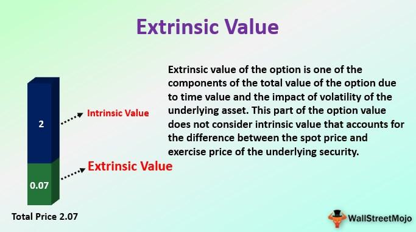

## Table of Contents

## What is extrinsic value?

Extrinsic value is the worth that something has because of outside reasons, not because of what it is by itself. For example, money has extrinsic value because people agree that it can be used to buy things, but the paper or metal it's made from isn't worth much on its own. Things like grades, trophies, or even a diploma have extrinsic value because they show others that you have achieved something, but they don't have much value just as objects.

Understanding extrinsic value is important because it helps us see why we value certain things. Sometimes, we might chase after things with high extrinsic value, like money or fame, thinking they will make us happy. But if we focus too much on these, we might miss out on things that have intrinsic value, like spending time with family or enjoying a hobby, which can bring us true happiness and fulfillment.

## How does extrinsic value differ from intrinsic value?

Extrinsic value and intrinsic value are two different ways to think about why something is valuable. Extrinsic value is about the value something has because of what it can do for us or what others think about it. For example, a diploma has extrinsic value because it can help you get a job or make people think you're smart. But the paper itself isn't worth much.

On the other hand, intrinsic value is about the value something has just because of what it is. It's the value that comes from inside the thing itself, not from what it can do for us or what others think. For example, spending time with family might have intrinsic value because it makes you feel happy and loved, no matter what anyone else thinks.

Understanding the difference between these two types of value can help us make better choices about what's really important to us. Sometimes, we might focus too much on things with extrinsic value, like money or fame, and forget about things with intrinsic value, like love and happiness. By knowing the difference, we can try to balance both and live a more fulfilling life.

## What factors influence the extrinsic value of an option?

The extrinsic value of an option is influenced by several factors that are not directly related to the option's current price. One big factor is time until the option expires. The more time there is before the option expires, the more chance there is for the price of the underlying asset to move in a favorable direction. This makes the option more valuable, so it has a higher extrinsic value. Another factor is how much the price of the underlying asset moves around, which is called volatility. If the price moves a lot, there's a bigger chance the option will end up being worth something, so its extrinsic value goes up.

Another important factor is the interest rate. When interest rates are high, the cost of holding onto the option until it expires goes up, which can increase its extrinsic value. Also, the difference between the option's strike price and the current price of the underlying asset, called the moneyness, affects extrinsic value. If the option is far away from being in the money, it might still have some extrinsic value because there's still a chance it could become valuable before it expires. All these factors together help determine how much an option is worth beyond its intrinsic value.

## How is time to expiration related to extrinsic value?

The time until an option expires is a big deal when it comes to its extrinsic value. Extrinsic value is like the extra worth an option has because it still has time left before it expires. The more time there is, the more chances the price of the thing the option is for can move in a good way. So, if an option has a long time before it expires, it's more valuable because there's more time for good things to happen. That's why options with more time left usually have a higher extrinsic value.

Think of it like a lottery ticket. If you buy a ticket a month before the drawing, it's worth more than if you buy it the day before because you have more time to dream about winning. The same goes for options. The longer you have until the option expires, the more hope there is that the price will move in your favor, and that hope adds to the option's extrinsic value.

## What role does volatility play in determining extrinsic value?

Volatility is a big factor in figuring out an option's extrinsic value. It's all about how much the price of the thing the option is for moves around. If the price is jumping up and down a lot, that's high volatility. When there's high volatility, there's a bigger chance the option's price could move in a good way before it expires. So, options with high volatility have more extrinsic value because there's more chance they'll end up being worth something.

Think of it like this: if you're betting on a horse race, you'd pay more for a bet on a horse that's known for being unpredictable. That's because there's a bigger chance it could win, even if it's not the favorite. The same goes for options. High volatility means more uncertainty, and that uncertainty makes the option more valuable because there's more chance for a big payoff. So, when the price of the underlying asset is really volatile, the extrinsic value of the option goes up.

## How can interest rates affect the extrinsic value of an option?

Interest rates can change the extrinsic value of an option. When interest rates go up, it costs more to hold onto the option until it expires. This is because you could have put your money in a bank and earned interest instead. So, when interest rates are high, the option becomes more valuable because you're giving up more potential interest to keep it. This makes the extrinsic value of the option go up.

On the other hand, when interest rates are low, it doesn't cost as much to hold onto the option. You're not missing out on much interest by keeping the option instead of putting your money in the bank. So, the option's extrinsic value goes down because it's not as costly to hold onto it. In simple terms, higher interest rates make options more expensive, and lower interest rates make them less expensive, all because of the opportunity cost of holding the option.

## What is the formula used to calculate extrinsic value?

The formula to calculate the extrinsic value of an option is pretty simple. You just take the total price of the option and subtract its intrinsic value. The intrinsic value is what the option would be worth if you used it right now. So, if the option's price is higher than its intrinsic value, the difference is the extrinsic value.

For example, let's say you have a call option with a strike price of $50, and the current price of the stock is $60. The intrinsic value of this option is $10 because if you used it right now, you could buy the stock for $50 and sell it for $60, making a $10 profit. If the total price of the option is $12, then the extrinsic value is $2. You get that by taking the total price ($12) and subtracting the intrinsic value ($10). So, the extrinsic value is what you're paying for the chance that the stock price might go even higher before the option expires.

## How do market conditions impact the extrinsic value?

Market conditions can really change the extrinsic value of an option. When the market is feeling unsure or shaky, people expect bigger price swings. This is called higher volatility. When there's more volatility, options become more valuable because there's a bigger chance the price will move in a good way before the option expires. So, in a volatile market, the extrinsic value of options goes up because people are willing to pay more for the chance of a big payoff.

On the other hand, when the market is calm and steady, there's less chance for big price moves. This means lower volatility, and options become less valuable because there's less chance for a big change in price. So, in a calm market, the extrinsic value of options goes down because people aren't as willing to pay for the chance of a big payoff. Market conditions, like how much the market is moving around, can make a big difference in what people are willing to pay for the extra value in an option.

## Can you explain the concept of theta decay in relation to extrinsic value?

Theta decay is a fancy term for how the value of an option goes down as time passes. It's all about the time until the option expires. The closer you get to the expiration date, the less time there is for the price of the thing the option is for to move in a good way. This means the option loses some of its extrinsic value because there's less chance for a big payoff. So, theta decay is like a clock ticking down, making the option less valuable as each day goes by.

Think of it like a fruit that's getting older. When you first buy the fruit, it's fresh and has a lot of time before it goes bad. But as time goes on, the fruit starts to lose its freshness and value. The same thing happens with options. When you first buy an option, it has a lot of time left, so it's more valuable. But as the expiration date gets closer, the option loses its freshness, or extrinsic value, because there's less time for good things to happen. That's theta decay in action.

## How do traders use extrinsic value in their strategies?

Traders use extrinsic value to make smart choices about buying and selling options. They know that extrinsic value is the part of an option's price that comes from things like time until it expires and how much the price of the thing the option is for moves around. So, if a trader thinks the price will stay the same or move a little, they might sell options to get the extrinsic value as profit. On the other hand, if they think the price will move a lot, they might buy options to take advantage of the higher extrinsic value that comes with more movement.

Traders also use extrinsic value to manage risk. For example, they might buy options with a lot of time left to give themselves more chances for the price to move in their favor. Or, they might sell options that are about to expire to take advantage of theta decay, which is when the option loses value as time goes by. By understanding how extrinsic value works, traders can make better decisions about when to buy or sell options, helping them make money and avoid big losses.

## What are some common misconceptions about extrinsic value?

One common misconception about extrinsic value is that it's the same as the total value of an option. But that's not true. Extrinsic value is just one part of an option's price. It's the extra value that comes from things like time until the option expires and how much the price of the thing the option is for moves around. The total value of an option is made up of both its intrinsic value, which is what the option would be worth if you used it right now, and its extrinsic value. So, it's important to know the difference between these two parts when you're looking at an option's price.

Another misconception is that extrinsic value stays the same over time. But actually, extrinsic value changes a lot. It goes down as the option gets closer to expiring, which is called theta decay. And it can go up or down depending on how much the price of the thing the option is for moves around, which is called volatility. So, extrinsic value is always changing, and traders need to keep an eye on it to make smart choices about buying and selling options.

## How can advanced models like the Black-Scholes model be used to estimate extrinsic value?

The Black-Scholes model is a fancy tool that traders use to figure out how much an option is worth. It helps them break down the option's price into its intrinsic value and extrinsic value. The model uses things like the current price of the thing the option is for, the option's strike price, how much time is left until the option expires, how much the price moves around, and even interest rates to come up with a number. By using the Black-Scholes model, traders can see how much of the option's price comes from the chance that the price will move in a good way before it expires, which is the extrinsic value.

Even though the Black-Scholes model is really helpful, it's not perfect. It makes some guesses about how the price will move, and real life can be different. But it's still a great way for traders to get a good idea of an option's extrinsic value. By understanding how the model works and what it's telling them, traders can make smarter choices about when to buy or sell options, helping them make money and manage risk better.

## What is Extrinsic Value?

Extrinsic value, also referred to as time value, is a crucial component of an option's premium, distinct from its intrinsic value. This component of the option's price accounts for the difference between the actual market price of the option and its intrinsic value. Intrinsic value is straightforwardly calculated as the difference between the current underlying asset's price and the option's strike price, considering any positive difference for options that are "in-the-money" (ITM).

Extrinsic value indicates the extra premium that traders are willing to pay based on speculative factors such as volatility and time remaining until the option's expiration. For instance, options with longer durations until expiration tend to have higher extrinsic values since there is more time for the market to experience changes that could move the option ITM. This temporal characteristic is one [factor](/wiki/factor-investing) enhancing the option's attractiveness and potential profitability.

To better understand the calculation, consider the equation:

$$
\text{Extrinsic Value} = \text{Option Premium} - \text{Intrinsic Value}.
$$

For example, if a call option has a strike price of $20 and the underlying asset is trading at $22, the intrinsic value is $2. If the total premium (price) of the option is $2.50, then the extrinsic value is $0.50. This $0.50 represents the market's valuation of factors beyond current asset prices, accounting for potential future price movements and the time value of money.

The extrinsic value becomes particularly relevant in contexts with heightened market [volatility](/wiki/volatility-trading-strategies). Greater volatility enhances the likelihood of significant price fluctuations in the underlying asset, thereby increasing the potential for the option to move ITM before expiration. Consequently, options in volatile markets often exhibit a higher extrinsic value, reflecting the increased risk and opportunity embedded within the market's environment.

Understanding extrinsic value is essential for traders as it provides insight into the market's expectations of future price shifts and helps in assessing the true worth and risk level associated with options trading strategies.

## How do you calculate extrinsic value?

Extrinsic value is a key concept in options trading, providing insights into market sentiment and price movements. To calculate extrinsic value, one must first understand the intrinsic value of the option. The intrinsic value of a call option is determined by the difference between the current price of the underlying asset and the option's strike price, provided this difference is positive. If it is negative, the intrinsic value is zero because options cannot have negative intrinsic values. For a put option, the intrinsic value is calculated as the difference between the strike price and the current price of the underlying asset, again with a minimum value of zero.

Once the intrinsic value has been determined, the extrinsic value can be calculated using the formula:

$$

\text{Extrinsic Value} = \text{Option Premium} - \text{Intrinsic Value} 
$$

Consider a concrete example: suppose a call option has a strike price of $20, and the underlying stock is currently trading at $22. The intrinsic value of this call option would be:

$$

\text{Intrinsic Value} = \$22 - \$20 = \$2 
$$

If the market price or premium for this option is $2.50, the extrinsic value would be calculated as:

$$

\text{Extrinsic Value} = \$2.50 - \$2 = \$0.50 
$$

This extrinsic value reflects the premium above the intrinsic value that traders are willing to pay, often related to the time remaining until expiration and the volatility of the underlying asset. Calculating extrinsic value allows traders to assess how much of the option's price is due to factors other than the current price difference between the asset and the strike price. This assessment is essential for making strategic decisions in trading.

## What are the factors affecting extrinsic value?

Extrinsic value, often referred to as the time value of an option, is influenced by several critical factors that traders must consider to optimize their strategies. Understanding these factors is essential in estimating how the extrinsic value can fluctuate and affect trading outcomes.

**Time to Expiration**

One of the primary factors impacting extrinsic value is the time remaining until the option's expiration. Generally, options with longer expiration periods exhibit higher extrinsic value. This is because there is a greater possibility for the underlying asset's price to move favorably, allowing the option to become in-the-money (ITM). As the expiration date approaches, the extrinsic value of the option tends to decay, a phenomenon often termed as "time decay" or "theta decay." Mathematically, the relationship can be expressed as:

$$
\text{Extrinsic Value} \propto \text{Time to Expiration}
$$

This implies that the extrinsic value diminishes as the option nears its expiration, all else being equal.

**Implied Volatility**

Implied volatility (IV) is another significant determinant of extrinsic value. It represents the market's expectation of the future volatility of the underlying asset. Higher implied volatility increases the likelihood of substantial price swings, elevating the chance that an option will end up ITM. Therefore, options with higher implied volatility are priced with greater extrinsic value. The Black-Scholes model and other option pricing models incorporate volatility to compute option prices, thus highlighting its importance. The sensitivity of an option's price to changes in implied volatility is measured by the "vega" of the option. In practical terms:

$$
\text{Extrinsic Value} \propto \text{Implied Volatility}
$$

This relationship underscores that as expected market volatility rises, so does the extrinsic value, ceteris paribus.

**Interest Rates and Dividends**

Interest rates and expected dividends of the underlying asset can also influence an option's extrinsic value. Changes in interest rates affect the cost of [carry](/wiki/carry-trading), which influences option pricing. Typically, as interest rates increase, call option prices tend to rise while put option prices may decline, though the impact on extrinsic value is more nuanced. The rationale is that higher interest rates increase the cost of holding underlying stocks, impacting options' pricing models.

Expected dividends affect options differently based on the type—calls or puts. Generally, anticipated dividends can decrease the extrinsic value of call options and increase the extrinsic value of put options. This is because expected dividend payouts reduce the expected future price of the underlying asset, influencing the probability of the option finishing ITM.

Understanding these factors allows traders to predict changes in extrinsic value and develop strategies that consider time decay, volatility fluctuations, and macroeconomic indicators like interest rates. By doing so, they can capitalize on these changes for optimized option trading.

## What is the difference between Extrinsic and Intrinsic Value?

Intrinsic and extrinsic values are key components in options trading, each influencing trading strategies in distinct ways. Intrinsic value is the immediate, tangible worth of an option. It represents the amount by which an option is in-the-money (ITM). For a call option, this is the difference between the underlying asset's current price and the option's strike price, provided the asset's price is higher. Conversely, for a put option, it is the difference between the strike price and the asset's current price, as long as the strike price is higher. Mathematically, intrinsic value can be expressed as:

- For a call option: $\text{Intrinsic Value} = \max(0, \text{Current Price} - \text{Strike Price})$
- For a put option: $\text{Intrinsic Value} = \max(0, \text{Strike Price} - \text{Current Price})$

Extrinsic value, also known as time value, accounts for any additional premium paid over the intrinsic value. This portion of the premium is dependent on various factors such as time remaining until expiration and expected future volatility. It represents the opportunity for the option to become profitable before expiration, implying potential future gains. The relationship between intrinsic and extrinsic values is fundamental for determining the total premium of an option, as given by the formula:

$$
\text{Total Premium} = \text{Intrinsic Value} + \text{Extrinsic Value}
$$

Both intrinsic and extrinsic values hold significant weight in trading decisions. Intrinsic value provides a clear assessment of an option's immediate economic benefit, focusing on current market conditions. On the other hand, extrinsic value encapsulates market expectations, incorporating potential future developments that could render an option profitable.

In algorithmic trading, the distinction between these values becomes crucial. Algorithms must accurately assess both intrinsic and extrinsic values to optimize trading strategies. Intrinsic value helps establish the baseline worth of an option. In contrast, extrinsic value offers insights into future market expectations. By integrating these values into algorithms, traders can identify opportunities where options are mispriced based on prevailing market conditions. This precise evaluation and integration of both intrinsic and extrinsic values enable traders to strategically enter and [exit](/wiki/exit-strategy) positions to optimize returns.

## References & Further Reading

[1]: Black, F., & Scholes, M. (1973). ["The Pricing of Options and Corporate Liabilities."](https://www.cs.princeton.edu/courses/archive/fall09/cos323/papers/black_scholes73.pdf) Journal of Political Economy, 81(3), 637-654.

[2]: Hull, J. C. (2012). ["Options, Futures, and Other Derivatives"](https://www.semanticscholar.org/paper/Options%2C-Futures%2C-and-Other-Derivatives-Hull/89bdee500c8623864fc9eb7a471546aa713acc44) (9th ed.). Pearson Education.

[3]: Natenberg, S. (1994). ["Option Volatility and Pricing: Advanced Trading Strategies and Techniques."](https://www.amazon.com/Option-Volatility-Pricing-Strategies-Techniques/dp/0071818774)

[4]: Haug, E. G. (2007). ["The Complete Guide to Option Pricing Formulas."](https://www.amazon.com/Complete-Guide-Option-Pricing-Formulas/dp/0071389970)

[5]: Wilmott, P. (2006). ["Paul Wilmott Introduces Quantitative Finance"](https://www.amazon.com/Paul-Wilmott-Quantitative-Finance-Set/dp/0470018704) (2nd ed.). Wiley.