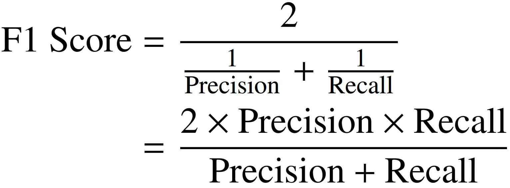

## Table of Contents

## What is an F1 score?

The F1 score is a way to measure how well a test or model works, especially when you want to know how accurate it is. It's like a score that combines two other important scores: precision and recall. Precision tells you how many of the things the model said were correct actually were correct. Recall tells you how many of the correct things the model was able to find. The F1 score is the best when both precision and recall are high, and it's a good way to see if your model is doing a good job overall.

To calculate the F1 score, you take the harmonic mean of precision and recall. This means you use a special kind of average that makes sure both precision and recall are important. The formula is 2 * (precision * recall) / (precision + recall). If the F1 score is close to 1, it means your model is doing really well. If it's close to 0, it means your model needs more work. The F1 score is really useful when you want to balance between making sure you catch all the right things and making sure you don't make too many mistakes.

## Why is the F1 score important in machine learning?

The F1 score is important in machine learning because it helps us understand how well a model is doing, especially when we care about both finding all the right things and not making too many mistakes. Imagine you're looking for apples in a big orchard. You want to find as many apples as you can (that's recall), but you also don't want to pick things that aren't apples (that's precision). The F1 score is like a special score that tells you how good you are at doing both things at the same time. It's really helpful when you need to balance these two goals.

In many real-world problems, like detecting diseases or finding fraud, it's crucial to have a good balance between precision and recall. If a model only focuses on precision, it might miss a lot of important cases. If it only focuses on recall, it might flag too many false positives. The F1 score gives us a single number that shows how well the model is doing overall. This makes it easier to compare different models and choose the one that works best for our needs. So, the F1 score is a key tool that helps us make better decisions in machine learning.

## How is the F1 score calculated?

The F1 score is calculated by finding the harmonic mean of two other important scores: precision and recall. Precision is all about how many of the things the model said were right actually were right. Recall is about how many of the right things the model was able to find. To find the F1 score, you use a special formula that makes sure both precision and recall are important. The formula is 2 times the precision times the recall, divided by the precision plus the recall. In math, it looks like this: F1 = 2 * (precision * recall) / (precision + recall).

The F1 score will be a number between 0 and 1. If the F1 score is close to 1, it means your model is doing a great job at balancing precision and recall. If it's close to 0, it means your model needs more work. This score is really helpful because it gives you one number that shows how well your model is doing overall. It's like a report card for your model that tells you if it's doing well at finding the right things without making too many mistakes.

## What are precision and recall, and how do they relate to the F1 score?

Precision and recall are two important measures that help us understand how well a model is doing. Precision is about how many of the things the model said were right actually were right. Imagine you're picking apples, and you want to make sure that most of the things you pick are really apples. If you pick 10 things and 8 of them are apples, your precision is 80%. Recall, on the other hand, is about how many of the right things the model was able to find. Going back to the apple example, if there are 20 apples in the orchard and you find 15 of them, your recall is 75%. Both precision and recall are important because they tell us different things about how well the model is working.

The F1 score is a way to combine precision and recall into one number that shows how well the model is doing overall. It's like a special average that makes sure both precision and recall are important. The formula for the F1 score is 2 times the precision times the recall, divided by the precision plus the recall. If the F1 score is close to 1, it means the model is doing a great job at balancing precision and recall. If it's close to 0, it means the model needs more work. The F1 score is really helpful because it gives us one number that shows how well the model is doing at finding the right things without making too many mistakes.

## In what scenarios is the F1 score particularly useful?

The F1 score is really useful when you need to balance finding all the right things and not making too many mistakes. Imagine you're a doctor trying to diagnose a rare disease. You want to find all the people who have the disease (that's recall), but you also don't want to tell healthy people they're sick (that's precision). The F1 score helps you see how good your test is at doing both things at the same time. It's like a report card that tells you if your test is doing a good job overall.

Another scenario where the F1 score is helpful is in detecting fraud. Banks want to catch as many fraudulent transactions as possible (high recall), but they also don't want to flag too many normal transactions as fraud (high precision). The F1 score gives them one number that shows how well their fraud detection system is working. It's a great way to compare different systems and choose the one that balances finding fraud and not bothering customers.

## Can you explain the difference between F1 score and accuracy?

F1 score and accuracy are both ways to see how good a model is, but they look at different things. Accuracy is like a simple score that tells you how many times the model got things right out of all the times it tried. It's easy to understand because it's just the number of correct guesses divided by the total number of guesses. But accuracy can be tricky if you have a lot more of one thing than another. For example, if you're trying to find a rare disease and most people don't have it, a model could seem accurate just by saying everyone is healthy, even if it misses all the sick people.

The F1 score is different because it cares about both finding all the right things (recall) and not making too many mistakes (precision). It's like a special average that makes sure both are important. The F1 score is really helpful when you need to balance these two goals. For example, if you're looking for fraud, you want to catch as much fraud as possible but also not flag too many normal transactions. The F1 score gives you one number that shows how well your model is doing at both things, which is why it's often better than accuracy when you have an uneven number of things to find.

## How does the F1 score handle imbalanced datasets?

The F1 score is really good at handling imbalanced datasets because it focuses on both precision and recall. An imbalanced dataset is when you have a lot more of one thing than another. For example, if you're looking for a rare disease, most people won't have it. Accuracy might trick you into thinking a model is good if it just says everyone is healthy, but it will miss all the sick people. The F1 score doesn't fall for this trick. It makes sure the model is good at finding the rare cases (recall) and not making too many mistakes (precision).

By using the harmonic mean of precision and recall, the F1 score gives a single number that shows how well the model is doing overall. This is really helpful when you have more of one thing than another because it balances the importance of catching all the right cases and not flagging too many wrong ones. So, if you're working with data where one thing is much rarer than another, the F1 score is a better choice than accuracy because it tells you if your model is really doing a good job at finding what's important.

## What are the limitations of using the F1 score?

The F1 score is really helpful, but it has some limitations. One big problem is that it treats precision and recall as equally important. But in some situations, you might care more about one than the other. For example, if you're trying to find a dangerous disease, you might want to catch every case even if it means making more mistakes. The F1 score doesn't let you change how much you care about precision or recall, so it might not be the best choice for every situation.

Another limitation is that the F1 score can be hard to understand if you're not used to it. It's a special kind of average that can be confusing, especially if you're more familiar with simple averages like accuracy. Also, the F1 score can be affected by how many of each thing you have in your data. If you have a lot more of one thing than another, the F1 score might not give you a clear picture of how well your model is doing. So, while the F1 score is a good tool, it's important to know its limits and use other measures too.

## How can the F1 score be used to compare different models?

The F1 score is a great way to compare different models because it gives you one number that shows how well each model is doing overall. Imagine you have two models trying to find apples in an orchard. One model finds more apples but also picks more things that aren't apples. The other model picks fewer things but is more likely to be right when it does pick something. The F1 score helps you see which model is better at balancing finding apples and not making too many mistakes.

When you compare the F1 scores of different models, you can see which one does a better job at finding the right things without making too many errors. If one model has a higher F1 score, it means it's doing a better job overall. This is really helpful when you need to choose the best model for your needs, like if you're trying to detect fraud or diagnose diseases. The F1 score makes it easier to decide which model will work best for you.

## What is the macro-average and micro-average F1 score, and when should each be used?

The macro-average F1 score and the micro-average F1 score are two ways to calculate the F1 score when you have more than one thing you're trying to find. The macro-average F1 score is like taking the average of the F1 scores for each thing separately. You find the F1 score for each thing, and then you add them up and divide by the number of things. This is good when you want to make sure each thing is treated the same, even if you have more of some things than others. It's useful when you care about how well your model does for each thing, like if you're trying to find different types of diseases and want to know how well it does for each one.

The micro-average F1 score is different because it looks at all the things together. Instead of finding the F1 score for each thing and then averaging them, you add up all the true positives, false positives, and false negatives for all the things, and then you calculate one F1 score from these totals. This is good when you have a lot more of some things than others and you want to see how well your model does overall. It's useful when you care more about the overall performance of your model, like if you're trying to detect fraud and want to know how well it does across all types of fraud.

## How does the F1 score relate to other metrics like the F-beta score?

The F1 score is a special kind of score that combines precision and recall into one number. Precision tells you how many of the things the model said were right actually were right, and recall tells you how many of the right things the model was able to find. The F1 score uses a special kind of average called the harmonic mean to make sure both precision and recall are important. But sometimes, you might care more about one than the other. That's where the F-beta score comes in. The F-beta score lets you decide how much you care about precision and recall by using a number called beta.

The F-beta score is like the F1 score, but it lets you change how much you care about precision and recall. If you set beta to 1, the F-beta score is the same as the F1 score because it treats precision and recall equally. But if you set beta to a different number, like 2, the F-beta score will care more about recall. If you set beta to 0.5, it will care more about precision. This is really helpful when you need to focus more on one thing than the other, like if you're trying to find a dangerous disease and you want to catch every case even if it means making more mistakes. So, the F-beta score is a flexible tool that lets you adjust how you measure your model's performance.

## Can you discuss advanced applications of the F1 score in multi-class classification problems?

In multi-class classification problems, the F1 score is really helpful because it can be used in different ways to understand how well a model is doing. Imagine you're trying to sort different types of fruit, like apples, oranges, and bananas. You want to know how good your model is at telling them apart. The F1 score can be calculated for each type of fruit separately, and then you can take the average of these scores. This is called the macro-average F1 score. It's good when you want to make sure your model is doing well for each type of fruit, even if you have more apples than oranges or bananas. It's like giving each fruit an equal chance to show how well the model is doing.

Another way to use the F1 score in multi-class problems is to look at all the fruit together. This is called the micro-average F1 score. Instead of finding the F1 score for each type of fruit and then averaging them, you add up all the times the model got things right or wrong for all the fruit, and then you calculate one F1 score from these totals. This is good when you have a lot more of some types of fruit than others and you want to see how well your model does overall. It's like looking at the big picture to see if your model is doing a good job at sorting all the fruit together. Both ways of using the F1 score help you understand different things about how well your model is working in multi-class classification problems.

## What is the understanding of F1 Scores?

The F1 score is a widely recognized metric in [machine learning](/wiki/machine-learning) and [statistics](/wiki/bayesian-statistics), particularly valuable in situations where a balance between precision and recall is essential. It is defined as the harmonic mean of precision and recall and is particularly useful in classification problems where there is an uneven class distribution.

Mathematically, the F1 score can be expressed as:

$$
F1 = 2 \times \left( \frac{\text{precision} \times \text{recall}}{\text{precision} + \text{recall}} \right)
$$

Here, precision is the ratio of true positive predictions to the total predicted positives:

$$
\text{Precision} = \frac{\text{True Positives}}{\text{True Positives} + \text{False Positives}}
$$

Recall, also known as sensitivity, is the ratio of true positive predictions to the actual positives (the sum of true positives and false negatives):

$$
\text{Recall} = \frac{\text{True Positives}}{\text{True Positives} + \text{False Negatives}}
$$

In the context of trading, precision pertains to the accuracy of a model in predicting profitable trades. It essentially measures the proportion of correct predictions regarding successful trades out of all trades predicted as successful. High precision means fewer false positives, which translates into fewer incorrect trades being classified as profitable.

Recall, on the other hand, evaluates the model's ability to identify all potential profitable trades. This aspect is crucial because it measures how well the model captures every opportunity for profit within the dataset. High recall indicates that the model effectively identifies most, if not all, profitable trades, minimizing missed opportunities (false negatives).

By optimizing the F1 score, traders can enhance decision-making in their strategies. The goal is to find an equilibrium where both precision and recall are maximized, thus minimizing both false positives and false negatives. This balance allows for more accurate predictions and reduces the risk of executing unprofitable trades or missing out on profitable ones. Effective use of the F1 score in [algorithmic trading](/wiki/algorithmic-trading) can therefore lead to strategies that are both robust and adaptive to market dynamics.

## What is the role of F1 scores in algorithmic trading?

In algorithmic trading, the datasets utilized by models often exhibit a significant imbalance, with fewer successful trades compared to numerous unsuccessful ones. This presents a challenge in model evaluation, as traditional metrics like accuracy can be misleading. Accuracy, defined as the ratio of correctly predicted instances to total instances, may give an overly optimistic picture when the majority of trades are unsuccessful yet correctly predicted. In such cases, the F1 score becomes essential as it provides a more nuanced evaluation of a model's performance.

The F1 score is the harmonic mean of precision and recall. Precision indicates the proportion of true positive predictions among all positive predictions (i.e., successful trades identified as such by the model), while recall measures the proportion of true positives among all actual positives. The F1 score can be mathematically expressed as:

$$
F1 = 2 \times \frac{{\text{{Precision}} \times \text{{Recall}}}}{{\text{{Precision}} + \text{{Recall}}}}
$$

Using the F1 score allows traders to strike a balance between precision and recall, ensuring that their models are both capturing as many profitable trades as possible while minimizing false alarms. This is particularly important in algorithmic trading, where trades decisions are executed at high speeds and with substantial capital. A model might be accurate in identifying the majority of trades as unsuccessful, but the high cost of missing potential successful trades underscores the value of recall in conjunction with precision.

Incorporating F1 scores in the evaluation process aids in the fine-tuning of trading algorithms. By optimizing model parameters to improve the F1 score, traders can enhance their algorithms' overall efficiency and profitability. This involves not only adjusting the model's sensitivity to capture more successful trades but also implementing effective strategies to handle the class imbalance. Techniques such as resampling, cost-sensitive learning, or advanced ensemble methods can be used to enhance a model's F1 score, thereby improving its predictive capability.

The focus on the F1 score rather than accuracy alone facilitates the identification of more resilient and profitable trading strategies. By refining models through the lens of F1 scores, traders are better equipped to make informed decisions that optimize returns and reduce risks in rapidly changing market environments.

## How can trading models be improved using F1 scores?

Optimizing F1 scores in algorithmic trading models involves fine-tuning model parameters to achieve the optimal balance between precision and recall, thereby enhancing the accuracy and reliability of trade predictions. Precision and recall are critical components in this process—precision indicates the proportion of true positive predictions among all positive predictions, while recall measures the ability of the model to identify all relevant positive instances. The F1 score, defined as the harmonic mean of precision and recall, is given by the formula:

$$
F1 = 2 \times \frac{{\text{{Precision}} \times \text{{Recall}}}}{{\text{{Precision}} + \text{{Recall}}}}
$$

Focusing on F1 scores during model development and evaluation provides a more nuanced view of a model's predictive power compared to accuracy alone, especially in cases with imbalanced datasets.

One effective method for improving the F1 score is through rigorous [backtesting](/wiki/backtesting), a process where historical market data is used to simulate trades and analyze the model's performance. By backtesting strategies with a focus on F1 scores, traders can identify specific areas where the model may produce false positives (incorrectly predicted as successful trades) or false negatives (missed profitable opportunities). This feedback allows for iterative adjustments in strategy, leading to enhanced performance.

Further enhancement of F1 scores can be achieved through careful feature selection and model tuning. Selecting the right features is crucial, as irrelevant or redundant data can obscure the underlying patterns within the market, reducing the predictive capability of the model. Algorithms such as Recursive Feature Elimination (RFE) or Random Forests can be employed to rank the importance of features and select those which contribute most significantly to model performance.

Model tuning involves adjusting hyperparameters to balance precision and recall effectively. Techniques such as Grid Search or Random Search can be utilized to explore various hyperparameter combinations, optimizing them to reach the best possible F1 score. For example, in a machine learning model like a support vector machine (SVM), adjusting the kernel or regularization parameter might yield substantial improvements in precision and recall trade-offs.

Below is a simple Python snippet demonstrating how to optimize an F1 score using the Grid Search method:

```python
from sklearn.model_selection import GridSearchCV
from sklearn.svm import SVC
from sklearn.metrics import make_scorer, f1_score

# Sample data
X_train, y_train = ...

# Define the model
model = SVC()

# Set up parameter grid
param_grid = {
    'C': [0.1, 1, 10],
    'kernel': ['linear', 'rbf']
}

# Define the scoring method
scorer = make_scorer(f1_score, average='weighted')

# Set up grid search
grid_search = GridSearchCV(model, param_grid, scoring=scorer, cv=5)

# Fit the model
grid_search.fit(X_train, y_train)

# Best hyperparameters
best_parameters = grid_search.best_params_
```

By honing in on the elements that influence precision and recall through strategic optimizations, traders can develop more robust algorithmic trading strategies that are resilient to market [volatility](/wiki/volatility-trading-strategies) and better aligned with profitability goals.

## References & Further Reading

[1]: Bergstra, J., Bardenet, R., Bengio, Y., & Kégl, B. (2011). ["Algorithms for Hyper-Parameter Optimization."](https://papers.nips.cc/paper/4443-algorithms-for-hyper-parameter-optimization) Advances in Neural Information Processing Systems 24.

[2]: ["Advances in Financial Machine Learning"](https://www.amazon.com/Advances-Financial-Machine-Learning-Marcos/dp/1119482089) by Marcos Lopez de Prado

[3]: ["Evidence-Based Technical Analysis: Applying the Scientific Method and Statistical Inference to Trading Signals"](https://www.amazon.com/Evidence-Based-Technical-Analysis-Scientific-Statistical/dp/0470008741) by David Aronson

[4]: ["Machine Learning for Algorithmic Trading"](https://github.com/stefan-jansen/machine-learning-for-trading) by Stefan Jansen

[5]: ["Quantitative Trading: How to Build Your Own Algorithmic Trading Business"](https://books.google.com/books/about/Quantitative_Trading.html?id=j70yEAAAQBAJ) by Ernest P. Chan