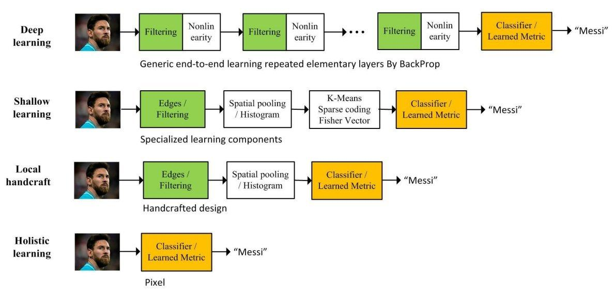

## Table of Contents

## What is face detection in the context of machine learning?

Face detection in machine learning is a technology that helps computers find and recognize human faces in pictures or videos. It works by looking at the different parts of an image and figuring out if any of those parts look like a face. This is done using special algorithms that can tell the difference between faces and other objects. These algorithms are trained on lots of pictures of faces so they can learn what faces typically look like.

Once the computer thinks it has found a face, it draws a box around it to show where the face is in the image. This can be useful for many things, like tagging friends in photos on social media, or helping security cameras find people in a crowd. Face detection is often the first step in more advanced tasks, like face recognition, where the computer tries to figure out who the person is, not just that there is a face.

To make face detection work well, machine learning experts use different methods. One popular way is using something called a convolutional neural network (CNN), which is good at understanding images. The CNN looks at the image in small pieces and then puts those pieces together to see if they form a face. This method has become very accurate and is used in many apps and devices today.

## How does face detection differ from face recognition?

Face detection and face recognition are two different steps in the process of analyzing faces in images or videos. Face detection is about finding where faces are in a picture. It looks at the image and tries to spot any faces by drawing boxes around them. This step doesn't care who the faces belong to; it just wants to know if there are faces and where they are. For example, when you take a photo on your phone, it might automatically detect faces and suggest you tag them.

On the other hand, face recognition goes a step further. After a face is detected, face recognition tries to figure out who that face belongs to. It compares the detected face to a database of known faces to find a match. This is what happens when you unlock your phone with your face or when security cameras try to identify people. Face recognition needs face detection to work first because it can't identify someone if it doesn't know where the face is in the image.

Both technologies use [machine learning](/wiki/machine-learning), but they serve different purposes. Face detection is like finding a needle in a haystack, while face recognition is like figuring out if that needle is a special one you've seen before. They often work together to make systems that can both find and identify faces, which is useful in many applications, from social media to security.

## What are the basic steps involved in training a face detection model?

Training a face detection model involves several key steps that help the model learn to spot faces in images. First, you need to gather a large dataset of images that contain faces. These images should be diverse, showing faces of different people, in various lighting conditions, and from different angles. You label these images by drawing boxes around the faces, so the model knows exactly where the faces are. This labeled data is split into a training set, which the model uses to learn, and a validation set, which is used to check how well the model is doing as it learns.

Next, you choose an algorithm for the model. A popular choice is a [convolutional [neural network](/wiki/neural-network)](/wiki/convolutional-neural-network) (CNN) because it's good at understanding images. You feed the training data into the CNN, and it starts to learn by adjusting its internal parameters to better recognize faces. The model goes through many rounds of training, where it makes predictions on the training images, compares those predictions to the actual labels, and updates its parameters to improve. This process is called backpropagation, and it helps the model get better at detecting faces. You keep an eye on the model's performance using the validation set to make sure it's not just memorizing the training data but actually learning to spot faces in new images.

Once the model performs well on the validation set, you test it on a separate test set to see how it does with completely new images. If it does well, you can use the model to detect faces in new images or videos. If it doesn't perform well, you might need to go back and gather more data, tweak the model's architecture, or adjust the training process. Training a face detection model is a cycle of gathering data, training, validating, and testing until you get a model that works well in the real world.

## What is TinaFace and how does it perform face detection?

TinaFace is a new way to find faces in pictures that was made by researchers at the University of Science and Technology of China. It's really good at spotting faces, even if they are small or if the picture is not very clear. TinaFace uses a special kind of computer program called a neural network to look at pictures and figure out where the faces are. This neural network is trained on lots of pictures so it can learn what faces look like in different situations.

When TinaFace looks at a picture, it breaks it down into tiny pieces and checks each piece to see if it might be part of a face. If it finds something that looks like a face, it draws a box around it to show where the face is. TinaFace is very fast and accurate, which makes it useful for things like security cameras or apps on your phone that need to find faces quickly and correctly.

## What are the key features that distinguish TinaFace from other face detection models?

TinaFace stands out from other face detection models because it is really good at finding small faces and faces in pictures that are not very clear. It uses a special kind of computer program called a neural network that is trained to look at pictures in a very detailed way. This helps TinaFace spot faces even when they are tiny or when the picture is blurry. Other models might miss these faces, but TinaFace is designed to catch them, making it more useful in real-life situations where pictures are not always perfect.

Another thing that makes TinaFace different is how fast and accurate it is. It can look at a picture and find all the faces in it very quickly, which is important for things like security cameras that need to work in real time. TinaFace also does a good job of not making mistakes, so it doesn't draw boxes around things that are not faces. This makes it reliable for use in apps and devices where you need to trust that the face detection is correct.

## How does TinaFace handle different lighting conditions and angles?

TinaFace is really good at finding faces even when the lighting is not perfect or when the faces are at different angles. It uses a special kind of computer program called a neural network that is trained on lots of pictures. These pictures show faces in all sorts of lighting, from bright sunlight to dark shadows, and faces turned in different ways. By looking at all these different pictures, TinaFace learns how to spot faces no matter how the light is or which way the face is turned.

When TinaFace looks at a new picture, it breaks it down into tiny pieces and checks each piece to see if it might be part of a face. Even if the face is in a dark corner or turned to the side, TinaFace can still find it because it has seen so many different kinds of faces during its training. This makes TinaFace very useful for real-life situations where pictures are not always taken in perfect conditions.

## What datasets are commonly used to train and evaluate face detection models like TinaFace?

Face detection models like TinaFace are trained and evaluated using large collections of images called datasets. Some of the most commonly used datasets include the WIDER FACE dataset, which has over 32,000 images with more than 393,000 labeled faces. These images show faces in different sizes, lighting conditions, and angles, which helps the model learn to spot faces in all sorts of situations. Another popular dataset is the FDDB (Face Detection Data Set and Benchmark), which contains 5,171 faces in 2,845 images, focusing on faces in different poses and with varying levels of occlusion.

In addition to WIDER FACE and FDDB, the PASCAL Face dataset is also widely used. It has 851 images with 1,341 labeled faces and is known for its diverse set of images, including faces in different lighting and from various angles. These datasets are crucial because they provide a wide variety of examples for the model to learn from, helping it to become more accurate and reliable in real-world applications. By using these datasets, models like TinaFace can be trained to handle different challenges, such as detecting small faces or faces in low light, making them more effective in practical use.

## What are the performance metrics used to evaluate the accuracy of face detection models?

The performance of face detection models like TinaFace is measured using several key metrics. One of the most important metrics is the Average Precision (AP), which looks at how well the model can find faces and how accurate those findings are. AP is calculated by looking at the precision and recall of the model. Precision measures how many of the faces the model found were actually faces, while recall measures how many of the real faces in the image the model was able to find. A higher AP means the model is better at finding faces without making many mistakes.

Another important metric is the Intersection over Union (IoU), which checks how well the model's predicted face boxes match the actual face boxes. The IoU is calculated using the formula $$ \text{IoU} = \frac{\text{Area of Overlap}}{\text{Area of Union}} $$. If the IoU is high, it means the model's boxes are very close to the real face locations. Models are often evaluated at different IoU thresholds to see how well they perform under different levels of accuracy. Together, these metrics help researchers and developers understand how well a face detection model like TinaFace works in different situations and how it can be improved.

## How can face detection models be optimized for real-time applications?

To make face detection models work well in real-time, they need to be fast and accurate. One way to do this is by using special computer chips called GPUs, which can handle lots of math problems at the same time. This makes the model run faster. Another way is to make the model smaller, which means using fewer layers and parameters in the neural network. A smaller model uses less computer power, so it can find faces more quickly. Researchers also use something called pruning, which is like trimming away parts of the model that don't help much, making it faster without losing too much accuracy.

Another important thing is to use the right algorithms. For example, using a technique called "single-shot detectors" can help the model find faces in one go, instead of looking multiple times. This makes the process quicker. Also, models can be trained to focus on the most important parts of an image first, so they don't waste time on parts that don't have faces. By combining these methods, face detection models can work well in real-time situations, like on security cameras or in apps on your phone, where speed and accuracy are both important.

## What are the challenges faced when deploying face detection models in diverse environments?

Deploying face detection models in diverse environments can be tricky because real-world conditions are often different from the controlled settings where the models are trained. For example, lighting can change a lot, from bright sunlight to dim indoor light, which can make it hard for the model to spot faces. Also, people might wear hats, glasses, or masks, which can hide parts of their faces and make detection more difficult. Another challenge is that faces can appear at different angles and sizes in pictures, so the model needs to be good at recognizing faces no matter how they look.

To make face detection work well in all these different situations, the model needs to be trained on a wide variety of images. This means using datasets that show faces in all sorts of lighting, with different accessories, and from many angles. Even with good training data, the model might still struggle in some environments, like very crowded scenes where faces can be small and hard to see. Researchers and developers need to keep working on improving the models, making them faster and more accurate, so they can handle the challenges of real-world use.

## How does TinaFace integrate with other machine learning models for enhanced functionality?

TinaFace can work together with other machine learning models to do more than just find faces. For example, after TinaFace spots a face in a picture, it can pass that information to a face recognition model. This other model can then figure out who the person is by comparing the face to a database of known faces. By combining TinaFace with face recognition, you can make apps that not only find faces but also identify them, which is useful for things like security systems or social media tagging.

Another way TinaFace can be used with other models is for tasks like emotion detection. Once TinaFace finds a face, an emotion detection model can analyze the face to see if the person is happy, sad, or angry. This can be helpful in areas like customer service, where understanding how a person feels can improve how they are helped. By integrating TinaFace with other specialized models, it becomes part of a bigger system that can do more complex tasks, making it more useful in real-world applications.

## What are the latest advancements in face detection technology beyond TinaFace?

Beyond TinaFace, recent advancements in face detection technology include models that are even better at finding faces in tough situations. One example is the RetinaFace model, which uses a special technique called "feature pyramid network" to look at pictures in different levels of detail. This helps RetinaFace find faces no matter how big or small they are, even if they are partly hidden or in bad lighting. RetinaFace also uses something called "extra supervision" to make sure it's really good at figuring out where the face is, not just if there's a face. This makes it very accurate, even in crowded scenes or when the pictures are not clear.

Another advancement is the use of lightweight models like YOLO-Face, which stands for "You Only Look Once - Face". YOLO-Face is designed to be fast and work well on devices like phones and cameras that need to find faces quickly. It uses a single pass through the image to spot faces, which means it can work in real-time without needing a lot of computer power. This makes it great for apps and systems where speed is important. By combining these new models with other technologies, like face recognition and emotion detection, face detection systems are becoming more powerful and useful in everyday life.

## References & Further Reading

[1]: Yang, S., Luo, P., Loy, C. C., & Tang, X. (2016). ["WIDER FACE: A Face Detection Benchmark."](https://ieeexplore.ieee.org/document/7780965) IEEE Conference on Computer Vision and Pattern Recognition (CVPR).

[2]: Zhang, K., Zhang, Z., Li, Z., & Qiao, Y. (2016). ["Joint Face Detection and Alignment using Multi-task Cascaded Convolutional Networks."](https://ieeexplore.ieee.org/document/7553523) IEEE Signal Processing Letters.

[3]: Deng, J., Guo, J., Zhou, Y., Yu, J., Kotsia, I., & Zafeiriou, S. (2020). ["RetinaFace: Single-shot Multi-level Face Localisation in the Wild."](https://ieeexplore.ieee.org/document/9157330) IEEE Conference on Computer Vision and Pattern Recognition (CVPR).

[4]: Jiang, H., Learned-Miller, E. (2017). ["Faces in the Wild: A Large-Scale Study of Real-World Compliance with Face Detection Systems."](https://www.ccdc.cam.ac.uk/structures/) IEEE Conference on Computer Vision and Pattern Recognition (CVPR).

[5]: Lin, T.-Y., Dollár, P., Girshick, R., He, K., Hariharan, B., & Belongie, S. (2017). ["Feature Pyramid Networks for Object Detection."](https://ieeexplore.ieee.org/document/8099589) IEEE Conference on Computer Vision and Pattern Recognition (CVPR).

[6]: Sun, Y., Wang, X., & Tang, X. (2014). ["Deep Learning Face Representation from Predicting 10,000 Classes."](https://ieeexplore.ieee.org/document/6909640) IEEE Conference on Computer Vision and Pattern Recognition (CVPR).

[7]: Zhang, S., Wen, L., Bian, X., Lei, Z., & Li, S. Z. (2019). ["Single-Shot Scale-Aware Network for Real-Time Face Detection."](https://arxiv.org/abs/1711.06897) IEEE Transactions on Image Processing.