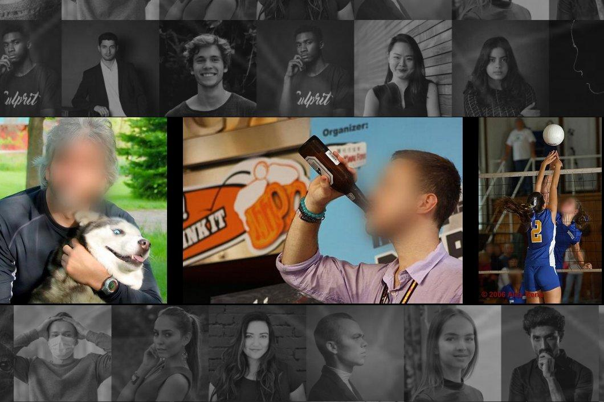

## Table of Contents

## What is face privacy and why is it important?

Face privacy refers to the protection of personal information that can be gathered from someone's face, like their identity, emotions, or even health data. With the rise of technology, like cameras and facial recognition software, it's easier than ever for companies or even strangers to collect this information without our permission. This can happen in public spaces, through social media, or even when we're using our own devices.

It's important to protect face privacy because it helps keep our personal lives private. If someone can easily find out who we are, where we go, or how we're feeling just by looking at our face, it can lead to problems like identity theft, unwanted tracking, or even discrimination. By being aware of face privacy and taking steps to protect it, we can feel safer and more in control of our own information.

## How does machine learning impact face privacy?

Machine learning has a big impact on face privacy because it makes it easier for computers to recognize and understand faces. With machine learning, computers can learn to pick out faces in pictures or videos, figure out who they belong to, and even guess things like age, gender, or emotions. This technology is used in things like security cameras, social media apps, and even unlocking phones. But, it also means that our faces can be watched and tracked without us knowing, which can make our private information less safe.

Because [machine learning](/wiki/machine-learning) is so good at recognizing faces, it can be used in ways that might not be good for our privacy. For example, companies might use it to follow what we do and where we go, and then use that information to show us ads or even sell it to other people. Governments might use it to keep an eye on people in public places. This can make us feel like we're always being watched, and it can be hard to stop because the technology keeps getting better and better. So, it's important to think about how we can use machine learning in a way that respects our right to privacy.

## What are common threats to face privacy?

One common threat to face privacy comes from surveillance cameras in public places. These cameras can capture our faces and use facial recognition technology to identify us without our permission. This means that governments or private companies can track where we go and what we do, which can feel like an invasion of our privacy. For example, if we go to a protest, the cameras might record our faces and use that information against us later.

Another threat comes from social media and online platforms. When we post pictures or videos of ourselves, facial recognition software can analyze these images and gather information about us. This information can be used to target us with ads, or even be sold to other companies. It's also possible for bad actors to use this data to steal our identity or impersonate us online, which can lead to serious problems.

Lastly, there's the risk of data breaches. If a company that uses facial recognition technology gets hacked, all the information they have about our faces could be stolen. This means that our private information could end up in the hands of people who might use it to harm us. It's important for companies to keep our data safe, but sometimes they don't do a good enough job, and that puts our face privacy at risk.

## What is Fawkes and how does it protect face privacy?

Fawkes is a tool that helps protect your face privacy from facial recognition technology. It works by making small changes to your photos that are hard for humans to see but trick facial recognition systems. When you use Fawkes on your photos before sharing them online, it makes it much harder for these systems to recognize your face. This way, even if someone tries to use your photos to track you or steal your identity, the facial recognition software won't be able to match your face correctly.

Fawkes is easy to use and can be a big help in keeping your face private. All you need to do is upload your photos to the Fawkes tool, and it will change them slightly to protect your privacy. By doing this, you can feel safer about sharing your photos online, knowing that facial recognition technology will have a harder time using them against you. It's a simple but powerful way to take control of your face privacy in a world where cameras and computers are always watching.

## How does Fawkes use machine learning to alter images?

Fawkes uses machine learning to make small changes to your photos that trick facial recognition systems. It does this by learning what these systems look for in faces and then changing your photo just enough so that it looks the same to you but different to the computer. This is called "adversarial perturbation," where the changes are so small that humans can't see them, but they make the computer think it's looking at a different person.

When you use Fawkes, it takes your photo and adds these tiny changes all over it. The changes are designed to confuse the facial recognition software, making it think your face is someone else's. This way, even if someone uses your photo to try to track you or steal your identity, the facial recognition system will get it wrong. By using machine learning, Fawkes can keep up with the latest facial recognition technology and keep your face private.

## What are the limitations of Fawkes in protecting face privacy?

Fawkes is a great tool for protecting face privacy, but it does have some limitations. One big limitation is that it only works on the photos you change with it. If someone takes a new photo of you, or if they find an old photo that you haven't used Fawkes on, the facial recognition systems can still recognize you. This means you have to use Fawkes on every photo you share online, which can be a lot of work.

Another limitation is that Fawkes might not work against all types of facial recognition systems. As these systems get better and better, they might find ways to see through the changes Fawkes makes. This means that while Fawkes can help now, it might not be as good in the future. Also, if you change your photo too much with Fawkes, it might start to look weird to other people, even if they can't see the changes clearly.

So, while Fawkes is a helpful tool, it's not a perfect solution. You still need to be careful about where and how you share your photos, and keep up with new ways to protect your privacy. Using Fawkes along with other privacy tools and being smart about what you share online can help keep your face private.

## What is PrivacyNet and how does it differ from Fawkes?

PrivacyNet is another tool that helps protect your face privacy from facial recognition technology. It works by adding special patterns to your photos that confuse the facial recognition systems. These patterns are designed to make it hard for the computer to recognize your face, but they are usually more visible than the changes made by Fawkes. PrivacyNet can be used to protect your privacy in real-time, which means it can work on live video feeds as well as still photos.

The main difference between PrivacyNet and Fawkes is how they change your photos. Fawkes makes very small changes that are hard for humans to see, while PrivacyNet adds more noticeable patterns. This means that PrivacyNet might be easier to use because you don't need to change every photo you share, but it might also make your photos look different to other people. Both tools are helpful for protecting your face privacy, but they work in different ways and might be better for different situations.

## How does PrivacyNet utilize machine learning to enhance face privacy?

PrivacyNet uses machine learning to add special patterns to your photos that trick facial recognition systems. It learns how these systems work and then creates patterns that confuse them. When you use PrivacyNet, it puts these patterns on your face in the photo, making it hard for the computer to recognize you. This is different from just hiding your face because the patterns are designed to mess up the computer's understanding of your face, not just cover it up.

The way PrivacyNet uses machine learning is smart because it can work on live video as well as still photos. This means it can protect your privacy in real-time, which is really helpful if you're worried about being watched by cameras in public places. While the patterns might be more noticeable than the changes made by other tools like Fawkes, they are still a good way to keep your face private and safe from being tracked or used without your permission.

## What are the effectiveness metrics used to evaluate PrivacyNet?

The effectiveness of PrivacyNet is measured by how well it can trick facial recognition systems. Researchers look at something called the "attack success rate," which is the percentage of times PrivacyNet's patterns make the facial recognition system fail to identify a person correctly. They also check the "recognition rate," which is how often the system can still recognize a face even with the patterns added. A good PrivacyNet should have a high attack success rate and a low recognition rate, meaning it's good at fooling the computers.

Another important metric is the "visual quality" of the images after PrivacyNet adds its patterns. This is measured by how much the patterns change the way the photo looks to a human. If the patterns are too obvious, people might not want to use PrivacyNet because their photos won't look normal. So, researchers try to find a balance where the patterns are strong enough to fool computers but not so strong that they ruin the photo for humans.

## How can face privacy solutions like Fawkes and PrivacyNet be integrated into existing systems?

Face privacy solutions like Fawkes and PrivacyNet can be integrated into existing systems by adding them as part of the photo processing pipeline. This means that whenever a photo is taken or uploaded, the system automatically applies the Fawkes or PrivacyNet algorithm to change the image before it is shared or stored. For example, social media platforms could include these tools in their upload process, so every photo a user posts gets the privacy protection without the user needing to do anything extra. This integration can be done by developers who add the necessary code to the system's software, making sure it works smoothly with other features.

Another way to integrate these tools is by creating browser extensions or mobile apps that users can install. These extensions or apps would work in the background, automatically changing photos before they are shared online. For instance, a browser extension could modify photos as they are uploaded to a website, while a mobile app could process images taken with the camera before they are saved or shared. This approach gives users more control over their privacy and can be used across different platforms without needing to change the platforms themselves.

## What are the ethical considerations when using machine learning for face privacy?

When using machine learning for face privacy, it's important to think about the ethical side of things. One big question is about consent. Should people be able to choose if their photos are changed by tools like Fawkes or PrivacyNet? These tools can help keep our faces private, but they also change our photos without us always knowing. It's important to make sure people understand what's happening to their photos and give them a say in it. Also, we need to think about fairness. If these tools work better for some people than others, like if they work better on lighter skin than darker skin, that's not fair. Everyone should be able to protect their privacy the same way.

Another thing to consider is the balance between privacy and security. While tools like Fawkes and PrivacyNet can stop facial recognition from tracking us, they might also make it harder for the good guys to use this technology. For example, police might use facial recognition to find missing people or catch criminals. If everyone's using these privacy tools, it could make it harder to do that. We need to find a way to protect our privacy without making it too hard for important security work. It's all about finding the right balance so that we can feel safe and private at the same time.

## What future developments can we expect in the field of face privacy using machine learning?

In the future, we can expect machine learning to play an even bigger role in protecting face privacy. As facial recognition technology gets better and better, tools like Fawkes and PrivacyNet will need to keep up. This might mean making the changes to photos even harder for computers to see but still easy for people to understand. Researchers might also find new ways to protect our privacy, like using machine learning to change our faces in real-time on our phones or computers. This could make it even easier for us to stay private without having to think about it too much.

Another thing we might see is more focus on making sure face privacy tools work well for everyone. Right now, some tools might work better on certain skin colors or face shapes. In the future, machine learning could be used to make sure these tools are fair and work the same for everyone. This would mean more people can feel safe and private, no matter what they look like. As technology keeps changing, finding the right balance between privacy and security will be important, so we can all feel safe and private at the same time.