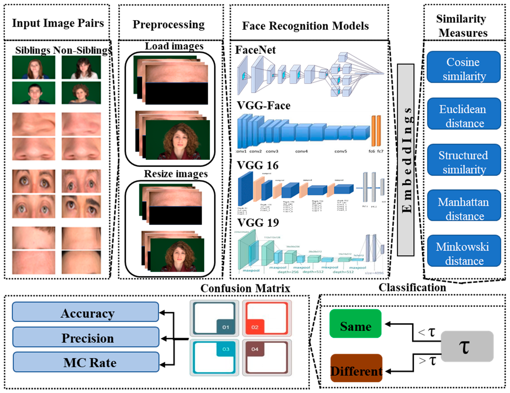

## Table of Contents

## What is face recognition and how does it work?

Face recognition is a technology that identifies or verifies a person from a digital image or video source. It works by comparing the features of a face in an image to the faces stored in a database. This technology is used in many places, like unlocking smartphones, security systems, and even in social media to tag friends in photos.

The process of face recognition starts with detecting a face in an image. Once a face is detected, the system analyzes key features like the distance between the eyes, the shape of the jawline, and other facial landmarks. These features are then converted into a numerical code, called a faceprint, which is unique to each individual. This faceprint is compared to the faceprints stored in a database to find a match. If a match is found, the system can confirm the identity of the person.

In simple terms, face recognition is like a high-tech version of how we recognize our friends and family. Instead of our brains remembering faces, a computer does it by turning faces into numbers and comparing them to a list of known faces. This technology keeps getting better as computers learn from more and more images.

## What are the main applications of face recognition technology?

Face recognition technology is used in many different ways to make life easier and safer. One common use is unlocking smartphones. When you look at your phone, it can recognize your face and let you in without needing a password. This is very convenient and quick. Another important use is in security systems. Airports, banks, and other places use face recognition to check if people are who they say they are. This helps keep these places safe by spotting people who might cause trouble.

Another big use of face recognition is in social media. When you upload a photo, the app can find your friends' faces and suggest tagging them. This makes sharing photos with friends easier. Also, face recognition is used by the police to find missing people or catch criminals. They can scan crowds or use security cameras to look for specific faces. This can help solve crimes faster and find people who are lost.

In addition to these, face recognition is used in stores to help with shopping. Some stores use it to see who their customers are and suggest things they might like to buy. It's also used in healthcare to help doctors and nurses quickly find the right patient records. This can make taking care of patients faster and more accurate. Overall, face recognition technology helps in many areas by making things more secure, convenient, and efficient.

## What are the differences between MFR and NFR face recognition models?

MFR stands for Multi-Face Recognition, which means it can recognize many faces at the same time. Imagine you are at a party with lots of people. MFR can look at a photo of the party and find and name many of the people in it. This is useful in places like airports or big events where you need to check many faces quickly. MFR works by comparing each face it sees to a big list of known faces. If it finds matches, it can tell you who those people are.

NFR, or Neural Face Recognition, uses special computer programs called neural networks to recognize faces. These programs are like brains that learn from lots of pictures. NFR can get better over time as it sees more faces. It's good for things like unlocking your phone or tagging friends in photos on social media. NFR works by turning a face into a special code, called a faceprint, and then comparing this code to other faceprints it knows. If the codes match, it knows who the person is.

Both MFR and NFR are used to recognize faces, but they do it in different ways. MFR is better at looking at many faces at once, while NFR can get better at recognizing faces the more it learns. Depending on what you need, you might choose one over the other.

## How does MagFace improve upon traditional face recognition models?

MagFace is a new kind of face recognition model that makes recognizing faces more accurate and reliable. It does this by using something called "adaptive margin" which helps the model learn better from different faces. Traditional models might struggle with faces that look very similar or are taken in different lighting. MagFace solves this by adjusting how it looks at faces, making it better at telling them apart, even if they are hard to tell apart.

The way MagFace works is by using a special math formula to figure out how far apart faces are in its "face space." This helps it understand the small differences between faces better. For example, if two people look a lot alike, MagFace can still tell them apart because it pays attention to the tiny details that make each face unique. This makes MagFace a big step forward in face recognition technology, making it more useful in places like security systems where telling people apart accurately is very important.

## What unique features does CurricularFace bring to face recognition?

CurricularFace is a new way to recognize faces that makes the process better and more accurate. It does this by using a special method called "curricular learning," which means it learns from faces in a smart way. Instead of treating all faces the same, CurricularFace pays more attention to the hard-to-tell-apart faces. This helps it get better at recognizing faces that look very similar, which is a big problem in face recognition.

The way CurricularFace works is by using a special formula to figure out how far apart faces are in its "face space." This formula helps it understand the small differences between faces better. For example, if two people look a lot alike, CurricularFace can still tell them apart because it focuses on the tiny details that make each face unique. This makes CurricularFace a big improvement in face recognition technology, making it more useful in places like security systems where telling people apart accurately is very important.

## Can you explain the architecture of PocketNet and its advantages?

PocketNet is a special kind of face recognition model that is designed to work well even on small devices like phones. It uses a simple structure that makes it fast and light. The main idea behind PocketNet is to use fewer layers and connections, which means it doesn't need as much power to run. This makes it perfect for devices that don't have a lot of processing power. PocketNet is built to recognize faces quickly and accurately, even when the device it's running on isn't very powerful.

The advantages of PocketNet are that it's small and fast. Because it's designed to use less power, it can run on devices like smartphones without slowing them down. This is important because it means more people can use face recognition technology, even if they don't have the latest and most powerful devices. PocketNet's simple structure also makes it easier to understand and improve, which can lead to even better face recognition in the future. Overall, PocketNet makes face recognition more accessible and efficient for everyone.

## What are the key performance metrics used to evaluate face recognition models?

The key performance metrics used to evaluate face recognition models are accuracy, precision, recall, and F1 score. Accuracy measures how often the model correctly identifies faces. It's calculated by dividing the number of correct predictions by the total number of predictions. Precision looks at how many of the faces the model said were correct actually were correct. It's important when you want to avoid false positives, like when unlocking a phone. Recall, on the other hand, measures how many of the actual faces the model was able to find. It's crucial in security systems where missing a face could be a problem. The F1 score combines precision and recall into one number, giving a balanced view of how well the model performs.

Another important metric is the Equal Error Rate (EER), which is the point where the false acceptance rate (FAR) and the false rejection rate (FRR) are equal. The EER helps understand the trade-off between letting in the wrong people and keeping out the right people. A lower EER means the model is better at balancing these two errors. Additionally, the Receiver Operating Characteristic (ROC) curve and the Area Under the Curve (AUC) are used to show how well the model can tell apart faces at different thresholds. A higher AUC means the model is better at distinguishing between different faces. These metrics help researchers and developers understand how well a face recognition model works and where it needs improvement.

## How do face recognition models handle variations in lighting, pose, and expression?

Face recognition models handle variations in lighting, pose, and expression by using special techniques to make sure they can still recognize faces no matter how they look. For lighting, models use something called "illumination normalization." This means they adjust the brightness and shadows in the picture so that the face looks the same no matter if it's dark or bright. For pose, models use "pose-invariant features." These are parts of the face that don't change much when the head moves, like the distance between the eyes. By focusing on these parts, the model can recognize the face even if it's turned to the side. For expressions, models learn to see past the changes in the face by looking at the overall structure. They know that even if someone is smiling or frowning, the basic shape of their face stays the same.

These techniques help face recognition models work well in real life, where faces don't always look the same. By using these methods, the models can handle the many ways a face can change and still correctly identify people. This makes face recognition useful in places like airports or on phones, where people might be moving around or in different lighting. The goal is to make the models as good as our brains at recognizing faces, no matter what they look like at the moment.

## What are the challenges associated with deploying face recognition models in real-world scenarios?

Deploying face recognition models in real-world scenarios comes with several challenges. One big challenge is the variety of conditions in which the models must work. Faces can look very different in different lighting, from different angles, or with different expressions. Models need to be trained on a lot of different images to handle these changes well. Another challenge is privacy and security. People worry about their faces being used without permission, and there's a risk that the data could be hacked. It's important to have strong rules and protections in place to keep people's information safe.

Another challenge is making sure the models work fairly for everyone. Sometimes, face recognition models can be less accurate for people with darker skin or certain facial features. This is called bias, and it's a big problem that needs to be fixed. Researchers are working on ways to train models with more diverse images to make them fairer. Finally, there's the challenge of speed and efficiency. In places like airports or on phones, the models need to work quickly without using too much power. This means they need to be designed to run well on different kinds of devices, from powerful computers to smaller gadgets.

## How do advanced techniques like deep learning contribute to the accuracy of face recognition models?

Deep learning has made face recognition much better by teaching computers to understand faces in a way that's similar to how our brains work. These models use something called neural networks, which are made up of many layers that can learn from lots of pictures. Each layer looks at different parts of the face and figures out what makes it unique. By training on huge numbers of images, the model can learn to recognize faces even if they look a bit different because of lighting, angles, or expressions. This makes the models more accurate and able to handle the many ways faces can change in real life.

One key way [deep learning](/wiki/deep-learning) improves face recognition is by using a technique called convolutional neural networks (CNNs). These networks are really good at [picking](/wiki/asset-class-picking) out the important parts of a face, like the eyes, nose, and mouth. They do this by applying special filters that can find these features no matter where they are in the picture. This helps the model focus on what really matters for recognizing a face. As the model sees more and more faces, it gets better at telling them apart, even if they look very similar. This is why deep learning has been such a big step forward in making face recognition more accurate and reliable.

## What ethical considerations should be taken into account when implementing face recognition technology?

When using face recognition technology, it's important to think about privacy and consent. People might not want their faces to be used to identify them without their permission. This technology can collect a lot of personal information, and if it's not protected well, it could be stolen or misused. It's crucial to have strong rules and protections in place to make sure people's information stays safe. Also, face recognition systems should be open about how they use the data they collect, so people know what's happening with their faces.

Another big ethical issue is fairness and bias. Sometimes, face recognition systems can be less accurate for people with darker skin or certain facial features. This can lead to unfair treatment, like wrongly identifying someone as a criminal. It's important to make sure the technology works well for everyone, no matter what they look like. Researchers need to train these systems with a wide variety of faces to make them fairer. By doing this, we can help make sure face recognition technology is used in a way that's good for everyone.

## What are the latest advancements in face recognition models and their potential future impacts?

The latest advancements in face recognition models include new techniques like MagFace and CurricularFace. These models use special math formulas to better understand the small differences between faces. For example, MagFace uses an "adaptive margin" to help the model learn from different faces more effectively. This means it can tell apart faces that look very similar, even in different lighting or angles. CurricularFace uses "curricular learning" to focus more on the hard-to-tell-apart faces, making the model more accurate over time. These advancements make face recognition more reliable and useful in real-life situations.

In the future, these improvements could change how we use face recognition in many areas. For example, in security systems, more accurate models could help catch criminals faster and find missing people more easily. In healthcare, better face recognition could help doctors and nurses find patient records quicker, making care more efficient. On smartphones, these models could make unlocking your phone even faster and more secure. As these models keep getting better, they will likely become a bigger part of our daily lives, making things more convenient and safe, but it's also important to make sure they are used in a fair and ethical way.