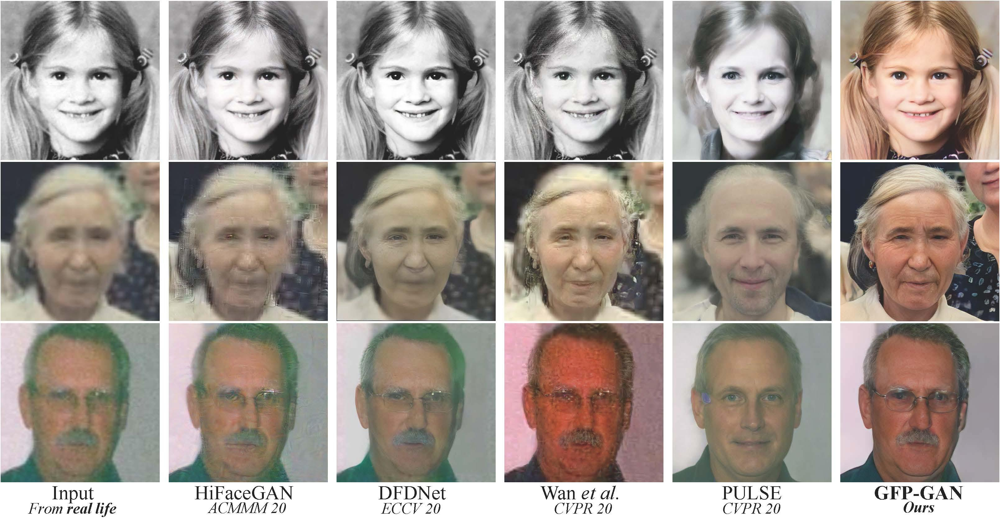

## Table of Contents

## What is face restoration in the context of machine learning?

Face restoration in machine learning is a technique used to improve the quality of old, damaged, or low-resolution images of faces. It uses special algorithms to make these images look clearer and more detailed. Imagine you have an old photo of your grandparents that is faded and blurry. Face restoration can help bring that photo back to life, making it look as if it was taken recently.

The process involves using deep learning models, which are trained on many images to understand what a clear face should look like. These models then apply what they've learned to enhance the damaged images. For example, they can fill in missing details, sharpen edges, and correct colors. This technology is not only useful for personal photos but also in fields like forensics, where clear images can be crucial for identification purposes.

## How do face restoration models work?

Face restoration models use a type of artificial intelligence called deep learning. These models are trained on a lot of pictures of faces, learning what a clear and detailed face looks like. When you give the model a blurry or damaged photo, it uses what it has learned to guess and fill in the missing parts. It's like a smart paintbrush that knows how to make faces look better. The model looks at the whole image, figuring out where the eyes, nose, and mouth should be, and then it adds details to make the face look clearer.

The process starts with the model analyzing the input image. It breaks down the image into smaller parts and compares these parts to the many faces it has seen during training. Using this comparison, the model can decide how to enhance each part of the face. For example, if the eyes in the photo are blurry, the model can sharpen them based on its understanding of what clear eyes look like. This way, the model can restore old or damaged photos, making them look much better and more detailed.

## What are some common applications of face restoration models?

One common use of face restoration models is to fix old family photos. Imagine you have a picture of your great-grandparents that is faded and blurry. With face restoration, you can make that photo look new again. The model can clear up the faces, making it easier to see what your ancestors looked like. This is great for keeping family memories alive and sharing them with younger generations.

Another application is in the field of forensics. Police and investigators often need clear images to identify people. If they have a blurry photo from a security camera, a face restoration model can help make it clearer. This can be crucial for solving crimes and finding missing people. By enhancing the image, the model helps law enforcement do their job better.

Face restoration models are also used in the entertainment industry. For example, movie makers might use these models to restore old films or to enhance the faces of actors in new movies. This can make the movies look better and more appealing to audiences. Whether it's fixing old movie posters or improving the quality of a new film, face restoration helps make everything look its best.

## Can you explain the basic architecture of a face restoration model?

The basic architecture of a face restoration model usually involves a deep learning network, specifically a type of neural network called a Convolutional Neural Network (CNN). This network is designed to understand and process images. When you feed a blurry or damaged photo into the model, it goes through several layers. Each layer looks at different parts of the image, like edges, textures, and shapes. The model uses what it has learned from many other face images to figure out how to make the input image look better. It's like the model is using a smart guess to fill in missing details and sharpen the image.

The CNN architecture typically includes an encoder and a decoder. The encoder part of the network breaks down the input image into a simpler form, capturing important features. Imagine it's like taking apart a puzzle to see how the pieces fit together. Then, the decoder part uses these features to rebuild the image, but this time with more detail and clarity. It's like putting the puzzle back together, but now you can see the whole picture much better. By going through this process, the model can restore old or damaged photos, making them look clear and detailed.

## What is ISPL and how does it contribute to face restoration?

ISPL stands for Iterative Sparse and Progressive Learning. It is a method used in face restoration to make blurry or damaged photos look better. Imagine you have a puzzle with missing pieces. ISPL works like trying to guess what those missing pieces should look like, bit by bit. It starts with a rough guess and keeps improving it until the picture looks clear. This method helps the model understand how to fill in missing details and make the face look more like it should.

ISPL contributes to face restoration by breaking down the problem into smaller, easier steps. Instead of trying to fix the whole image at once, it works on small parts of the image and slowly builds up to the full picture. This makes it easier for the model to learn and improve. By using ISPL, the model can make better guesses about what the face should look like, leading to clearer and more detailed restored images.

## How does GFP-GAN improve upon traditional face restoration techniques?

GFP-GAN, or Generative Facial Prior Generative Adversarial Network, is a newer method that makes face restoration better than older ways. It uses two parts, called a generator and a discriminator, that work together to make images clearer. The generator tries to make the blurry image look real, while the discriminator checks if it looks real or fake. This back-and-forth helps the model learn to fix faces better. GFP-GAN is special because it can add details that were missing in the original photo, making the restored image look more natural and lifelike.

One big way GFP-GAN improves on traditional methods is by using something called a "facial prior." This means it has a good idea of what a face should look like, even if the photo is very blurry or damaged. By using this knowledge, GFP-GAN can guess and fill in missing parts better than older methods. This makes the restored images not only clearer but also more true to what the person really looked like. So, if you have an old family photo that's hard to see, GFP-GAN can help bring it back to life in a way that feels more real.

## What makes DFDNet unique among face restoration models?

DFDNet, or Deep Face Dictionary Network, is unique because it uses a special way to fix blurry or damaged photos of faces. It works by using a "dictionary" of face parts. Imagine you have a book with lots of pictures of eyes, noses, and mouths. DFDNet looks at this book to find the best parts to fix the photo. This method helps the model add details that are missing, making the face look clearer and more like the real person.

Another thing that makes DFDNet special is how it can work on different parts of the face at the same time. It can fix the eyes, nose, and mouth all together, which makes the whole face look better. This is different from some other models that might only fix one part at a time. By working on the whole face, DFDNet can make the restored photo look more natural and true to life.

## How does PSFR-GAN approach the problem of face restoration?

PSFR-GAN, or Progressive Semantic Face Restoration Generative Adversarial Network, is a method that fixes blurry or damaged photos of faces in a special way. It works by slowly building up the image, starting with the big parts and then adding smaller details. Imagine you're drawing a face. You start with the shape of the head, then add the eyes, nose, and mouth, and finally, you add little details like eyelashes and wrinkles. PSFR-GAN does something similar, making sure each step looks right before moving on to the next.

This method is good because it uses what it knows about faces to make the photo look more real. It understands that faces have certain parts and how those parts should look together. By focusing on the meaning of each part of the face, PSFR-GAN can make the restored image look more like the person in the photo. This makes it easier to see what the person really looked like, even if the original photo was very blurry or damaged.

## What are the key features of WIPA in face restoration?

WIPA, or Wavelet-based Image Processing Algorithm, is a special way to fix blurry or damaged photos of faces. It uses something called wavelets, which are like tiny waves that help break down the image into smaller parts. By looking at these parts, WIPA can figure out how to make the photo clearer. It's like using a magnifying glass to see the tiny details and then putting them back together in a better way. This method is good because it can work on different levels of the image, from big shapes to small details, making the whole face look better.

One key feature of WIPA is that it can handle different kinds of damage in photos. Whether the photo is blurry, has scratches, or is faded, WIPA can fix it. It does this by using the wavelets to find where the problems are and then fixing them step by step. This makes WIPA very useful for old family photos that might have a lot of different issues. By fixing these problems, WIPA helps bring the photo back to life, making it easier to see what the person in the photo really looked like.

## How do you evaluate the performance of face restoration models?

To evaluate the performance of face restoration models, experts look at how well the model can make blurry or damaged photos look clear and detailed. They use special numbers called metrics to measure this. One common metric is the Peak Signal-to-Noise Ratio (PSNR), which shows how much the restored image looks like the original clear image. Another metric is the Structural Similarity Index (SSIM), which checks if the restored image keeps the same shapes and details as the original. These metrics help experts see if the model is doing a good job at fixing the photos.

Besides using numbers, experts also look at the restored photos themselves. They check if the faces look natural and if the model added details that were missing in the original photo. Sometimes, they ask people to look at the photos and say which ones look better. This is called a user study. By combining these methods, experts can get a full picture of how well the face restoration model works. They can see if it's good at making old or damaged photos look new and clear again.

## What are the challenges faced when training face restoration models?

Training face restoration models can be tricky because they need to learn a lot about faces. The models have to understand how to fix blurry or damaged photos, which means they need to see many different kinds of faces. This requires a big collection of photos to train on, and getting enough good quality images can be hard. Also, the model has to learn to fill in missing details correctly, which is not easy. If the model makes a mistake, it might add details that don't look right, making the restored photo look strange.

Another challenge is that face restoration models need to work well on all kinds of photos, not just the ones they were trained on. This means the model has to be smart enough to fix photos that are different from what it has seen before. For example, if the model was trained mostly on photos of young people, it might not do as well on photos of older people. To solve this, experts need to make sure the training data includes many different types of faces. This can take a lot of time and effort, but it's important for making the model work well in the real world.

## What are the latest advancements in face restoration models and their potential future directions?

The latest advancements in face restoration models include techniques like GFP-GAN and PSFR-GAN. GFP-GAN uses a generative adversarial network (GAN) to make restored images look more natural and lifelike. It does this by using a "facial prior," which helps the model guess what a face should look like even if the original photo is very blurry. PSFR-GAN, on the other hand, takes a step-by-step approach, starting with the big parts of the face and slowly adding smaller details. This method helps make sure the restored image is accurate and detailed. Both of these techniques have made face restoration better by adding more realistic details and handling different kinds of damage in photos.

Looking to the future, face restoration models could get even better. One direction might be to make the models work faster, so they can restore photos in real-time. Another direction could be to make the models work on videos, not just still photos. This would be useful for restoring old movies or fixing blurry security footage. Researchers might also work on making the models understand more about different kinds of faces, like those from different cultures or ages. By doing this, the models could become more accurate and helpful for everyone. Overall, the future of face restoration looks bright, with many exciting possibilities on the horizon.