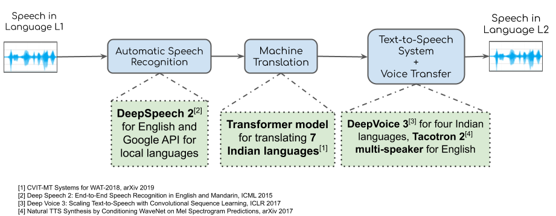

## Table of Contents

## What is face-to-face translation in the context of machine learning?

Face-to-face translation in machine learning refers to the process where a computer system translates spoken language in real-time during a conversation between two or more people. This technology is often used in settings where people speak different languages, allowing them to communicate more effectively without the need for a human interpreter. The system listens to the spoken words, quickly translates them into the target language, and then either speaks the translation aloud or displays it as text.

The technology behind face-to-face translation involves several components, including speech recognition, natural language processing, and text-to-speech synthesis. Speech recognition converts spoken words into text, which is then processed by natural language processing algorithms to understand the context and meaning. After translation, the text-to-speech system converts the translated text back into spoken words. This entire process needs to happen quickly and accurately to be useful in real-time conversations, making it a challenging but valuable application of machine learning.

## How does face-to-face translation differ from traditional translation methods?

Face-to-face translation uses computers to help people talk to each other in real time, even if they speak different languages. It listens to what someone says, quickly turns it into another language, and then says it out loud or shows it on a screen. This is different from traditional translation, where a person or a computer translates written text or recorded speech after it has been said or written. Traditional translation can take more time because it doesn't need to happen right away.

Another big difference is that face-to-face translation needs to be very fast and accurate because people are waiting to understand each other during the conversation. If the translation takes too long or is wrong, it can make the conversation hard or confusing. Traditional translation, on the other hand, can be checked and fixed before it is used, so it can be more accurate but it's not as quick.

## What are the key components of a face-to-face translation system?

The key components of a face-to-face translation system include speech recognition, natural language processing, and text-to-speech synthesis. Speech recognition is the part that listens to what people say and turns it into text. It needs to be very good at understanding different voices and accents so it can accurately capture what is being said. Natural language processing then takes this text and figures out what it means. It looks at the words and how they are used to understand the context and translate them into another language.

After the translation is done, the text-to-speech synthesis component turns the translated text back into spoken words. This part needs to sound clear and natural so that the other person can easily understand the translation. All these components need to work together quickly and smoothly to make sure the conversation flows well. If any part is slow or makes mistakes, it can make the conversation difficult or confusing.

## Can you explain the basic process of how LipGAN works for face-to-face translation?

LipGAN is a cool technology that helps with face-to-face translation by making it look like a person's lips are moving to match the translated words. It works by using a special kind of computer program called a [neural network](/wiki/neural-network). This neural network is trained to watch videos of people talking and learn how their lips move when they say different sounds. Once it's good at this, LipGAN can take the translated words and make a video where the person's lips move in a way that looks like they are saying those words, even though they are speaking in a different language.

The way LipGAN does this is by using two parts of the neural network: one part that makes the lip movements and another part that checks if the movements look real. The part that makes the lip movements tries to create videos that look as real as possible, while the part that checks tries to find any mistakes. They keep working together until the lip movements look just right. This helps make the translation seem more natural and easier to understand for the person watching the video.

## What are the primary challenges in developing accurate face-to-face translation systems?

One of the biggest challenges in developing accurate face-to-face translation systems is making sure the system can understand different accents and ways of speaking. People from different places can sound very different even when they speak the same language. This can make it hard for the computer to turn what they say into the right words. Also, background noise can mess things up. If the system hears a lot of noise, it might not understand the words correctly. So, the system needs to be really good at [picking](/wiki/asset-class-picking) out the important sounds from the noise.

Another challenge is translating things quickly and correctly. In a conversation, people need to understand each other right away. If the translation takes too long or gets things wrong, it can make the conversation confusing. The system has to be fast and also understand the context so it can translate what people mean, not just the words they say. This is tough because languages have a lot of sayings and expressions that don't translate directly. So, the system needs to be smart enough to figure out what people really mean.

Lastly, making the translated speech sound natural is also important. People are used to hearing voices that sound like real people. If the translated voice sounds too robotic or strange, it can be hard to understand or even annoying. The system needs to sound like a real person talking, which is a big challenge. Also, if the system uses LipGAN to make the lips move right, it has to match the lip movements perfectly with the translated words, which is another tricky part.

## How does LipGAN handle different languages and dialects in its translation process?

LipGAN works with different languages and dialects by learning from lots of videos where people are talking in those languages. It watches how their lips move when they say different sounds in different languages. This way, LipGAN can make the lips move correctly for the translated words, no matter which language or dialect it is. But, it can be hard for LipGAN to get it right for every dialect because some dialects have very different ways of speaking and sounding.

To handle different languages and dialects well, LipGAN uses a special kind of computer program called a neural network. This neural network is trained on lots of examples so it can learn the patterns of how people's lips move in different languages. Even though it tries its best, LipGAN might still have trouble with very rare dialects or accents because it might not have seen enough examples of those. So, the more examples it can learn from, the better it can handle different ways of speaking.

## What datasets are commonly used to train models like LipGAN for face-to-face translation?

To train models like LipGAN for face-to-face translation, researchers often use large datasets that include videos of people speaking in different languages. One popular dataset is the LRW (Lip Reading in the Wild) dataset, which contains thousands of short video clips of people saying specific words in English. Another commonly used dataset is the VoxCeleb dataset, which includes videos of celebrities speaking in various languages and accents. These datasets help the model learn how people's lips move when they speak different sounds and words.

In addition to these, the TCD-TIMIT dataset is also used, which has videos of people speaking in Irish English, helping the model understand different accents. For training on a wider range of languages, the LRS2 (Lip Reading Sentences 2) and LRS3 (Lip Reading Sentences 3) datasets are valuable, as they contain longer video clips with people speaking in multiple languages. By using these diverse datasets, LipGAN can improve its ability to accurately generate lip movements for translated speech across different languages and dialects.

## How is the performance of face-to-face translation systems like LipGAN evaluated?

The performance of face-to-face translation systems like LipGAN is evaluated by looking at how well they can make the lips move correctly and how clear the translated speech sounds. Researchers use special tests to see if the lip movements match the translated words. They also check if the translated speech sounds natural and easy to understand. To do this, they might ask people to watch videos and say if the lip movements look real or if the speech sounds like a real person talking. They also use computer programs to measure how close the lip movements are to what they should be.

Another way to evaluate LipGAN is by using numbers to show how well it works. For example, they might use a measure called the Word Error Rate (WER) to see how many words the system gets wrong when it translates. They can also use a measure called the Lip Sync Error (LSE) to see how well the lip movements match the speech. These numbers help researchers understand where the system needs to improve. By combining what people think with these numbers, they can get a good idea of how well LipGAN is doing and how to make it better.

## What are the current limitations of LipGAN in face-to-face translation?

One of the main limitations of LipGAN in face-to-face translation is its struggle with different accents and dialects. LipGAN learns from videos of people talking, but if it hasn't seen enough examples of a certain way of speaking, it might not do a good job with that accent or dialect. This can make the lip movements look off or the translated speech hard to understand. Also, background noise can mess things up. If there's a lot of noise around, LipGAN might have trouble hearing the words clearly, which can lead to mistakes in the translation and lip movements.

Another challenge is making sure the lip movements match the translated words perfectly. Even though LipGAN tries its best, sometimes the lip movements can be a bit off, which can make the video look strange or confusing. This is because getting the timing and the way the lips move just right is really hard, especially when translating between languages that have different sounds and rhythms. Researchers are working on making LipGAN better, but for now, these limitations can make face-to-face translation less smooth and natural than we'd like it to be.

## How can face-to-face translation systems be integrated into real-world applications?

Face-to-face translation systems can be used in many real-world situations to help people who speak different languages talk to each other. For example, in hospitals, doctors and nurses can use these systems to talk to patients who don't speak the same language. This can make it easier for patients to understand their medical care and feel more comfortable. In schools, teachers can use face-to-face translation to communicate with students and parents who speak different languages, making education more accessible to everyone. These systems can also be helpful in businesses where employees and customers come from different countries, improving communication and making work more efficient.

Another way to use face-to-face translation systems is in travel and tourism. When people visit new countries, they can use these systems to talk to locals, ask for directions, or learn about the culture. This can make traveling more enjoyable and less stressful. Also, these systems can be used in video calls and online meetings, helping people from different parts of the world work together more easily. By making it possible for people to understand each other in real-time, face-to-face translation systems can break down language barriers and bring people closer together.

## What advancements in machine learning and AI are expected to improve face-to-face translation in the future?

In the future, face-to-face translation is expected to get a lot better thanks to new advancements in [machine learning](/wiki/machine-learning) and AI. One big improvement will come from better speech recognition. This means the computer will be able to understand different accents and ways of speaking more easily, even if there's a lot of background noise. Also, natural language processing will get smarter, so the system can understand what people mean, not just the words they say. This will help translate sayings and expressions that don't have a direct translation, making conversations sound more natural.

Another important advancement will be in making the translated speech sound more like a real person talking. With better text-to-speech technology, the voice will sound clearer and more natural, making it easier for people to understand. Also, systems like LipGAN will improve, so the lip movements will match the translated words more accurately. This will make video calls and meetings feel more like real face-to-face conversations. All these improvements will help break down language barriers and make communication smoother and more enjoyable for everyone.

## Can you discuss any ethical considerations or privacy concerns related to the use of face-to-face translation technology?

Using face-to-face translation technology can bring up some important ethical questions and privacy worries. One big concern is about keeping conversations private. When people use these systems to talk, their words are turned into data that the computer uses to translate. This data could be saved or shared without their permission, which could be a problem if the conversation is private or sensitive. Also, if the technology makes mistakes in translating, it could cause misunderstandings or even harm if important information is not translated correctly.

Another thing to think about is fairness and who gets to use this technology. If only some people can use it because it's too expensive or hard to get, it might not be fair to everyone. Also, the technology might work better for some languages or accents than others, which could leave some people out. It's important for the people making these systems to think about these issues and try to make the technology as fair and private as possible, so everyone can use it safely and equally.

## References & Further Reading

[1]: Sutton, R. S., & Barto, A. G. (2018). ["Reinforcement Learning: An Introduction"](https://web.stanford.edu/class/psych209/Readings/SuttonBartoIPRLBook2ndEd.pdf). MIT Press.

[2]: Huang, X., Baker, J., & Reddy, R. (2014). ["A Historical Perspective of Speech Recognition."](https://dl.acm.org/doi/10.1145/2500887). Communications of the ACM, 57(1), 94-103.

[3]: Jurafsky, D., & Martin, J. H. (2023). ["Speech and Language Processing"](https://web.stanford.edu/~jurafsky/slp3/). Prentice Hall.

[4]: Awasthi, P., & Sarawgi, A. (2019). ["Understanding Automatic Speech Recognition for Conversational Agents."](https://pmc.ncbi.nlm.nih.gov/articles/PMC8704682/). Conference on Human Factors in Computing Systems.

[5]: Gjoreski, J., Kostovski, G., & Gams, M. (2020). ["Deep Neural Networks for Fast and Accurate Natural Language Processing."](https://dis.ijs.si/mitjal/documents/GjoreskiM-Monitoring_stress_with_a_wrist_device_using_context-JBI-17.pdf). Springer Verlag.