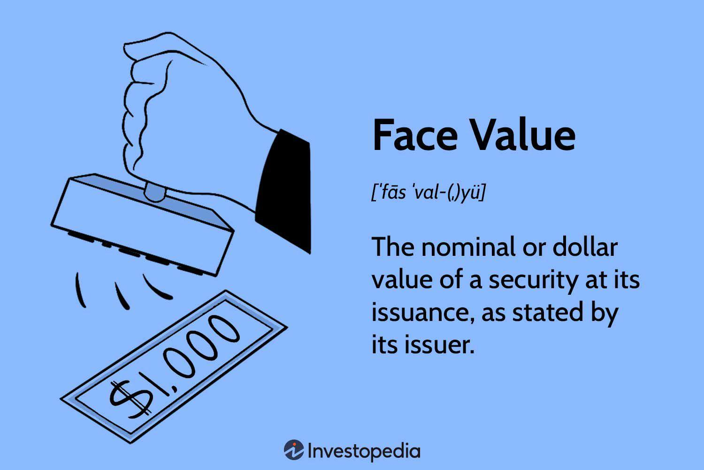

## Table of Contents

## What is face value in finance?

Face value in finance is the original value or price of a financial instrument, like a bond or a stock, when it is first issued. It's also called par value or nominal value. For bonds, face value is the amount that the bond issuer agrees to pay back to the bondholder when the bond matures. For stocks, face value is a small, fixed amount set by the company and is usually not related to the stock's market price.

Understanding face value is important because it helps investors know what they will get back at the end of a bond's term. For example, if you buy a bond with a face value of $1,000, you can expect to receive $1,000 when the bond matures, no matter what price you paid for it. For stocks, face value is less important because the market price can be much higher or lower than the face value, but it can still be used in calculating dividends or for accounting purposes.

## What is market value in finance?

Market value in finance is what people are willing to pay for something right now. It's the current price of a stock, bond, or any other financial asset that you can see on the stock market or other trading platforms. This value changes all the time because it depends on what buyers and sellers think the asset is worth at that moment. Things like how well a company is doing, news about the economy, and what people feel about the future can all make the market value go up or down.

For example, if a company's stock has a market value of $50 per share, that means people are buying and selling that stock for $50 right now. This is different from the face value, which is set when the stock is first issued and doesn't change. Market value is important because it tells you how much money you would get if you sold your asset today. It's a key piece of information for investors who want to know if their investments are doing well or if they should buy or sell.

## How is face value different from market value?

Face value and market value are two different ways to talk about the worth of a financial thing like a stock or a bond. Face value is the original price set when the financial thing is first made. It's like a starting point that doesn't change. For a bond, it's the amount you get back when the bond finishes its time. For a stock, it's a small number set by the company and doesn't really matter much for what the stock is worth in the market.

Market value, on the other hand, is what people are willing to pay for that financial thing right now. It changes all the time because it depends on what people think it's worth at that moment. If lots of people want to buy a stock, its market value might go up. If people think a company is doing badly, the market value might go down. So, market value is important because it tells you how much money you could get if you sold your stock or bond today.

## Can you give an example of face value and market value for a bond?

Imagine you buy a bond from a company. The bond has a face value of $1,000. This means when the bond reaches the end of its term, say in 10 years, the company promises to pay you back $1,000. The face value is like a promise written on the bond that doesn't change, no matter what happens in the market.

Now, let's talk about the market value of that same bond. Right after you buy it, the market might think the bond is worth $950 because interest rates went up, making newer bonds more attractive. Or, if the company is doing really well, the market value might go up to $1,050 because people think it's safer to own that bond. The market value changes all the time based on what people are willing to pay for the bond at that moment. So, if you wanted to sell your bond before it matures, you would get the market value, not the face value.

## How does the face value of a stock relate to its market value?

The face value of a stock is a fixed number set by the company when the stock is first issued. It's usually a small amount, like $0.01 or $1, and it doesn't change over time. This face value is mostly used for accounting purposes or to calculate dividends, but it doesn't tell you much about how much the stock is worth in the market. For example, if a company sets the face value of its stock at $1, that doesn't mean the stock will be worth $1 when you buy or sell it.

The market value of a stock is what people are willing to pay for it right now. It changes all the time based on things like how well the company is doing, news about the economy, and what people think about the future. If lots of people want to buy the stock, its market value might go up. If people think the company is doing badly, the market value might go down. So, while the face value stays the same, the market value can be much higher or lower. For instance, a stock with a face value of $1 might have a market value of $50 if people think the company is doing great.

## What factors influence the market value of a security?

The market value of a security, like a stock or a bond, can change because of many things. One big thing is how well the company is doing. If the company makes more money and grows, people might want to buy its stock more, which can make the market value go up. On the other hand, if the company is not doing well, people might want to sell the stock, and that can make the market value go down. Another thing that can change the market value is news about the economy. If the economy is doing well, people might feel more confident about buying stocks, pushing up their market value. But if there's bad news, like a recession, people might sell their stocks, which can lower the market value.

Another [factor](/wiki/factor-investing) is interest rates. When interest rates go up, bonds that were issued with lower interest rates become less attractive, so their market value can drop. For stocks, higher interest rates can make borrowing more expensive for companies, which might hurt their profits and lower the stock's market value. Also, what people feel about the future can play a big role. If people think a company will do well in the future, they might buy its stock now, which can raise the market value. If they think the company will struggle, they might sell, pushing the market value down.

Lastly, things like how much people are buying and selling the security, called supply and demand, can also affect its market value. If there are more people wanting to buy than sell, the market value can go up. If more people want to sell than buy, the market value can go down. All these factors together make the market value of a security change all the time, and it's what investors look at to decide if they should buy or sell.

## How do interest rates affect the relationship between face value and market value of bonds?

Interest rates can change how much a bond is worth in the market compared to its face value. When interest rates go up, new bonds that are issued will have higher interest payments. This makes older bonds with lower interest rates less attractive to investors. So, if you have a bond with a face value of $1,000 and a fixed [interest rate](/wiki/interest-rate-trading-strategies), its market value might drop because people would rather buy new bonds that pay more interest. For example, if you want to sell your bond before it matures, you might have to sell it for less than $1,000, like $950, because that's what people are willing to pay for it now.

On the other hand, when interest rates go down, the opposite happens. Your old bond with a higher interest rate becomes more attractive because new bonds being issued have lower interest payments. So, the market value of your bond might go up. If you want to sell your bond with a face value of $1,000, you might be able to sell it for more than that, like $1,050, because people are willing to pay more for the higher interest payments. This shows how interest rates can make the market value of a bond move away from its face value, either higher or lower, depending on whether rates are going up or down.

## Why might the market value of a stock be significantly different from its face value?

The market value of a stock can be very different from its face value because the market value is all about what people are willing to pay for the stock right now. This changes all the time based on lots of things like how well the company is doing, news about the economy, and what people think about the future. If the company is making a lot of money and growing, people might want to buy its stock, which can make the market value go way up, even if the face value is just a small number like $1. On the other hand, if the company is not doing well, people might sell the stock, and that can make the market value go down a lot.

Face value, on the other hand, is a fixed number that the company sets when the stock is first issued. It's usually a small amount and doesn't change, no matter what happens in the market. Because the face value is set and doesn't reflect the company's current performance or what people think about it, it can be much lower than the market value. For example, a stock with a face value of $1 might have a market value of $100 if people think the company is doing great. So, the big difference between the two values comes from how the market sees the stock's worth right now compared to when it was first issued.

## How do investors use the concepts of face value and market value in their decision-making process?

Investors use the concepts of face value and market value to make smart choices about buying and selling stocks and bonds. For bonds, the face value is important because it tells investors how much money they will get back when the bond matures. If an investor buys a bond with a face value of $1,000, they know they will get $1,000 at the end of the bond's term, no matter what they paid for it. But the market value of the bond can be different from the face value. If interest rates go up, the market value might drop below the face value, and if interest rates go down, the market value might go above the face value. So, investors look at the market value to decide if it's a good time to buy or sell the bond before it matures.

For stocks, the face value is usually a small, fixed number that doesn't change and isn't very important for deciding to buy or sell. What matters more is the market value, which changes all the time based on how well the company is doing and what people think about it. If the market value of a stock is much higher than its face value, it might mean people think the company is doing well and will keep doing well. If the market value is low, it might mean people are worried about the company. So, investors use the market value to decide if a stock is a good buy or if they should sell it. By looking at both face value and market value, investors can make better choices about their investments.

## What role do economic conditions play in the fluctuation of market values relative to face values?

Economic conditions can make the market value of stocks and bonds go up and down a lot compared to their face values. When the economy is doing well, people feel good about buying stocks and bonds. They think companies will make more money, so they are willing to pay more for stocks, making their market values go up. For bonds, if interest rates are low because the economy is strong, older bonds with higher interest rates become more valuable, so their market values can go above their face values. But if the economy is not doing well, like during a recession, people might sell their stocks because they are worried about companies making less money. This can make the market values of stocks drop a lot, even if their face values stay the same.

Also, changes in interest rates, which are part of economic conditions, can affect how much bonds are worth in the market. When interest rates go up, new bonds have higher interest payments, so older bonds with lower rates become less attractive. This can make the market value of those older bonds drop below their face values. On the other hand, if interest rates go down, older bonds with higher rates become more valuable, and their market values can go above their face values. So, economic conditions, like how well the economy is doing and what's happening with interest rates, play a big role in how much the market values of stocks and bonds change compared to their face values.

## How can understanding the difference between face value and market value help in assessing the risk of an investment?

Understanding the difference between face value and market value can help investors see how much risk they might be taking with their money. For bonds, if the market value is a lot lower than the face value, it might mean that people think the bond is risky. This could happen if interest rates go up or if people think the company might not be able to pay back the bond when it's due. On the other hand, if the market value is higher than the face value, it might mean the bond is seen as safer because it has a higher interest rate than new bonds. So, by looking at how far apart the market value and face value are, investors can get a sense of how risky the bond might be.

For stocks, the face value doesn't tell us much about risk, but the market value does. If the market value of a stock is much higher than its face value, it might mean people think the company will do well in the future. But this also means there's a risk that the stock's price could drop if the company doesn't meet those high expectations. If the market value is lower than the face value, it might mean people are worried about the company's future, which could be a sign of higher risk. By comparing the market value to the face value, investors can better understand the risk they are taking and make smarter choices about buying or selling their investments.

## In what scenarios might the face value of a financial instrument be more relevant than its market value?

The face value of a financial instrument can be more important than its market value in certain situations. For bonds, face value is key because it's the amount you get back when the bond matures. If you buy a bond for its face value, you know exactly how much money you will get at the end, no matter what the market value is doing along the way. This makes face value really important for people who want to make sure they get a certain amount of money back at a specific time, like when they need it for retirement or other plans.

In the case of stocks, face value might not matter as much for buying and selling, but it can still be important for some things. Companies use the face value of stocks to figure out how much to pay in dividends. If a company says it will pay a dividend of 5% of the face value, then knowing the face value helps you know how much money you'll get. Also, face value can be used for accounting and legal reasons, like when a company needs to report its total number of shares or when setting up the company's initial stock structure. So, even if the market value is what most people look at, face value can still be important in these specific situations.

## How does algorithmic trading use market and face values?

Algorithmic trading, characterized by its reliance on advanced technology and algorithms, utilizes market and face values to optimize trading decisions effectively. Market value, representing the real-time price at which an asset is bought or sold, is a primary input for algorithms that aim to capitalize on price movements. These algorithms can process vast amounts of data to detect patterns or trends in the market value, enabling them to execute trades with precision and speed that surpasses human capability. For instance, when an algorithm identifies a change in market conditions reflected through fluctuating asset prices, it can automatically adjust trading strategies, buy or sell positions, and minimize exposure to unfavorable shifts.

Face value, particularly in bond trading, provides a stable benchmark that algorithms can use to gauge the intrinsic worth of securities. When dealing with bonds, face value is the amount that the issuer agrees to repay at maturity. Algorithms employ this information to evaluate the yield and compare it against prevailing interest rates or market values. Such evaluations are crucial for determining whether a bond offers a lucrative return in light of current market conditions.

In [algorithmic trading](/wiki/algorithmic-trading), understanding both market and face values enriches the trader's ability to assess risk and make informed decisions. For example, an algorithm might calculate the yield to maturity (YTM) of a bond using its face value and compare it against the bond's current market price:

$$
YTM = \frac{C + \frac{F-P}{n}}{\frac{F+P}{2}}
$$

where $C$ is the annual coupon payment, $F$ is the face value, $P$ is the current price, and $n$ is the years to maturity.

Such calculations allow for the rapid assessment of the bond's attractiveness compared to other investment opportunities, enabling traders to make decisions that align with their strategic goals.

Algorithmic trading systems also incorporate the principles of both values into their decision-making algorithms to enhance risk-adjusted returns. This dual understanding aids in crafting strategies that are resilient to both sudden market changes and long-term shifts in economic indicators. As a result, traders leveraging algorithmic systems benefit from enhanced precision and capacity to navigate the complexities of trading environments.

## References & Further Reading

[1]: ["Advances in Financial Machine Learning"](https://www.amazon.com/Advances-Financial-Machine-Learning-Marcos/dp/1119482089) by Marcos Lopez de Prado

[2]: ["Evidence-Based Technical Analysis: Applying the Scientific Method and Statistical Inference to Trading Signals"](https://www.amazon.com/Evidence-Based-Technical-Analysis-Scientific-Statistical/dp/0470008741) by David Aronson

[3]: ["Machine Learning for Algorithmic Trading"](https://github.com/stefan-jansen/machine-learning-for-trading) by Stefan Jansen

[4]: ["Quantitative Trading: How to Build Your Own Algorithmic Trading Business"](https://www.amazon.com/Quantitative-Trading-Build-Algorithmic-Business/dp/1119800064) by Ernest P. Chan

[5]: Bergstra, J., Bardenet, R., Bengio, Y., & Kégl, B. (2011). ["Algorithms for Hyper-Parameter Optimization."](https://dl.acm.org/doi/10.5555/2986459.2986743) Advances in Neural Information Processing Systems 24.