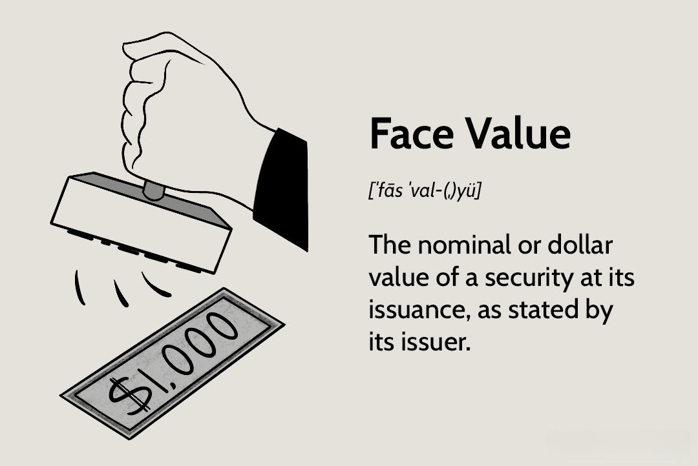

In the dynamic world of finance, grasping the concepts of market value, face value, and algorithmic trading is essential for both investors and traders. These elements serve as foundational pillars, influencing decision-making and outcomes in financial markets. Understanding market value presents a real-time picture of an asset's worth as dictated by the forces of supply and demand. This contrasts with face value, which represents the nominal or original value assigned to a security by its issuer, offering a more static measurement primarily used in accounting and bond transactions.

Algorithmic trading, a modern innovation, leverages sophisticated computer programs to automate and optimize trading decisions, revolutionizing how investors and traders interact with the market. It capitalizes on technologies that ensure speed and precision, challenging traditional trading methods. By exploring these financial concepts, this article demystifies their roles and interconnections and highlights the significant impact of algorithmic trading on market dynamics. Through their collective application, investors can navigate the complexities of financial markets more effectively, making informed decisions that align with contemporary trading strategies and risk assessments.



## Table of Contents

## Understanding Market Value

Market value is a key concept in finance, frequently referenced by investors and traders to assess the real-time worth of assets. At its core, market value is the price at which an asset or service can currently be bought or sold in the marketplace. This valuation is not static; it is subject to the constant interplay of supply and demand dynamics. 

When the demand for an asset surpasses its supply, prices tend to rise, increasing the market value. Conversely, when the supply outstrips demand, prices generally fall, leading to a decrease in market value. These fluctuations provide a snapshot of what investors are willing to pay for an asset at any given moment, reflecting broader economic indicators and investor sentiment.

Understanding market value is crucial for investors because it offers insights that influence investment decisions. A rising market value could indicate positive investor sentiment and potential economic growth, encouraging more investment. In contrast, a declining market value might signal caution or pessimism within the market, prompting a reassessment of investment strategies.

The insights gleaned from market value changes enable investors to identify trends and make informed decisions. For example, if the market value of technology stocks is consistently increasing, it might suggest a tech sector uptrend, attracting more investors to allocate funds into this area.

In conclusion, market value serves as a pivotal indicator of an asset's worth, shaped by the fluid mechanics of supply and demand. It empowers stakeholders to decode market trends and navigate the financial landscape more effectively.

## What is Face Value?

Face value, also referred to as par value, is the nominal value assigned to a security by its issuer. It is a fundamental concept in the financial world, particularly when dealing with bonds and stocks. For bonds, the face value represents the principal amount that the issuer agrees to repay the bondholder at maturity. This value is crucial as it determines the bond's interest payments, which are typically expressed as a percentage of the face value. For example, if a bond has a face value of $1,000 and carries a coupon rate of 5%, the bondholder will receive $50 annually as interest.

In the context of stocks, face value serves a different purpose. It is the original cost of the stock as indicated on the certificate and has little direct impact on day-to-day market operations. For stocks, face value is often a merely symbolic figure used for legal and accounting reasons. It provides a reference point for the calculation of dividends and the allocation of retained earnings on balance sheets, but it does not influence the stock's market price. 

Despite its limited influence on stock market dynamics, the face value remains an important figure in corporate accounting and regulatory compliance. The issuance price, initial public offering (IPO) price, and equity calculations often hinge on this baseline valuation. Understanding face value is essential for clear insights into the inherent terms of securities and their financial obligations.

## Market Value vs Face Value

Market value and face value are distinct yet interconnected concepts that are fundamental in understanding the valuation of financial securities. Market value refers to the current trading price of a security in the open market, determined by the forces of supply and demand. It fluctuates based on various factors, including economic data, geopolitical events, and investor sentiment. Conversely, face value, or par value, is the original nominal value of a security as per its issuer. In the context of bonds, it indicates the amount that the issuer agrees to repay upon maturity. For stocks, face value serves more for accounting purposes, having minimal influence on the actual market price.

The divergence between market and face value can be attributed to several factors. Market value is inherently dynamic, reflecting real-time feedback from market participants on the perceived worth and prospects of a security. As market conditions evolve, such as changes in interest rates, inflation expectations, or corporate earnings reports, the market value adjusts accordingly. On the other hand, face value remains static, representing a fixed baseline set at issuance.

Understanding the disparity between these two values is crucial for investors and traders aiming to evaluate the actual worth and risk of securities. A bond, for example, may trade at a premium or discount to its face value, influenced by [interest rate](/wiki/interest-rate-trading-strategies) changes or the issuer’s creditworthiness. If a bond's market value surpasses its face value, it is said to be trading at a premium, reflecting lower yields than newly issued bonds. Conversely, if the market value is below the face value, the bond is trading at a discount with higher yields.

Consider a scenario in Python to illustrate this distinction:

```python
# Example of calculating market value vs face value of a bond
face_value = 1000  # Face value of the bond
market_value = 950  # Current market value of the bond

if market_value > face_value:
    print("The bond is trading at a premium.")
elif market_value < face_value:
    print("The bond is trading at a discount.")
else:
    print("The bond is trading at par.")
```

In essence, while face value provides a foundational reference point for a security, market value offers a more accurate representation of its current economic worth. This understanding aids investors in making informed decisions, tailoring their strategies to market conditions, and effectively managing risk.

## Algorithmic Trading: A Game Changer

Algorithmic trading represents a pivotal development in the financial markets, fundamentally altering how trades are executed. This form of trading employs sophisticated computer programs designed to follow predefined strategies, enabling the automation of the trading process. The automation provided by [algorithmic trading](/wiki/algorithmic-trading) minimizes the need for human intervention, enhancing the speed and accuracy of trades. Consequently, this technological advancement often results in more efficient trade execution compared to traditional methods.

The primary advantage of algorithmic trading lies in its ability to process vast amounts of market data at exceptional speeds. This speed allows traders to capitalize on fleeting market opportunities, often too minute for human traders to notice. By leveraging algorithms, traders can respond instantaneously to market movements, executing trades faster than would be possible manually.

Moreover, algorithmic trading is adept at identifying and exploiting small market inefficiencies. These inefficiencies, which may be unperceivable to the human eye, can arise from discrepancies in asset pricing across different markets or slight deviations from historical price patterns. By implementing algorithms programmed to recognize these anomalies, traders can achieve a competitive edge, executing trades that capture value from these transient market conditions.

The precision afforded by algorithmic trading is another critical benefit. Algorithms can be fine-tuned to adhere to specific criteria, ensuring that trades are only executed when all pre-set conditions are met. This feature reduces the likelihood of errors that might occur from manual trading processes and allows for the execution of trades with a degree of consistency and predictability unattainable through traditional means.

In summary, algorithmic trading is a transformative force in the financial markets, offering unparalleled speed, precision, and the capability to exploit market inefficiencies that remain beyond the reach of human traders. As technology continues to evolve, the impact of algorithmic trading is expected to grow, further influencing trading strategies and financial market dynamics.

## How Algorithmic Trading Uses Market and Face Values

Algorithmic trading, characterized by its reliance on advanced technology and algorithms, utilizes market and face values to optimize trading decisions effectively. Market value, representing the real-time price at which an asset is bought or sold, is a primary input for algorithms that aim to capitalize on price movements. These algorithms can process vast amounts of data to detect patterns or trends in the market value, enabling them to execute trades with precision and speed that surpasses human capability. For instance, when an algorithm identifies a change in market conditions reflected through fluctuating asset prices, it can automatically adjust trading strategies, buy or sell positions, and minimize exposure to unfavorable shifts.

Face value, particularly in bond trading, provides a stable benchmark that algorithms can use to gauge the intrinsic worth of securities. When dealing with bonds, face value is the amount that the issuer agrees to repay at maturity. Algorithms employ this information to evaluate the yield and compare it against prevailing interest rates or market values. Such evaluations are crucial for determining whether a bond offers a lucrative return in light of current market conditions.

In algorithmic trading, understanding both market and face values enriches the trader's ability to assess risk and make informed decisions. For example, an algorithm might calculate the yield to maturity (YTM) of a bond using its face value and compare it against the bond's current market price:

$$
YTM = \frac{C + \frac{F-P}{n}}{\frac{F+P}{2}}
$$

where $C$ is the annual coupon payment, $F$ is the face value, $P$ is the current price, and $n$ is the years to maturity.

Such calculations allow for the rapid assessment of the bond's attractiveness compared to other investment opportunities, enabling traders to make decisions that align with their strategic goals.

Algorithmic trading systems also incorporate the principles of both values into their decision-making algorithms to enhance risk-adjusted returns. This dual understanding aids in crafting strategies that are resilient to both sudden market changes and long-term shifts in economic indicators. As a result, traders leveraging algorithmic systems benefit from enhanced precision and capacity to navigate the complexities of trading environments.

## Strategies in Algorithmic Trading

Trend-following strategies are a cornerstone in algorithmic trading, aiming to capitalize on the [momentum](/wiki/momentum) of market movements. These strategies rely on historical price data to predict the future direction of asset prices. By analyzing trends that have emerged over time, traders execute buy or sell orders aligned with the current trajectory of the market. The underlying principle is based on the idea that assets which have been rising in price will continue to rise, and those declining will continue their downward movement. Trend-following algorithms might implement technical indicators such as moving averages, relative strength index (RSI), or Bollinger Bands to systematically identify and act upon trends.

Arbitrage strategies aim to exploit pricing inefficiencies across different markets or financial instruments. These strategies are built around the concept that identical or similar assets should sell for the same price; discrepancies in value offer risk-free profit opportunities. Arbitrage algorithms scan multiple trading venues to detect these discrepancies, automatically executing offsetting trades to capture the price differential. For example, if a stock is undervalued on one exchange but overvalued on another, an algorithm might simultaneously buy on the cheaper and sell on the more expensive exchange, hence securing profit. High-frequency trading firms often employ sophisticated [arbitrage](/wiki/arbitrage) models that operate at millisecond speeds to gain a competitive edge.

Quote-driven strategies depend on the [liquidity](/wiki/liquidity-risk-premium) and depth of the market to execute trades swiftly and efficiently. Such strategies involve continuously placing buy or sell quotes, typically acting as market makers that provide liquidity by offering to buy and sell at quoted prices. The profitability of this strategy hinges on maintaining a narrow bid-ask spread and rapidly adjusting to evolving market conditions. Algorithms that employ quote-driven strategies are designed to respond to real-time changes in [order book](/wiki/order-book-trading-strategies) dynamics and are adept at handling high volumes of transactions with minimal market impact.

Algorithmic trading strategies, including trend-following, arbitrage, and quote-driven approaches, incorporate sophisticated financial models and computational power. These strategies enable traders to systematically and efficiently harness market opportunities that may be imperceptible through manual analysis, thus offering both significant potential and challenges in terms of execution and risk management.

## Benefits and Risks of Algorithmic Trading

Algorithmic trading, also known as algo trading, presents numerous advantages and drawbacks. This approach employs computer programs to automate trading strategies, offering several benefits. One of the primary advantages is faster execution of trades. Algorithms can operate at speeds far beyond human capability, identifying and acting on trading opportunities in milliseconds, which is crucial in highly dynamic markets.

Another significant benefit is the reduction of human error. By automating the trading process, algorithms diminish the likelihood of mistakes caused by emotional decision-making or fatigue. Additionally, algo trading harnesses the power of complex mathematical calculations and data analysis, allowing traders to handle intricate strategies that would be cumbersome for manual processing. This capability enables traders to simulate various scenarios and refine strategies to optimize outcomes.

Nevertheless, algorithmic trading is not without its risks. Technical failures are a notable concern, as they can lead to significant losses if systems malfunction during critical trading periods. For example, connectivity issues, software bugs, or hardware failures might disrupt trading activities, resulting in financial losses.

Over-optimization is another risk inherent in algorithmic trading. Traders might tailor algorithms too precisely based on historical data, a practice known as "curve fitting." This can lead to strategies that perform well in backtests but fail in live markets due to changing conditions or unseen variables.

Moreover, algorithmic trading contributes to increased market [volatility](/wiki/volatility-trading-strategies). High-frequency trading, a subset of algorithmic trading, can cause rapid price fluctuations, potentially destabilizing the market during periods of stress. The interplay between multiple algorithms reacting to each other can exacerbate these movements, leading to flash crashes or other disruptive events.

Balancing technology with human oversight is essential to mitigate these risks. While algorithms excel at processing vast amounts of data quickly, human traders are crucial for monitoring and adjusting strategies in real-time. They can intervene if the market behaves unexpectedly or if technical issues arise. Therefore, a hybrid approach combining algorithmic systems with human intelligence is often considered the most effective way to navigate the complexities of modern trading environments.

## Conclusion

Understanding the concepts of market value, face value, and algorithmic trading is essential for modern investors and traders. These elements are intertwined within the fabric of contemporary financial markets, helping investors gauge the real-time worth of securities and the intrinsic value set forth at issuance. Market value, being dynamic, reflects the real-time conditions of supply and demand, capturing investor sentiment and broader economic trends. Conversely, face value provides the static nominal worth of a security, which is crucial in areas like bond issuance and accounting.

Algorithmic trading capitalizes on these concepts, offering distinct advantages in speed and precision over traditional trading methods. By employing sophisticated computer algorithms, trades can be executed at volumes and speeds that are unachievable manually. This form of trading can harness subtle price movements that might be imperceptible to human traders, using market value as a primary input in strategy formulation. Yet, the implementation of algorithmic strategies mandates a comprehensive understanding of market dynamics, alongside robust risk management frameworks that consider both market and face values effectively.

Establishing a cohesive strategy that integrates these financial principles can enable traders to make more informed decisions. Such a strategy would not only capture emerging opportunities in real-time but also account for the inherent worth indicated by face values, particularly in bond trading. By balancing the fast-paced environment of algorithmic trading with a solid grasp of financial principles, investors and traders can maximize their potential for successful trading outcomes.

## References & Further Reading

[1]: ["Advances in Financial Machine Learning"](https://www.amazon.com/Advances-Financial-Machine-Learning-Marcos/dp/1119482089) by Marcos Lopez de Prado

[2]: ["Evidence-Based Technical Analysis: Applying the Scientific Method and Statistical Inference to Trading Signals"](https://www.amazon.com/Evidence-Based-Technical-Analysis-Scientific-Statistical/dp/0470008741) by David Aronson

[3]: ["Machine Learning for Algorithmic Trading"](https://github.com/stefan-jansen/machine-learning-for-trading) by Stefan Jansen

[4]: ["Quantitative Trading: How to Build Your Own Algorithmic Trading Business"](https://www.amazon.com/Quantitative-Trading-Build-Algorithmic-Business/dp/1119800064) by Ernest P. Chan

[5]: Bergstra, J., Bardenet, R., Bengio, Y., & Kégl, B. (2011). ["Algorithms for Hyper-Parameter Optimization."](https://dl.acm.org/doi/10.5555/2986459.2986743) Advances in Neural Information Processing Systems 24.