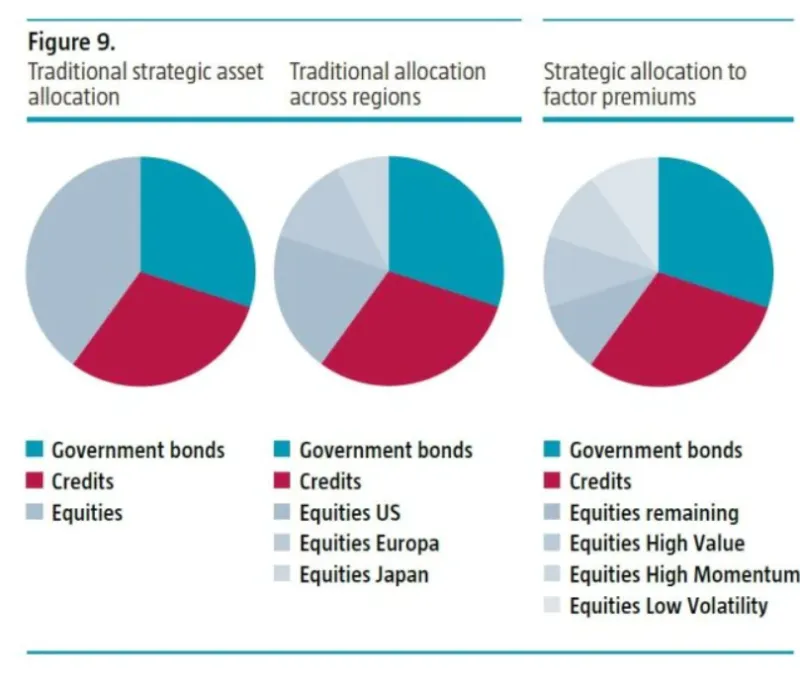

## Table of Contents

## What is factor allocation?

Factor allocation is a way of managing investments by focusing on certain characteristics, or factors, that can affect how well an investment does. These factors can include things like the size of a company, how much it grows, or how risky it is. By choosing investments based on these factors, investors try to build a portfolio that can do better than just picking stocks randomly.

When investors use factor allocation, they look at data and research to decide which factors are likely to help their investments grow. For example, they might choose to invest more in small companies if research shows that small companies tend to grow faster than big ones. This approach helps investors spread out their risk and aim for better returns over time.

## Why is factor allocation important in investment strategies?

Factor allocation is important in investment strategies because it helps investors make smarter choices about where to put their money. Instead of just picking stocks randomly, investors can look at specific characteristics, or factors, that have been shown to affect how well investments do. By focusing on these factors, like the size of a company or how much it grows, investors can build a portfolio that is more likely to do well over time. This approach helps them avoid putting all their eggs in one basket and instead spread out their risk.

Using factor allocation also allows investors to take advantage of research and data. For example, if studies show that small companies tend to grow faster than big ones, an investor might decide to put more money into small companies. This way, they can aim for better returns by following what the data suggests. Overall, factor allocation helps investors make more informed decisions, manage risk better, and potentially earn higher returns on their investments.

## How does factor allocation differ from traditional asset allocation?

Factor allocation and traditional asset allocation are two different ways to build an investment portfolio. Traditional asset allocation focuses on dividing money among different types of investments, like stocks, bonds, and cash. The idea is to spread out the risk by not putting all your money in one type of investment. For example, if you have a mix of stocks and bonds, you might be safer if the stock market goes down because your bonds might still do well.

Factor allocation, on the other hand, looks at specific characteristics, or factors, that can affect how well an investment does. Instead of just focusing on the type of investment, like stocks or bonds, factor allocation looks at things like the size of a company, how much it grows, or how risky it is. For example, an investor might choose to invest more in small companies if research shows that small companies tend to grow faster. This way, factor allocation tries to pick investments based on what the data says will do well, not just on the type of investment.

## What are the common factors used in factor allocation?

In factor allocation, investors look at different characteristics, or factors, that can affect how well an investment does. Some common factors they use are the size of a company, how much it grows, its value, how risky it is, and how much it pays out in dividends. For example, the size factor means choosing between small companies and big companies. Research might show that small companies can grow faster, so an investor might put more money into them.

Another important factor is growth, which looks at how fast a company's earnings or sales are growing. If a company is growing quickly, it might be a good investment. Value is another factor, where investors look for companies that seem to be a good deal, maybe because their stock price is low compared to what the company is worth. Risk, or momentum, is about how much a stock's price goes up and down. Some investors like to take more risk for the chance of higher returns. Lastly, the dividend factor focuses on how much money a company pays out to its shareholders. Companies that pay high dividends can be attractive to investors looking for steady income.

These factors help investors make smarter choices about where to put their money. By looking at these characteristics, investors can build a portfolio that is more likely to do well over time. Instead of just [picking](/wiki/asset-class-picking) stocks randomly, factor allocation uses data and research to guide investment decisions, aiming for better returns and managing risk more effectively.

## How can factor allocation improve portfolio diversification?

Factor allocation can help make your investment portfolio more diverse by focusing on different characteristics of investments, not just the type of investment like stocks or bonds. For example, instead of just picking stocks, you might look at factors like the size of companies, how much they grow, or how risky they are. By spreading your money across these different factors, you're not putting all your eggs in one basket. If one factor doesn't do well, like if small companies struggle, other factors like value or growth might still do okay, helping to balance out your portfolio.

This approach can also help you find investments that don't move in the same way. For instance, if you invest in both small companies and companies that pay high dividends, these might not go up and down at the same time. This means that when one part of your portfolio goes down, another part might go up, which can make your overall investments more stable. By using factor allocation, you can build a portfolio that is more likely to handle different market conditions and potentially earn better returns over time.

## What are the steps to implement a factor allocation strategy?

To start using a factor allocation strategy, first, you need to decide which factors you want to focus on. Common factors include the size of a company, how much it grows, its value, how risky it is, and how much it pays out in dividends. You can look at research and data to see which factors have done well in the past and might do well in the future. Once you've chosen your factors, you need to find investments that match those factors. For example, if you choose the size factor, you might look for small companies to invest in.

After picking your factors and finding investments that fit them, the next step is to decide how much money to put into each factor. This is called weighting your portfolio. You might decide to put more money into factors that you think will do better, or you might spread your money evenly across all the factors. Once you've set up your portfolio, you need to keep an eye on it and make changes if needed. If one factor starts doing badly, you might want to put less money into it and more into another factor that's doing well. This way, you can keep your portfolio balanced and working towards your investment goals.

## What tools and data are needed for effective factor allocation?

To do factor allocation well, you need good tools and data. You'll need a computer with software that can handle lots of numbers and do math quickly. This software helps you look at different factors like the size of a company, how much it grows, its value, how risky it is, and how much it pays out in dividends. You can use programs like Excel or special investment software to keep track of all this information. These tools help you see how different factors are doing and make smart choices about where to put your money.

You also need good data to make factor allocation work. This means getting information about companies, like their earnings, sales, and stock prices. You can find this data from places like financial websites, stock market databases, and research reports. The more data you have, the better you can understand how different factors affect investments. By using this data with your tools, you can build a portfolio that is more likely to do well over time and help you reach your investment goals.

## How do you measure the performance of a factor allocation strategy?

To measure how well a factor allocation strategy is doing, you need to look at how your investments are growing over time. You can do this by checking the returns of your portfolio, which means seeing how much money you've made or lost. You can compare these returns to a benchmark, like a stock market index, to see if your strategy is doing better or worse than the market. Another way to measure performance is by looking at the risk you're taking. You can use something called the Sharpe ratio, which tells you how much return you're getting for the risk you're taking. A higher Sharpe ratio means you're getting good returns without taking too much risk.

It's also important to keep an eye on how each factor in your portfolio is doing. You can look at the performance of each factor separately to see which ones are helping your portfolio grow and which ones might be holding it back. For example, if you've invested in small companies because of the size factor, you can check how those small companies are doing compared to big companies. By regularly checking these things, you can make changes to your strategy if needed, like putting more money into factors that are doing well and less into those that aren't. This way, you can keep your portfolio balanced and working towards your investment goals.

## What are the risks associated with factor allocation?

Factor allocation can help you make smarter choices about your investments, but it also comes with some risks. One big risk is that the factors you choose might not do well. For example, if you put a lot of money into small companies because you think they'll grow fast, but they end up struggling, your whole portfolio could lose value. Another risk is that the data and research you use to pick your factors might be wrong or outdated. If you're relying on old information, you might make choices that don't work out as well as you hoped.

Another risk is that factor allocation can make your portfolio less diverse if you focus too much on just a few factors. If all your investments are based on the same few factors, like growth and size, and those factors don't do well, your whole portfolio could suffer. It's important to spread your money across different factors to reduce this risk. Also, factor allocation requires you to keep an eye on your investments and make changes when needed, which can be time-consuming and might lead to mistakes if you're not careful.

## How can factor allocation be adjusted during different market conditions?

When the market changes, you might need to adjust your factor allocation strategy to keep your investments doing well. If the market is doing great and growing fast, you might want to put more money into growth factors, like companies that are growing quickly. But if the market starts to slow down or get risky, you might decide to focus more on value factors, looking for companies that seem like a good deal. By watching the market and seeing how different factors are doing, you can move your money around to take advantage of the best opportunities at that time.

It's also important to think about how different factors might do in different parts of the market cycle. For example, during a recession, small companies might struggle more than big ones, so you might want to put less money into the size factor and more into other factors like dividends, which can give you steady income even when the market is down. By being flexible and ready to change your factor allocation, you can help protect your investments and keep them growing no matter what the market is doing.

## What advanced techniques can be used to optimize factor allocation?

To make factor allocation even better, you can use something called factor timing. This means watching how different factors are doing over time and putting more money into the factors that are doing well right now. For example, if you see that small companies are growing faster than big ones, you might decide to put more money into the size factor. By keeping an eye on the market and moving your money around, you can try to get better returns. Another advanced technique is using [machine learning](/wiki/machine-learning). This is when computers look at lots of data to find patterns and make predictions. With machine learning, you can find new factors that might help your investments grow, or figure out the best way to mix different factors together.

Another way to optimize factor allocation is by using something called multifactor models. These models look at how different factors work together and how they affect your investments. By understanding these relationships, you can build a portfolio that balances different factors in the best way possible. For example, you might find that combining the growth factor with the value factor gives you better returns than using either one alone. Also, you can use something called risk parity, which means spreading your risk evenly across different factors. This way, no single factor can hurt your portfolio too much if it doesn't do well. By using these advanced techniques, you can make your factor allocation strategy even stronger and more likely to succeed.

## How does factor allocation integrate with other investment approaches like ESG investing?

Factor allocation can work well with other investment approaches like [ESG](/wiki/esg-investing) (Environmental, Social, and Governance) investing. ESG investing looks at how companies treat the environment, their workers, and how they are run. By combining factor allocation with ESG, you can pick investments that not only match certain factors like size or growth but also meet your values. For example, if you care about the environment, you might choose to invest in companies that are small and growing fast but also have good environmental practices. This way, you can aim for good returns while also supporting companies that do good things.

To make this work, you need to find data that shows how well companies do on ESG factors. You can use this data along with the data you use for factor allocation to make your choices. If a company scores high on ESG and also fits the factors you're looking for, it might be a good investment. By blending these two approaches, you can build a portfolio that not only tries to grow your money but also reflects what you believe in. This can help you feel good about your investments and still aim for strong financial results.

## What is Understanding Factor Allocation?

Factor allocation is a strategy used in [algorithmic trading](/wiki/algorithmic-trading) that differs from traditional asset allocation by concentrating on the weighting of quantifiable characteristics, or "[factor](/wiki/factor-investing)s," within a portfolio. Factors are specific attributes or criteria that can influence the performance of an asset, such as value, growth, [momentum](/wiki/momentum), and [volatility](/wiki/volatility-trading-strategies). Each factor is a significant driver of returns, and the process of factor allocation involves systematically choosing and adjusting the weights of these factors to optimize portfolio outcomes.

Selecting the right factors and their appropriate weights is crucial for achieving desired investment results. The logic behind factor allocation is similar to asset allocation, where the goal is to diversify investments to maximize returns for a given level of risk. However, instead of focusing solely on different asset classes like stocks or bonds, factor allocation targets specific characteristics within those asset classes, aiming for a more refined adjustment of risk and returns.

The basic idea of factor allocation can be mathematically represented in the context of portfolio optimization. Consider a portfolio with \$n$ factors, each with a corresponding weight $w_i$, and expected return $r_i$. The portfolio's expected return $R_p$ can be modeled as:

$$
R_p = \sum_{i=1}^{n} w_i \times r_i
$$

Here, the challenge is to determine the optimal weights $w_i$ that balance risk and return according to the investor's objectives. This often involves using quantitative methods and algorithms to evaluate the historical performance and potential future impact of each factor.

Factor allocation's role in portfolio management is vital because it allows for a more granular approach to diversification and risk management. By understanding which factors drive returns, investors can better position their portfolios to capture upside potential while mitigating downside risks. This approach offers a sophisticated layer of analysis that complements traditional asset allocation strategies.

Moreover, factor allocation is dynamic and requires continuous monitoring and adjustments as market conditions change. Factors that were influential in the past may lose their relevance, necessitating a recalibration of the allocation to maintain an optimal investment strategy.

In summary, factor allocation, by emphasizing the weighting of individual characteristics within a portfolio, provides a nuanced way to manage investments. It enables investors to fine-tune their strategies, maximizing returns while carefully managing associated risks, ultimately leading to enhanced portfolio performance.

## What is the Importance of Accurate Factor Weighting?

Accurate factor weighting is essential for mitigating unnecessary risks and achieving a balanced portfolio in algorithmic trading. When investors fail to allocate the correct weights to various factors, it can result in risk concentrations that negatively impact performance. These risk concentrations might stem from excessive exposure to a single factor, thereby increasing vulnerability to specific market conditions. For instance, over-reliance on a momentum factor during a market downturn might leave a portfolio unprotected against sudden negative trends.

To optimize portfolios for both risk and return, investors must evaluate the weight of each factor with precision. This evaluation involves understanding the correlation between different factors and their impact on the overall portfolio. For example, if two factors are highly correlated, assigning high weights to both might not provide the diversification benefit that typically reduces risk.

A quantitative approach to determining the appropriate weights can involve using optimization techniques. One common method is the mean-variance optimization, which seeks to maximize returns for a given level of risk by adjusting factor weights. The optimization problem can be formulated as follows:

$$
\min_{w} \quad \frac{1}{2} w^T \Sigma w - \lambda \mu^T w
$$

Subject to:

$$
\sum_{i=1}^{n} w_i = 1
$$

where $w$ is the vector of weights, $\Sigma$ is the covariance matrix of factor returns, $\lambda$ is the risk aversion coefficient, and $\mu$ is the expected return vector. This approach ensures that the factor weights not only cater to targeted risk levels but also align with the investor's return expectations.

Moreover, continuous monitoring and adjustment of factor weights are necessary to respond to changing market dynamics. This might involve using machine learning algorithms to predict factor returns and adjust weights accordingly, thereby minimizing unexpected risk exposures.

In conclusion, accurate factor weighting is a vital component of a robust algorithmic trading strategy, providing investors with the ability to manage risks effectively while striving for optimal return profiles.

## What are Momentum Strategies in Factor Portfolios?

Momentum strategies play a pivotal role in factor portfolios due to their ability to capitalize on the continuation of an asset's performance over a specified period. By identifying and exploiting trends, momentum strategies aim to achieve superior returns across various asset classes. These strategies rely on the persistent performance of winning assets and the continued poor performance of losing ones. At the core of any momentum strategy is the hypothesis that assets that have performed well recently will continue to perform well, while those that have underperformed will continue to lag.

### Incorporating Momentum Factors Across Asset Classes

Momentum factors can be incorporated into different asset classes, from equities to commodities, and specifically within FOREX trading. In equities, the strategy typically involves purchasing stocks that have outperformed over the last 3-12 months and selling those that have underperformed. This concept can be mathematically expressed by defining a momentum score for each asset:

$$
\text{Momentum Score} = \frac{P_t - P_{t-n}}{P_{t-n}}
$$

where $P_t$ is the current price of the asset, and $P_{t-n}$ is the price n periods ago. Positive scores indicate upward momentum, suggesting a buying opportunity, while negative scores point to downward momentum, indicating a potential sell.

In the context of FOREX, momentum strategies capitalize on currency trends driven by macroeconomic factors. Traders identify currency pairs that have shown significant movement in the recent past and anticipate that these trends will persist. For example, assuming the EUR/USD pair has shown an upward trajectory over the past six months due to favorable economic data from the Eurozone, a momentum strategy would favor a long position in this pair.

### Style Rotation and Strategy Adjustments

The adaptability of momentum strategies is further enhanced by their integration with style rotation. Style rotation involves shifting investment preferences between different asset styles, such as growth and value, depending on market conditions. By embedding momentum within style rotation, traders can dynamically adjust their portfolios to favor styles exhibiting strong momentum.

A practical implementation could involve using algorithms to rotate between sectors or industries based on their current momentum scores. Python, for example, offers libraries such as `pandas` and `numpy` to efficiently calculate and identify such trends:

```python
import pandas as pd
import numpy as np

def calculate_momentum(stock_prices, lookback_period=252):
    momentum_score = (stock_prices - stock_prices.shift(lookback_period)) / stock_prices.shift(lookback_period)
    return momentum_score

# Example usage for calculating momentum scores
stock_data = pd.DataFrame({'AAPL': aapl_prices, 'MSFT': msft_prices})
momentum_scores = stock_data.apply(calculate_momentum)
```

### Application Within Factor Portfolios

Within factor portfolios, momentum can be paired with other factors such as value, size, or quality to diversify and enhance returns. By combining momentum with a diversified set of factors, investors can mitigate the risk of sudden market reversals that might adversely affect single-factor strategies.

Momentum strategies are integral for traders looking to optimize their portfolios by capitalizing on performance persistence. When strategically integrated, they offer a robust mechanism for enhancing returns across diverse market scenarios.

## How can we optimize risk-adjusted performance?

To optimize risk-adjusted performance in factor investing, it's crucial to identify and use a combination of factors that deliver superior returns while minimizing risk. Factor allocation is essential because it ensures a balanced exposure to different sources of return, effectively diversifying the risk across the portfolio.

### The Role of Factor Allocation

Factor allocation helps in distributing exposure evenly so that no single factor dominates the risk profile. A key metric used to evaluate risk-adjusted performance is the Sharpe Ratio, defined as:

$$
\text{Sharpe Ratio} = \frac{E(R_p) - R_f}{\sigma_p}
$$

where:
- $E(R_p)$ is the expected portfolio return,
- $R_f$ is the risk-free rate,
- $\sigma_p$ is the standard deviation of the portfolio's excess return.

By carefully selecting and weighting factors, investors can aim to maximize this ratio, indicating a more efficient risk-return trade-off.

### Strategies for Balance

To achieve an optimal balance, investors should consider the following strategies:

1. **Diversification of Factors**: Employ a mix of factors such as Value, Momentum, Low Volatility, and Quality to spread risk. Diversification reduces the portfolio's risk since different factors often perform well at different times.

2. **Dynamic Rebalancing**: Regularly adjust factor weights in response to changing market conditions. Utilizing forecasts and economic indicators, allocations can be dynamically shifted to prioritize factors expected to outperform.

3. **Risk Parity Approach**: Allocate risk, rather than capital. Instead of equal capital distribution, ensure that each factor contributes equally to the overall portfolio risk. This approach can stabilize returns across varying market environments.

4. **Multi-Factor Optimization**: Use optimization techniques to find the set of factor weights that achieve the desired balance. Techniques like mean-variance optimization can be applied here to enhance diversification.

Here is a simple Python example demonstrating optimization using a combination of factors:

```python
import numpy as np
from scipy.optimize import minimize

def portfolio_volatility(weights, cov_matrix):
    return np.sqrt(weights.T @ cov_matrix @ weights)

# Example covariance matrix for 3 factors
cov_matrix = np.array([[0.1, 0.02, 0.04],
                       [0.02, 0.08, 0.02],
                       [0.04, 0.02, 0.09]])

# Initial weights guess
init_guess = np.array([1/3, 1/3, 1/3])

# Constraints for the optimizer
constraints = ({'type': 'eq', 'fun': lambda weights: np.sum(weights) - 1})
bounds = [(0, 1) for _ in range(len(init_guess))]

# Minimize the portfolio volatility
optimal_weights = minimize(portfolio_volatility, init_guess, args=(cov_matrix,), 
                           method='SLSQP', bounds=bounds, constraints=constraints)

print("Optimal Weights:", optimal_weights.x)
```

5. **Stress Testing**: Regular scenario analyses to evaluate portfolio performance under extreme conditions. This helps in understanding and mitigating potential worst-case outcomes.

### Challenges

It's important to note potential challenges such as over-reliance on historical data, which may not predict future performance accurately. Moreover, transaction costs and changing market dynamics might affect the practical application of these strategies. Continuous monitoring and adaptive strategy refinement are necessary to maintain an optimal risk-adjusted performance.

In summary, optimizing risk-adjusted performance through factor allocation requires a strategic, adaptive approach. By diversifying factors, dynamically adjusting allocations, and employing sophisticated optimization techniques, investors can enhance their portfolio's performance while managing risk effectively.

## References & Further Reading

[1]: Bergstra, J., Bardenet, R., Bengio, Y., & Kégl, B. (2011). ["Algorithms for Hyper-Parameter Optimization."](https://papers.nips.cc/paper_files/paper/2011/hash/86e8f7ab32cfd12577bc2619bc635690-Abstract.html) Advances in Neural Information Processing Systems 24.

[2]: ["Advances in Financial Machine Learning"](https://www.amazon.com/Advances-Financial-Machine-Learning-Marcos/dp/1119482089) by Marcos Lopez de Prado

[3]: ["Evidence-Based Technical Analysis: Applying the Scientific Method and Statistical Inference to Trading Signals"](https://www.wiley.com/en-gb/Evidence+Based+Technical+Analysis:+Applying+the+Scientific+Method+and+Statistical+Inference+to+Trading+Signals-p-9780470008744) by David Aronson

[4]: ["Machine Learning for Algorithmic Trading"](https://www.amazon.com/Machine-Learning-Algorithmic-Trading-intelligence/dp/9918608013) by Stefan Jansen

[5]: ["Quantitative Trading: How to Build Your Own Algorithmic Trading Business"](https://www.amazon.com/Quantitative-Trading-Build-Algorithmic-Business/dp/0470284889) by Ernest P. Chan