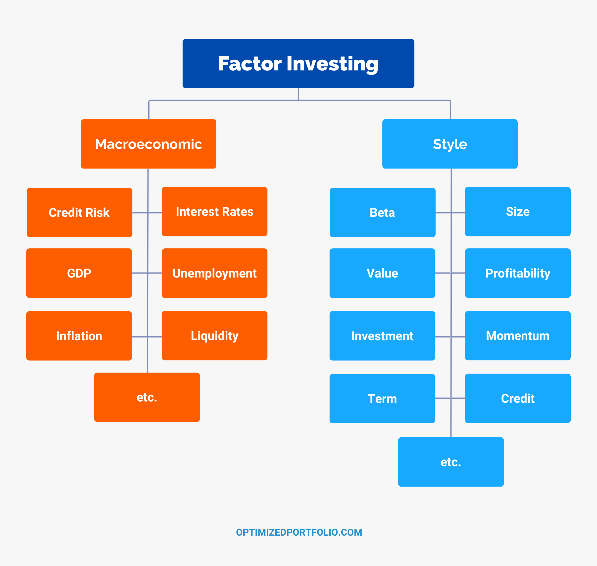

## Table of Contents

## What are Factor ETFs?

Factor ETFs are a type of exchange-traded fund that focuses on specific characteristics, or factors, that can help investors pick stocks. These factors can include things like the size of a company, how much it's growing, how cheap its stock is, or how much it moves with the market. By focusing on these factors, investors hope to get better returns or reduce risk compared to just investing in the whole market.

For example, if an investor believes that smaller companies will do better than bigger ones, they might choose a Factor ETF that focuses on company size. This ETF would include more stocks from smaller companies. Another investor might think that stocks that are less affected by the overall market will do better, so they might pick a Factor ETF that focuses on how much a stock moves with the market. This way, Factor ETFs help investors target specific parts of the market that they think will perform well.

## How do Factor ETFs differ from traditional ETFs?

Factor ETFs and traditional ETFs both let you invest in a bunch of stocks at once, but they do it in different ways. Traditional ETFs usually try to match the performance of a broad market index, like the S&P 500. This means they include a wide range of stocks to represent the whole market. For example, if you buy a traditional ETF that tracks the S&P 500, you're getting a little piece of all the companies in that index.

On the other hand, Factor ETFs focus on specific traits or "factors" that might make some stocks do better than others. These factors could be things like how big a company is, how fast it's growing, or how cheap its stock is compared to its earnings. Instead of trying to match a broad market, Factor ETFs aim to beat the market by [picking](/wiki/asset-class-picking) stocks with these special traits. So, if you think smaller companies will do better, you might pick a Factor [ETF](/wiki/etf-trading-strategies) that focuses on company size.

## What are the common factors used in Factor ETFs?

Factor ETFs focus on different characteristics, or factors, that can help pick stocks that might do better than the whole market. Some of the most common factors are size, value, [momentum](/wiki/momentum), quality, and low [volatility](/wiki/volatility-trading-strategies). Size looks at how big or small a company is. Value focuses on stocks that seem cheap compared to what the company is worth. Momentum picks stocks that have been going up in price recently. Quality looks for companies that are financially strong and well-managed. Low volatility chooses stocks that don't move up and down as much as others.

Each of these factors tries to find a way to beat the market by focusing on different things. For example, a size [factor](/wiki/factor-investing) ETF might invest more in smaller companies because they think these will grow faster. A value factor ETF might look for stocks that are underpriced, hoping they'll go up in value. Momentum ETFs bet on the idea that stocks that have been doing well will keep doing well. Quality ETFs aim for companies that are stable and profitable, which might be safer in tough times. Low volatility ETFs try to reduce risk by picking stocks that don't swing a lot in price.

By using these factors, investors can target specific parts of the market they think will do well. This is different from traditional ETFs, which just try to match the performance of a broad market index. Factor ETFs give investors more ways to try to beat the market, but they also come with their own risks and challenges.

## What are the benefits of investing in Factor ETFs?

Investing in Factor ETFs can help you make your investment strategy better. These ETFs focus on specific traits, like how big a company is, how cheap its stock is, or how fast it's growing. By picking stocks with these traits, Factor ETFs try to do better than the whole market. This can be good if you think certain parts of the market will do well. For example, if you believe smaller companies will grow faster, you can invest in a Factor ETF that focuses on company size.

Another benefit is that Factor ETFs can help you spread out your risk. Instead of putting all your money into one type of stock, you can invest in different factors. This way, if one factor doesn't do well, the others might make up for it. Also, some factors, like low volatility, can make your investments less risky because they pick stocks that don't go up and down as much. So, Factor ETFs can help you aim for better returns and manage risk at the same time.

## What are the risks associated with Factor ETFs?

Investing in Factor ETFs can be a bit risky. One big risk is that the factors they focus on might not do well all the time. For example, if you pick a Factor ETF that focuses on small companies because you think they'll grow fast, but then the market changes and small companies don't do well, your investment could lose money. It's hard to predict which factors will work best, so you might end up picking the wrong ones.

Another risk is that Factor ETFs can be more complicated than regular ETFs. They use special ways to pick stocks, and if you don't understand how these work, you might make bad choices. Also, because they focus on specific parts of the market, they can be more up and down than regular ETFs. This means your investment could go up a lot or down a lot, which can be scary if you're not ready for it.

Lastly, Factor ETFs can be more expensive. They often have higher fees because they need more work to pick the right stocks based on the factors. These extra costs can eat into your returns, making it harder to make money. So, while Factor ETFs can offer good chances to beat the market, they come with their own set of risks that you need to think about carefully.

## How can Factor ETFs be used in a diversified investment portfolio?

Factor ETFs can be a great tool to help you spread out your investments in different ways. They focus on specific traits like how big a company is, how cheap its stock is, or how fast it's growing. By adding Factor ETFs to your portfolio, you can target different parts of the market that you think will do well. For example, if you believe smaller companies will grow faster, you can invest in a Factor ETF that focuses on company size. This way, you're not putting all your eggs in one basket, and you can try to beat the market by picking stocks with these special traits.

Using Factor ETFs can also help you manage risk. Since they focus on different factors, you can mix them in your portfolio to balance out the ups and downs. For instance, if you have a Factor ETF that focuses on low volatility, it can help make your overall investments less risky because it picks stocks that don't go up and down as much. By combining different Factor ETFs, you can aim for better returns while also keeping your investments safer. This way, if one factor doesn't do well, the others might make up for it, helping you keep your portfolio steady.

## What is the historical performance of Factor ETFs?

Factor ETFs have been around for a while, and their performance can be a bit up and down. Over the years, some factors like value and momentum have done well at certain times, but not always. For example, value ETFs, which focus on stocks that seem cheap, did really well in the early 2000s but struggled in the years after the financial crisis. Momentum ETFs, which pick stocks that have been going up in price, had a good run in the mid-2010s but can be risky because they can drop fast if the market changes.

It's hard to say that Factor ETFs always do better than the whole market because their performance depends a lot on which factors are in style at the time. Sometimes, smaller companies might do better, making size-focused ETFs a good choice. Other times, stocks that don't move a lot, like those in low volatility ETFs, might be the winners. Because of this, investors need to keep an eye on the market and pick the right factors at the right time to get the best results from Factor ETFs.

## How do you evaluate the effectiveness of a Factor ETF?

To figure out if a Factor ETF is doing a good job, you need to look at how it's doing compared to the whole market. You can do this by checking its returns over time. If the ETF is beating the market, like the S&P 500, then it's doing well. But it's not just about the returns. You also need to see how much risk you're taking. Some Factor ETFs might do better than the market but go up and down a lot, which can be scary if you don't like risk. So, you should look at how much the ETF's value changes, called volatility, and see if it's worth the extra risk for the returns you're getting.

Another thing to think about is how well the ETF is sticking to its factor. If it's supposed to focus on small companies, you want to make sure it's actually picking those stocks. You can check this by looking at the ETF's holdings and seeing if they match the factor it's supposed to follow. Also, you should look at the fees. Some Factor ETFs can be more expensive because they need more work to pick the right stocks. If the fees are too high, they can eat into your returns, making the ETF less effective. By looking at all these things - returns, risk, how well it follows its factor, and fees - you can get a good idea of how effective a Factor ETF really is.

## What are the tax implications of investing in Factor ETFs?

Investing in Factor ETFs can have tax effects that you need to think about. When you buy and sell ETFs, you might have to pay taxes on any money you make. If you hold the ETF for more than a year, you'll pay a lower tax rate on your gains, called long-term capital gains tax. But if you sell it within a year, you'll pay a higher rate, known as short-term capital gains tax. Also, if the ETF sells stocks inside it and makes money, it might give you some of that money as dividends. These dividends can be taxed too, depending on how much you get and what kind they are.

Another thing to know is that Factor ETFs might do more buying and selling inside the fund than regular ETFs. This can lead to more taxes for you because the ETF might have to give you more dividends from those sales. If you're investing in a regular account, not a tax-sheltered one like an IRA or 401(k), you need to keep an eye on these taxes. They can eat into your returns, so it's a good idea to talk to a tax advisor to understand how Factor ETFs might affect your taxes and plan your investments wisely.

## How do Factor ETFs fit into different investment strategies?

Factor ETFs can be a useful part of many different investment strategies. If you want to try to beat the market, you can use Factor ETFs that focus on specific traits like how big a company is, how cheap its stock is, or how fast it's growing. By picking these ETFs, you can aim for better returns than just investing in the whole market. For example, if you think smaller companies will do better, you can add a size-focused Factor ETF to your portfolio. This way, you're not just following the market; you're trying to get ahead of it by targeting parts you think will do well.

Factor ETFs can also help you spread out your investments and manage risk. Instead of putting all your money into one type of stock, you can mix different Factor ETFs in your portfolio. This can help balance out the ups and downs. For instance, if you add a low volatility Factor ETF, it can make your overall investments less risky because it picks stocks that don't move up and down as much. By combining different Factor ETFs, you can aim for better returns while also keeping your investments safer. This way, if one factor doesn't do well, the others might make up for it, helping you keep your portfolio steady.

## What advanced techniques can be used to optimize a Factor ETF portfolio?

To make your Factor ETF portfolio better, you can use something called factor rotation. This means you keep an eye on how different factors are doing and switch your investments to the ones that are doing well at the moment. For example, if value stocks are doing better than [growth stocks](/wiki/growth-stocks), you might move more of your money into a value-focused Factor ETF. This way, you're always trying to be in the right place at the right time. It's like surfing and trying to catch the best wave. But remember, this can be tricky because you need to guess which factors will do well next, and you might get it wrong sometimes.

Another way to optimize your Factor ETF portfolio is by using something called multi-factor ETFs. These ETFs mix different factors together, like size, value, and momentum, to try to get the best of all worlds. By investing in a multi-factor ETF, you spread out your risk because you're not betting on just one factor. It's like having a team of players instead of relying on just one. This can make your portfolio more stable and might help you get better returns over time. But you need to check if the mix of factors in the ETF matches what you want and if the fees are worth it.

## How do regulatory environments affect the operation and performance of Factor ETFs?

The rules and laws that govern financial markets can have a big impact on how Factor ETFs work and how well they do. Different countries have different rules about what ETFs can invest in and how they need to report their activities. For example, some places might have strict rules about how much an ETF can invest in certain types of stocks or how often it needs to show its holdings to the public. These rules can make it harder for Factor ETFs to follow their strategies, especially if they need to buy and sell stocks often to keep up with their chosen factors. If the rules change, it can also affect how much it costs to run the ETF, which might lead to higher fees for investors.

Also, the way regulators watch over the market can affect how safe and trustworthy Factor ETFs seem to investors. If there's a lot of oversight and clear rules, people might feel more comfortable putting their money into these ETFs. But if there are big changes or uncertainty in the rules, it can make investors nervous and cause them to pull their money out, which can hurt the ETF's performance. So, keeping an eye on what regulators are doing and how it might change the rules for Factor ETFs is important for anyone thinking about investing in them.

## References & Further Reading

[1]: ["Global Factor Investing Study"](https://www.invesco.com/content/dam/invesco/emea/en/pdf/Invesco-Global-Factor-Investing-Study-2021-EMEA.pdf) by Vanguard Group

[2]: Ang, A. (2014). ["Asset Management: A Systematic Approach to Factor Investing."](https://archive.org/details/assetmanagements0000anga) Oxford University Press.

[3]: Carhart, M. M. (1997). "On Persistence in Mutual Fund Performance." Journal of Finance, 52(1), 57-82.

[4]: Fama, E. F., & French, K. R. (1993). "Common Risk Factors in the Returns on Stocks and Bonds." Journal of Financial Economics, 33(1), 3-56.

[5]: Arnott, R. D., Hsu, J., & Moore, P. (2005). "Fundamental Indexation." Financial Analysts Journal, 61(2), 83-99. 

[6]: ["Advances in Financial Machine Learning"](https://www.amazon.com/Advances-Financial-Machine-Learning-Marcos/dp/1119482089) by Marcos Lopez de Prado

[7]: Chen, M. H., & Zimmermann, H. (2020). ["Factor Investing: From Traditional to Alternative Risk Premia."](https://www.researchgate.net/publication/323110894_Factor_Investing_From_Traditional_to_Alternative_Risk_Premia) Journal of Asset Management.

[8]: Asness, C. S., Liew, J. M., & Stevens, R. L. (1997). "Parallels Between the Cross-Sectional Predictability of Stock and Country Returns." Journal of International Money and Finance, 16(6), 613-636.

[9]: Blitz, D., & Van Vliet, P. (2007). "The Volatility Effect: Lower Risk Without Lower Return." Journal of Portfolio Management, 34(1), 102-113.