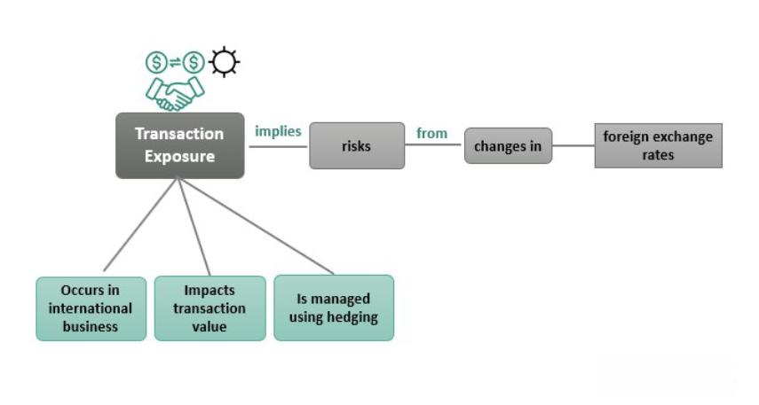

Algorithmic trading represents a cutting-edge intersection of finance and technology, offering traders myriad opportunities to capitalize on market dynamics through sophisticated strategies. Leveraging algorithms, traders can automate the execution of trades based on predetermined criteria, thus enabling moment-to-moment adjustments that capitalize on even the most fleeting market conditions. A fundamental concept within this domain is 'factor exposure', a critical determinant in shaping trading strategies and influencing performance outcomes.

Factor exposure involves understanding how particular market factors drive investment returns and how sensitive an investment portfolio is to these elements. In finance, these factors typically encompass size, value, momentum, and volatility among others, influencing asset prices significantly. Traders who comprehend factor exposure can better gauge potential risks and returns in diverse market environments, allowing them to fine-tune strategies in alignment with these broader market catalysts.



In algorithmic trading, incorporating factor exposures allows for optimized strategy development that resonates with prevailing market movements. By systematically understanding and applying these elements, traders can balance their portfolios more effectively, enhancing the risk-adjusted returns of their investments.

This article will investigate the various dimensions and applications of factor exposure, relating this powerful concept to actionable trading strategies. Through comprehensive exploration, the aim is to equip you with the insights necessary to make factor exposure an essential part of your algorithmic trading practices, facilitating improved decision-making in an ever-evolving market landscape.

## Table of Contents

## What is Factor Exposure?

Factor exposure refers to an investment's sensitivity to specific market factors that influence returns. These factors are underlying characteristics or variables that systematically explain differences in the returns of financial assets. Commonly identified factors in finance include size, value, [momentum](/wiki/momentum), and [volatility](/wiki/volatility-trading-strategies), each playing a significant role in the behavior of asset prices.

Size, as a [factor](/wiki/factor-investing), relates to the market capitalization of a company. The size effect suggests that smaller companies often outperform larger ones on a risk-adjusted basis. Value, another critical factor, is linked to the book-to-market ratio; it measures the return premium investors can potentially gain by investing in undervalued stocks relative to their intrinsic value. 

Momentum is the tendency of assets to exhibit persistence in their performance; assets with positive trends tend to continue performing well in the short-term, while those underperforming may continue to lag behind. Volatility, as a factor, accounts for the degree of variation in asset prices over time, often serving as a proxy for risk.

Understanding factor exposure is essential for traders and portfolio managers as it allows them to assess the risk-return profile of their investments given different market conditions. In [algorithmic trading](/wiki/algorithmic-trading), factor exposure can be incorporated into trading models to optimize strategy performance in alignment with prevailing market trends. By quantitatively measuring how sensitive an investment is to these factors, traders can systematically balance portfolios, thereby enhancing risk-adjusted returns.

For instance, an asset's return $R_i$ can be modeled using a multi-factor model such as the following:

$$
R_i = \alpha + \beta_1 F_1 + \beta_2 F_2 + \cdots + \beta_n F_n + \epsilon
$$

where:
- $R_i$ is the return of the asset.
- $\alpha$ is the asset's expected return independent of exposure to the factors.
- $\beta_n$ represents the loadings or sensitivities of the asset to specific factors $F_n$.
- $\epsilon$ is the error term capturing idiosyncratic risks.

Through this multi-factor model, traders can ascertain which factors have historically influenced their portfolio's returns and thus leverage this understanding to devise strategies that are robust to different economic scenarios. Factor exposure, therefore, serves as a cornerstone for systematic investment processes, driving the identification of both potential risks and opportunities in the trading landscape.

## Importance of Factor Exposure in Algo Trading

Factor exposure is a crucial aspect of algorithmic trading, offering traders the ability to develop strategies that are attuned to specific market drivers. By understanding and utilizing factor exposures, traders can significantly enhance the efficacy of their trading models and decision-making processes.

Modern computational tools enable traders to backtest and optimize their strategies in relation to identified factor exposures. Backtesting involves simulating how a trading strategy would have performed in the past using historical data. This process helps determine how sensitive a trading model is to various factors such as market risk, size, and momentum. By optimizing factor exposures, traders can align their strategies more closely with market dynamics, improving the precision of model predictions.

Factor exposure also forms the foundation of advanced trading strategies such as statistical [arbitrage](/wiki/arbitrage) and momentum trading. Statistical arbitrage involves exploiting pricing inefficiencies between assets that have statistical relationships but are mispriced in the short term. Understanding factor exposures allows traders to identify and model these pricing discrepancies more accurately. Similarly, momentum trading, which is based on the assumption that past asset performance will continue in the short term, relies heavily on factor analysis to predict future trends effectively.

Neglecting factor exposure can lead to suboptimal trading strategies, especially in variable financial environments. Markets are continuously influenced by a confluence of factors that drive asset prices. Without accounting for these factors, trading models can fail to adapt to changes in market conditions, resulting in poor performance. Comprehensive factor analysis provides a structured approach to manage these complexities, ensuring that strategies remain robust across different market scenarios. 

By tailoring strategies to factor exposures, algorithmic traders can better manage risks and capitalize on opportunities, maintaining a competitive edge in ever-evolving financial markets.

## Types of Factor Exposures in Algorithmic Trading

Common factors in algorithmic trading are integral to understanding and anticipating market movements. These factors include Market Risk, also known as Beta, Size Factor, Value, and Momentum. Each of these factors reflects a unique aspect of market behavior and can significantly impact investment strategies.

1. **Market Risk (Beta):** Beta measures an asset's sensitivity to market movements. A higher beta implies that the asset is more volatile than the market, and vice versa. For traders, understanding beta is crucial when assessing a stock's risk level relative to broader market shifts. Mathematically, Beta ($\beta$) is expressed as:
$$
   \beta = \frac{\text{Cov}(R_i, R_m)}{\text{Var}(R_m)}

$$

   where $R_i$ is the return of the individual asset, and $R_m$ is the return of the market.

2. **Size Factor (Small minus Big):** This factor captures the return spread between small-cap and large-cap stocks. Historically, smaller companies (small-cap) tend to outperform larger ones (large-cap) over the long term. This phenomenon is exploited in trading strategies that bet on the size premium.

3. **Value (High Book to Market):** The value factor targets stocks with high book-to-market ratios, suggesting they are undervalued by the market. Investing in such stocks typically yields higher returns as the market adjusts their valuations.

4. **Momentum:** The momentum factor revolves around the premise that assets which have performed well in the recent past will continue to do so in the near future. Momentum trading strategies capitalize on these trends by buying securities that exhibit a high momentum score.

5. **Other Factors:** Volatility, Dividend Yield, and Quality are additional considerations in various trading environments. Volatility measures the degree of variation in trading prices, while dividend yield is the ratio of a company's annual dividends to its share price. Quality factors include metrics like financial stability, earnings variability, and profitability.

6. **Macro Factors:** Interest rates, inflation, and economic growth rates are macroeconomic indicators that affect asset prices and trading strategies focused on these elements. These factors can influence specific sectors differently and are analyzed to foresee macroeconomic shifts in the market.

Traders employ these factors to determine potential alpha generation and beta risks within their portfolios. By combining multiple factor exposures, traders can diversify risk and enhance strategic outcomes. This multi-factor approach balances the nuances of individual factors against the backdrop of economic conditions, providing a robust framework for optimizing trading strategies.

## Integrating Factor Exposure into Trading Strategies

Integrating factor exposure into trading strategies involves a structured approach to ensure that the strategies are robust and aligned with market dynamics. The first step is to identify relevant factors that resonate with your trading strategy and objectives. Factors such as market risk, size, value, momentum, and others must be mapped to understand their historical impact on market behavior. This requires comprehensive analysis of historical data to identify patterns, risks, and potential returns associated with each factor. 

Utilizing historical data involves statistical analysis and [machine learning](/wiki/machine-learning) techniques to uncover relationships between these factors and asset returns. Python, with libraries like pandas and scikit-learn, can be utilized for data manipulation and model building. For example:

```python
import pandas as pd
from sklearn.linear_model import LinearRegression

# Load historical data
data = pd.read_csv('historical_data.csv')

# Define your factors and returns
X = data[['market_risk', 'size', 'value', 'momentum']]
y = data['asset_returns']

# Fit a linear model
model = LinearRegression().fit(X, y)

# Calculate factor loadings
factor_loadings = model.coef_
```

Developing algorithms that dynamically respond to changes in factor exposure is crucial for exploiting market inefficiencies. These algorithms should be designed to adjust factor weights based on their predictive power, as measured by statistical significance or machine learning feature importance metrics.

Backtesting is a vital phase, ensuring that trading strategies perform well against historical data. Simulation tools, such as [backtrader](/wiki/backtrader) in Python, allow traders to test the strategy's viability by simulating its performance during different market cycles. This helps in assessing the strategy's robustness and tweaking it to enhance performance consistency.

```python
from backtrader import Cerebro

# Initialize the cerebro engine
cerebro = Cerebro()

# Add a strategy
cerebro.addstrategy(MyFactorStrategy)

# Provide historical data
cerebro.adddata(MyHistoricalData)

# Run backtest
cerebro.run()
```

Regular monitoring and adjustment of factor exposures are critical to maintaining strategy relevance over time. Markets are not static, and economic conditions can shift factors' relevance. This necessitates continuous monitoring of economic indicators and market sentiment, enabling adaptive factor exposure adjustments. Traders can use real-time data analytics platforms to stay updated on market conditions and incorporate real-time data feeds into algorithmic models for timely strategy adaptation.

In summary, a strategic approach to integrating factor exposure into trading strategies involves identifying factors relevant to the trading objectives, using historical data for factor impact analysis, developing adaptive algorithms, [backtesting](/wiki/backtesting) for consistency, and continuously monitoring and adjusting factor exposures in line with market dynamics.

## Challenges and Considerations

One of the primary challenges in utilizing factor exposures in algorithmic trading is ensuring the data used for strategy development is both accurate and relevant. Data accuracy is crucial because the entire foundation of factor-based trading strategies relies on precise and reliable data inputs. Inaccurate data can lead to erroneous factor analysis, which can significantly skew trading decisions and outcomes. Additionally, relevance is a key concern because market conditions are not static; they evolve over time, which can lead to shifts in the significance of different factors. Traders must be vigilant in updating their models to reflect these changes, which requires continuous monitoring and adaptation of factor exposures.

Overfitting represents another significant challenge wherein models are excessively tailored to historical data. This can result in trading strategies that excel in past performance yet struggle under fluid market conditions that diverge from historical norms. Overfitting can falsely enhance a model's predictive capabilities, leading traders to make suboptimal decisions in a live market setting. Developing robust models that are resilient to overfitting often involves techniques such as cross-validation and stress testing against a range of market scenarios.

Trading strategies based on factor exposure must also account for transaction costs and [liquidity](/wiki/liquidity-risk-premium) risks, crucial elements that can erode profitability. Transaction costs, including fees, slippage, and the bid-ask spread, must be meticulously considered within the trading strategy to accurately assess net returns. Meanwhile, liquidity risk can impact a strategy’s ability to enter and [exit](/wiki/exit-strategy) positions without significant market impact, particularly in less liquid markets or during periods of market stress.

A holistic approach is essential for effectively balancing multiple factor exposures and managing the associated risks. This involves constructing a diversified portfolio that does not overly rely on any single factor, thus mitigating idiosyncratic risks. Traders must engage in comprehensive risk management practices, which may include the use of derivatives for hedging, dynamic rebalancing of portfolios, and employing advanced statistical and machine learning techniques to anticipate and adjust for shifts in factor dynamics. By considering these elements, traders can enhance their ability to manage risks and optimize performance in dynamic markets.

## Conclusion

Factor exposure provides valuable insights and opportunities for informed decision-making in algorithmic trading. By effectively harnessing the appropriate factors, traders can enhance their algorithmic trading strategies, aligning them with broader market dynamics. As market conditions are ever-evolving, it is crucial for strategies to adapt fluidly to changes in factor exposures. This adaptability enhances robustness, ensuring that trading strategies remain effective across different market regimes.

Algo traders who master factor exposure can significantly optimize portfolio performance, thereby gaining a competitive advantage. Understanding the subtle intricacies of factor interactions allows traders to anticipate market pressures more accurately and proactively adjust their positions. Moreover, integrating factor exposure into trading strategies goes beyond merely aiming for higher returns; it is equally about prudent risk management. By balancing various factor exposures, traders can potentially reduce portfolio volatility and mitigate unwanted risks.

In conclusion, while factor exposure is instrumental for achieving better returns, its true value lies in empowering traders with the ability to manage risks intelligently. Thus, a nuanced approach to factor exposure not only bolsters returns but also contributes to the overall stability and resilience of trading strategies in an increasingly competitive and complex financial landscape.

## References & Further Reading

[1]: Fama, E.F., & French, K.R. (1993). ["Common Risk Factors in the Returns on Stocks and Bonds."](https://www.sciencedirect.com/science/article/pii/0304405X93900235) Journal of Financial Economics, 33(1), 3-56.

[2]: Carhart, M. M. (1997). ["On Persistence in Mutual Fund Performance."](https://onlinelibrary.wiley.com/doi/full/10.1111/j.1540-6261.1997.tb03808.x) The Journal of Finance, 52(1), 57-82.

[3]: ["Advances in Financial Machine Learning"](https://www.amazon.com/Advances-Financial-Machine-Learning-Marcos/dp/1119482089) by Marcos Lopez de Prado

[4]: Grinold, R.C., & Kahn, R.N. (2000). ["Active Portfolio Management: A Quantitative Approach for Producing Superior Returns and Controlling Risk."](https://www.amazon.com/Active-Portfolio-Management-Quantitative-Controlling/dp/0070248826) McGraw-Hill Education.

[5]: Chan, E. P. (2009). ["Quantitative Trading: How to Build Your Own Algorithmic Trading Business"](https://github.com/ftvision/quant_trading_echan_book) Wiley Trading.

[6]: Jegadeesh, N., & Titman, S. (1993). ["Returns to Buying Winners and Selling Losers: Implications for Stock Market Efficiency."](https://onlinelibrary.wiley.com/doi/abs/10.1111/j.1540-6261.1993.tb04702.x) The Journal of Finance, 48(1), 65-91.

[7]: Jansen, S. (2018). ["Machine Learning for Algorithmic Trading: Predictive Models to Extract Signals from Market and Alternative Data for Systematic Trading Strategies with Python."](https://www.amazon.com/Machine-Learning-Algorithmic-Trading-alternative/dp/1839217715) Packt Publishing.