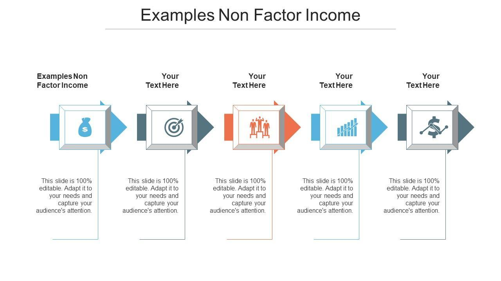

## Table of Contents

## What is factor income?

Factor income is the money that people or businesses earn from using their resources to produce goods or services. These resources, called factors of production, include things like land, labor, and capital. For example, when a farmer earns money from selling crops grown on their land, that's factor income from land. When a worker gets paid for their job, that's factor income from labor. And when a business owner earns profit from their company, that's factor income from capital.

Understanding factor income is important because it helps us see how wealth is created and distributed in an economy. Different countries might have different ways of earning factor income. For instance, a country with a lot of factories might earn more from capital, while a country with many farms might earn more from land. By looking at factor income, economists can learn about the health of an economy and how different groups of people are doing financially.

## What is non-factor income?

Non-factor income is money that people or countries get that isn't from using their resources to make things. It's different from factor income, which comes from things like land, labor, and capital. Non-factor income includes things like gifts, donations, and money sent from one country to another, which is called remittances.

For example, if someone in one country sends money to their family in another country, that money is non-factor income for the family receiving it. Another example is when a country gets aid from another country or an organization. This aid is also non-factor income because it's not earned from producing goods or services. Non-factor income is important because it can help support people and countries that might not have enough money from their own resources.

## How do factor income and non-factor income differ?

Factor income and non-factor income are two different ways that people and countries can get money. Factor income comes from using resources like land, labor, and capital to make things. For example, when a farmer sells crops from their land, that's factor income. When a worker gets paid for their job, that's also factor income. It's all about earning money by using what you have to produce goods or services.

Non-factor income, on the other hand, is money that comes from other places, not from making things. This can include gifts, donations, or money sent from one country to another, which we call remittances. For instance, if someone sends money to their family in another country, that money is non-factor income for the family receiving it. Countries can also get non-factor income as aid from other countries or organizations. This type of income helps support people and countries that might not have enough money from their own resources.

## What are the main sources of factor income?

Factor income comes from using resources to make things. The main sources of factor income are land, labor, and capital. When people use their land to grow crops or rent it out, they earn money from it. This is factor income from land. For example, a farmer selling wheat from their field gets factor income. Another source is labor. When people work and get paid for their time and effort, that's factor income from labor. A worker earning a salary or hourly wage is getting factor income from their job.

The third source of factor income is capital. This is when people use money or equipment to start a business or invest in something that makes money. For example, if someone owns a factory and earns profit from it, that's factor income from capital. Also, if someone invests in stocks and gets dividends, that's another way to earn factor income from capital. These three sources—land, labor, and capital—are the main ways people earn factor income by using their resources to produce goods or services.

## What are the common sources of non-factor income?

Non-factor income comes from sources that are not about making things. One common source is remittances, which is when people working in one country send money back to their families in another country. For example, if someone from Mexico works in the United States and sends money home, that money is non-factor income for their family in Mexico. Another source is gifts and donations. When someone gives money to another person or a charity without expecting anything in return, that's non-factor income. For instance, if a rich person donates money to help build a school, the money received by the school is non-factor income.

Another common source of non-factor income is foreign aid. This is when one country or an international organization gives money to another country to help it. For example, if the United States gives money to help rebuild a country after a natural disaster, that money is non-factor income for the country receiving it. These sources of non-factor income are important because they can help support people and countries that might not have enough money from their own resources. They provide a way for money to flow between people and countries without being tied to the production of goods or services.

## How is factor income calculated?

Factor income is calculated by looking at the money people or businesses earn from using their resources to make things. These resources are called factors of production, and they include land, labor, and capital. For land, factor income is the money earned from using the land to grow crops or rent it out. For example, if a farmer sells wheat from their field, the money they get is factor income from land. For labor, factor income is the money people earn from working. This could be a salary or hourly wage. If someone works at a factory and gets paid, that's factor income from labor.

For capital, factor income is the money earned from using money or equipment to make more money. This can include profits from a business or dividends from investments. If someone owns a factory and makes a profit from selling the products, that's factor income from capital. If someone invests in stocks and gets dividends, that's also factor income from capital. To calculate total factor income, you add up all the money earned from land, labor, and capital. This helps economists understand how much money is being made from using resources to produce goods and services.

## Can you provide examples of non-factor income?

Non-factor income is money that people or countries get from sources that don't involve making things. One common example is remittances. This happens when people working in one country send money back to their families in another country. For instance, if someone from the Philippines works in Saudi Arabia and sends money home to their family, that money is non-factor income for their family in the Philippines. Another example is gifts and donations. If a person gives money to a friend or a charity without expecting anything in return, that's non-factor income. For example, if a wealthy person donates money to build a community center, the money the community center receives is non-factor income.

Foreign aid is another example of non-factor income. This is when one country or an international organization gives money to another country to help it. For instance, if the United States gives money to help rebuild a country after an earthquake, that money is non-factor income for the country receiving it. These examples show how non-factor income can help support people and countries that might not have enough money from their own resources. It's a way for money to flow between people and countries without being tied to the production of goods or services.

## What role does factor income play in national income accounting?

Factor income is a big part of national income accounting. It helps us figure out how much money a country makes from using its resources like land, labor, and capital to make things. When we add up all the money from these resources, we get a good idea of how much the country earns from its own production. This is important because it shows how well the country is doing in making goods and services. Economists use this information to see if the economy is growing or shrinking.

Factor income also helps us understand how money is shared among different people and groups in a country. For example, if a lot of the factor income comes from labor, it means many people are earning money from their jobs. If more comes from capital, it might mean that business owners and investors are doing well. By looking at factor income, we can see which parts of the economy are strong and which might need help. This helps the government and businesses make better plans for the future.

## How do changes in factor income affect the economy?

Changes in factor income can have a big impact on the economy. When factor income goes up, it usually means that people are earning more from their jobs, their land, or their investments. This can make the economy grow because people have more money to spend on things they need or want. When people spend more, businesses make more money, and they might hire more workers or invest in new projects. This can create a cycle where the economy keeps getting better. But if factor income goes down, people have less money to spend. This can slow down the economy because businesses might sell less and might have to cut jobs or stop investing.

Changes in factor income also affect different groups of people in different ways. If income from labor goes up, it's good for workers because they earn more money. But if income from capital goes down, it can be bad for business owners and investors because they make less profit. This can lead to more inequality in the economy if some groups earn a lot more than others. Governments often watch these changes closely and might make policies to help balance things out. For example, they might raise the minimum wage to help workers if labor income is low, or they might offer tax breaks to businesses if capital income is struggling.

## What are the implications of non-factor income on economic development?

Non-factor income, like remittances, gifts, and foreign aid, can help a country grow its economy. When people in a country get money from family members working abroad, they can use that money to buy things they need, like food and clothes, or even to start small businesses. This can make the economy stronger because more people are spending money and creating jobs. Foreign aid can also help by paying for big projects like building roads or schools, which can help the country develop faster. But non-factor income can also have some downsides. If a country relies too much on this kind of money, it might not work hard enough to grow its own businesses and industries. This can make the economy weak in the long run.

Non-factor income can also affect how equal or unequal a country's economy is. When money comes in from outside, it might go to certain people or groups more than others. For example, if aid money goes to the government, it might not reach the poor people who need it most. On the other hand, if remittances help poor families, it can make their lives better and reduce inequality. Governments need to be careful about how they use non-factor income to make sure it helps everyone in the country and doesn't just make a few people richer. By balancing non-factor income with efforts to grow the economy from within, a country can use this money to help it develop in a good way.

## How do government policies influence factor and non-factor income?

Government policies can have a big impact on factor income, which is the money people earn from their land, labor, and capital. For example, if the government raises the minimum wage, it helps workers earn more money from their jobs. This is good for labor income. If the government gives tax breaks to businesses, it can help them make more profit, which is good for capital income. Also, if the government invests in farming or gives money to farmers, it can help them earn more from their land. By making these kinds of policies, the government can help different groups of people earn more money from their resources.

Government policies can also affect non-factor income, which is money that comes from sources like remittances, gifts, and foreign aid. For example, if the government makes it easier for people to send money home from other countries, it can help families get more remittances. This can be good for the economy because it gives people more money to spend. If the government uses foreign aid well, like building schools or roads, it can help the country develop faster. But if the government relies too much on non-factor income, it might not work hard enough to grow its own economy. So, the government needs to balance using non-factor income with making its own economy stronger.

## What advanced economic theories explain the distribution of factor and non-factor income?

One advanced economic theory that helps explain how factor income is distributed is the marginal productivity theory. This theory says that people get paid based on how much they help make things. For example, if a worker helps a company make a lot more products, they should get paid more. This idea works for land and capital too. If a piece of land or a machine helps make a lot more, the owner should earn more from it. But this theory also shows that not everyone earns the same. Some people have skills or own resources that are more valuable, so they get more factor income. This can make the economy unequal because some people earn a lot more than others.

Another theory that helps explain both factor and non-factor income is the dependency theory. This theory says that some countries stay poor because they depend too much on rich countries. For example, a poor country might get a lot of non-factor income like foreign aid or remittances from people working abroad. While this money can help in the short term, it can also make the country less likely to grow its own economy. Dependency theory says that for a country to develop, it needs to focus on making its own goods and services and not just rely on money from outside. This can affect how factor income is distributed because if a country's economy grows, more people can earn money from their own resources.

## References & Further Reading

[1]: Bergstra, J., Bardenet, R., Bengio, Y., & Kégl, B. (2011). ["Algorithms for Hyper-Parameter Optimization."](https://papers.nips.cc/paper/4443-algorithms-for-hyper-parameter-optimization) Advances in Neural Information Processing Systems 24.

[2]: ["Advances in Financial Machine Learning"](https://www.amazon.com/Advances-Financial-Machine-Learning-Marcos/dp/1119482089) by Marcos Lopez de Prado

[3]: ["Evidence-Based Technical Analysis: Applying the Scientific Method and Statistical Inference to Trading Signals"](https://www.amazon.com/Evidence-Based-Technical-Analysis-Scientific-Statistical/dp/0470008741) by David Aronson

[4]: ["Machine Learning for Algorithmic Trading"](https://github.com/PacktPublishing/Machine-Learning-for-Algorithmic-Trading-Second-Edition) by Stefan Jansen

[5]: ["Quantitative Trading: How to Build Your Own Algorithmic Trading Business"](https://www.amazon.com/Quantitative-Trading-Build-Algorithmic-Business/dp/1119800064) by Ernest P. Chan