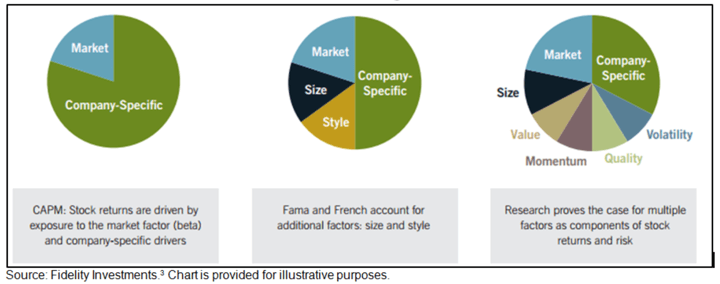

This article explores the intricate world of financial strategies, specifically focusing on investment strategies like factor investing and algorithmic trading. These strategies have transformed how investors approach portfolios by enhancing performance, managing risks, and optimizing returns. Factor investing involves selecting securities based on attributes or "factors" that have been historically linked to higher returns, such as growth versus value, size, momentum, and quality. Meanwhile, algorithmic trading leverages computer programs to execute trades efficiently, often mitigating human emotion's impact on trading decisions. 

By exploring these strategies, the article aims to provide readers with a comprehensive understanding of modern investment frameworks. These frameworks have evolved considerably with the integration of quantitative methods that allow for more precise investment processes. Quantitative analysis, which employs mathematical models and statistical techniques, helps identify patterns and opportunities that may not be evident through traditional analysis. This transformation underscores the importance of staying informed and adaptive in today's fast-paced financial markets, where advanced technologies play an increasingly crucial role.



Factor investing and algorithmic trading are not just strategies for the future but integral parts of contemporary investing. As financial markets continue to evolve, these strategies are expected to gain further traction. Understanding their basics is essential for investors aiming to harness their full potential for a resilient and profitable investment portfolio.

## Table of Contents

## Understanding Financial Strategies

Financial strategies are critical components that guide investors and financial managers in meeting their investment objectives. At their core, these strategies aim to optimize investment outcomes by balancing potential returns with associated risks. This requires a thorough understanding of both traditional investment methods and advanced strategies driven by technology and quantitative analysis.

Traditional investment strategies often rely on fundamental analysis, where the intrinsic value of an asset is evaluated by examining related economic, financial, and other qualitative and quantitative factors. This approach involves analyzing a company's financial statements, industry position, and market conditions to make informed investment decisions. The primary goal is to maximize returns through sound investment choices while managing the inherent risks involved.

On the other end of the spectrum, advanced financial strategies utilize technology and quantitative techniques to make data-driven decisions. These approaches often incorporate mathematical models, algorithms, and statistical analysis to identify patterns and opportunities within financial markets. Advanced strategies leverage a vast array of data sources, from market price movements and economic indicators to [alternative data](/wiki/best-alternative-data) such as social media sentiment and satellite imagery, to gain a competitive advantage.

The core objective of any financial strategy is twofold: to maximize returns and to manage risk effectively. This involves building a diversified portfolio that spreads investment risk across a variety of assets. Diversification helps mitigate the impact of poor performance in any single asset or asset class. This aligns with the principles of Modern Portfolio Theory (MPT), which suggests that a diversified portfolio can achieve a higher expected return for a given level of risk. The efficient frontier, a concept from MPT, illustrates this trade-off, where the goal is to reach the optimal portfolio offering the highest possible return for a defined level of risk.

Understanding the array of financial strategies is indispensable for navigating the complexities of the investment landscape. By gaining insight into various strategies, investors can tailor their approaches to align with their risk tolerance, investment goals, and market conditions. Whether employing traditional analysis or advanced quantitative techniques, the effective deployment of financial strategies can substantially enhance investment performance. As financial markets evolve, the integration of technology and data analytics continues to transform how investment decisions are developed and implemented, providing new opportunities for optimizing investment outcomes.

## Investment Strategy: The Case for Factor Investing

Factor investing is an investment strategy that aims to achieve higher returns by selecting securities based on certain attributes or factors. These factors, categorized as either macroeconomic or style factors, are believed to explain the differences in stock returns over the long term. Factor investing focuses on systematically capturing these attributes to enhance portfolio performance by improving diversification, increasing returns, and managing risk more effectively.

### Key Factors in Factor Investing

1. **Growth vs. Value**: 

   - **Growth Factor**: Growth investing involves selecting stocks that exhibit potential for above-average earnings increases. These stocks typically have high price-to-earnings (P/E) ratios or high price-to-book (P/B) ratios, as their revenues and earnings are expected to grow at an exceptional rate compared to the overall market.

   - **Value Factor**: Value investing focuses on stocks that appear underpriced based on fundamental analysis. These stocks often feature low P/E or P/B ratios, indicating that they are trading for less than their intrinsic value.

2. **Size Factor**:

   The size [factor](/wiki/factor-investing) refers to investing in companies based on their market capitalization. Research has historically shown that smaller companies (small-cap) tend to outperform larger companies (large-cap) over the long term, possibly due to their higher growth potential and less analyst coverage, which might lead to more mispricing opportunities.

3. **Momentum Factor**:

   Momentum investing involves buying securities that have shown an upward price trend over a specific period and selling those with downward trends. The [momentum](/wiki/momentum) factor exploits the tendency of securities to continue performing in line with recent trends, leveraging market psychology and investor behavior, which often cause stocks to overreact to news.

4. **Quality Factor**:

   Quality investing targets companies with strong fundamentals such as robust profitability, stable earnings, low debt, and high return on equity (ROE). These indicators suggest financial strength and stability, making such stocks attractive in various market conditions.

5. **Volatility Factor**:

   Low-[volatility](/wiki/volatility-trading-strategies) investing concentrates on stocks with less price fluctuation compared to the market. This strategy leverages the "low-volatility anomaly," where low-volatility stocks have been found to offer higher risk-adjusted returns than their high-volatility counterparts, potentially due to behavioral factors and institutional mandates.

### Contribution to a Successful Investment Strategy

The integration of these factors into an investment portfolio aims to create a more diversified and robust strategy. By systematically targeting specific attributes that have been associated with outperformance, investors seek to harness risk premia that are expected to materialize over time. This approach relies heavily on rigorous quantitative analysis and statistical models to identify opportunities that might otherwise be overlooked by traditional investment methods.

Empirical research and practical applications suggest that a factor-based strategy can improve risk-adjusted returns by steering the portfolio through different economic cycles. However, it is crucial to recognize that factor investing requires a deep understanding of the underlying drivers of each factor and the interplay between them, as well as proper due diligence and ongoing monitoring.

In conclusion, factor investing provides a structured methodology for capturing specific risks and opportunities in the market. By comprehensively understanding and applying these factors, investors can enhance portfolio diversification and optimize returns while managing associated risks.

## Algo Trading: Revolutionizing Financial Markets

Algorithmic trading, often referred to as algo trading, involves the use of computer algorithms to execute trades on financial markets with precision and speed. By removing human emotion and the potential for error from the trading process, these automated systems aim to optimize trade execution and improve market efficiency.

### Mechanisms of Algorithmic Trading
Algo trading fundamentally relies on pre-programmed rules and quantitative models to identify trading opportunities and execute orders. These algorithms analyze a plethora of market data, such as price, [volume](/wiki/volume-trading-strategy), and time, to identify patterns and make trading decisions. The speed at which these algorithms can operate gives them a significant advantage over traditional human traders, particularly in fast-moving markets.

### Common Algorithmic Trading Strategies
Several strategies are prevalent in the world of algo trading:

1. **Trend-Following Strategies**: These algorithms attempt to capitalize on market trends by executing trades based on the direction and strength of a trend. For example, a simple moving average crossover strategy could be used, where buy signals are triggered when a short-term moving average crosses above a long-term moving average.

2. **Arbitrage**: Arbitrage strategies exploit price discrepancies of similar or identical financial instruments across different markets to secure a risk-free profit. This might involve buying an asset on one market at a lower price and simultaneously selling it on another at a higher price.

3. **Index Fund Rebalancing**: Algorithmic trading is also used to rebalance portfolio holdings in index funds when there are changes in the underlying index. The objective is to execute large batches of transactions with minimal market impact and reduced transaction costs.

### Advantages of Algorithmic Trading
The advantages of [algorithmic trading](/wiki/algorithmic-trading) are multifaceted:

- **Speed and Efficiency**: Algorithms can execute orders in fractions of a second, far faster than human capability, allowing traders to capitalize on fleeting market conditions.

- **Accuracy**: By executing trade orders automatically based on predefined criteria, algo trading minimizes the potential for human error that might arise from manual trading processes.

- **Backtesting Capability**: Algorithms can be tested on historical data to evaluate their performance, refine strategies, and improve predictability before being deployed in live markets.

### Challenges of Algorithmic Trading
Despite its benefits, algo trading presents several challenges:

- **Dependence on Technology**: The reliance on computer systems and networks means that any technological failure could lead to significant trading losses or missed opportunities.

- **Model Risk**: Algorithms are based on mathematical models that may become outdated or inaccurate during unforeseen market shocks, leading to unanticipated trading losses.

- **Regulatory Concerns**: As algorithms can execute large volumes of trades at high speeds, regulators are concerned about their potential to contribute to market volatility and have imposed safeguards to protect market integrity.

### Conclusion
Algorithmic trading has revolutionized financial markets through enhanced trade execution, improved market [liquidity](/wiki/liquidity-risk-premium), and minimized human intervention. The utilization of these advanced trading algorithms continues to grow, as traders seek to harness the power of technology to gain an edge in complex financial markets.

## Integrating Factor Investing and Algo Trading

Integrating factor investing with algorithmic trading provides a sophisticated approach to optimizing investment portfolios. This blend capitalizes on quantitative analysis to pinpoint profitable opportunities, thereby enhancing execution precision and optimizing risk-adjusted returns.

**Leveraging Quantitative Analysis**

Factor investing relies on identifying specific factors, such as value, size, momentum, quality, and low volatility, which have historically provided returns above the market average. By incorporating algorithmic trading, investors automate the selection and rebalancing process, ensuring timely reactions to market conditions. Algorithms can rapidly process large datasets to recognize patterns and uncover factors, enhancing the factor model's robustness and accuracy.

For instance, consider a momentum factor strategy, which involves buying securities with positive recent returns and selling those with negative returns. An algorithm could automate this strategy by continuously evaluating the recent performance metrics of a stock portfolio and executing trades when a threshold condition is met. This process minimizes lag, a common issue in manual trading.

**Enhancing Execution Precision**

Algorithmic trading systems are designed to perform trades at optimal times, often executing orders based on predefined criteria such as price level, timing, or volume. This capability is invaluable for factor-based strategies, where timely execution can significantly impact returns. 

For example, deploying a Volume Weighted Average Price (VWAP) algorithm can aid in executing trades at prices closer to the average trading price during a given period, reducing the market impact of large trades. This precision is especially beneficial when investing in large positions based on factor signals, minimizing transaction costs and slippage.

**Optimizing Risk-Adjusted Returns**

The integration of factor investing and algo trading allows for dynamic risk management. Algorithms can systematically adjust exposure to various factors based on market conditions and risk assessments. This adaptability helps maintain target risk levels and optimize the Sharpe ratio, a common measure for risk-adjusted returns.

Investors can use algorithms to adjust portfolios in response to volatility shifts. For example, if the market becomes more volatile, an algorithm might temporarily increase allocation to low-volatility or quality factors, which historically offer more stable returns. Conversely, during calmer market phases, the algorithm can shift focus towards momentum factors to capture potential alpha.

**Effective Combination Strategies**

For effective integration, investors should ensure robust data infrastructure, implement advanced algorithms capable of real-time processing, and continuously monitor model performance. A practical approach involves using [machine learning](/wiki/machine-learning) techniques to refine factor models, improving predictive accuracy over time.

Python, with its extensive libraries such as pandas for data manipulation and scikit-learn for machine learning, provides an ideal platform for this integration. A basic example might involve using historical return data to train a machine learning model that predicts future factor performance, allowing algorithms to adapt strategies dynamically.

Here’s a simple Python snippet demonstrating this:

```python
import pandas as pd
from sklearn.ensemble import RandomForestRegressor
from sklearn.model_selection import train_test_split

# Load and prepare factor return data
data = pd.read_csv('factor_returns.csv')
X = data.drop('future_return', axis=1)
y = data['future_return']

# Split data for training and testing
X_train, X_test, y_train, y_test = train_test_split(X, y, test_size=0.2, random_state=42)

# Train a Random Forest model
model = RandomForestRegressor(n_estimators=100, random_state=42)
model.fit(X_train, y_train)

# Predict future factor performance
predictions = model.predict(X_test)

# Output predicted returns for evaluation
print(predictions)
```

This integration not only streamlines the investment process but also allows for a more resilient strategy adaptable to changing market conditions, ultimately striving towards the dual goals of increasing returns and managing risks effectively.

## Challenges and Considerations

Financial strategies such as factor investing and algorithmic trading hold significant promise for optimizing investment portfolios. However, they are not without challenges. One primary concern is the reliance on data and potential model risk. Factor investing and algorithmic trading both rely heavily on historical and real-time data to identify patterns and opportunities. Any inaccuracies or bias in this data can lead to flawed strategies and suboptimal outcomes. Model risk arises when the models used to predict or analyze investment decisions fail due to incorrect formulations, assumptions, or implementations. This can result in significant financial losses.

The implementation of these strategies demands powerful computational tools and expertise. The vast amounts of data and complex algorithms associated with these strategies require high-performance computing environments and skilled practitioners who understand both financial markets and advanced computational techniques. This necessitates an ongoing investment in technology and human capital, making it a barrier for smaller firms or individual investors.

Regulatory concerns are another important consideration. Financial markets are highly regulated, and trading strategies employing advanced technologies must adhere to evolving legal standards. Regulations may dictate aspects of trading such as market manipulation, fair access, and reporting requirements. Practitioners must ensure that their strategies comply with these regulations to avoid legal infractions, which can lead to fines and reputational damage.

Additionally, ethical implications should not be overlooked. Algorithmic trading, in particular, raises questions about market fairness and transparency. The speed and complexity of these systems can create an environment that disadvantages unsophisticated investors. Moreover, the use of high-frequency trading can exacerbate market volatility, raising ethical concerns about the impact on overall market stability.

Navigating these challenges requires a comprehensive approach. Practitioners should implement robust risk management strategies to account for data and model uncertainties. Regular stress testing and validation of models are crucial to ensure reliability. Keeping abreast of technological advancements and maintaining a team of skilled professionals can address the need for computational expertise. Furthermore, engagement with regulatory bodies and adherence to ethical standards are essential to operate within the framework of fair and transparent markets.

Ultimately, while factor investing and algorithmic trading offer attractive opportunities, they require careful consideration of the associated risks and challenges to ensure effective and sustainable implementation.

## Conclusion

Financial strategies, particularly factor investing and algorithmic trading, offer powerful means to enhance investment returns. These approaches are increasingly being integrated into sophisticated investment practices due to their ability to systematically analyze data and efficiently execute trades. By leveraging factor investing, which involves selecting securities based on characteristics known to drive higher returns—such as value, momentum, and quality—investors can build portfolios that are both diversified and resilient to market fluctuations. 

Algorithmic trading complements this by utilizing computer algorithms to execute trades at optimal times, reducing the risk of human error and emotion-driven decisions. The mathematical rigor and speed associated with these strategies offer a competitive edge in today’s fast-paced markets. For example, Python scripts can be used to automate data analysis and execute trades in a fraction of a second, employing statistical models to predict market movements.

As investors continue to seek ways to optimize risk-adjusted returns, the integration of factor investing and algorithmic trading is becoming a standard in sophisticated investment circles. With the evolution of technology and the availability of vast datasets, the potential to refine these strategies further is immense. However, success in leveraging these strategies requires thorough understanding and precise execution. 

Staying informed about emerging trends and continuously adapting to new market dynamics is essential. This involves not only mastering the technical aspects but also keeping abreast of regulatory changes and ethical considerations. By doing so, investors can ensure that their investment portfolios are well-positioned to navigate the complexities of modern financial markets.

## References & Further Reading

[1]: ["Advances in Financial Machine Learning"](https://www.amazon.com/Advances-Financial-Machine-Learning-Marcos/dp/1119482089) by Marcos Lopez de Prado

[2]: ["Quantitative Trading: How to Build Your Own Algorithmic Trading Business"](https://www.amazon.com/Quantitative-Trading-Build-Algorithmic-Business/dp/1119800064) by Ernest P. Chan

[3]: ["Machine Learning for Algorithmic Trading"](https://github.com/stefan-jansen/machine-learning-for-trading) by Stefan Jansen

[4]: ["Evidence-Based Technical Analysis: Applying the Scientific Method and Statistical Inference to Trading Signals"](https://www.amazon.com/Evidence-Based-Technical-Analysis-Scientific-Statistical/dp/0470008741) by David Aronson

[5]: Fama, E. F., & French, K. R. (1992). ["The Cross‐Section of Expected Stock Returns."](https://onlinelibrary.wiley.com/doi/full/10.1111/j.1540-6261.1992.tb04398.x) The Journal of Finance, 47(2), 427-465.