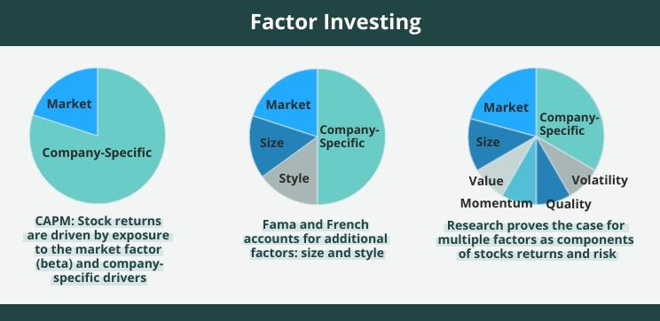

## Table of Contents

## What is factor investing and how does it differ from traditional investing?

Factor investing is a strategy where you pick investments based on certain characteristics, or "factors," that are believed to predict higher returns. These factors can include things like the size of a company, its value, its momentum, or even its quality. Instead of just picking stocks or funds randomly, factor investing uses these specific traits to try to do better than the overall market. For example, if you believe that smaller companies tend to grow faster, you might focus on investing in smaller companies.

Traditional investing, on the other hand, often involves buying a mix of stocks, bonds, or funds without focusing on specific factors. It's more about spreading your money across different types of investments to reduce risk. For example, you might buy a bit of everything in the stock market, or follow a popular index like the S&P 500. The main difference is that traditional investing doesn't zoom in on particular characteristics like factor investing does. Instead, it aims for a balanced approach, hoping that the overall market will grow over time.

## What are the most common factors used in factor investing?

The most common factors used in factor investing are size, value, momentum, and quality. Size means looking at how big or small a company is. Smaller companies can sometimes grow faster than bigger ones, so investors might choose to focus on them. Value is about finding companies that seem to be priced lower than they should be, based on their earnings or other measures. Investors think these undervalued companies might go up in price over time. Momentum looks at which stocks have been going up recently. The idea is that stocks that have been doing well will keep doing well for a while. Quality focuses on companies that are financially healthy, with strong earnings and low debt. These companies are thought to be safer bets.

Another [factor](/wiki/factor-investing) that's often used is low [volatility](/wiki/volatility-trading-strategies). This means choosing stocks that don't go up and down a lot in price. They might not grow as fast as others, but they can be less risky. Some investors also look at a factor called dividend yield, which is about how much money a company pays out to its shareholders. Companies with high dividend yields can provide steady income, which can be attractive to certain investors. Each of these factors has its own way of trying to beat the market, and investors often mix and match them to build a portfolio that suits their goals.

## How do you identify and select factors for a factor-based investment strategy?

To identify and select factors for a factor-based investment strategy, you first need to understand what each factor means and how it might help your investments. Common factors like size, value, [momentum](/wiki/momentum), and quality each have their own way of trying to beat the market. You might start by looking at past data to see which factors have worked well over time. For example, if you find that small companies have often done better than big ones, you might decide to focus on the size factor. It's also important to think about what you want from your investments. If you want steady income, you might choose the dividend yield factor. If you're okay with more risk for the chance of higher returns, you might go for momentum.

Once you've figured out which factors you're interested in, you need to decide how to use them in your strategy. This means choosing how much of your money to put into each factor. You might decide to spread your money across several factors to reduce risk, or you might focus heavily on one or two factors if you believe strongly in them. It's also a good idea to keep an eye on how your chosen factors are doing over time. If a factor stops working as well as it used to, you might need to adjust your strategy. Remember, no factor works all the time, so being flexible and ready to change your approach can help you do better in the long run.

## What are the benefits of factor investing for portfolio diversification?

Factor investing can help make your investment portfolio more diverse by spreading your money across different kinds of stocks that share certain traits. Instead of just buying a bunch of stocks from different companies, you're choosing stocks based on factors like size, value, or momentum. This can help lower your risk because if one type of stock does badly, the others might do better. For example, if small companies are struggling, stocks picked for their value might still be doing well. This way, your portfolio isn't all in one basket, and it can handle ups and downs in the market better.

Another benefit is that factor investing can help you find new ways to grow your money. By focusing on specific factors, you might discover opportunities that you wouldn't see if you were just buying a mix of stocks. For instance, if you believe that companies with strong momentum will keep doing well, you can put more money into those stocks and possibly earn more than if you were just following the overall market. This can make your portfolio not only safer but also potentially more profitable over time.

## How does factor investing perform during different market conditions?

Factor investing can do well or struggle depending on what's happening in the market. During good times when the economy is growing, factors like momentum and quality often do well. Stocks that have been going up tend to keep going up, and companies that are financially strong can benefit from the positive market mood. On the other hand, factors like value might not do as well because investors might be more interested in companies that are already doing well instead of those that might be a good deal but are not yet showing strong growth.

During tough times, like when the economy is shrinking or there's a lot of uncertainty, different factors can shine. The value factor might do better because investors start looking for bargains and companies that are underpriced. Low volatility stocks can also be helpful because they don't go up and down as much, which can make your portfolio safer when the market is rocky. Size can be a mixed bag; smaller companies might struggle more in bad times, but if they survive, they could bounce back strongly when things get better. So, factor investing can help you adjust your strategy to match what's happening in the market.

## What are the key mechanics involved in implementing a factor investing strategy?

To start a factor investing strategy, you first need to pick the factors you want to use. Common ones are size, value, momentum, and quality. You look at past data to see which factors have done well over time. For example, if small companies have often beaten big ones, you might choose the size factor. You also need to think about what you want from your investments. If you want steady income, you might go for the dividend yield factor. Once you've chosen your factors, you decide how much money to put into each one. You might spread your money across several factors to lower risk, or focus on one or two if you believe in them strongly.

After setting up your strategy, you need to keep an eye on how your factors are doing. Markets change, and what worked before might not work as well in the future. If a factor starts to do badly, you might need to adjust your strategy. This could mean changing how much money you have in each factor or even switching to different factors. Being flexible and ready to change your approach can help you do better over time. Remember, no factor works all the time, so staying on top of things and making smart adjustments is key to success in factor investing.

## How can factor tilts be integrated into existing investment portfolios?

Adding factor tilts to your existing investment portfolio means you start focusing on certain characteristics, or factors, that can help your investments do better. For example, if you already own a bunch of stocks, you might decide to put more money into smaller companies because you believe they can grow faster. This is using the size factor. Or, you might look for companies that seem cheap compared to what they're worth, which is using the value factor. You don't have to change your whole portfolio; you just shift some of your money to focus on these factors.

To do this, you first need to figure out which factors you want to use. Look at past data to see which ones have worked well before. Then, decide how much of your money you want to put into each factor. You might spread it out across a few factors to lower your risk, or focus on one or two if you really believe in them. Keep checking how your factors are doing over time. If one factor starts to do badly, you might need to adjust your strategy. This could mean changing how much money you have in each factor or even switching to different factors. Being flexible and ready to make changes can help your portfolio do better in the long run.

## What are the risks and challenges associated with factor investing?

Factor investing can be tricky because it's not always easy to pick the right factors. What worked in the past might not work in the future. For example, if you put all your money into small companies because they did well before, they might not do well next time. Also, factors can go in and out of style. When everyone starts using the same factor, it might stop working as well because too many people are trying to do the same thing. This can make it hard to keep beating the market.

Another challenge is that factor investing needs a lot of looking after. You have to keep an eye on how your factors are doing and be ready to change your strategy if things aren't working out. This can be a lot of work and might mean you need to spend more time or money on managing your investments. Plus, there's always the risk that you might make a wrong move and lose money. So, while factor investing can help you do better than just following the market, it comes with its own set of risks and challenges.

## How do you evaluate the performance of a factor investing strategy?

To evaluate the performance of a factor investing strategy, you need to look at how well the factors you chose are doing over time. This means checking if the stocks you picked because of their size, value, momentum, or other factors are doing better than the overall market. You can do this by comparing your returns to a benchmark, like the S&P 500. If your factor strategy is beating the benchmark, that's a good sign. You also need to see if your strategy is helping you reach your investment goals, like growing your money or getting regular income.

Another important part of evaluating your factor investing strategy is looking at how it's handling risk. You want to make sure that the factors you're using aren't making your portfolio too risky. For example, if you're focusing on momentum stocks, they might go up a lot, but they can also fall a lot. You need to check if the extra returns you're getting are worth the extra risk. It's also a good idea to keep an eye on how different factors are doing at different times. If one factor is doing badly, you might need to adjust your strategy to keep your portfolio balanced and on track.

## What advanced quantitative methods are used to optimize factor investing strategies?

To make factor investing strategies better, people use fancy math methods called advanced quantitative techniques. One way is to use something called regression analysis. This helps figure out how much each factor, like size or value, affects how well your investments do. By looking at a lot of past data, you can see which factors have been most important and how they work together. Another method is called optimization, where you use math to find the best way to spread your money across different factors. This can help you get the most return while keeping risk low. People also use [machine learning](/wiki/machine-learning), which is like teaching a computer to find patterns in data that humans might miss. This can help predict which factors will do well in the future.

These methods need a lot of data and strong computers to work well. You have to keep updating your models with new data because what worked before might not work next time. It's also important to check if your fancy methods are actually making your investments better. Sometimes, simple strategies can work just as well, so you have to be careful not to make things too complicated. The goal is to use these advanced techniques to make smarter choices about which factors to use and how much to put into each one, so your portfolio can do better over time.

## How does factor investing align with smart beta strategies and ETFs?

Factor investing and smart beta strategies are pretty similar. Both are about [picking](/wiki/asset-class-picking) investments based on certain traits, like size, value, or momentum, instead of just following the overall market. Smart beta ETFs are a way to do factor investing easily. They are like regular ETFs, but they focus on these special traits. So, if you want to use the size factor, you can buy a smart beta [ETF](/wiki/etf-trading-strategies) that picks smaller companies. This makes it easier for you to use factor investing without having to pick each stock yourself.

Smart beta ETFs can help you spread your money across different factors without a lot of work. For example, if you believe in the value factor, you can buy a value-focused smart beta ETF. This ETF will automatically pick stocks that seem cheap compared to what they're worth. By using these ETFs, you can mix and match different factors to build a portfolio that fits what you want. It's a simple way to try to do better than the market by focusing on the traits that you think will help your investments grow.

## What future trends and innovations are expected in the field of factor investing?

In the future, factor investing is likely to get even smarter with the help of new technology. People are using more advanced math and computer programs, like machine learning, to find new factors and better ways to use them. This means they can look at a lot more data and find patterns that were hard to see before. They might also start using factors that change over time, instead of just sticking to the same old ones like size and value. This could make factor investing work better and help people make more money.

Another big trend is that more people will probably use factor investing through smart beta ETFs. These ETFs make it easy for anyone to try factor investing without having to pick each stock themselves. As more people learn about factor investing, these ETFs will become more popular. Also, companies that make these ETFs might start offering new ones that focus on different or new factors. This will give people more choices and help them build portfolios that fit their goals better.

## References & Further Reading

[1]: ["Advances in Financial Machine Learning"](https://www.amazon.com/Advances-Financial-Machine-Learning-Marcos/dp/1119482089) by Marcos Lopez de Prado

[2]: ["Quantitative Trading: How to Build Your Own Algorithmic Trading Business"](https://www.amazon.com/Quantitative-Trading-Build-Algorithmic-Business/dp/1119800064) by Ernest P. Chan

[3]: ["Machine Learning for Algorithmic Trading"](https://github.com/stefan-jansen/machine-learning-for-trading) by Stefan Jansen

[4]: ["Evidence-Based Technical Analysis: Applying the Scientific Method and Statistical Inference to Trading Signals"](https://www.amazon.com/Evidence-Based-Technical-Analysis-Scientific-Statistical/dp/0470008741) by David Aronson

[5]: Fama, E. F., & French, K. R. (1992). ["The Cross‐Section of Expected Stock Returns."](https://onlinelibrary.wiley.com/doi/full/10.1111/j.1540-6261.1992.tb04398.x) The Journal of Finance, 47(2), 427-465.