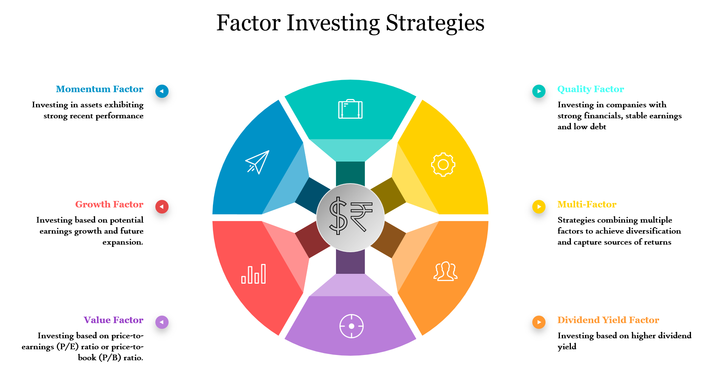

## Table of Contents

## What is factor investing?

Factor investing is a way of choosing investments based on certain characteristics, or factors, that can help predict how well an investment might do. These factors can include things like the size of a company, how much it's growing, or how cheap its stock is compared to its earnings. Instead of just picking stocks randomly or based on a gut feeling, investors using factor investing look for stocks that have these specific traits, hoping to get better returns over time.

There are many different factors that investors might look at, but some of the most common ones are value, momentum, quality, and low volatility. For example, a value factor might focus on stocks that seem to be priced lower than they should be, based on their earnings or other financial measures. By focusing on these factors, investors aim to build a portfolio that can perform better than the overall market, or at least in a more predictable way.

## How does factor investing differ from traditional investing?

Factor investing and traditional investing are two different ways to pick investments. Traditional investing often means picking stocks based on what you think about the company, like how good its products are or who runs it. People might also look at the overall economy or news to decide which stocks to buy. They might choose a mix of stocks from different industries to spread out their risk, hoping that the good ones will make up for any that don't do well.

Factor investing, on the other hand, is more about using data and research to find stocks with certain characteristics that have been shown to do well over time. Instead of guessing which companies will do better, [factor](/wiki/factor-investing) investors look for things like how cheap a stock is compared to its earnings, or how much the stock price has been going up lately. They believe that by focusing on these factors, they can build a portfolio that might do better than just [picking](/wiki/asset-class-picking) stocks randomly or based on gut feelings.

## What are the main factors used in factor investing?

Factor investing looks at certain things about stocks to decide which ones to buy. Some of the main factors are value, [momentum](/wiki/momentum), quality, and low [volatility](/wiki/volatility-trading-strategies). Value means looking for stocks that seem cheap compared to what the company is worth. Momentum is about picking stocks that have been going up in price lately. Quality focuses on companies that are strong and stable, with good earnings and not too much debt. Low volatility means choosing stocks that don't go up and down in price as much as others.

These factors help investors pick stocks in a more organized way. For example, if you're using the value factor, you might look at a company's price-to-earnings ratio to see if it's a good deal. If you're using momentum, you might check how the stock has been doing over the last few months. By focusing on these factors, investors hope to build a portfolio that can do better than just picking stocks randomly. Each factor has its own way of trying to beat the market, and investors might use one or more of them depending on what they're trying to achieve.

## Can you explain the value factor in factor investing?

The value factor in factor investing is all about finding stocks that seem like a good deal. It's like shopping for bargains, but instead of looking for sales at a store, you're looking for companies that are priced lower than what they might be worth. Investors using the value factor look at things like the price-to-earnings ratio, which compares the stock price to the company's earnings. If a stock has a low price-to-earnings ratio compared to other stocks, it might be a good value.

The idea behind the value factor is that over time, these underpriced stocks will go up in value as the market realizes they're worth more than their current price. This can lead to higher returns for investors who buy these stocks and hold onto them. But it's not always easy, because figuring out if a stock is really a good value can be tricky. Sometimes, a stock might look cheap because the company is having problems, so investors need to do their homework to make sure they're not just buying a stock that's cheap for a reason.

## How does the momentum factor work in factor investing?

The momentum factor in factor investing is about picking stocks that have been going up in price lately. The idea is that if a stock has been doing well recently, it might keep doing well for a while longer. So, investors look at how much the stock price has changed over the last few months or a year. If it's been going up a lot, they might decide to buy it, hoping that the upward trend will continue.

This approach is based on the belief that stocks that are already moving in a certain direction will keep moving that way for some time. It's kind of like catching a wave while surfing – if you get on at the right time, you can ride it for a bit. But, it's not always easy. Sometimes, a stock's price can suddenly change direction, so investors using the momentum factor need to keep a close eye on their investments and be ready to make changes if things start to go the other way.

## What is the quality factor and why is it important?

The quality factor in factor investing is all about picking companies that are strong and stable. These are the companies that have good earnings, not too much debt, and a solid business plan. When investors use the quality factor, they look for businesses that are doing well and are likely to keep doing well in the future. It's like choosing a reliable friend – you know they'll be there for you and won't let you down.

This factor is important because it can help investors avoid companies that might look good on the surface but have hidden problems. By focusing on quality, investors can build a portfolio of companies that are less likely to have big surprises or sudden drops in value. Over time, this can lead to more steady returns and less worry about the ups and downs of the market. It's a way to play it safe while still aiming for good performance.

## How can size be a factor in investing?

The size factor in investing is about looking at how big or small a company is. Big companies are usually called large-cap, and small companies are called small-cap. Investors who use the size factor believe that smaller companies might grow faster than bigger ones. So, they might choose to invest more in small-cap stocks, hoping to get bigger returns as these companies get bigger.

But, investing in smaller companies can be riskier. They might not have as much money or as many resources as big companies, so they can be more affected by problems in the economy or their industry. On the other hand, big companies are often more stable and have more resources to handle tough times. So, some investors might prefer to stick with large-cap stocks for a safer investment. It all depends on what an investor is looking for – more growth potential or more stability.

## What are the benefits of factor investing for a beginner investor?

Factor investing can help beginner investors by giving them a clear way to pick stocks. Instead of guessing which stocks might do well, beginners can use factors like value, momentum, or quality to make their choices. This means they can look at data and research instead of just going with their gut feeling. It can make investing feel less scary and more organized, which is great for someone just starting out.

Another benefit is that factor investing can help beginners spread out their risk. By focusing on different factors, they can build a portfolio that includes a mix of stocks with different characteristics. This can help protect them if some stocks don't do well, because other stocks might make up for it. Plus, using factors can help beginners learn more about what makes a good investment, which is important for getting better at investing over time.

## How can factor investing be implemented in a portfolio?

To implement factor investing in a portfolio, you start by deciding which factors you want to focus on, like value, momentum, quality, or size. You can do this by looking at different stocks and seeing which ones have the characteristics you're interested in. For example, if you're focusing on the value factor, you might look for stocks with low price-to-earnings ratios. Once you've chosen your factors, you can pick stocks that fit those factors and add them to your portfolio. Some people might choose to invest in just one factor, while others might mix several factors to spread out their risk and aim for better returns.

Another way to implement factor investing is by using exchange-traded funds (ETFs) or mutual funds that are designed around specific factors. These funds do the work of picking stocks that match the factor for you, so it's easier if you're not sure how to pick stocks on your own. For example, you might buy a value [ETF](/wiki/etf-trading-strategies) that includes a bunch of stocks with low price-to-earnings ratios. By investing in these funds, you can still benefit from factor investing without having to do all the research yourself. This can be a good choice for beginners who want to start using factor investing in their portfolio.

## What are the risks associated with factor investing?

Factor investing can be a good way to pick stocks, but it also comes with some risks. One risk is that the factors you choose might not work as well as you hope. For example, if you focus on the value factor and buy stocks that seem cheap, those stocks might stay cheap or even get cheaper if the market doesn't agree with your idea of what they're worth. This can lead to lower returns or even losses if the stocks don't go up in value like you expected.

Another risk is that factor investing can be more complicated than traditional investing. You need to understand how each factor works and keep up with changes in the market that might affect those factors. If you don't do your homework, you might pick the wrong stocks or miss out on better opportunities. Plus, focusing too much on one factor can make your portfolio less diverse, which means it might be riskier if that factor doesn't do well.

## How do you evaluate the performance of a factor-based strategy?

To evaluate the performance of a factor-based strategy, you need to look at how well the stocks you picked based on certain factors are doing over time. You can compare the returns of your factor-based portfolio to a general market index, like the S&P 500, to see if your strategy is doing better or worse. You might also look at how much risk you're taking on by using this strategy. If your portfolio is going up and down a lot more than the market, it might be too risky, even if it's doing well.

Another way to evaluate a factor-based strategy is by looking at how well each factor is working. For example, if you're using the value factor, you can see if the stocks you picked because they were cheap are actually going up in value. You can also check if the factor you're using is still a good predictor of stock performance. Sometimes, a factor that worked well in the past might not work as well in the future, so it's important to keep an eye on that. By regularly checking these things, you can decide if your factor-based strategy is working for you or if you need to make some changes.

## What advanced techniques can be used to optimize factor investing strategies?

One advanced technique to optimize factor investing strategies is to use multi-factor models. Instead of focusing on just one factor like value or momentum, you can combine several factors to create a more balanced and potentially more effective portfolio. For example, you might mix value and quality factors to find stocks that are not only cheap but also have strong earnings and low debt. By using multiple factors, you can spread out your risk and aim for better returns. This approach requires more research and data analysis, but it can help you find stocks that have the best chance of doing well.

Another technique is to use [machine learning](/wiki/machine-learning) and data analytics to improve your factor investing strategy. These tools can help you find patterns and relationships in large amounts of data that you might not see otherwise. For example, machine learning can help you figure out which factors are working best at any given time and adjust your portfolio accordingly. It can also help you predict how different factors might perform in the future based on past data. While this approach can be more complex and might require some technical skills, it can give you a big advantage in making smarter investment choices.

## References & Further Reading

[1]: Fama, E. F., & French, K. R. (1992). ["The Cross-Section of Expected Stock Returns."](https://www.jstor.org/stable/2329112) The Journal of Finance, 47(2), 427-465.

[2]: Ross, S. A. (1976). ["The Arbitrage Theory of Capital Asset Pricing."](https://www.jstor.org/stable/2326487) Journal of Economic Theory, 13(3), 341-360.

[3]: Chan, E. P. (2009). ["Quantitative Trading: How to Build Your Own Algorithmic Trading Business."](https://www.amazon.com/Quantitative-Trading-Build-Algorithmic-Business/dp/0470284889) Wiley.

[4]: Lopez de Prado, M. (2018). ["Advances in Financial Machine Learning."](https://www.amazon.com/Advances-Financial-Machine-Learning-Marcos/dp/1119482089) Wiley.