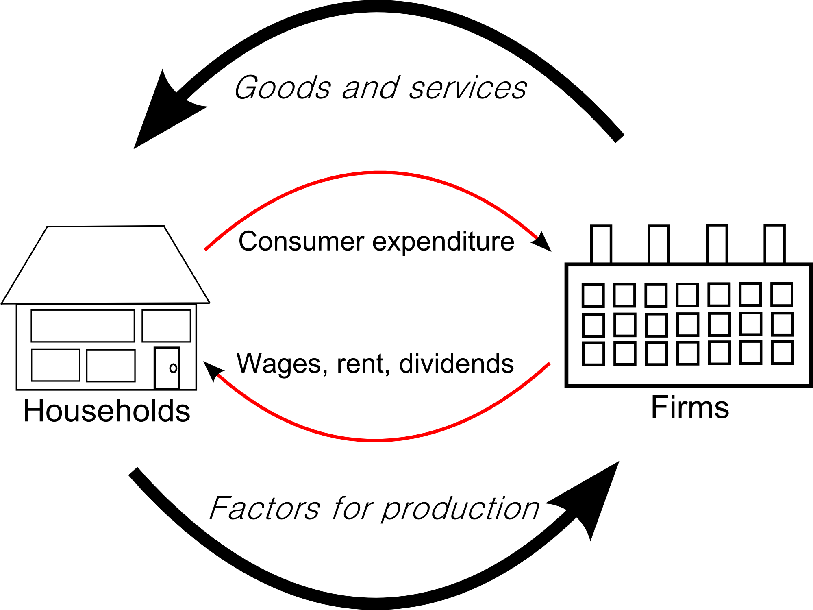

## Table of Contents

## What is a factor market?

A factor market is a place where businesses go to buy the things they need to make their products or provide their services. These things are called factors of production, and they include things like labor, land, and capital. For example, a factory might need to hire workers, rent a building, and buy machines. The factor market is where the factory owner would find and buy these resources.

In a factor market, the price of these resources is determined by supply and demand. If there are a lot of workers looking for jobs but not many jobs available, the price of labor (or wages) might go down. On the other hand, if there are a lot of jobs but not many workers, wages might go up. This is similar to how the price of goods is determined in a regular market, but in the factor market, it's about the resources needed to produce those goods.

## What are the main types of factors of production?

The main types of factors of production are land, labor, capital, and entrepreneurship. Land includes all natural resources used in production, like forests, minerals, and water. Labor is the effort and work people put into making things or providing services. Capital refers to the tools, machines, and buildings that businesses use to produce goods and services. Entrepreneurship is the drive and ideas that people use to start and run businesses.

Each of these factors plays a key role in the production process. Land provides the raw materials needed to make products. Labor is essential because people are needed to do the work. Capital helps make production easier and more efficient. Entrepreneurship is important because it brings all these factors together and turns ideas into actual businesses. Without any one of these factors, production would be much harder or even impossible.

## How does a factor market differ from a product market?

A [factor](/wiki/factor-investing) market is where businesses buy the things they need to make their products or offer services. These things are called factors of production and include land, labor, capital, and entrepreneurship. For example, a company might need to hire workers, buy machines, or rent a building. The price of these resources is set by how many people want them and how many are available. If there are lots of workers but not many jobs, the price of labor (wages) might go down. If there are lots of jobs but few workers, wages might go up.

A product market is different because it's where businesses sell the things they make or the services they offer to customers. In a product market, the price of goods and services is also set by supply and demand. If lots of people want a product but there isn't much of it, the price might go up. If there's a lot of the product but not many people want it, the price might go down. So, the main difference between a factor market and a product market is what is being bought and sold. In a factor market, it's the resources needed to make things, and in a product market, it's the actual things or services that are made.

## What is the role of factor markets in the economy?

Factor markets are really important in the economy because they help businesses get what they need to make things or offer services. These things are called factors of production, and they include land, labor, capital, and entrepreneurship. When businesses buy these resources in the factor market, they can use them to create products or services that people want. This helps the economy grow because it means more things can be made and more services can be offered.

The prices in factor markets are decided by how many people want the resources and how many are available. If there are lots of workers but not many jobs, the price of labor (or wages) might go down. If there are lots of jobs but not many workers, wages might go up. This balance helps make sure resources are used in the best way possible. When factor markets work well, they help make the economy strong and efficient, which is good for everyone.

## How do factor prices influence the allocation of resources?

Factor prices play a big role in deciding how resources are used in the economy. When the price of a resource like labor or land goes up, it means that resource is in high demand or there isn't much of it available. Businesses will then try to use less of that expensive resource and look for cheaper alternatives. For example, if wages go up, a company might decide to use more machines instead of hiring more workers. This shift helps businesses save money and use their resources in the best way possible.

On the other hand, when the price of a resource goes down, it becomes more attractive for businesses to use more of it. If the cost of renting land drops, companies might decide to expand their operations and use more land. This change in resource use helps the economy adjust to what's available and what's needed. By responding to factor prices, businesses help make sure that resources are used efficiently, which is good for the overall economy.

## What are the characteristics of a perfectly competitive factor market?

In a perfectly competitive factor market, there are many buyers and sellers of the resources like labor, land, and capital. No single buyer or seller can control the price of these resources. This means that if a business wants to hire workers or rent land, they have to accept the price that's already set by the market. Because there are so many options, businesses can easily switch between different sellers if they find a better deal. This keeps the prices fair and competitive.

Another important thing about a perfectly competitive factor market is that the resources being sold are all pretty much the same. For example, if you're hiring workers, you assume that all workers have similar skills and can do the job just as well. This makes it easier for businesses to decide how much they're willing to pay because they're not worried about big differences in quality. Overall, a perfectly competitive factor market helps make sure resources are used in the best way possible because prices are set by what everyone in the market is willing to pay or accept.

## How do imperfections in factor markets affect economic efficiency?

Imperfections in factor markets can make the economy less efficient. When markets aren't perfect, it means that some businesses might have too much power to set prices. For example, if there's only one big company hiring workers in a town, they can pay lower wages because workers don't have many other choices. This can lead to resources not being used in the best way because the prices aren't fair. If workers are paid less than they should be, they might not work as hard or might leave to find better jobs, which can hurt the company and the economy.

Another problem with imperfections in factor markets is that they can make it harder for new businesses to start up. If it's tough to get the resources you need, like land or capital, because a few big companies control them, it can stop new ideas and businesses from growing. This can slow down the economy because fewer new products and services are being created. When factor markets work well, they help make sure resources are used efficiently, but when they don't, it can lead to less growth and fewer opportunities for everyone.

## What is the impact of technological change on factor markets?

Technological change can really shake things up in factor markets. When new technology comes along, it can change how much businesses need certain resources. For example, if a new machine can do the work of many people, companies might not need to hire as many workers. This can make the demand for labor go down, which might lower wages. On the other hand, if the new technology needs special skills to use, the demand for workers with those skills can go up, and their wages might increase. So, technology can change which resources are important and how much businesses are willing to pay for them.

Technology can also affect the demand for other resources like land and capital. If a new way of farming makes it easier to grow crops on less land, the demand for land might go down. But if the new technology needs a lot of investment in new machines or buildings, the demand for capital might go up. This can make the prices of these resources change, which can affect how businesses decide to use them. Overall, technological change can make factor markets more dynamic, but it can also create challenges for workers and businesses that need to adapt to the new ways of doing things.

## How do government policies influence factor markets?

Government policies can have a big impact on factor markets. When the government sets rules about things like minimum wages or working hours, it changes how much businesses have to pay for labor. If the minimum wage goes up, businesses might hire fewer workers or look for other ways to save money. Governments can also give tax breaks or subsidies to encourage businesses to use certain resources. For example, if the government wants more people to use renewable energy, they might offer money to companies that invest in solar panels. These policies can change how businesses decide to use different resources, which affects the prices and demand in factor markets.

Another way government policies can influence factor markets is through regulations on land and capital. If the government makes it harder to buy or develop land, like with zoning laws, it can make land more expensive and less available. This can push businesses to use land more carefully or look for other places to build. When it comes to capital, government policies like interest rates can affect how much it costs to borrow money for new machines or buildings. If interest rates are low, businesses might be more willing to invest in new capital, which can increase demand and change prices in the factor market. Overall, government policies play a big role in shaping how factor markets work and how resources are used in the economy.

## What are the global trends affecting factor markets?

Global trends are changing how factor markets work around the world. One big trend is globalization, which means businesses can now buy resources from anywhere. This can make factor markets more competitive because companies can choose from more options. For example, if labor costs are lower in another country, a business might decide to move some of its operations there. This can affect wages and jobs in different countries. Another trend is the growth of technology, which is changing the kinds of jobs people do and the skills they need. As more work gets automated, the demand for certain types of labor might go down, while the need for workers with tech skills might go up.

Another important trend is the focus on sustainability and green energy. Governments and businesses are trying to use resources in ways that are better for the environment. This can change the demand for different types of land and capital. For example, there might be more demand for land to build solar farms or wind turbines. This can affect the prices and availability of these resources in factor markets. Also, as more countries try to reduce their use of fossil fuels, the demand for labor in traditional energy industries might go down, while jobs in renewable energy might grow. These global trends are making factor markets more complex and interconnected, and they are changing how businesses use and pay for resources.

## How do factor markets interact with financial markets?

Factor markets and financial markets are closely connected. In factor markets, businesses buy things like labor, land, and capital to make their products or offer services. To get these resources, businesses often need money. That's where financial markets come in. Financial markets are places where people and businesses can borrow, lend, or invest money. If a business wants to buy a new machine, they might borrow money from a bank or sell stocks to investors. The money they get from financial markets helps them pay for the resources they need in factor markets.

The prices and availability of resources in factor markets can also affect what happens in financial markets. For example, if the price of labor goes up, businesses might need to borrow more money to pay their workers. This can increase the demand for loans, which can affect interest rates in financial markets. On the other hand, if a new technology makes it cheaper to produce things, businesses might not need to borrow as much money. This can lower the demand for loans and change interest rates. So, what happens in factor markets can have a big impact on financial markets, and vice versa. They work together to help businesses get the resources and money they need to grow and succeed.

## What advanced economic models are used to analyze factor markets?

Economists use different models to understand how factor markets work. One common model is the supply and demand model. This model looks at how the price of resources like labor or land is decided by how many people want them and how many are available. For example, if there are a lot of workers but not many jobs, the price of labor (wages) might go down. If there are a lot of jobs but not many workers, wages might go up. This model helps economists predict what might happen to prices and how businesses will use resources.

Another model economists use is the production function model. This model looks at how businesses combine different resources to make things. It helps economists understand how much of each resource, like labor or capital, a business needs to make a certain amount of product. The production function model can show how changes in technology or the prices of resources might affect how businesses use them. By using these models, economists can get a better idea of how factor markets work and how they affect the economy.

## References & Further Reading

[1]: Bergstra, J., Bardenet, R., Bengio, Y., & Kégl, B. (2011). ["Algorithms for Hyper-Parameter Optimization."](https://dl.acm.org/doi/10.5555/2986459.2986743) Advances in Neural Information Processing Systems 24.

[2]: ["Advances in Financial Machine Learning"](https://www.amazon.com/Advances-Financial-Machine-Learning-Marcos/dp/1119482089) by Marcos Lopez de Prado

[3]: ["Evidence-Based Technical Analysis: Applying the Scientific Method and Statistical Inference to Trading Signals"](https://www.amazon.com/Evidence-Based-Technical-Analysis-Scientific-Statistical/dp/0470008741) by David Aronson

[4]: ["Machine Learning for Algorithmic Trading"](https://github.com/stefan-jansen/machine-learning-for-trading) by Stefan Jansen

[5]: ["Quantitative Trading: How to Build Your Own Algorithmic Trading Business"](https://www.amazon.com/Quantitative-Trading-Build-Algorithmic-Business/dp/1119800064) by Ernest P. Chan