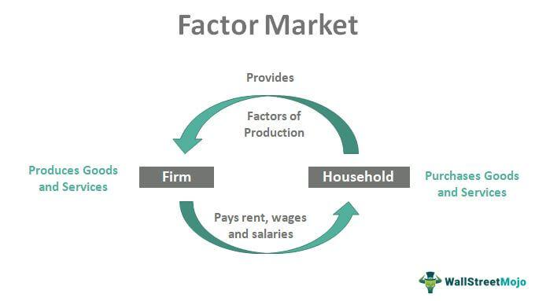

In economics, understanding the various market types and their examples is crucial for grasping the overall economic landscape. Markets represent the arenas where buyers and sellers meet to exchange goods, services, and resources, all of which orchestrate the flow of economic activity. Different markets are characterized by their specific structures, participants, and interactions, each contributing uniquely to the economic ecosystem.

Among the multitude of market categories, the factor market and algorithmic trading emerge as particularly significant within economic discussions. The factor market is fundamental as it involves the markets where factors of production—such as labor, capital, and land—are bought and sold. It plays a key role in determining wages, interest rates, and rents, directly affecting production capabilities and economic growth.



Conversely, algorithmic trading represents a modern advancement in financial markets where computer algorithms execute trades at high speeds and volumes, enhancing market efficiency and reducing human error. This innovation has transformed traditional trading mechanisms, impacting liquidity and pricing in stock markets, forex, and beyond.

This article aims to explore these varied market types, provide illustrative examples, and explain key concepts such as the factor market and algorithmic trading. The interactions among these markets and their influences on economic activities will be examined, leading to insights about resource allocation, market behavior, and technological impacts.

By the end, readers will have a clearer understanding of these economic frameworks and their real-world applications, enabling better appreciation for how economies operate and evolve in response to changing market dynamics and technological advancements.

## Table of Contents

## Understanding Market Types in Economics

Market types in economics are fundamental structures that define how goods and services are exchanged within an economy. There are four primary market types: perfect competition, monopolistic competition, oligopoly, and monopoly. Each type exhibits unique characteristics regarding the number of sellers, the nature of products, and barriers to entry.

**Perfect Competition**

Perfect competition is an idealized market structure characterized by a large number of small firms, homogenous products, and free entry and [exit](/wiki/exit-strategy) from the market. In this scenario, firms are price takers, meaning they have no influence over the market price and must accept it as given. The agricultural markets often serve as close examples, where numerous farmers sell identical products such as wheat or corn. The conditions in a perfectly competitive market lead to optimal resource allocation and efficiency, with consumers paying a price equal to the marginal cost of production.

**Monopolistic Competition**

Monopolistic competition describes a market with many sellers, each offering differentiated products. This differentiation can be based on quality, branding, or other attributes that allow firms to have some degree of price-making power. The retail fashion industry exemplifies this market type, where brands compete by offering unique styles, designs, and brand experiences. Although firms have some control over their pricing, the presence of close substitutes ensures that this control is limited. In the long run, firms in monopolistic competition can only earn normal profits due to the absence of barriers to entry.

**Oligopoly**

Oligopoly is a market structure dominated by a few large firms that have significant control over the market. This structure often results in interdependent decision-making, where the actions of one firm can significantly affect the others. The airline industry is a prime example, with major carriers controlling a significant portion of the market share. Barriers to entry are typically high, which can stem from infrastructure costs, regulatory requirements, or economies of scale. Oligopolies can lead to outcomes such as price rigidity or collusion, affecting market dynamics and consumer prices.

**Monopoly**

A monopoly exists when a single firm supplies the entire market for a product with no close substitutes. This position allows the monopolist to exert considerable control over prices, potentially leading to higher-than-competitive prices for consumers. Natural monopolies, such as utility companies, often occur in industries where high infrastructure costs make single-firm production most efficient. The monopolist maximizes profit by equating marginal revenue with marginal cost, which does not always align with the market demand and can result in reduced overall welfare compared to more competitive market structures.

Understanding these market types is crucial as they influence pricing, product availability, and innovation across different economic sectors. Businesses can leverage insights from market structures for strategic planning, while policymakers can better address market failures and promote competitive practices for the welfare of consumers and the economy.

## Examples of Different Market Types

Perfect competition is commonly observed in agricultural markets where numerous sellers offer identical products, such as wheat or corn. This market type is characterized by a high number of small firms, homogeneous products, and ease of entry and exit, which collectively ensure that no single firm can influence market prices. As a result, prices are determined purely by supply and demand dynamics.

Monopolistic competition is found in industries like retail fashion, where many sellers offer similar yet differentiated products. Differentiation is key in monopolistic competition; each firm has some degree of market power to set prices due to brand loyalty or perceived product distinctions. Nevertheless, the presence of many competitors ensures that prices remain within a competitive range.

Oligopoly is evident in sectors such as the airline industry, where a few dominant players control a substantial market share. This market type is characterized by a small number of large firms whose actions are interdependent; changes in pricing or output by one firm can significantly impact competitors. Often, firms in an oligopoly may collude to fix prices, though this is regulated by antitrust laws.

Natural monopolies, such as utility companies, occur when a single supplier is most efficient due to high infrastructure costs, making it impractical for new entrants to compete. In such cases, economies of scale are significant, and government regulation often ensures fair pricing and access to essential services. 

These examples demonstrate how different market structures operate and influence consumer choices and corporate strategies, each with distinct implications for competitiveness and economic efficiency.

## The Role of the Factor Market

The [factor](/wiki/factor-investing) market is a critical component of economic systems, referring to the markets where the services of the factors of production—namely labor, capital, and land—are traded. These markets form the backbone of productive activities by determining the allocation of resources across various sectors. 

Labor markets are a central part of the factor market, directly influencing employment levels and wage rates. In these markets, the supply of labor (workers) and the demand for labor (employers) interact to establish equilibrium wage rates and employment levels. The dynamics of labor markets affect economic productivity and individual livelihoods significantly.

Capital markets, another vital segment of the factor market, involve the buying and selling of financial securities such as stocks and bonds. These markets play a crucial role in determining the cost of capital for businesses, influencing investment decisions and savings behavior. Through mechanisms like interest rates, capital markets also impact the broader economic climate, affecting everything from consumer lending rates to business expansion plans.

Land markets focus on the exchange of real estate, determining pricing and the availability of land, which in turn influences urban development and spatial economic arrangements. The decisions made in land markets can affect housing costs, infrastructure development, and overall urban planning.

Overall, the factor market is pivotal in shaping economic output and growth. By dictating how resources like labor, capital, and land are allocated, these markets have profound implications for economic development, efficiency, and the distribution of wealth. Understanding their operation is key to both policy formulation and business strategy, ensuring optimal use of resources to support sustainable economic progress.

 to Algorithmic Trading

Algorithmic trading, commonly referred to as algo trading, is a sophisticated method of executing trades using advanced computer algorithms. These algorithms are designed to process vast amounts of financial data rapidly and execute orders based on a predetermined set of criteria. This can include parameters related to timing, price, [volume](/wiki/volume-trading-strategy), or any mathematical model, which allows for high-speed and high-volume trading.

The core advantage of [algorithmic trading](/wiki/algorithmic-trading) lies in its ability to perform trades with greater efficiency and precision than human traders. By using algorithms, traders can optimize their strategies to reduce transaction costs, enhance speed, and minimize human-induced errors. This systematized approach to trading is particularly beneficial in volatile markets, where quick decision-making is crucial.

Algorithmic trading has become ingrained in several financial sectors, most prominently in stock markets and foreign exchange ([forex](/wiki/forex-system)) markets. Its influence extends across various trading strategies that were once labor-intensive and challenging to implement manually. These include [arbitrage](/wiki/arbitrage), [market making](/wiki/market-making), [trend following](/wiki/trend-following), and [statistical arbitrage](/wiki/statistical-arbitrage), among others. For example, a simple algo trading strategy might use moving averages to determine the right time to buy or sell a stock. Here is a basic illustration in Python:

```python
def moving_average_strategy(prices, short_window, long_window):
    signals = pd.DataFrame(index=prices.index)
    signals['signal'] = 0.0

    short_mavg = prices.rolling(window=short_window, min_periods=1, center=False).mean()
    long_mavg = prices.rolling(window=long_window, min_periods=1, center=False).mean()

    signals['signal'][short_window:] = np.where(short_mavg[short_window:] > long_mavg[short_window:], 1.0, 0.0)
    signals['positions'] = signals['signal'].diff()
    return signals

# Example usage
# prices is a Pandas Series of stock prices
signals = moving_average_strategy(prices, short_window=40, long_window=100)
```

The automation facilitated by these algorithms allows investors to access complex trading strategies that were previously unfeasible. By leveraging data-driven insights, algo trading empowers investors to make informed decisions swiftly, ensuring they capitalize on market opportunities promptly.

However, while algorithmic trading offers substantial benefits, it also raises concerns regarding market stability. The speed and volume of trades executed algorithmically can contribute to market anomalies, such as flash crashes, requiring continuous regulatory oversight to ensure market integrity.

In conclusion, by embracing technological advancements and data analytics, algorithmic trading has transformed modern financial markets, offering a blend of enhanced efficiency, precision, and strategic complexity. It is this confluence of technology and finance that defines the power and potential of algo trading in today's economy.

## Impact of Algorithmic Trading on Markets

Algorithmic trading has significantly transformed financial markets by enhancing [liquidity](/wiki/liquidity-risk-premium). This is achieved through the rapid execution of trades, enabling a larger volume of transactions in a shorter duration. High-frequency trading, a subset of algorithmic trading, exemplifies this benefit by executing millions of orders in mere seconds, thereby contributing to market fluidity and tighter bid-ask spreads. This increase in liquidity is beneficial as it generally leads to more stable prices and easier access to trading for market participants.

The use of algorithms also aids in reducing transaction costs. By automating the trading process, algorithmic trading minimizes the influence of human error and decreases the likelihood of slippage, which is the difference between the expected price of a trade and the actual price at which the trade is executed. The precision and speed of algorithmic systems ensure that trades are conducted at the best available prices, thus optimizing pricing accuracy.

Despite these advantages, algorithmic trading presents challenges, primarily concerning market [volatility](/wiki/volatility-trading-strategies). The rapid nature of algorithmic trades can exacerbate price swings, leading to increased volatility. Furthermore, the risk of flash crashes is a significant concern. A flash crash is a very rapid, deep, and volatile fall in security prices occurring within an extremely short time. The 2010 Flash Crash is a notable example, during which the Dow Jones Industrial Average dropped by nearly 1,000 points in minutes, largely attributed to algorithmic trading errors.

To mitigate such risks, regulatory bodies like the Securities and Exchange Commission (SEC) in the United States and the Financial Conduct Authority (FCA) in the UK actively monitor algorithmic trading practices. These organizations implement regulations designed to promote transparency, maintain fair trading conditions, and prevent market abuse. For instance, circuit breakers are mechanisms put in place to temporarily halt trading on an exchange to curb panic-selling and provide traders time to assess information during volatile periods.

The constant evolution of technology in trading systems raises ongoing debates about the balance between technological advancement and market stability. On one hand, algorithmic trading facilitates efficient and cost-effective markets; on the other hand, it poses risks that require vigilant oversight to prevent systemic issues. Thus, the financial industry must continuously adapt its regulatory frameworks to ensure that the benefits of algorithmic trading do not come at the expense of market integrity.

## Conclusion

Understanding the various market types and their examples is crucial for grasping the complexities of modern economies. Market structures such as perfect competition, monopolistic competition, oligopoly, and monopoly each present unique characteristics that influence pricing, innovation, and consumer choice. These structures serve as fundamental frameworks guiding strategic decisions in both business and policy-making spheres.

The factor market, comprising labor, capital, and land markets, plays an integral role in resource allocation. It shapes economic output and growth by determining employment dynamics, investment flows, and real estate development. As such, the efficient functioning of factor markets is vital for enhancing productivity and facilitating sustainable development.

Algorithmic trading has redefined the landscape of financial markets, introducing both opportunities and challenges. Its ability to execute trades at high speeds has improved market liquidity and reduced transaction costs. However, it also raises concerns over potential market disruptions, such as increased volatility and flash crashes. Ongoing monitoring and regulation are essential to balance technological advances with market stability.

Together, these components—market types, factor markets, and algorithmic trading—provide a comprehensive understanding of how economies operate today. Staying informed about these topics is invaluable for professionals and scholars in economic and financial fields, ensuring informed decision-making and contributing to economic resilience.

## References & Further Reading

[1]: Bergstra, J., Bardenet, R., Bengio, Y., & Kégl, B. (2011). ["Algorithms for Hyper-Parameter Optimization."](https://dl.acm.org/doi/10.5555/2986459.2986743) Advances in Neural Information Processing Systems 24.

[2]: ["Advances in Financial Machine Learning"](https://www.amazon.com/Advances-Financial-Machine-Learning-Marcos/dp/1119482089) by Marcos Lopez de Prado

[3]: ["Evidence-Based Technical Analysis: Applying the Scientific Method and Statistical Inference to Trading Signals"](https://www.amazon.com/Evidence-Based-Technical-Analysis-Scientific-Statistical/dp/0470008741) by David Aronson

[4]: ["Machine Learning for Algorithmic Trading"](https://github.com/stefan-jansen/machine-learning-for-trading) by Stefan Jansen

[5]: ["Quantitative Trading: How to Build Your Own Algorithmic Trading Business"](https://www.amazon.com/Quantitative-Trading-Build-Algorithmic-Business/dp/1119800064) by Ernest P. Chan