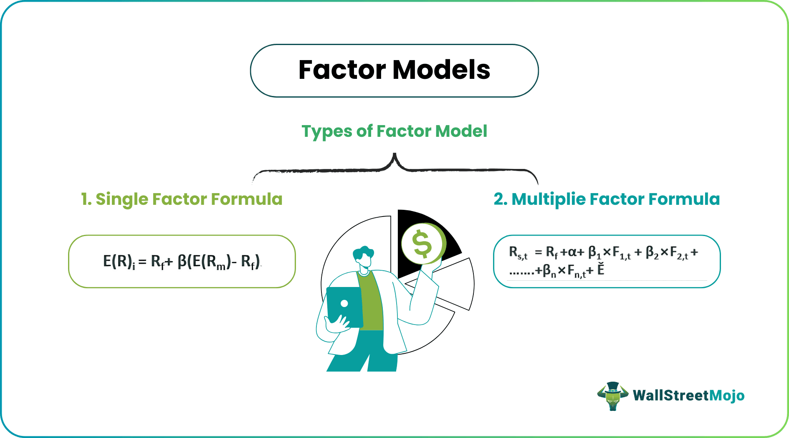

## Table of Contents

## What is a factor model in the context of execution?

A factor model in the context of execution is a way to understand and predict how different elements or factors can affect how well a task or project is carried out. These factors can include things like the skills of the team, the tools available, or even the time of day the task is performed. By studying these factors, people can make better plans and decisions to improve how tasks are done.

For example, if a company wants to know why some projects are finished faster than others, they might use a factor model. They would look at different factors like the experience of the team members, the complexity of the project, and the resources available. By understanding which factors make a big difference, the company can focus on improving those areas to make future projects run more smoothly.

## How do factor models help in understanding market dynamics?

Factor models help in understanding market dynamics by breaking down the complex movements of the market into simpler, understandable parts. These models look at different factors like interest rates, company size, or even how much a stock's price goes up and down. By studying these factors, people can see which ones have the biggest effect on the market. This helps investors and companies make better guesses about what might happen next in the market.

For example, if a factor model shows that interest rates have a big impact on stock prices, investors might pay more attention to what the central bank is doing. They can then adjust their investments based on whether they think interest rates will go up or down. This way, factor models make the market less confusing by showing clear links between different factors and market changes.

## What are the basic components of a factor model?

A factor model has a few main parts that help it work. The first part is the factors themselves. These are the things that can change and affect what the model is trying to predict. For example, in a stock market model, factors might include things like interest rates, how big a company is, or how much its stock price moves around. Each factor is like a piece of the puzzle that helps explain what's going on.

The second part of a factor model is the way it puts these factors together. This is often done using math formulas that show how each factor impacts the thing being predicted. For example, the model might say that if interest rates go up, stock prices tend to go down. This part of the model helps people see the connections between the factors and the results they care about.

The third part is the data that the model uses. To make good predictions, a factor model needs a lot of information about how the factors have behaved in the past. This data helps the model learn and make better guesses about what might happen next. By using past data, the model can show how different factors have affected things before, and it can use that to predict what might happen in the future.

## Can you explain the difference between single-factor and multi-factor models?

A single-factor model is a simple way to understand how one thing affects something else. For example, if you want to know how interest rates affect stock prices, you might use a single-factor model that only looks at interest rates. This kind of model is easy to understand and use because it focuses on just one factor. But, it might not give you the whole picture because it doesn't consider other things that could also be important.

On the other hand, a multi-factor model looks at more than one thing at the same time. For instance, it might look at interest rates, company size, and how much a stock's price moves around. This type of model can give you a better understanding of what's going on because it takes into account many different factors. However, it can be more complicated to use and understand because you have to think about how all these different factors work together.

In summary, single-factor models are simpler and focus on one main thing, while multi-factor models are more complex but can give a fuller picture of what's happening. Both types of models have their uses, depending on what you need to know and how much detail you want.

## How are factor models used in algorithmic trading?

Factor models are very useful in algorithmic trading because they help traders make smart choices about buying and selling. In algorithmic trading, computers use math formulas to decide when to trade. Factor models help by breaking down what affects stock prices into simple parts, like interest rates or how big a company is. By understanding these parts, the computer can predict how stock prices might change and decide the best times to trade.

For example, if a factor model shows that low interest rates usually make stock prices go up, the computer can use this information to buy stocks when interest rates are low. This way, the computer can make trades that are more likely to make money. Factor models help make these predictions more accurate by looking at lots of different factors at the same time, which can lead to better trading decisions.

## What are some common factors used in factor models for execution?

In factor models for execution, some common factors include the skills and experience of the team working on a project. If the team knows a lot about what they're doing, they can usually finish the job faster and better. Another important factor is the tools and resources available. Good tools can make a big difference in how quickly and well a task is done. Time is also a key factor. If there's a tight deadline, it can put pressure on the team and affect how they work.

Other factors that are often used in these models include the complexity of the task itself. Some jobs are just harder than others, and that can slow things down. The environment where the work is being done can also matter. If it's noisy or distracting, it can make it harder for the team to focus. Finally, communication within the team is a big factor. If everyone is on the same page and talking well, the work usually goes more smoothly.

## How do you estimate and validate the factors in a factor model?

To estimate the factors in a factor model, you start by collecting a lot of data about the things you think might affect what you're trying to predict. For example, if you're looking at stock prices, you might gather data on interest rates, company size, and how much stock prices move around. Then, you use math formulas to see how these factors relate to the thing you're trying to predict. This often involves running the data through a computer program that can find patterns and connections. The program helps you figure out how much each factor matters and how they all work together.

Once you have your estimated factors, you need to check if they're really useful. This is called validation. You do this by using your factor model to make predictions about new data that you haven't used before. If your model's predictions are close to what actually happens, then your factors are probably good. But if the predictions are way off, you might need to go back and change your factors or collect more data. Validation helps make sure your model is reliable and can be trusted to help with decisions.

## What are the challenges in implementing factor models for real-time trading?

Implementing factor models for real-time trading can be tricky because it needs to happen very quickly. In real-time trading, decisions need to be made in seconds or even milliseconds. This means the computer has to process a lot of data and run the factor model super fast. If the model takes too long to give an answer, the trading opportunity might be gone. Also, the data used in the model has to be up-to-date all the time, which can be hard to manage.

Another challenge is making sure the factor model works well in real-time situations. The model might work great with old data, but the market can change quickly. What worked yesterday might not work today. So, the model needs to be checked and updated often to make sure it's still useful. This can be a lot of work and needs people who know a lot about both the market and the math behind the model.

## How can factor models be integrated with other quantitative tools for better execution?

Factor models can be combined with other quantitative tools to make execution better. One way to do this is by using them with [machine learning](/wiki/machine-learning). Machine learning can look at a lot of data and find patterns that factor models might miss. By using both together, you can make better guesses about what will happen next. For example, a factor model might tell you that interest rates affect stock prices, but machine learning can help you see how other things, like news or social media, also play a role.

Another way to use factor models with other tools is by combining them with optimization techniques. Optimization helps you find the best way to do something. If a factor model tells you which factors are important, optimization can help you figure out the best way to use those factors to make decisions. For instance, if the factor model says that team skills and tools are key to finishing a project on time, optimization can help you decide how to assign tasks and resources to get the job done as quickly as possible. By working together, these tools can make your plans and decisions much better.

## What advanced statistical techniques are used to enhance the performance of factor models?

Advanced statistical techniques can make factor models work better by helping them find more accurate patterns in data. One technique is called principal component analysis (PCA). PCA helps to find the most important factors by looking at how different pieces of data move together. It can simplify a lot of data into just a few key factors, making the model easier to understand and use. Another technique is regression analysis, which helps to see how much each factor affects what you're trying to predict. By using regression, you can fine-tune the model to make better guesses about the future.

Another useful technique is time series analysis, which looks at how data changes over time. This can be really helpful for factor models used in trading or project management, where knowing how things have changed in the past can help predict what might happen next. Techniques like autoregressive integrated moving average (ARIMA) models can be used to understand these patterns better. Lastly, machine learning methods like random forests or neural networks can also be used to improve factor models. These methods can find complex patterns in data that simpler models might miss, making the factor model more accurate and reliable.

## How do factor models adapt to different market conditions and asset classes?

Factor models can change to fit different market conditions and types of investments by using different factors that matter most in each situation. For example, in a booming stock market, factors like company growth and earnings might be more important. But in a shaky market, factors like how much a stock's price moves around or how safe an investment is might matter more. By changing which factors the model looks at, it can give better predictions no matter what the market is doing. Also, factor models can be used for different kinds of investments, like stocks, bonds, or even real estate, by [picking](/wiki/asset-class-picking) factors that are important for each type.

For different asset classes, factor models need to use factors that make sense for that specific type of investment. For stocks, factors might include things like company size, how much the stock price moves, or how much the company is growing. For bonds, factors could be interest rates, how likely the bond is to be paid back, or how long until the bond matures. By using the right factors for each asset class, the model can give useful information that helps people make better choices about buying and selling different types of investments.

## What are the latest research developments in factor models for execution?

The latest research in factor models for execution has been focusing on making these models smarter and more accurate. One big area of study is using machine learning to improve factor models. Researchers are finding ways to combine traditional factor models with machine learning methods like [deep learning](/wiki/deep-learning) and neural networks. This helps the models learn from a lot of data and find patterns that might be hard to see otherwise. For example, machine learning can help factor models understand how different factors work together in complex ways, making the models better at predicting how tasks or projects will go.

Another important development is looking at how factor models can adapt to changing situations. Researchers are working on ways to make factor models more flexible so they can adjust to new data and different conditions. This is really helpful for things like project management or trading, where the situation can change quickly. By using techniques like online learning, where the model keeps learning as new data comes in, factor models can stay up-to-date and give better predictions. This means they can help people make better decisions even when things are changing around them.

## What are factor models?

Factor models are essential analytical tools in finance that help explain an asset's returns by identifying underlying factors influencing financial markets. These factors typically include market risk, company size, value, and momentum, among others. By revealing the relationships between these factors and asset returns, factor models aid in formulating effective investment strategies and managing risk.

A historically significant example of a factor model is the Capital Asset Pricing Model (CAPM). CAPM is foundational in financial theory, providing a simplistic yet effective method for understanding the relationship between systematic risk and expected return. It posits that the expected return of an asset is proportional to its exposure to market risk, quantified through beta ($\beta$), and can be expressed mathematically as:

$$
E(R_i) = R_f + \beta_i (E(R_m) - R_f)
$$

where $E(R_i)$ is the expected return of the asset, $R_f$ is the risk-free rate, $E(R_m)$ is the expected market return, and $\beta_i$ measures the asset's sensitivity to market movements.

CAPM laid the groundwork for more intricate models like the Fama-French three-[factor](/wiki/factor-investing) model, which extends the CAPM framework by incorporating two additional factors: size and value. The Fama-French model suggests that smaller companies (size factor) and those with higher book-to-market ratios (value factor) tend to outperform the broader market. This model is expressed as:

$$
E(R_i) = R_f + \beta_{i,m} (E(R_m) - R_f) + \beta_{i,SMB} \times \text{SMB} + \beta_{i,HML} \times \text{HML}
$$

where SMB (Small Minus Big) represents the return of small-cap stocks minus large-cap stocks, and HML (High Minus Low) signifies the return difference between stocks with high and low book-to-market ratios.

Factor models effectively decompose asset prices into systematic and idiosyncratic components, thereby aiding investors in gaining insights into risk management and investment strategies. Systematic components, associated with beta exposures to identified factors, represent risks that cannot be diversified away. In contrast, idiosyncratic components, which are uncorrelated with other assets, are unique to individual stocks and can be mitigated through diversification.

In applying factor models, traders can break down complex market data into manageable components, allowing for a structured analysis process. This structured approach facilitates the identification of potential risk exposures and aids in constructing portfolios that align with desired risk-return profiles. By leveraging insights from factor models, investors can better understand the drivers of returns and optimize their strategies accordingly.

## What are the types of factor models in algorithmic trading?

Factor models are critical in [algorithmic trading](/wiki/algorithmic-trading), offering a structured approach to understanding and manipulating the intricacies of market dynamics. Several types of factor models are utilized in trading, each catering to specific analytical needs and offering unique insights into risk and return characteristics.

Linear factor models provide a fundamental framework for asset return analysis. Their simplicity and ease of estimation make them highly favored in financial modeling. In their basic form, these models express asset returns as a linear function of one or more explanatory factors. For instance, the Capital Asset Pricing Model (CAPM) is a simple linear factor model where the expected return of an asset is described as a function of its sensitivity to overall market risk, often represented by:

$$
R_i = \alpha + \beta_i R_m + \epsilon_i
$$

where $R_i$ is the expected return of asset $i$, $\beta_i$ is the asset's sensitivity to the market return $R_m$, $\alpha$ is the intercept, and $\epsilon_i$ is the error term.

Multi-factor models extend the linear framework by incorporating multiple factors that can explain asset returns beyond market risk. These models provide a more nuanced understanding by integrating factors such as size, value, and [momentum](/wiki/momentum). The Fama-French three-factor model is an example of a multi-factor model, which expands CAPM to include size and value factors:

$$
R_i = \alpha + \beta_i R_m + \beta_{SMB} SMB + \beta_{HML} HML + \epsilon_i
$$

Here, $SMB$ (Small Minus Big) stands for the size premium, capturing the additional returns expected from small-cap stocks over large-cap ones, while $HML$ (High Minus Low) represents the value premium, reflecting the return differential between high book-to-market and low book-to-market stocks. The introduction of these factors allows traders to gain a fuller picture of risk by considering multiple dimensions.

Macroeconomic models are another important category of factor models, incorporating broader economic variables to explain asset returns. These models are designed to capture the impact of macroeconomic indicators such as GDP growth, inflation rates, and interest rates on market performance. They are particularly useful for understanding how changes in the economic environment influence asset returns, aiding in strategic portfolio allocation.

In conclusion, the various types of factor models—including linear, multi-factor, and macroeconomic models—cater to diverse analytical needs within algorithmic trading. Each model provides a different lens through which traders can evaluate risk and formulate strategies, reflecting their crucial role in the analytical toolkit of modern trading.

## How can Linear Factor Models be implemented in Algorithmic Trading?

Linear factor models, particularly those based on linear regression, play a pivotal role in algorithmic trading by revealing relationships between asset returns and pertinent financial factors. The implementation of these models involves a structured process that begins with data collection and culminates in trading execution.

The initial step in implementing linear factor models is data collection. This process requires gathering a comprehensive dataset that includes historical asset returns and potential explanatory factors. These factors often include market risk, size, value, and other characteristics that are believed to affect asset prices. High-quality data is essential as it ensures the integrity of the subsequent analysis and modeling stages.

Following data collection, the next step is factor selection. This involves identifying the factors that are most relevant to the assets under consideration. Analysts utilize statistical techniques to determine which factors have significant explanatory power and contribute to the model's effectiveness. This step is crucial for distinguishing between systematic influences and asset-specific variations.

Model specification is the subsequent phase, where the linear regression framework is established. This framework typically takes the form of:

$$
R_i = \alpha + \beta_1 F_1 + \beta_2 F_2 + \cdots + \beta_n F_n + \epsilon
$$

where $R_i$ represents the return of asset $i$, $F_1, F_2, \ldots, F_n$ are the selected factors, $\alpha$ is the intercept, $\beta_1, \beta_2, \ldots, \beta_n$ are the coefficients representing the sensitivity of the asset returns to each factor, and $\epsilon$ captures the idiosyncratic error not explained by the factors.

Estimation follows model specification, during which the coefficients of the model are calculated using historical data. This step typically employs ordinary least squares (OLS) regression to minimize the sum of squared residuals, yielding estimates for the alpha and beta coefficients.

Upon estimating the model, evaluation becomes necessary to ascertain its predictive power and reliability. Analysts test the model's performance using out-of-sample and [backtesting](/wiki/backtesting) methods to ensure its robustness against unseen data.

Finally, trading execution leverages the insights gained from the model to formulate and implement trading strategies. Traders utilize forecasts of asset returns based on factor exposures to make informed buy or sell decisions, optimizing portfolio performance while managing risk.

The transition from the Capital Asset Pricing Model (CAPM) to more sophisticated models like the Fama-French three-factor model exemplifies the evolution of linear factor models. CAPM, characterized by its simplicity, primarily attributes asset returns to market risk. However, the Fama-French model incorporates additional factors such as size and value, providing a more nuanced understanding of return predictors. This progression highlights the increasing complexity and depth of factor models necessary to capture the multifaceted nature of financial markets.

## What are the advanced techniques and applications?

Advanced techniques play a crucial role in enhancing the capabilities of factor models used in algorithmic trading. The application of methods such as Lasso (Least Absolute Shrinkage and Selection Operator) and Ridge regression has become increasingly common to address specific challenges in factor modeling, particularly overfitting and multicollinearity. 

Lasso regression is a linear regression technique that employs L1 regularization, which can be expressed by the equation:

$$
\text{minimize } (||\mathbf{y} - \mathbf{X}\mathbf{\beta}||^2_2 + \lambda||\mathbf{\beta}||_1)
$$

where $\mathbf{y}$ is the vector of observed values, $\mathbf{X}$ is the matrix of predictors, $\mathbf{\beta}$ is the coefficients vector, and $\lambda$ is the penalty parameter. This method helps in shrinking some coefficients to zero, thus selecting a simpler model that mitigates overfitting and enhances predictive accuracy by reducing multicollinearity among factors.

Ridge regression, on the other hand, uses L2 regularization:

$$
\text{minimize } (||\mathbf{y} - \mathbf{X}\mathbf{\beta}||^2_2 + \lambda||\mathbf{\beta}||^2_2)
$$

Ridge regression is effective in situations with high multicollinearity as it shrinks the coefficients of correlated predictors, thereby stabilizing the estimation process. 

Dynamic Factor Models (DFMs) provide a framework for modeling time-varying factors, thus accommodating changing market conditions. In a DFM, factors may evolve over time following a stochastic process such as an ARIMA (Auto-Regressive Integrated Moving Average) model. This flexibility allows DFMs to capture evolving economic conditions, improving the model's ability to adapt to real-world changes effectively.

Machine learning techniques, including Random Forests and gradient boosting, have also significantly improved the performance of factor models. Random Forests, an ensemble of decision trees, helps in handling non-linearity and capturing complex interactions between factors without requiring a priori assumptions about the distribution of the data. Python's `sklearn` library facilitates the implementation of Random Forests as follows:

```python
from sklearn.ensemble import RandomForestRegressor

# Assuming X_train and y_train are training data and target variables
rf_model = RandomForestRegressor(n_estimators=100, random_state=42)
rf_model.fit(X_train, y_train)
```

Boosting algorithms, such as XGBoost, iteratively train models to correct the errors made by preceding models in the sequence, enhancing predictive performance:

```python
import xgboost as xgb

# Creating DMatrix, an internal data structure that XGBoost uses
dtrain = xgb.DMatrix(X_train, label=y_train)

# Parameters and training
params = {'max_depth': 5, 'eta': 0.1, 'objective': 'reg:squarederror'}
bst = xgb.train(params, dtrain, num_boost_round=100)
```

These methods are particularly beneficial due to their ability to handle large, complex datasets, yielding robust models in diverse market scenarios. By integrating these advanced techniques, factor models can more effectively capture the multifaceted dynamics of financial markets, offering nuanced insights and improved trading strategies.

## References & Further Reading

[1]: Fama, E. F., & French, K. R. (1993). ["Common risk factors in the returns on stocks and bonds."](https://www.sciencedirect.com/science/article/pii/0304405X93900235) Journal of Financial Economics, 33(1), 3-56.

[2]: Sharpe, W. F. (1964). ["Capital Asset Prices: A Theory of Market Equilibrium under Conditions of Risk."](https://onlinelibrary.wiley.com/doi/full/10.1111/j.1540-6261.1964.tb02865.x) The Journal of Finance, 19(3), 425-442.

[3]: Ang, A. (2014). ["Asset Management: A Systematic Approach to Factor Investing."](https://archive.org/details/assetmanagements0000anga) Oxford University Press.

[4]: Grinold, R. C., & Kahn, R. N. (2000). ["Active Portfolio Management: A Quantitative Approach for Producing Superior Returns and Controlling Risk"](https://www.amazon.com/Active-Portfolio-Management-Quantitative-Controlling/dp/0070248826) (2nd ed.). McGraw-Hill Professional.

[5]: Tsay, R. S. (2005). ["Analysis of Financial Time Series."](https://cpb-us-w2.wpmucdn.com/blog.nus.edu.sg/dist/0/6796/files/2017/03/analysis-of-financial-time-series-copy-2ffgm3v.pdf) Wiley.

[6]: Lopez de Prado, M. (2018). ["Advances in Financial Machine Learning."](https://www.amazon.com/Advances-Financial-Machine-Learning-Marcos/dp/1119482089) Wiley.

[7]: Jagannathan, R., & McGrattan, E. R. (1995). ["The CAPM Debate."](https://www.semanticscholar.org/paper/The-CAPM-Debate-Jagannathan-Mcgrattan/2ae28a7d5bc3132040ccf46f10d59f4d55705e45) Quarterly Review: Federal Reserve Bank of Minneapolis.

[8]: Jorion, P. (2003). ["Value at Risk: The New Benchmark for Managing Financial Risk."](https://books.google.com/books/about/Value_at_Risk_3rd_Ed.html?id=nnblKhI7KP8C) McGraw-Hill Education.