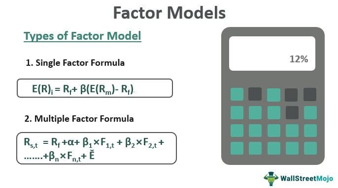

Factor models have become essential in algorithmic trading by providing a structured approach to both understanding and predicting asset returns. By identifying relationships between financial factors—such as interest rates, economic indicators, or specific company metrics—and market performance, these models enable traders to optimize returns and manage risk effectively.

Factor models break down the complexity of financial markets into manageable components. This decomposition aids traders in analyzing vast amounts of market data and applying it to trading strategies. One of the earliest models, the Capital Asset Pricing Model (CAPM), laid the foundation for more sophisticated models, such as the Fama-French three-factor model. These models help deconstruct asset prices into both systematic and idiosyncratic components, illuminating the market's risk factors and driving informed investment decisions. 



In trading, understanding the significance of factor models is crucial. Over time, these models have evolved, adapting to the increasing intricacies of financial markets and the vast availability of data. They not only improve return predictions but also fortify risk management frameworks. This extensive evolution underscores their fundamental role in modern algorithmic strategies where traders require precise and reliable analytical tools to stay competitive.

Through sophisticated algorithms and statistical techniques, factor models continue to advance, allowing traders to harness the ever-growing streams of data in financial markets. As technology progresses, integrating traditional and novel data sources, the adaptability and utility of factor models will remain central to the success of algorithmic trading endeavors.

## Table of Contents

## What Are Factor Models?

Factor models are essential analytical tools in finance that help explain an asset's returns by identifying underlying factors influencing financial markets. These factors typically include market risk, company size, value, and momentum, among others. By revealing the relationships between these factors and asset returns, factor models aid in formulating effective investment strategies and managing risk.

A historically significant example of a factor model is the Capital Asset Pricing Model (CAPM). CAPM is foundational in financial theory, providing a simplistic yet effective method for understanding the relationship between systematic risk and expected return. It posits that the expected return of an asset is proportional to its exposure to market risk, quantified through beta ($\beta$), and can be expressed mathematically as:

$$
E(R_i) = R_f + \beta_i (E(R_m) - R_f)
$$

where $E(R_i)$ is the expected return of the asset, $R_f$ is the risk-free rate, $E(R_m)$ is the expected market return, and $\beta_i$ measures the asset's sensitivity to market movements.

CAPM laid the groundwork for more intricate models like the Fama-French three-[factor](/wiki/factor-investing) model, which extends the CAPM framework by incorporating two additional factors: size and value. The Fama-French model suggests that smaller companies (size factor) and those with higher book-to-market ratios (value factor) tend to outperform the broader market. This model is expressed as:

$$
E(R_i) = R_f + \beta_{i,m} (E(R_m) - R_f) + \beta_{i,SMB} \times \text{SMB} + \beta_{i,HML} \times \text{HML}
$$

where SMB (Small Minus Big) represents the return of small-cap stocks minus large-cap stocks, and HML (High Minus Low) signifies the return difference between stocks with high and low book-to-market ratios.

Factor models effectively decompose asset prices into systematic and idiosyncratic components, thereby aiding investors in gaining insights into risk management and investment strategies. Systematic components, associated with beta exposures to identified factors, represent risks that cannot be diversified away. In contrast, idiosyncratic components, which are uncorrelated with other assets, are unique to individual stocks and can be mitigated through diversification.

In applying factor models, traders can break down complex market data into manageable components, allowing for a structured analysis process. This structured approach facilitates the identification of potential risk exposures and aids in constructing portfolios that align with desired risk-return profiles. By leveraging insights from factor models, investors can better understand the drivers of returns and optimize their strategies accordingly.

## Types of Factor Models in Algorithmic Trading

Factor models are critical in [algorithmic trading](/wiki/algorithmic-trading), offering a structured approach to understanding and manipulating the intricacies of market dynamics. Several types of factor models are utilized in trading, each catering to specific analytical needs and offering unique insights into risk and return characteristics.

Linear factor models provide a fundamental framework for asset return analysis. Their simplicity and ease of estimation make them highly favored in financial modeling. In their basic form, these models express asset returns as a linear function of one or more explanatory factors. For instance, the Capital Asset Pricing Model (CAPM) is a simple linear factor model where the expected return of an asset is described as a function of its sensitivity to overall market risk, often represented by:

$$
R_i = \alpha + \beta_i R_m + \epsilon_i
$$

where $R_i$ is the expected return of asset $i$, $\beta_i$ is the asset's sensitivity to the market return $R_m$, $\alpha$ is the intercept, and $\epsilon_i$ is the error term.

Multi-factor models extend the linear framework by incorporating multiple factors that can explain asset returns beyond market risk. These models provide a more nuanced understanding by integrating factors such as size, value, and [momentum](/wiki/momentum). The Fama-French three-factor model is an example of a multi-factor model, which expands CAPM to include size and value factors:

$$
R_i = \alpha + \beta_i R_m + \beta_{SMB} SMB + \beta_{HML} HML + \epsilon_i
$$

Here, $SMB$ (Small Minus Big) stands for the size premium, capturing the additional returns expected from small-cap stocks over large-cap ones, while $HML$ (High Minus Low) represents the value premium, reflecting the return differential between high book-to-market and low book-to-market stocks. The introduction of these factors allows traders to gain a fuller picture of risk by considering multiple dimensions.

Macroeconomic models are another important category of factor models, incorporating broader economic variables to explain asset returns. These models are designed to capture the impact of macroeconomic indicators such as GDP growth, inflation rates, and interest rates on market performance. They are particularly useful for understanding how changes in the economic environment influence asset returns, aiding in strategic portfolio allocation.

In conclusion, the various types of factor models—including linear, multi-factor, and macroeconomic models—cater to diverse analytical needs within algorithmic trading. Each model provides a different lens through which traders can evaluate risk and formulate strategies, reflecting their crucial role in the analytical toolkit of modern trading.

## Implementing Linear Factor Models in Algorithmic Trading

Linear factor models, particularly those based on linear regression, play a pivotal role in algorithmic trading by revealing relationships between asset returns and pertinent financial factors. The implementation of these models involves a structured process that begins with data collection and culminates in trading execution.

The initial step in implementing linear factor models is data collection. This process requires gathering a comprehensive dataset that includes historical asset returns and potential explanatory factors. These factors often include market risk, size, value, and other characteristics that are believed to affect asset prices. High-quality data is essential as it ensures the integrity of the subsequent analysis and modeling stages.

Following data collection, the next step is factor selection. This involves identifying the factors that are most relevant to the assets under consideration. Analysts utilize statistical techniques to determine which factors have significant explanatory power and contribute to the model's effectiveness. This step is crucial for distinguishing between systematic influences and asset-specific variations.

Model specification is the subsequent phase, where the linear regression framework is established. This framework typically takes the form of:

$$
R_i = \alpha + \beta_1 F_1 + \beta_2 F_2 + \cdots + \beta_n F_n + \epsilon
$$

where $R_i$ represents the return of asset $i$, $F_1, F_2, \ldots, F_n$ are the selected factors, $\alpha$ is the intercept, $\beta_1, \beta_2, \ldots, \beta_n$ are the coefficients representing the sensitivity of the asset returns to each factor, and $\epsilon$ captures the idiosyncratic error not explained by the factors.

Estimation follows model specification, during which the coefficients of the model are calculated using historical data. This step typically employs ordinary least squares (OLS) regression to minimize the sum of squared residuals, yielding estimates for the alpha and beta coefficients.

Upon estimating the model, evaluation becomes necessary to ascertain its predictive power and reliability. Analysts test the model's performance using out-of-sample and [backtesting](/wiki/backtesting) methods to ensure its robustness against unseen data.

Finally, trading execution leverages the insights gained from the model to formulate and implement trading strategies. Traders utilize forecasts of asset returns based on factor exposures to make informed buy or sell decisions, optimizing portfolio performance while managing risk.

The transition from the Capital Asset Pricing Model (CAPM) to more sophisticated models like the Fama-French three-factor model exemplifies the evolution of linear factor models. CAPM, characterized by its simplicity, primarily attributes asset returns to market risk. However, the Fama-French model incorporates additional factors such as size and value, providing a more nuanced understanding of return predictors. This progression highlights the increasing complexity and depth of factor models necessary to capture the multifaceted nature of financial markets.

## Advanced Techniques and Applications

Advanced techniques play a crucial role in enhancing the capabilities of factor models used in algorithmic trading. The application of methods such as Lasso (Least Absolute Shrinkage and Selection Operator) and Ridge regression has become increasingly common to address specific challenges in factor modeling, particularly overfitting and multicollinearity. 

Lasso regression is a linear regression technique that employs L1 regularization, which can be expressed by the equation:

$$
\text{minimize } (||\mathbf{y} - \mathbf{X}\mathbf{\beta}||^2_2 + \lambda||\mathbf{\beta}||_1)
$$

where $\mathbf{y}$ is the vector of observed values, $\mathbf{X}$ is the matrix of predictors, $\mathbf{\beta}$ is the coefficients vector, and $\lambda$ is the penalty parameter. This method helps in shrinking some coefficients to zero, thus selecting a simpler model that mitigates overfitting and enhances predictive accuracy by reducing multicollinearity among factors.

Ridge regression, on the other hand, uses L2 regularization:

$$
\text{minimize } (||\mathbf{y} - \mathbf{X}\mathbf{\beta}||^2_2 + \lambda||\mathbf{\beta}||^2_2)
$$

Ridge regression is effective in situations with high multicollinearity as it shrinks the coefficients of correlated predictors, thereby stabilizing the estimation process. 

Dynamic Factor Models (DFMs) provide a framework for modeling time-varying factors, thus accommodating changing market conditions. In a DFM, factors may evolve over time following a stochastic process such as an ARIMA (Auto-Regressive Integrated Moving Average) model. This flexibility allows DFMs to capture evolving economic conditions, improving the model's ability to adapt to real-world changes effectively.

Machine learning techniques, including Random Forests and gradient boosting, have also significantly improved the performance of factor models. Random Forests, an ensemble of decision trees, helps in handling non-linearity and capturing complex interactions between factors without requiring a priori assumptions about the distribution of the data. Python's `sklearn` library facilitates the implementation of Random Forests as follows:

```python
from sklearn.ensemble import RandomForestRegressor

# Assuming X_train and y_train are training data and target variables
rf_model = RandomForestRegressor(n_estimators=100, random_state=42)
rf_model.fit(X_train, y_train)
```

Boosting algorithms, such as XGBoost, iteratively train models to correct the errors made by preceding models in the sequence, enhancing predictive performance:

```python
import xgboost as xgb

# Creating DMatrix, an internal data structure that XGBoost uses
dtrain = xgb.DMatrix(X_train, label=y_train)

# Parameters and training
params = {'max_depth': 5, 'eta': 0.1, 'objective': 'reg:squarederror'}
bst = xgb.train(params, dtrain, num_boost_round=100)
```

These methods are particularly beneficial due to their ability to handle large, complex datasets, yielding robust models in diverse market scenarios. By integrating these advanced techniques, factor models can more effectively capture the multifaceted dynamics of financial markets, offering nuanced insights and improved trading strategies.

## The Role of Alternative Data in Factor Models

Alternative data refers to non-traditional data sources that can provide valuable insights into financial markets, supplements traditional financial metrics, and enhances the predictive accuracy of factor models. This data includes satellite imagery, social media sentiment, geolocation data, weather forecasts, or even corporate web traffic [statistics](/wiki/bayesian-statistics). Such information can capture variables that traditional financial data might overlook, enabling a more holistic view of market dynamics and potential trends.

For example, satellite imagery can assess traffic [volume](/wiki/volume-trading-strategy) in retail parking lots, providing early signals about company performance before official earnings announcements. Social media sentiment analysis leverages the massive amounts of data generated on platforms like Twitter and Facebook, gauging public sentiment and behavioral trends that might affect stock prices. Integrating these non-traditional datasets provides a more comprehensive model by identifying and quantifying market-affecting factors beyond typical financial ratios and statements.

To effectively integrate [alternative data](/wiki/best-alternative-data) with traditional datasets, data processing becomes critical. This integration process involves ensuring data quality and consistency, managing different data formats, and dealing with potentially messy and unstructured data. Data preprocessing techniques such as cleaning, normalization, and transformation are essential to ensure seamless integration. This is crucial because alternative data can have varied structures and frequency compared to structured financial data, necessitating methods like time-series alignment to create a unified dataset ready for analysis.

A critical challenge is combining these data types in a way that maintains or enhances model reliability and performance. Balanced datasets resulting from both traditional and alternative data ensure that factor models better reflect market realities without introducing noise or bias. Employing [machine learning](/wiki/machine-learning) techniques can be particularly useful in processing and analyzing alternative data. For instance, natural language processing (NLP) algorithms can convert social media text data into sentiment scores, which can then be integrated as an additional factor into a model. 

Python's robust data-processing libraries, including Pandas and NumPy, facilitate data manipulation and merging. Here's a simple Python pseudocode example demonstrating sentiment analysis:

```python
import pandas as pd
from textblob import TextBlob

# Load financial data
financial_data = pd.read_csv('financial_data.csv')

# Load social media data
social_media_data = pd.read_csv('social_media_data.csv')

# Calculate sentiment score for each social media post
social_media_data['Sentiment'] = social_media_data['Post'].apply(lambda x: TextBlob(x).sentiment.polarity)

# Aggregate sentiment scores by date
daily_sentiment = social_media_data.groupby('Date')['Sentiment'].mean().reset_index()

# Merge sentiment data with financial data
combined_data = pd.merge(financial_data, daily_sentiment, on='Date', how='left')

print(combined_data.head())
```

This analytical approach, pairing traditional with new data streams, expands factor model capacity, offering nuanced insights into asset performance predictions and potentially yielding a competitive edge in algorithmic trading. Effective utilization of alternative data fosters innovative financial analyses that can anticipate trends and anomalies in the economy, which could lead to better-informed trading decisions and strategies.

## Challenges and Considerations in Using Factor Models

Factor models are indispensable in algorithmic trading, yet they are not without challenges and considerations. One of the primary challenges is ensuring the quality of data used in these models. High-quality data is crucial for the models to yield reliable and actionable insights. Poor data quality, such as inaccuracies or incomplete datasets, can lead to incorrect conclusions and flawed trading strategies. Therefore, traders and analysts often employ rigorous data preprocessing and cleaning techniques to mitigate these risks.

In the context of factor models, several key assumptions must be managed meticulously. The assumptions of linearity and stationarity are particularly significant. Linearity assumes a direct relationship between the factors and asset returns, which may not always hold true in volatile or irregular markets. Stationarity, on the other hand, implies that statistical properties like mean and variance remain constant over time. Violations of these assumptions can result in the model's reduced efficacy.

Overfitting represents another critical consideration. Overfitting occurs when a model becomes too complex and begins to capture noise rather than valuable information from the data. This often leads to poor predictive performance on unseen data. Techniques such as cross-validation and regularization are employed to counter overfitting. Cross-validation involves dividing the data into subsets to validate the model's performance iteratively, ensuring it generalizes well to new data. Regularization techniques, such as Ridge and Lasso regression, add penalty terms to the loss function to shrink coefficients and discourage complex models.

Ethical and fairness considerations are increasingly crucial, especially with the inclusion of alternative data sources like satellite imagery and social media sentiment. These sources can provide profound insights but also raise data privacy concerns and potential biases. Data privacy laws, such as GDPR, necessitate careful handling of sensitive information to protect individual privacy rights. Moreover, ensuring fairness in model predictions becomes vital to avoid systemic biases that could result in unfair market practices.

In conclusion, while factor models offer sophisticated tools for asset prediction in algorithmic trading, their effective use necessitates addressing challenges related to data quality, model assumptions, overfitting, and ethical considerations. Robust management of these issues helps maintain the integrity and accuracy of the models, ultimately enhancing their utility in dynamic financial markets.

## Future Trends and Developments

The evolution of [artificial intelligence](/wiki/ai-artificial-intelligence) (AI) and machine learning is significantly reshaping the landscape of factor models in algorithmic trading. These advancements permit the identification of intricate market patterns that were previously elusive. AI-enhanced factor models can process vast datasets, encompassing both traditional financial metrics and alternative data sources, thereby enriching the understanding and prediction of asset returns.

One of the pivotal developments anticipated in the future of factor models is their movement towards increased autonomy. Autonomous models, driven by AI, are equipped to continually learn and adapt to new information without human intervention. This level of adaptability is crucial for maintaining relevance in the ever-changing financial markets. Furthermore, the integration of explainable AI is expected to improve transparency in decision-making processes. Explainability ensures that the rationale behind algorithmic predictions is understandable, facilitating more informed decisions and building trust among stakeholders who rely on these models.

Emerging techniques, such as [reinforcement learning](/wiki/reinforcement-learning) and unsupervised learning, are also set to propel factor model capabilities forward. Reinforcement learning, which involves algorithms learning optimal strategies through trial and error, can be particularly effective in dynamic trading environments where strategies must continuously evolve. Unsupervised learning algorithms, on the other hand, uncover hidden patterns in data without predefined labels, broadening the scope of factor models to include signals and insights that have not been explicitly coded into the model.

These advancements are poised to enhance both the performance and utility of factor models. Reinforcement learning, for instance, can adjust trading strategies in response to shifting market conditions, optimizing outcomes over time. Similarly, unsupervised learning techniques can help discover novel factors influencing asset prices that traditional models may overlook.

Despite the considerable promise these technological advancements hold, their implementation also poses challenges. Ensuring that models remain robust and free of biases, especially with the incorporation of alternative data, will be critical. Additionally, balancing model complexity with the need for interpretability will be an ongoing consideration for developers and users of AI-driven factor models.

In summary, the future of factor models in algorithmic trading will likely be characterized by greater autonomy, augmented transparency through explainable AI, and the incorporation of cutting-edge machine learning techniques like reinforcement and unsupervised learning. These innovations are set to continually enhance the efficacy of factor models, ensuring they remain indispensable tools in the ever-evolving landscape of financial trading.

## Conclusion

Factor models have proven to be indispensable tools in algorithmic trading, significantly benefiting from technological advancements to provide in-depth market insights. These models empower traders by facilitating data interpretation and strategy formulation, which in turn enhances their ability to predict asset returns with greater precision. By systematically breaking down complex market data into identifiable factors, traders can gain a competitive edge, optimizing their investment decisions and managing risks more effectively.

The trajectory of factor models indicates a sustained evolution alongside technological progressions in fields such as machine learning and artificial intelligence. These advancements have allowed for more sophisticated model architectures, accommodating an ever-expanding array of data sources, including alternative data. The integration of novel analytical methods continues to bolster the predictive capabilities of factor models, ensuring they remain at the forefront of financial innovation.

As financial markets become more dynamic, the continuous refinement and exploration of factor models will be essential. This ongoing development is crucial for these models to maintain their relevance and efficacy, adapting to emerging market conditions and regulatory environments. Ultimately, the capability of factor models to adjust and evolve will safeguard their position as critical assets in the toolkit of contemporary algorithmic traders.

## References & Further Reading

[1]: Fama, E. F., & French, K. R. (1993). ["Common risk factors in the returns on stocks and bonds."](https://www.sciencedirect.com/science/article/pii/0304405X93900235) Journal of Financial Economics, 33(1), 3-56.

[2]: Sharpe, W. F. (1964). ["Capital Asset Prices: A Theory of Market Equilibrium under Conditions of Risk."](https://onlinelibrary.wiley.com/doi/full/10.1111/j.1540-6261.1964.tb02865.x) The Journal of Finance, 19(3), 425-442.

[3]: Ang, A. (2014). ["Asset Management: A Systematic Approach to Factor Investing."](https://archive.org/details/assetmanagements0000anga) Oxford University Press.

[4]: Grinold, R. C., & Kahn, R. N. (2000). ["Active Portfolio Management: A Quantitative Approach for Producing Superior Returns and Controlling Risk"](https://www.amazon.com/Active-Portfolio-Management-Quantitative-Controlling/dp/0070248826) (2nd ed.). McGraw-Hill Professional.

[5]: Tsay, R. S. (2005). ["Analysis of Financial Time Series."](https://cpb-us-w2.wpmucdn.com/blog.nus.edu.sg/dist/0/6796/files/2017/03/analysis-of-financial-time-series-copy-2ffgm3v.pdf) Wiley.

[6]: Lopez de Prado, M. (2018). ["Advances in Financial Machine Learning."](https://www.amazon.com/Advances-Financial-Machine-Learning-Marcos/dp/1119482089) Wiley.

[7]: Jagannathan, R., & McGrattan, E. R. (1995). ["The CAPM Debate."](https://www.semanticscholar.org/paper/The-CAPM-Debate-Jagannathan-Mcgrattan/2ae28a7d5bc3132040ccf46f10d59f4d55705e45) Quarterly Review: Federal Reserve Bank of Minneapolis.

[8]: Jorion, P. (2003). ["Value at Risk: The New Benchmark for Managing Financial Risk."](https://books.google.com/books/about/Value_at_Risk_3rd_Ed.html?id=nnblKhI7KP8C) McGraw-Hill Education.