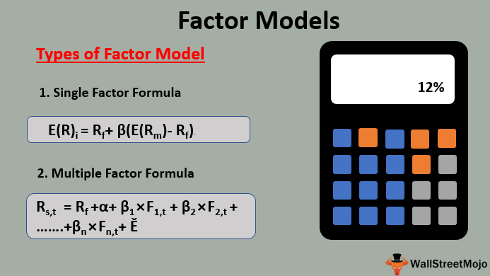

## Table of Contents

## What is a factor model in finance?

A factor model in finance is a way to understand how different things, called factors, affect the price of investments like stocks. Imagine you want to know why a stock's price goes up or down. A factor model helps by breaking down these changes into smaller parts, like how the whole market is doing, or how a specific industry is performing. These factors can be things like the overall economy, interest rates, or even how big a company is.

Using a factor model, investors can see which of these factors are most important for their investments. For example, if a stock goes up when the whole market goes up, the market factor is important for that stock. By understanding these factors, investors can make better decisions about which stocks to buy or sell. They can also use this information to build a portfolio that matches their goals and how much risk they are willing to take.

## How do factor models help in understanding asset returns?

Factor models help in understanding asset returns by breaking down the reasons why an investment's value changes into smaller, easier-to-understand pieces. These pieces, or factors, can include things like how the overall market is doing, how a specific industry is performing, or even how sensitive a stock is to changes in interest rates. By looking at these factors, investors can see which ones have the biggest impact on their investments. For example, if a stock tends to go up when the whole market goes up, then the market factor is important for that stock.

Using factor models, investors can better predict how their investments might perform in the future. If they know that a stock is heavily influenced by the technology industry, they can make more informed decisions about buying or selling that stock based on what's happening in the tech world. This helps investors build a portfolio that matches their goals and how much risk they are willing to take. By understanding the different factors that affect their investments, investors can make smarter choices and potentially improve their returns.

## What are the main types of factor models?

There are two main types of factor models: the single-factor model and the multi-factor model. The single-factor model, also known as the market model, looks at just one factor to explain how an investment's value changes. Usually, this factor is the overall market's performance. For example, if you want to understand why a stock's price goes up or down, the single-factor model says it's mostly because of what the whole market is doing.

The multi-factor model, on the other hand, looks at more than one factor to explain changes in an investment's value. This model can include things like the economy, interest rates, or how big a company is. For instance, if you're looking at a stock, the multi-factor model might say its price changes because of the market, the industry it's in, and how sensitive it is to interest rates. By using more factors, the multi-factor model can give a more detailed picture of what's affecting an investment's returns.

## Can you explain the difference between a single-factor and a multi-factor model?

A single-factor model is like looking at a puzzle and saying that one piece explains everything. In finance, this model usually focuses on just one thing, like how the whole market is doing, to explain why a stock's price goes up or down. For example, if the market goes up, the single-factor model says that's why your stock went up too. It's simple and easy to understand, but it might miss other important reasons why a stock's price changes.

A multi-factor model, on the other hand, is like looking at the same puzzle but using many pieces to explain it. This model looks at more than one thing to understand why a stock's price changes. It might consider the market, but also things like the economy, interest rates, or how big a company is. By using more factors, the multi-factor model can give a more complete picture of what's affecting a stock's returns. It's more complicated, but it can help investors make better decisions by understanding all the different reasons why their investments might go up or down.

## What is the Capital Asset Pricing Model (CAPM) and how does it relate to factor models?

The Capital Asset Pricing Model, or CAPM, is a special kind of single-factor model used in finance. It helps investors figure out how much return they should expect from an investment, like a stock, compared to how risky it is. The CAPM says that the return on a stock depends on just one thing: how the stock moves with the whole market. This is called the stock's "beta." If a stock has a high beta, it means it moves a lot when the market moves, so it's riskier but might give higher returns. If it has a low beta, it doesn't move much with the market, so it's less risky but might give lower returns.

The CAPM is related to factor models because it is a type of single-factor model. While factor models can look at many different things to explain why a stock's price changes, the CAPM focuses only on the market's performance. By using the market as the single factor, the CAPM simplifies the way investors think about risk and return. It helps them decide if a stock is a good investment by comparing its expected return to its risk, using just the market factor. So, the CAPM is a specific example of how a single-factor model works within the broader family of factor models.

## How are factors identified and selected in factor models?

Factors in factor models are identified and selected by looking at things that seem to affect how investments, like stocks, change in value. Researchers and investors study lots of data to find patterns. They might look at how stocks move with the whole market, how they react to changes in the economy, or even how they perform based on the size of the company. By studying these patterns, they can pick out the factors that seem to matter the most. For example, if they see that stocks in the technology industry often go up or down together, they might choose the technology industry as a factor.

Once they have a list of possible factors, they test them to see how well they explain changes in stock prices. They might use math and statistics to see if the factors they picked really do a good job of predicting how stocks will perform. If a factor doesn't help much, they might leave it out. But if it does help, they keep it in the model. This way, they end up with a set of factors that give a good picture of what's affecting stock returns. It's a bit like trying different pieces of a puzzle to see which ones fit best.

## What is the Fama-French three-factor model and what additional factors does it include beyond the market factor?

The Fama-French three-factor model is a type of multi-factor model used to understand why stocks go up or down in value. It was created by Eugene Fama and Kenneth French. This model looks at three different things, or factors, that can affect a stock's price. The first factor is the market, which is the same factor used in the Capital Asset Pricing Model (CAPM). The Fama-French model adds two more factors to get a better picture of what's happening with stock prices.

Beyond the market factor, the Fama-French model includes two additional factors: the size of the company and its book-to-market ratio. The size factor looks at how small or big a company is. Smaller companies often have higher returns than bigger ones, so this factor helps explain that difference. The book-to-market ratio factor looks at the value of a company compared to its stock price. Companies with high book-to-market ratios are considered "value" stocks, and they often do better than "growth" stocks, which have low book-to-market ratios. By including these extra factors, the Fama-French model gives investors a more detailed way to understand and predict stock returns.

## How do you estimate the parameters of a factor model?

Estimating the parameters of a factor model means figuring out how much each factor affects a stock's price. To do this, you start by collecting a lot of data about stock prices and the factors you want to study, like the market, the size of companies, or their book-to-market ratios. Then, you use math and statistics to see how well the factors explain changes in stock prices. This usually involves running something called a regression analysis, which helps you find out how much each factor matters. For example, if you're using the Fama-French three-factor model, you'd look at how the market, size, and book-to-market factors affect stock returns.

Once you have the data and run the regression, you get numbers that tell you how strong each factor is. These numbers are called the factor loadings or betas. They show how sensitive a stock is to each factor. For instance, if a stock has a high beta for the market factor, it means the stock moves a lot when the market moves. After you have these betas, you can use them to predict how a stock might perform in the future based on what's happening with the factors. It's like solving a puzzle to see which pieces fit best and how they all work together to explain stock returns.

## What are some common statistical methods used to test the validity of factor models?

To test if a factor model is good at explaining how stock prices change, people often use a method called regression analysis. This is like trying to see how well different pieces of a puzzle fit together. In regression analysis, you look at a lot of data about stock prices and the factors you think matter, like the market or the size of companies. You then use math to see how much each factor affects the stock prices. If the model fits the data well, it means the factors you chose are good at explaining why stock prices go up or down.

Another common method is called cross-sectional analysis. This is where you look at many different stocks at the same time to see if the factors work the same way for all of them. You might find that the market factor is important for some stocks but not for others. By comparing how well the factors explain the returns of different stocks, you can see if your model is valid for a wide range of investments. Both regression and cross-sectional analysis help make sure that the factors you picked really do a good job of explaining what's happening with stock prices.

## How can factor models be used in portfolio management and risk assessment?

Factor models help in portfolio management by letting investors see which things, or factors, are most important for their investments. For example, if an investor knows that the market factor is big for their stocks, they can choose stocks that move with the market in a way that matches their goals. They might pick stocks that go up a lot when the market goes up if they want more risk and reward, or they might pick stocks that don't move much with the market if they want less risk. By understanding these factors, investors can build a portfolio that fits what they want, whether it's more growth or more safety.

Factor models also help with risk assessment by showing investors where the risks in their portfolio come from. If a portfolio is heavily influenced by the size factor, it means the investor's returns could be affected a lot by how small or big companies are doing. By knowing this, investors can decide if they want to change their portfolio to reduce risk from certain factors. For example, if they see that their portfolio is too sensitive to interest rate changes, they might choose to add stocks that don't move much with interest rates. This way, factor models help investors manage and understand the risks they are taking with their investments.

## What are some criticisms and limitations of traditional factor models?

Traditional factor models, like the Capital Asset Pricing Model (CAPM) and the Fama-French three-factor model, have some problems. One big issue is that they can be too simple. They look at just a few things, like the market or the size of companies, to explain why stock prices change. But real life is more complicated. There are many other things that can affect stock prices, like news about a company or changes in the world economy. Because these models don't include all these other things, they might not give a full picture of what's really happening with stock prices.

Another problem is that these models can change over time. What worked well to explain stock prices in the past might not work as well in the future. For example, the factors that were important ten years ago might not be as important now. This means that investors using these models might make decisions based on old information that isn't as useful anymore. Also, it's hard to know if the factors in the model are really causing the changes in stock prices, or if they're just happening at the same time. This makes it tricky to trust the model completely.

## How have advancements in machine learning and big data influenced the development of new factor models?

Advancements in machine learning and big data have changed how we make factor models. Before, people looked at just a few things like the market or the size of companies to explain why stock prices go up or down. Now, with machine learning, we can look at a lot more things at the same time. Big data means we have tons of information about stocks, the economy, and even things like social media. Machine learning can find patterns in all this data that we might miss if we were looking at it by hand. This helps create new factor models that are better at explaining what's happening with stock prices.

These new models can be more accurate and work better over time. Machine learning can learn from new data as it comes in, so the models can change and stay useful even as the world changes. This is really helpful because the old models could become outdated. Also, machine learning can find factors that we might not have thought of before, like how people feel about a company on social media. By using all this new information, investors can make smarter decisions about their portfolios and understand the risks better.

## What are factor models?

Factor models are analytical frameworks used in finance and trading to explain asset returns through multiple underlying risk factors. They aim to decompose asset prices into systematic components, attributable to broad economic factors, and idiosyncratic components unique to individual assets. By identifying and quantifying these factors, investors can better understand the drivers of asset returns and develop more targeted and effective trading strategies.

The theoretical foundation of [factor](/wiki/factor-investing) models can be traced back to the Capital Asset Pricing Model (CAPM), introduced by William Sharpe in the 1960s. CAPM posits that an asset's expected return is a function of its sensitivity to the overall market return, represented by the equation:

$$
E(R_i) = R_f + \beta_i (E(R_m) - R_f)
$$

where $E(R_i)$ is the expected return of asset $i$, $R_f$ is the risk-free rate, $\beta_i$ is the asset's beta or sensitivity to the market, and $E(R_m)$ is the expected market return.

While CAPM provides a simple and intuitive framework, it has limitations, particularly in explaining the cross-section of stock returns. As a result, modern finance has seen the development of more comprehensive models that incorporate multiple factors. One notable extension is the Fama-French three-factor model, which includes size and value factors alongside the market factor. The model is mathematically expressed as:

$$
E(R_i) = R_f + \beta_{i,m} (E(R_m) - R_f) + \beta_{i,SMB} \times SMB + \beta_{i,HML} \times HML
$$

where $SMB$ (Small Minus Big) accounts for the size effect, and $HML$ (High Minus Low) captures the value effect based on book-to-market ratios.

Risk factors are crucial in factor models as they represent the economic variables that influence asset returns. Commonly recognized risk factors include market risk, size, value, [momentum](/wiki/momentum), and [liquidity](/wiki/liquidity-risk-premium). By incorporating these factors into predictive models, traders can identify systematic sources of risk and potential return, enabling them to construct diversified portfolios that optimize risk-adjusted performance.

The purpose and function of factor models in finance lie in their ability to break down complex market behaviors into understandable components, aiding in risk management and investment selection. Understanding how these factors influence returns helps traders in empirical testing of investment hypotheses and refining trading strategies to achieve superior returns.

Factor models thus serve as a bridge between asset pricing theory and practical trading applications, playing a fundamental role in the development and execution of [algorithmic trading](/wiki/algorithmic-trading) strategies. Their continued evolution reflects advancements in economic theory, statistical methods, and computational technology, underscoring their importance in capturing the ever-changing dynamics of financial markets.

## How can Linear Factor Models be implemented in Algorithmic Trading?

Linear factor models are pivotal in algorithmic trading, primarily due to their ability to decompose the sources of returns into component parts that can be understood and exploited. At their core, these models rely on linear regression techniques to uncover and leverage relationships between asset returns and various predictive factors.

### Explanation of Linear Regression Models Used for Factor Analysis

Linear regression is a statistical method that models the relationship between a dependent variable (often asset returns in finance) and one or more independent variables (factors). In its simplest form, linear regression can be expressed as:

$$
Y = \beta_0 + \beta_1X_1 + \beta_2X_2 + \ldots + \beta_nX_n + \epsilon
$$

where $Y$ is the dependent variable, $X_1, X_2, \ldots, X_n$ are the independent variables, $\beta_0$ is the intercept, $\beta_1, \beta_2, \ldots, \beta_n$ are the coefficients, and $\epsilon$ is the error term.

These regression models are utilized to identify the extent to which each factor contributes to an asset’s returns, allowing traders to build more effective strategies by focusing on the most significant factors.

### Steps to Build and Implement a Linear Factor Model

To construct and apply a linear factor model in algorithmic trading, the following steps are typically followed:

1. **Data Collection**: Gather historical data on asset returns and potential risk factors, such as market indices, interest rates, or economic indicators.

2. **Selection of Factors**: Choose a set of factors believed to influence asset returns, such as size, value, and momentum.

3. **Model Specification**: Formulate the linear regression model by specifying the dependent variable (asset returns) and independent variables (selected factors).

4. **Estimation**: Use statistical software or programming languages like Python to estimate the model coefficients. This involves calculating the best-fit line that minimizes the error term $\epsilon$.

5. **Evaluation**: Assess the model's performance through metrics like R-squared, adjusted R-squared, and out-of-sample testing to ensure that it captures the relationship effectively.

6. **Implementation**: Once validated, the model can be used to predict future returns or guide trading decisions by identifying mispriced assets based on current factor exposures.

### From CAPM to the Fama–French Three-Factor and Beyond

The Capital Asset Pricing Model (CAPM) was one of the first factor models, expressing asset returns as a function of market risk, characterized by a single factor - the market portfolio. Mathematically, CAPM is represented as:

$$
E(R_i) = R_f + \beta_i (E(R_m) - R_f)
$$

where $E(R_i)$ is the expected return on asset $i$, $R_f$ is the risk-free rate, $\beta_i$ is the asset's sensitivity to market returns, and $E(R_m)$ is the expected market return.

The Fama-French three-factor model expanded this by including two additional factors: size (SMB - Small Minus Big) and value (HML - High Minus Low), addressing market anomalies not captured by CAPM. This model is expressed as:

$$
E(R_i) = R_f + \beta_m(R_m - R_f) + \beta_{SMB}SMB + \beta_{HML}HML
$$

Since then, factor models have continued to evolve, incorporating additional factors like momentum, profitability, and investment patterns, resulting in multi-factor models that better capture the complexities of asset returns.

### Case Study: Building a Factor Model Using Python

Python is an essential tool in contemporary finance, offering various libraries useful for building and analyzing factor models. Here is a basic example of constructing a factor model using Python's `statsmodels` library:

```python
import pandas as pd
import statsmodels.api as sm

# Load historical returns data
data = pd.read_csv('historical_returns.csv')
factors = ['Market', 'SMB', 'HML']
X = data[factors]
Y = data['Asset_Return']

# Add a constant to the model (equivalent to the intercept)
X = sm.add_constant(X)

# Fit the regression model
model = sm.OLS(Y, X).fit()

# Print model summary
print(model.summary())
```

This code demonstrates the conduct of linear regression to estimate the impact of market, size, and value factors on the returns of a particular asset. It leverages historical data to validate the model's effectiveness, offering insights that can guide future trading decisions.

In conclusion, linear factor models are a cornerstone of algorithmic trading, helping traders systematically assess and respond to market risks and opportunities. By expanding beyond traditional models like CAPM to incorporate multiple factors, these models provide more nuanced insights that contribute to superior trading strategies.

## What are the advanced techniques and applications?

### Shrinkage Methods: Lasso and Ridge Regression

In the field of algorithmic trading, shrinkage methods like Lasso (Least Absolute Shrinkage and Selection Operator) and Ridge regression are pivotal for enhancing prediction accuracy in factor models. These methods address multicollinearity and overfitting, common challenges in high-dimensional financial datasets. Ridge regression introduces a penalty term to the linear regression model, preventing excessive flexibility by constraining the magnitude of regression coefficients. This is achieved by minimizing:

$$
\text{Objective} = \sum_{i=1}^{n} (y_i - \hat{y}_i)^2 + \lambda \sum_{j=1}^{p} \beta_j^2
$$

where $\lambda$ is the shrinkage parameter that determines the strength of the penalty, $y_i$ are observed values, and $\hat{y}_i$ are predicted values based on the model.

Contrastingly, Lasso regression employs an $L_1$ penalty:

$$
\text{Objective} = \sum_{i=1}^{n} (y_i - \hat{y}_i)^2 + \lambda \sum_{j=1}^{p} |\beta_j|
$$

The $L_1$ penalty facilitates feature selection by driving some coefficients to zero, thus simplifying models and aiding interpretability.

### Dynamic Factor Models (DFMs) and Changing Market Environments

Dynamic factor models excel in capturing temporal changes in market environments by modeling time series data through latent factors that evolve over time. DFMs are particularly useful for parsing economic indicators or asset returns where capturing dependencies and structural breaks is crucial. The generic form of a dynamic factor model is represented as:

$$
X_t = \Lambda F_t + \epsilon_t
$$

where $X_t$ is a vector of observed variables at time $t$, $\Lambda$ represents the factor loadings matrix, $F_t$ are the latent factors, and $\epsilon_t$ is the error term. This structure is adept at identifying underlying structures in financial data that change over time, enabling traders to adapt strategies dynamically.

### Integration of Machine Learning: Random Forests and Boosting Techniques

The integration of [machine learning](/wiki/machine-learning) techniques, such as Random Forests and boosting algorithms, into factor models enhances predictive performance and robustness. Random Forests, an ensemble method based on decision trees, improve accuracy by averaging multiple trees to reduce variance. A distinguishing feature of Random Forests is their ability to handle vast input spaces, which is particularly beneficial in finance due to the diverse and complex data sources.

Boosting, on the other hand, is a sequential ensemble technique that focuses on correcting the errors of the predecessor model. Techniques like AdaBoost or Gradient Boosting construct models incrementally, emphasizing difficult-to-predict instances. The synergy between boosting techniques and factor models results in improved prediction power and the ability to capture nonlinear dependencies in financial data.

Both Random Forests and boosting can be effectively implemented using Python libraries like scikit-learn:

```python
from sklearn.ensemble import RandomForestRegressor, GradientBoostingRegressor

# Initialize models
rf_model = RandomForestRegressor(n_estimators=100, random_state=42)
gbm_model = GradientBoostingRegressor(n_estimators=100, learning_rate=0.1, random_state=42)

# Train models
rf_model.fit(X_train, y_train)
gbm_model.fit(X_train, y_train)

# Predictions
rf_predictions = rf_model.predict(X_test)
gbm_predictions = gbm_model.predict(X_test)
```

These advanced techniques, when applied to factor models in algorithmic trading, provide significant gains in performance and adaptability, allowing traders to devise more informed and responsive strategies.

## References & Further Reading

[1]: Fama, E. F., & French, K. R. (1992). ["The Cross-Section of Expected Stock Returns."](https://www.jstor.org/stable/2329112) Journal of Finance.

[2]: Carhart, M. M. (1997). ["On Persistence in Mutual Fund Performance."](https://onlinelibrary.wiley.com/doi/full/10.1111/j.1540-6261.1997.tb03808.x) Journal of Finance.

[3]: Merton, R. C. (1973). ["An Intertemporal Capital Asset Pricing Model."](https://www.jstor.org/stable/1913811) Econometrica.

[4]: Ang, A. (2014). ["Asset Management: A Systematic Approach to Factor Investing."](https://academic.oup.com/book/3342) Oxford University Press.

[5]: ["The Fama-French Data Library."](https://mba.tuck.dartmouth.edu/pages/faculty/ken.french/data_library.html) 

[6]: Lopez de Prado, M. (2018). ["Advances in Financial Machine Learning."](https://books.google.com/books/about/Advances_in_Financial_Machine_Learning.html?id=oU9KDwAAQBAJ) Wiley.

[7]: Jansen, S. (2018). ["Machine Learning for Algorithmic Trading."](https://books.google.com/books/about/Hands_On_Machine_Learning_for_Algorithmi.html?id=tx2CDwAAQBAJ) 

[8]: Chan, E. P. (2009). ["Quantitative Trading: How to Build Your Own Algorithmic Trading Business."](https://github.com/ftvision/quant_trading_echan_book) Wiley.