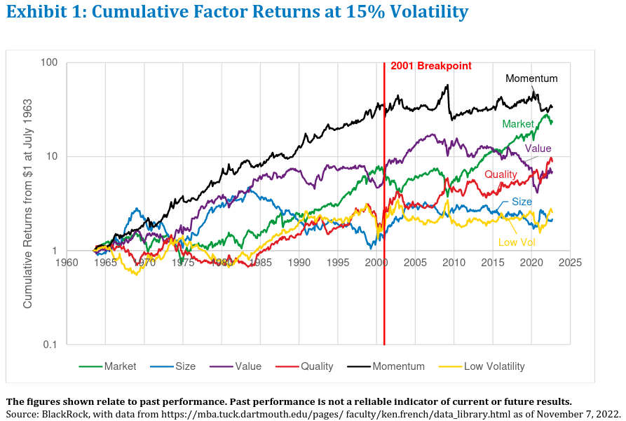

In the fast-paced world of finance, algorithmic trading has emerged as a key player, allowing traders to execute orders with unprecedented speed and precision. This automated approach to trading utilizes sophisticated algorithms to identify and capitalize on market opportunities more efficiently than traditional methods. A crucial component of successful algorithmic trading is understanding 'factor return,' a concept that can significantly influence trading strategies.

Factor return is the additional return derived from exposure to specific investment factors, such as size, value, and momentum. These factors, often identified through quantitative analysis, are integrated into trading algorithms to exploit market inefficiencies. By understanding the sources and behaviors of factor returns, traders can better anticipate market movements and adapt their strategies accordingly.



This article will explore how factor return impacts algorithmic trading and how traders can leverage it to optimize performance. Understanding which factors drive returns under various market conditions is imperative for developing robust models that can withstand market volatility. We'll address common mistakes associated with factor-based models, such as overfitting and neglecting transaction costs, and offer practical tips on effectively harnessing factor returns.

Through a blend of theoretical insights and practical guidance, this article aims to equip traders with the knowledge to integrate factor returns into their algorithmic trading strategies, enhancing their potential for robust and profitable outcomes.

## Table of Contents

## Understanding Factor Returns

Factor returns are the incremental financial gains attributed to specific investment factors, such as size, value, and [momentum](/wiki/momentum). These factors, derived from economic theories and empirical research, represent underlying market drivers that can influence stock prices and broader asset performance. In [algorithmic trading](/wiki/algorithmic-trading), [factor](/wiki/factor-investing) returns play a critical role as traders and quants incorporate these elements into their trading algorithms to capitalize on market inefficiencies or trends.

For example, the size factor is based on the principle that, historically, smaller companies have tended to outperform larger ones in the stock market. Similarly, the value factor involves investing in stocks that are undervalued relative to their fundamentals, with the expectation that they will appreciate over time. The momentum factor suggests that stocks which have performed well in the past will continue to do so in the near future. Other factors, such as quality or low [volatility](/wiki/volatility-trading-strategies), focus on companies with sturdy financials or stocks that exhibit less price fluctuation, respectively.

Each factor captures a different aspect of the market, and their returns can be used to structure trading strategies. By embedding these factors into algorithmic models, traders attempt to identify and exploit market opportunities based on historical performance and behavioral patterns. The mathematical formulation behind factor models often includes regression techniques where excess returns can be expressed as a linear combination of various factors:

$$
R_i = \alpha + \beta_1 F_{\text{size}} + \beta_2 F_{\text{value}} + \beta_3 F_{\text{momentum}} + \epsilon
$$

Where $R_i$ represents the return of asset $i$, $F_{\text{size}}, F_{\text{value}}, F_{\text{momentum}}$ are the factor sensitivities, $\beta_1, \beta_2, \beta_3$ are the corresponding factor loadings, $\alpha$ is the intercept capturing the asset's alpha, and $\epsilon$ is the error term.

Identifying which factors drive returns under various market conditions is essential for constructing robust trading models. Market conditions are dynamic, meaning that the factors which previously yielded high returns may not always be effective. Traders must therefore continuously analyze these factors through historical data and market trends to determine their current relevance and potential impact.

By understanding and accurately capturing factor returns, algorithmic traders can enhance their prediction models and optimize trading strategies, navigating market complexities with greater precision. This paves the way for advanced, adaptive trading systems that respond intelligently to market shifts and investor behavior.

## The Role of Factor Returns in Algorithmic Trading

Algorithmic trading strategies commonly employ factor-based models to systematically identify potential trading opportunities. These models rely on analyzing historical data to uncover patterns and trends associated with specific investment factors, such as size, value, momentum, and others. These factors act as predictors, allowing algorithms to anticipate future price movements and optimize trade executions.

The utilization of factor returns in optimizing portfolios is a significant aspect of algorithmic trading. By adjusting the portfolio's exposure to specific market conditions or economic indicators, traders can enhance their strategy's effectiveness. Factor models evaluate how these returns fluctuate over time and across different market environments, offering insights into potential adjustments that maximize performance. 

Furthermore, factor-based strategies aid in isolating the influence of various economic indicators, helping algorithms to fine-tune their sensitivity to these signals. This detailed analysis allows for more precise risk management, as well as the potential for higher returns by capitalizing on identified factor opportunities. 

The mathematical representation of a factor model can be expressed as a linear regression equation:
$$
R_t = \alpha + \beta_1 F_{1t} + \beta_2 F_{2t} + \ldots + \beta_n F_{nt} + \epsilon_t
$$
where $R_t$ denotes the asset return at time $t$, $\alpha$ represents the alpha (excess return), $\beta_i$ are the factor sensitivities or loadings, $F_{it}$ are the factor values at time $t$, and $\epsilon_t$ is the error term. This model allows traders to estimate the impact of each factor on the overall return, enabling targeted adjustments based on predicted factor behavior.

In conclusion, understanding and effectively integrating factor returns into algorithmic trading strategies allows for more informed and potentially profitable trading decisions. This approach leverages historical data insights, optimizing portfolio management and aligning trading strategies with varying market conditions.

## Integrating Factor Returns in Your Algo Trading Strategy

To successfully integrate factor returns into an algorithmic trading strategy, it is essential for traders to start by identifying which factors are most relevant to their specific approach. Factors such as market size, value, momentum, or volatility often play critical roles, but their impact can vary depending on the market segment and the trader's goals. Identifying these key factors involves thorough research and an understanding of the underlying market dynamics.

Once relevant factors are identified, traders should engage in [backtesting](/wiki/backtesting) to evaluate the effectiveness of these factors in generating excess returns. Backtesting involves analyzing historical data to simulate how a trading strategy might have performed in the past. This process helps in assessing whether selected factors can effectively predict market movements and result in profitable returns.

For backtesting, traders often use various statistical tools and programming languages to handle large datasets. Python, for instance, is widely used in algo trading, thanks to its robust libraries such as Pandas and NumPy for data manipulation, along with libraries like Backtrader for implementing backtests. A basic backtesting setup in Python might look like:

```python
import pandas as pd
import backtrader as bt

# Load historical data
data = pd.read_csv('historical_data.csv')
data_feed = bt.feeds.PandasData(dataname=data)

# Define a simple strategy class
class FactorStrategy(bt.Strategy):
    def __init__(self):
        self.sma = bt.indicators.SimpleMovingAverage(self.data.close, period=15)

    def next(self):
        if self.data.close[0] > self.sma[0]:  # Example condition
            self.buy()
        elif self.data.close[0] < self.sma[0]:
            self.sell()

# Run backtest
cerebro = bt.Cerebro()
cerebro.adddata(data_feed)
cerebro.addstrategy(FactorStrategy)
cerebro.run()
```

Beyond backtesting, continuous monitoring and adjustment of factor models are necessary. Market conditions and factor performance can shift over time, leading to changes in the optimal configuration of a trading strategy. This means that traders should not only rely on past data but also remain vigilant about current market dynamics and emerging trends. Staying updated with economic indicators and utilizing real-time data analytics can provide insights into when a factor's effectiveness may be waning.

Additionally, model tweaking—such as adjusting factor weights or introducing new, data-driven factors—should be informed by ongoing validation processes. This might involve setting up a rolling evaluation framework, where the model's outputs are continually assessed for their forecasting accuracy and risk profile.

In summary, integrating factor returns into an algorithmic trading strategy involves a structured approach of selecting appropriate factors, validating them through robust backtesting, and maintaining an adaptive strategy through ongoing monitoring and revision to respond to the ever-evolving market landscape.

## Common Mistakes and Pitfalls with Factor-Based Models

When designing factor models in algorithmic trading, several common mistakes can hinder their effectiveness. One of the most prevalent issues is overfitting. This occurs when a model is excessively complex and tailored to historical data, capturing noise rather than genuine market signals. An overfitted model may show excellent performance during backtesting but can underperform significantly in real market conditions. To mitigate overfitting, it is essential to use techniques such as cross-validation and to maintain a balance between model complexity and generalization.

Ignoring transaction costs and slippage is another pitfall that can lead to unexpected losses. Factor-based models often execute trades frequently, and neglecting these costs can skew the perceived profitability of a strategy. Even small transaction costs can accumulate over numerous trades, eroding returns. Effective models must incorporate realistic estimates of transaction costs and slippage to ensure viable performance when deployed live.

Relying solely on historical data without accounting for market dynamics and external influences introduces substantial risks. Markets evolve, and factors that were once significant drivers of returns may lose relevance. Additionally, unforeseen events and macroeconomic changes can impact factor effectiveness. It is vital for traders to contextualize historical data within current market environments, ensuring adaptability and responsiveness to evolving conditions. 

By being aware of these common mistakes and addressing them proactively, traders can improve the robustness and effectiveness of their factor-based models in algorithmic trading.

## Practical Tips for Maximizing Factor Returns

Diversification across multiple factors is a fundamental strategy in algorithmic trading, as it can mitigate the overall volatility of a portfolio and enhance risk-adjusted returns. By spreading investments across diverse factors such as size, value, and momentum, traders can reduce the impact of any single factor's poor performance. This diversification acts as a buffer against unexpected market movements, providing a more stable return profile.

Regular reassessment and recalibration of models are critical to capture the most relevant factors effectively. Market dynamics are ever-changing, making it essential for traders to continuously evaluate their models to ensure they accurately reflect the current environment. This process involves analyzing recent market data and adjusting the factor weights accordingly. Without regular updates, models can become outdated, leading to suboptimal performance.

Leveraging a combination of [machine learning](/wiki/machine-learning) (ML) and traditional statistical methods can significantly enhance factor models. Machine learning algorithms can identify complex patterns and relationships within large datasets that are not immediately apparent through conventional statistical techniques. For example, ML models like random forests or gradient boosting can be employed to predict factor performance. Here's a basic Python example using scikit-learn for a random forest model:

```python
from sklearn.ensemble import RandomForestRegressor
from sklearn.model_selection import train_test_split
from sklearn.metrics import mean_squared_error

# Sample data: X_factors is your feature set, y_returns is the target returns
X_train, X_test, y_train, y_test = train_test_split(X_factors, y_returns, test_size=0.2, random_state=42)

# Initialize and train the random forest regressor
rf_model = RandomForestRegressor(n_estimators=100, random_state=42)
rf_model.fit(X_train, y_train)

# Predict and calculate mean squared error
y_pred = rf_model.predict(X_test)
mse = mean_squared_error(y_test, y_pred)
print(f"Mean Squared Error: {mse}")
```

Incorporating ML alongside traditional methods such as regression analysis can provide a more comprehensive approach to modeling. Traditional methods offer a well-established foundation for understanding factor relationships, while ML introduces adaptability and complexity in handling large and diverse datasets.

By implementing these strategies, traders can maximize factor returns in algorithmic trading, ensuring their models remain robust and responsive to current market conditions. Regular optimization and a blend of analytical techniques are essential in maintaining a competitive edge in the fast-evolving financial landscape.

## Conclusion

Factor returns serve as a critical asset for algorithmic traders aiming to enhance trading performance. By focusing on specific factors like size, value, and momentum, traders can identify and exploit patterns that may not be obvious through traditional analysis. These returns allow for the strategic tailoring of portfolios to better navigate fluctuating market conditions, thereby increasing the potential for financial gains.

The successful application of factor returns demands a meticulous approach. Traders must engage in detailed analysis to understand which factors are most relevant to their strategies. This involves backtesting trading algorithms with historical data to judge their efficacy. Continuous optimization is essential, as market dynamics shift over time, making it crucial to adapt factor models to stay relevant. The implementation of adaptive models ensures that they consistently capture the factors driving returns in various market scenarios.

An understanding of market dynamics is vital. Traders must consider economic indicators, geopolitical events, and other external factors that might influence market behavior. These considerations help in maintaining the robustness of trading models, minimizing the risks associated with dynamic market environments.

By integrating factor returns thoughtfully into trading algorithms, traders can develop strategies that effectively balance risk and reward. This enables the creation of trading models that are not only robust but also adaptive and profitable. With precision and ongoing calibration, factor returns can greatly enhance the overall performance of an algorithmic trading strategy.

## FAQs

### What are factor returns in trading?

Factor returns refer to the incremental returns attributable to specific investment factors, such as size, value, momentum, and others. These factors stem from systematic risk elements that historically explain returns across different asset classes. By isolating these factors, traders and investors can better understand how different variables contribute to the overall performance of an asset or portfolio. Factor returns serve as a crucial concept in both traditional investing and algorithmic trading, offering insights into how various market conditions and investment strategies yield returns.

### How do factor returns affect algorithmic trading strategies?

Factor returns significantly influence algorithmic trading strategies by enabling traders to identify patterns and market opportunities. Algorithms can be designed to exploit these factors, allowing traders to develop strategies that anticipate price movements based on historical data patterns related to specific factors. For instance, an algorithm might adjust trading signals based on factor data, such as momentum or volatility, to align with market conditions. This approach allows for systematic risk management and optimized portfolio performance by shifting exposures to factors that are expected to outperform under specific economic indicators or market environments.

### What are the risks associated with factor-based algorithmic trading?

Factor-based algorithmic trading carries several risks, such as the potential for overfitting, where models are excessively tailored to historical data, impairing their efficacy in real market scenarios. Ignoring transaction costs and slippage can significantly affect expected returns, especially when factors are traded frequently. Additionally, reliance purely on historical data without acknowledging market dynamics and external influences may result in inadequacies when market conditions shift. Traders must be vigilant about these pitfalls to prevent unexpected losses and ensure robust strategy performance.

### How can I start incorporating factor returns into my trading strategy?

To incorporate factor returns into your trading strategy, begin by identifying which factors are relevant to your investment goals. You can start by conducting quantitative research on factor premiums that influence asset returns. Backtesting is crucial to evaluate how these factors have performed historically and their potential contribution to excess returns. Once identified, integrate these factors into your strategy through algorithmic models. Continuous monitoring and adjustments are necessary as factors can vary over time due to changes in market conditions. Utilizing a combination of machine learning techniques and conventional statistical analysis can enhance the precision and adaptability of your factor models.

## References & Further Reading

[1]: Bergstra, J., Bardenet, R., Bengio, Y., & Kégl, B. (2011). ["Algorithms for Hyper-Parameter Optimization."](https://papers.nips.cc/paper/4443-algorithms-for-hyper-parameter-optimization) Advances in Neural Information Processing Systems 24.

[2]: ["Advances in Financial Machine Learning"](https://www.amazon.com/Advances-Financial-Machine-Learning-Marcos/dp/1119482089) by Marcos Lopez de Prado

[3]: ["Evidence-Based Technical Analysis: Applying the Scientific Method and Statistical Inference to Trading Signals"](https://www.amazon.com/Evidence-Based-Technical-Analysis-Scientific-Statistical/dp/0470008741) by David Aronson

[4]: ["Machine Learning for Algorithmic Trading"](https://github.com/stefan-jansen/machine-learning-for-trading) by Stefan Jansen

[5]: ["Quantitative Trading: How to Build Your Own Algorithmic Trading Business"](https://www.amazon.com/Quantitative-Trading-Build-Algorithmic-Business/dp/1119800064) by Ernest P. Chan