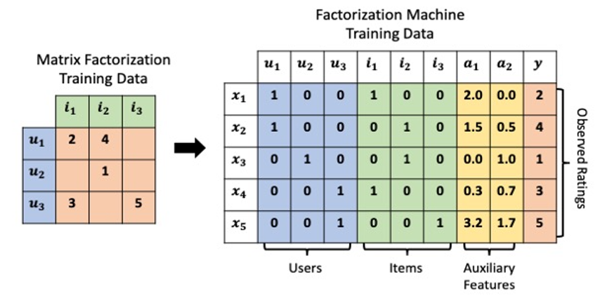

## Table of Contents

## What is a Factorization Machine in the context of machine learning?

A Factorization Machine is a type of machine learning model that is good at handling lots of features, even if some of them are missing. It's useful in areas like recommendation systems, where you might have information about users and items they interact with. The key idea behind a Factorization Machine is that it can learn how different features relate to each other. It does this by breaking down, or "factorizing," the features into smaller parts, which helps the model understand complex patterns in the data.

In more technical terms, a Factorization Machine can model interactions between features using a lower-dimensional representation. For example, if you have two features, say the age of a user and the price of an item, the model can figure out how these two features interact with each other to affect the outcome, like whether the user will buy the item. The model does this by representing each feature with a set of latent factors. The interaction between two features is then calculated as the dot product of their latent factor vectors. This approach not only makes the model efficient but also helps it perform well even when dealing with sparse data, where many feature values might be missing.

## How does a Factorization Machine differ from traditional linear models?

Factorization Machines and traditional linear models both aim to predict outcomes based on input features, but they do so in different ways. A traditional linear model, like linear regression, uses a straightforward approach where each feature contributes to the prediction independently. The model's prediction is simply a weighted sum of the input features, where the weights are learned during training. This method works well when the relationships between features are simple and linear, but it struggles to capture more complex interactions between features.

In contrast, a Factorization Machine is designed to capture these complex interactions more effectively. It does this by breaking down, or "factorizing," the features into smaller parts called latent factors. For example, if you have two features, the model can learn how these features interact by calculating the dot product of their latent [factor](/wiki/factor-investing) vectors. This allows the model to understand and predict outcomes based on the relationships between features, even when the data is sparse and many feature values are missing. While traditional linear models might miss these interactions, Factorization Machines can uncover them, making them particularly useful in areas like recommendation systems where understanding user-item interactions is key.

## What are the main components of a Factorization Machine?

A Factorization Machine has several key parts that help it work well. The first part is the weights for each feature. These weights are like the importance of each feature in making a prediction. Just like in regular linear models, these weights are learned during training. The second part is the latent factors. These are smaller parts that the model uses to understand how features relate to each other. Each feature is broken down into these latent factors, and the model figures out the best way to combine them.

The third part is how the model calculates the interactions between features. It does this by taking the dot product of the latent factor vectors for each pair of features. For example, if you have two features, say the age of a user and the price of an item, the model will calculate how these two features interact by using their latent factors. This method helps the model capture complex relationships in the data that a regular linear model might miss. The final prediction is a combination of the weighted sum of the features and the interactions calculated from the latent factors.

## How do Factorization Machines handle sparse data?

Factorization Machines are really good at handling data where a lot of information is missing, which we call sparse data. In regular models, missing information can be a big problem because they might not know how to deal with it. But Factorization Machines are different. They use something called latent factors, which are like small pieces that help the model understand how different pieces of information relate to each other. Even if a lot of data is missing, the model can still make good predictions because it can figure out these relationships.

The way Factorization Machines handle sparse data is by using these latent factors to calculate how different features interact. For example, if you have information about users and items they like, the model can use the latent factors to understand how a user's age might relate to the price of an item they might buy. Even if some information is missing, the model can still make sense of it. This makes Factorization Machines very useful in areas like recommendation systems, where you often have a lot of missing data but still need to make good guesses about what users might like.

## What is the mathematical formulation of a Factorization Machine?

A Factorization Machine is a model that predicts outcomes based on input features. The basic idea is to combine a linear part, which is like a regular linear model, with an interaction part that captures how different features relate to each other. The linear part is just a weighted sum of the input features, where each feature has a weight that the model learns during training. The interaction part is where the magic happens. It uses something called latent factors to break down each feature into smaller parts, and then calculates how these parts interact with each other.

The mathematical formula for a Factorization Machine can be written as:

$$ \hat{y} = w_0 + \sum_{i=1}^n w_i x_i + \sum_{i=1}^n \sum_{j=i+1}^n \langle \mathbf{v}_i, \mathbf{v}_j \rangle x_i x_j $$

Here, $\hat{y}$ is the predicted outcome, $w_0$ is the global bias, $w_i$ are the weights for each feature $x_i$, and $\mathbf{v}_i$ and $\mathbf{v}_j$ are the latent factor vectors for features $i$ and $j$. The term $\langle \mathbf{v}_i, \mathbf{v}_j \rangle$ is the dot product of these vectors, which captures the interaction between features $i$ and $j$. This formula shows how the model combines the linear part (the first two terms) with the interaction part (the last term) to make its predictions.

## How does the Field-aware Factorization Machine (FEFM) improve upon standard FMs?

A Field-aware Factorization Machine (FFM) improves on the standard Factorization Machine (FM) by better handling how different types of features, called fields, interact with each other. In a regular FM, all features are treated the same way, but in real life, different features might need different ways of understanding their interactions. For example, in a recommendation system, the age of a user might interact differently with the price of an item than with the category of the item. FFM takes this into account by creating separate latent factor vectors for each field, allowing the model to capture more specific and detailed interactions between different types of features.

The mathematical formula for an FFM is a bit more complex than a standard FM, but it allows for more precise predictions. The formula is:

$$ \hat{y} = w_0 + \sum_{i=1}^n w_i x_i + \sum_{i=1}^n \sum_{j=i+1}^n \langle \mathbf{v}_{i,f_j}, \mathbf{v}_{j,f_i} \rangle x_i x_j $$

In this formula, $\mathbf{v}_{i,f_j}$ is the latent factor vector for feature $i$ when it interacts with the field of feature $j$, and $\mathbf{v}_{j,f_i}$ is the latent factor vector for feature $j$ when it interacts with the field of feature $i$. This approach helps the model understand the unique ways that different fields interact, making it more effective at handling complex and diverse datasets.

## What are the practical applications of Factorization Machines in industry?

Factorization Machines are used a lot in industry, especially in recommendation systems. They help companies like Netflix or Amazon suggest movies or products to their users. These systems need to understand how different things, like a user's age or the price of a product, interact with each other. Factorization Machines are good at figuring out these interactions, even when a lot of information is missing. This makes them really useful for making good guesses about what a user might like next, based on what they've done before.

Another place where Factorization Machines are helpful is in online advertising. Companies want to show ads to people who are most likely to click on them. Factorization Machines can look at lots of different information about a user, like their browsing history or the time of day, and figure out which ads they might be interested in. By understanding how these different pieces of information work together, the model can make better predictions about which ads will get clicked, helping companies spend their advertising money more wisely.

In the world of finance, Factorization Machines can also be used to predict things like how likely someone is to pay back a loan. Banks and credit companies have a lot of information about their customers, but not all of it is complete. Factorization Machines can handle this missing information well, making them useful for predicting credit risk. By looking at how different pieces of data, like a person's income or their credit history, interact, the model can make better guesses about who will be a good borrower.

## How can Factorization Machines be used for recommendation systems?

Factorization Machines are really useful in recommendation systems because they can handle a lot of different information about users and items. For example, if you're trying to recommend movies to someone, you might have information about their age, what they've watched before, and what they rated those movies. Factorization Machines can figure out how these pieces of information work together to suggest movies that the user might like. Even if some information is missing, like if a user hasn't rated many movies, the model can still make good guesses because it understands how different pieces of information relate to each other.

In a recommendation system, Factorization Machines can predict how much a user might like a certain item by using a formula that combines a simple part with a more complex part. The simple part is just adding up the importance of each piece of information, like the user's age or the movie's genre. The more complex part looks at how these pieces of information interact with each other. For example, maybe younger users like action movies more than older users do. The model can capture this by using something called latent factors, which are like small pieces that help the model understand these interactions. The formula for this is $$ \hat{y} = w_0 + \sum_{i=1}^n w_i x_i + \sum_{i=1}^n \sum_{j=i+1}^n \langle \mathbf{v}_i, \mathbf{v}_j \rangle x_i x_j $$, where $\hat{y}$ is the predicted rating, $w_0$ is a starting point, $w_i$ are the weights for each piece of information $x_i$, and $\mathbf{v}_i$ and $\mathbf{v}_j$ are the latent factors that help capture the interactions.

## What are the advantages of using splines in Factorization Machines?

Using splines in Factorization Machines helps make the model better at understanding more complex relationships between different pieces of information. Splines are like smooth curves that can bend and twist to fit the data better. When you add splines to Factorization Machines, the model can learn how to predict outcomes more accurately by capturing these bends and twists. This is especially helpful when the relationships between features are not just straight lines but have more complicated patterns.

For example, in a recommendation system, the relationship between a user's age and their movie ratings might not be a simple straight line. Younger users might rate action movies higher, but this effect might change as they get older. Splines can help the model understand these changing patterns. By using splines, the Factorization Machine can make more accurate predictions about what a user might like, even when the data is complicated and hard to fit with a simple model.

## How do you implement a Factorization Machine using popular machine learning libraries?

To implement a Factorization Machine using popular [machine learning](/wiki/machine-learning) libraries like scikit-learn, you can use the `xlearn` library, which is specifically designed for factorization machines. First, you need to install `xlearn` using pip. Then, you can set up your data in a format that `xlearn` can understand, typically a CSV file with your features and target variable. You can use `xlearn` to create and train a Factorization Machine model. For example, you might use the following code to train a model:

```python
import xlearn as xl

# Assuming you have your data in a file called 'data.csv'
ffm_model = xl.create_ffm()
ffm_model.setTrain('data.csv')
ffm_model.setValidate('data.csv')  # Use the same data for validation if needed

# Set the parameters for the model
ffm_model.setSigmoid()  # For binary classification
ffm_model.setQuiet()  # Turn off the output of the training process
ffm_model.setTest('data.csv')  # Set the test data

# Train the model
ffm_model.fit('model.out', 'ffm_model')
```

Once you have trained your Factorization Machine, you can use it to make predictions. The `xlearn` library provides a way to load the trained model and use it to predict outcomes for new data. The model captures complex interactions between features using latent factors, which allows it to make accurate predictions even when dealing with sparse data. The formula for a Factorization Machine is $$ \hat{y} = w_0 + \sum_{i=1}^n w_i x_i + \sum_{i=1}^n \sum_{j=i+1}^n \langle \mathbf{v}_i, \mathbf{v}_j \rangle x_i x_j $$, where $\hat{y}$ is the predicted outcome, $w_0$ is the global bias, $w_i$ are the weights for each feature $x_i$, and $\mathbf{v}_i$ and $\mathbf{v}_j$ are the latent factor vectors for features $i$ and $j$. This formula helps the model understand how different features relate to each other and make better predictions.

## What are the common challenges and limitations when using Factorization Machines?

One of the main challenges when using Factorization Machines is dealing with very large datasets. These models can be slow to train when you have a lot of data because they need to figure out how all the different pieces of information, or features, interact with each other. This can take a long time, especially if you're using a regular computer instead of a powerful one. Another challenge is that Factorization Machines can be hard to understand. They use something called latent factors to capture how features interact, but these factors are not easy to explain in simple terms. This makes it tough to know why the model made a certain prediction, which can be a problem in areas like healthcare or finance where understanding the model's decisions is important.

Another limitation is that Factorization Machines might not work as well if the relationships between features are very simple. In these cases, a regular linear model might do just as well or even better, but it would be much simpler and faster to use. Also, while Factorization Machines are good at handling missing data, they can still struggle if too much information is missing. If the data is too sparse, the model might not have enough information to make good predictions. The formula for a Factorization Machine is $$ \hat{y} = w_0 + \sum_{i=1}^n w_i x_i + \sum_{i=1}^n \sum_{j=i+1}^n \langle \mathbf{v}_i, \mathbf{v}_j \rangle x_i x_j $$, which shows how the model combines the simple part (the first two terms) with the more complex part that captures interactions between features (the last term).

## How can one optimize the performance of Factorization Machines for large-scale datasets?

Optimizing the performance of Factorization Machines for large-scale datasets involves several strategies. One approach is to use parallel computing, which means using many computers at the same time to handle the data. This can speed up the training process a lot because the model needs to figure out how all the different pieces of information, or features, interact with each other. Another strategy is to use a technique called mini-batch learning. Instead of looking at all the data at once, the model looks at small chunks of it, which can make training faster and use less memory. Also, using a more powerful computer with a lot of memory and fast processors can help a lot when dealing with big datasets.

Another way to improve performance is by using smart ways to store and access the data. For example, using a format like CSV or a special database designed for machine learning can make it easier for the model to read the data quickly. It's also important to choose the right settings for the model, like the number of latent factors. If you use too many, the model might take longer to train and could even start to overfit, which means it learns the training data too well and doesn't work as well on new data. The formula for a Factorization Machine is $$ \hat{y} = w_0 + \sum_{i=1}^n w_i x_i + \sum_{i=1}^n \sum_{j=i+1}^n \langle \mathbf{v}_i, \mathbf{v}_j \rangle x_i x_j $$, which shows how the model combines the simple part (the first two terms) with the more complex part that captures interactions between features (the last term). By carefully adjusting these settings, you can make the model work better with large datasets.