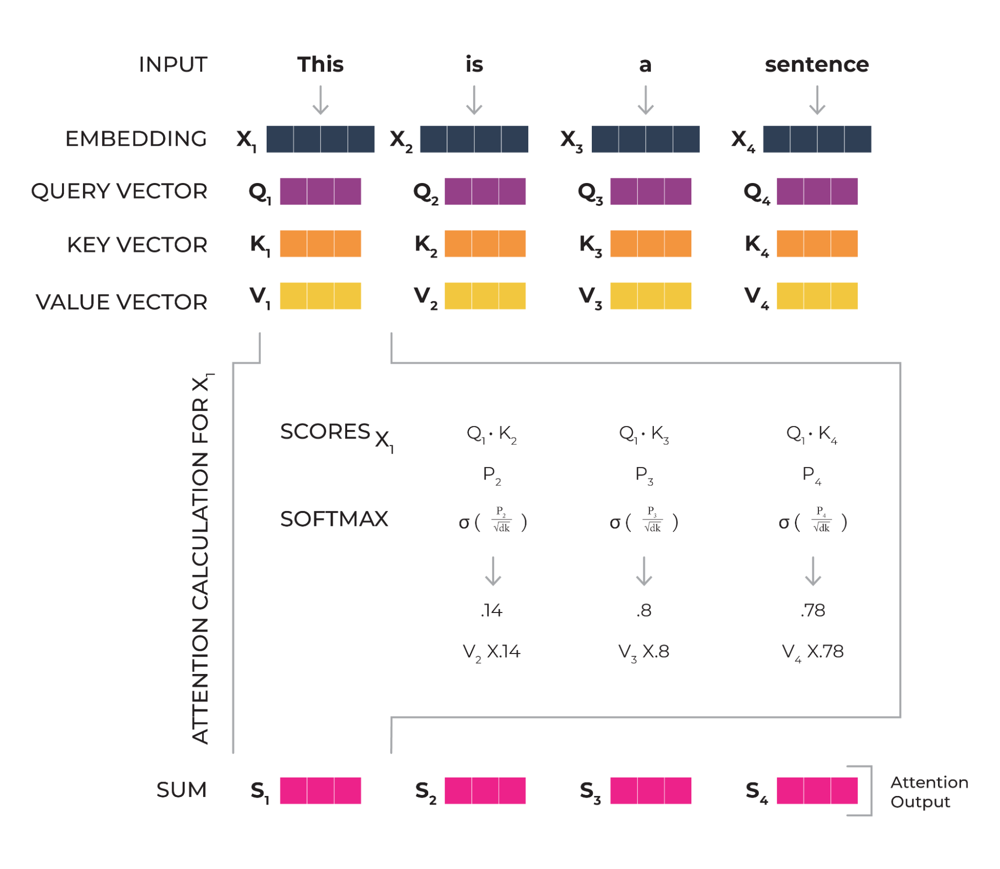

## Table of Contents

## What is attention in the context of machine learning?

Attention in machine learning is a technique that helps models focus on the most relevant parts of the input data when making predictions or generating outputs. Imagine you're reading a long document and you need to answer a question about it. Instead of reading the entire document again, you'd quickly scan it and focus on the parts that are most likely to contain the answer. That's what attention does for machine learning models. It allows the model to weigh the importance of different parts of the input, like words in a sentence or pixels in an image, and pay more attention to the parts that are most relevant for the task at hand.

One common way attention is used is in sequence-to-sequence models, such as those used in machine translation. In these models, the attention mechanism helps the decoder focus on different parts of the input sequence (like a sentence in one language) when generating the output sequence (like a translation in another language). The attention weights are calculated using a function that measures how well each part of the input aligns with the current state of the decoder. This can be represented as $$ \text{Attention}(Q, K, V) = \text{softmax}\left(\frac{QK^T}{\sqrt{d_k}}\right)V $$, where Q, K, and V are the query, key, and value matrices, and $d_k$ is the dimension of the key vectors. This formula helps the model decide which parts of the input to focus on at each step of the decoding process.

## How do attention patterns help in processing sequential data?

Attention patterns help in processing sequential data by allowing the model to focus on different parts of the input at different times. Imagine you're reading a long story and need to summarize it. You wouldn't read the whole story again; instead, you'd skim through it and focus on the key events or sentences that capture the main points. Attention works similarly in machine learning models, helping them to pay more attention to certain parts of the input sequence that are more relevant for the current task, like generating the next word in a translation or predicting the next action in a video.

In technical terms, attention mechanisms calculate weights for each part of the input sequence based on how relevant they are to the current state of the model. This is often done using a formula like $$ \text{Attention}(Q, K, V) = \text{softmax}\left(\frac{QK^T}{\sqrt{d_k}}\right)V $$, where Q, K, and V are the query, key, and value matrices, and $d_k$ is the dimension of the key vectors. By using these weights, the model can effectively "attend" to different parts of the input at each step, which is especially useful in tasks like machine translation where the model needs to understand the context of the entire input sentence to generate an accurate translation.

## What is Strided Attention and how does it work?

Strided Attention is a way to make attention mechanisms in [machine learning](/wiki/machine-learning) more efficient, especially when dealing with long sequences of data. Imagine you're reading a very long book and you want to summarize it. Instead of looking at every single word, you might skip some words and focus on key sentences or paragraphs. Strided Attention does something similar by not looking at every part of the input sequence all the time. It uses a "stride" to skip over some parts of the data, which helps the model process information faster and use less memory.

In technical terms, Strided Attention works by applying a stride to the attention mechanism. This means that instead of calculating attention scores for every single element in the input sequence, the model calculates them for every nth element, where n is the stride size. For example, if the stride size is 2, the model would look at every second element. The attention calculation still uses the formula $$ \text{Attention}(Q, K, V) = \text{softmax}\left(\frac{QK^T}{\sqrt{d_k}}\right)V $$, but now Q, K, and V are computed using only the strided elements. This approach can significantly speed up the processing of long sequences while still capturing important information.

## Can you explain Fixed Factorized Attention and its advantages?

Fixed Factorized Attention is a way to make attention mechanisms in machine learning even more efficient, especially when dealing with long sequences. Imagine you're reading a long book and you want to understand it better. Instead of looking at every single word, you might break the book into smaller parts, like chapters, and focus on the important sentences within each part. Fixed Factorized Attention does something similar by breaking down the attention into two steps: first, it groups the input sequence into smaller chunks, and then it applies attention within these chunks. This method helps the model process information faster and use less memory because it doesn't have to look at every single part of the sequence all at once.

The main advantage of Fixed Factorized Attention is that it makes the attention process more efficient. By breaking the input into smaller chunks and applying attention within these chunks, the model can handle longer sequences without using too much memory or computational power. This is especially useful for tasks like machine translation or text summarization, where the model needs to understand long pieces of text. The formula for Fixed Factorized Attention can be represented as $$ \text{FFA}(Q, K, V) = \text{softmax}\left(\frac{QK^T}{\sqrt{d_k}}\right)V $$, but applied in two stages: first within chunks, and then across chunks. This two-step approach helps the model focus on the most important parts of the input more effectively.

## What is Sliding Window Attention and where is it commonly used?

Sliding Window Attention is a way to make attention mechanisms in machine learning more efficient, especially when dealing with long sequences. Imagine you're reading a long book and you want to understand it better. Instead of looking at the whole book at once, you might focus on a few pages at a time, moving your focus as you read. Sliding Window Attention does something similar by looking at a small part of the input sequence at a time and moving this "window" along the sequence. This helps the model process information faster and use less memory because it doesn't have to look at every single part of the sequence all at once.

This technique is commonly used in tasks like machine translation and text summarization, where the model needs to understand long pieces of text. For example, when translating a long sentence, the model can focus on a few words at a time, making sure it captures the context correctly. The formula for Sliding Window Attention can be represented as $$ \text{SWA}(Q, K, V) = \text{softmax}\left(\frac{QK^T}{\sqrt{d_k}}\right)V $$, but applied within the moving window. This approach helps the model focus on the most important parts of the input more effectively, making it a useful tool for handling long sequences in various applications.

## How does Global and Sliding Window Attention differ from other attention patterns?

Global Attention and Sliding Window Attention are two different ways to focus on parts of a long sequence in machine learning. Global Attention looks at the entire input sequence at once. It's like reading a whole book to understand it. This method uses a formula like $$ \text{GlobalAttention}(Q, K, V) = \text{softmax}\left(\frac{QK^T}{\sqrt{d_k}}\right)V $$ to calculate how much to focus on each part. While this can be very effective for understanding the full context, it can also be slow and use a lot of memory, especially with long sequences.

Sliding Window Attention, on the other hand, looks at the input sequence in smaller parts, like focusing on a few pages of a book at a time. It moves a "window" along the sequence, using a formula like $$ \text{SWA}(Q, K, V) = \text{softmax}\left(\frac{QK^T}{\sqrt{d_k}}\right)V $$ but only within the window. This method is faster and uses less memory because it doesn't have to look at the whole sequence at once. It's especially useful for tasks like translating long sentences or summarizing long texts, where understanding smaller parts at a time can help the model work better.

## What are the benefits of using Dilated Sliding Window Attention?

Dilated Sliding Window Attention is a way to make attention mechanisms in machine learning even more efficient, especially when dealing with long sequences. Imagine you're reading a long book and you want to understand it better. Instead of looking at every single page, you might skip some pages and focus on certain parts. Dilated Sliding Window Attention does something similar by using a "dilation" [factor](/wiki/factor-investing) to skip over some parts of the sequence while still looking at others. This helps the model process information faster and use less memory because it doesn't have to look at every single part of the sequence all at once.

The main benefit of Dilated Sliding Window Attention is that it can capture long-range dependencies in the input sequence more effectively. By using a dilation factor, the model can look at parts of the sequence that are far apart, which can be very useful for tasks like machine translation or text summarization. The formula for Dilated Sliding Window Attention can be represented as $$ \text{DSWA}(Q, K, V) = \text{softmax}\left(\frac{QK^T}{\sqrt{d_k}}\right)V $$, but applied within the dilated window. This approach helps the model focus on the most important parts of the input more effectively, making it a powerful tool for handling long sequences in various applications.

## How does Neighborhood Attention improve efficiency in large-scale models?

Neighborhood Attention is a way to make big machine learning models work faster and use less memory. Imagine you're trying to understand a huge map. Instead of looking at the whole map at once, you focus on small areas around you, called neighborhoods. Neighborhood Attention does the same thing with data. It looks at small parts of the input at a time, which helps the model process information quicker and use less memory. This is especially helpful for big models that need to handle a lot of data.

The way Neighborhood Attention works is by breaking the input into smaller chunks and only looking at the nearby parts. This is like looking at the houses close to you on a map instead of the whole city. The formula for Neighborhood Attention can be represented as $$ \text{NA}(Q, K, V) = \text{softmax}\left(\frac{QK^T}{\sqrt{d_k}}\right)V $$, but it's applied within these small neighborhoods. By doing this, the model can still understand the important parts of the data without needing to look at everything all at once, making it more efficient for large-scale tasks.

## What is BigBird and how does it handle long sequences?

BigBird is a way to help machine learning models understand really long pieces of information, like a very long book or a huge document. It's like reading a book but instead of looking at every single word, you focus on important parts. BigBird does this by using different tricks to make the model faster and use less memory. It breaks the long information into smaller pieces and looks at them in different ways, like focusing on nearby parts or skipping some parts to look at others that are far away.

One of the main tricks BigBird uses is called "sparse attention." This means it doesn't look at every single part of the long information all at once. Instead, it uses a formula like $$ \text{Attention}(Q, K, V) = \text{softmax}\left(\frac{QK^T}{\sqrt{d_k}}\right)V $$ but only for certain parts. By doing this, BigBird can handle long sequences much better than other models. It's like reading a book by focusing on key chapters and important sentences, which helps the model understand the whole story without getting overwhelmed by too much information.

## Can you describe the mechanism of Routing Attention?

Routing Attention is a way to help machine learning models focus on the most important parts of the information they need to understand. Imagine you're reading a long book and you want to summarize it. Instead of reading every word, you might jump between different sections that seem important. Routing Attention does something similar by deciding which parts of the input to look at more closely. It uses a special method to figure out which parts are most useful, kind of like choosing the most interesting chapters in a book.

The way Routing Attention works is by using a formula like $$ \text{RoutingAttention}(Q, K, V) = \text{softmax}\left(\frac{QK^T}{\sqrt{d_k}}\right)V $$ to decide where to focus. But instead of looking at everything at once, it picks and chooses the most relevant parts. This helps the model work faster and use less memory because it doesn't have to pay attention to every single piece of information. It's like reading a book by skimming through it and focusing on the key parts that help you understand the story better.

## How do different attention patterns impact the performance of transformer models?

Different attention patterns in transformer models help them understand and process information better. Imagine you're reading a long story and need to summarize it. Some attention patterns, like Global Attention, look at the whole story at once, which helps the model see the big picture but can be slow and use a lot of memory. Other patterns, like Sliding Window Attention, focus on smaller parts of the story at a time, moving along as they go. This makes the model faster and more efficient, especially for long stories, but it might miss some important details that are far apart.

Another pattern, called Dilated Sliding Window Attention, is like reading a book but skipping some pages to focus on others that are further apart. This helps the model see connections between parts of the story that are not next to each other, which can be really useful for understanding long-range relationships in the text. Each attention pattern has its own way of helping the model focus on what's important, and choosing the right one can make the transformer model work better for different tasks, like translating languages or summarizing long documents.

## What are the latest advancements in attention patterns and their potential future applications?

The latest advancements in attention patterns include techniques like Longformer and Performer, which are designed to handle even longer sequences more efficiently. Longformer uses a combination of local and global attention, allowing it to focus on nearby parts of the text while also considering some distant parts. This is like reading a book by focusing on a few pages at a time but also occasionally looking at the beginning or end to keep the whole story in mind. Performer, on the other hand, uses a different approach called linear attention, which makes the model faster by simplifying the attention calculation. It's like reading a book by quickly scanning through it and [picking](/wiki/asset-class-picking) out the most important parts without getting bogged down in the details.

These new attention patterns have exciting potential future applications. For example, they could be used to improve language models that need to understand very long documents, like legal contracts or scientific papers. Imagine a model that can read through a whole book and answer questions about it accurately, or one that can summarize a long report without missing any important details. These advancements could also help in fields like genomics, where models need to analyze long sequences of DNA to find patterns and make predictions. By making attention more efficient, these new patterns could help machines understand and process information in ways that were previously too difficult or time-consuming.

## References & Further Reading

[1]: Vaswani, A., Shazeer, N., Parmar, N., Uszkoreit, J., Jones, L., Gomez, A. N., ... & Polosukhin, I. (2017). ["Attention is All You Need."](https://arxiv.org/abs/1706.03762) Advances in Neural Information Processing Systems.

[2]: Beltagy, I., Peters, M. E., & Cohan, A. (2020). ["Longformer: The Long-Document Transformer."](https://arxiv.org/abs/2004.05150) arXiv preprint arXiv:2004.05150.

[3]: Choromanski, K., Likhosherstov, V., Dohan, D., Song, X., Gane, A., Sarlos, T., ... & Weller, A. (2020). ["Rethinking Attention with Performers."](https://arxiv.org/abs/2009.14794) arXiv preprint arXiv:2009.14794.

[4]: Zaheer, M., Guruganesh, G., Dubey, K. A., Ainslie, J., Alberti, C., Ontanon, S., ... & Ahmed, A. (2020). ["Big Bird: Transformers for Longer Sequences."](https://arxiv.org/abs/2007.14062) arXiv preprint arXiv:2007.14062.

[5]: Tay, Y., Dehghani, M., Abnar, S., Shen, Y., Bahri, D., Pham, P., ... & Metzler, D. (2020). ["Long Range Arena: A Benchmark for Efficient Transformers."](https://arxiv.org/abs/2011.04006) arXiv preprint arXiv:2011.04006.

[6]: Beltagy, I., Cohan, A., & Lo, K. (2020). ["LED: A Large-Scale Long-Document Transformer."](https://arxiv.org/abs/2004.05150) arXiv preprint arXiv:2004.05150.