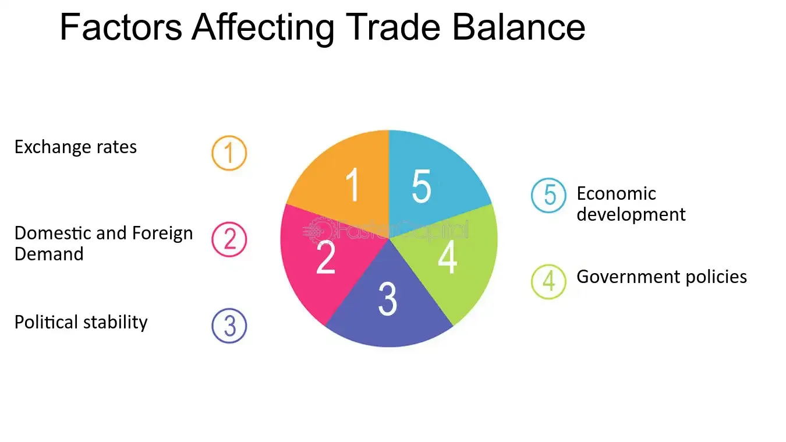

## Table of Contents

## What is a trade balance?

A trade balance is the difference between the value of a country's exports and the value of its imports over a certain period, usually a year. If a country exports more than it imports, it has a trade surplus. This means the country is selling more goods and services to other countries than it is buying from them. On the other hand, if a country imports more than it exports, it has a trade deficit. This means the country is buying more from other countries than it is selling to them.

The trade balance is an important indicator of a country's economic health. A trade surplus can be a sign of a strong economy because it shows that the country's goods and services are in demand around the world. However, a trade deficit isn't always bad. It can mean that the country's consumers have enough money to buy foreign goods. But if the deficit is too large, it might lead to problems like a weaker currency or more debt. Governments and economists watch the trade balance closely to make decisions about economic policies.

## How is a trade balance calculated?

A trade balance is calculated by subtracting the total value of a country's imports from the total value of its exports over a specific time, like a year. If the number is positive, it means the country has a trade surplus because it exported more than it imported. If the number is negative, the country has a trade deficit because it imported more than it exported.

To find these values, countries keep track of all the goods and services that cross their borders. This includes everything from cars and computers to tourism and financial services. The data is collected by customs offices and other government agencies, and then it's added up to get the total value of exports and imports.

The trade balance is important because it shows how a country is doing in the global market. A big surplus might mean the country is good at making things other countries want to buy. A big deficit might mean the country's people are buying a lot from other places. Either way, the trade balance helps leaders make decisions about things like taxes and trade deals.

## What does a positive trade balance indicate?

A positive trade balance means a country is selling more stuff to other countries than it is buying from them. This is also called a trade surplus. When a country has a trade surplus, it shows that other countries want to buy its products. This can be a good sign because it means the country's businesses are doing well in the global market.

Having a trade surplus can help a country's economy grow. When a country earns more from its exports, it can use that money to invest in things like schools, roads, and businesses. This can create jobs and make the country richer over time. But, a trade surplus isn't always the best thing. Sometimes, it can lead to other countries getting upset and putting up barriers to trade.

## What does a negative trade balance indicate?

A negative trade balance means a country is buying more stuff from other countries than it is selling to them. This is also called a trade deficit. When a country has a trade deficit, it shows that its people and businesses are spending more on foreign goods and services than what they are earning from selling their own products abroad.

Having a trade deficit isn't always bad. It can mean that the country's people have enough money to buy things from other places, which can be a sign of a strong economy. But if the deficit is too big, it might cause problems. The country might need to borrow money to pay for all the imports, which can lead to more debt and a weaker currency. Governments and economists watch the trade deficit closely to make sure it doesn't get out of control.

## How do exchange rates affect a country's trade balance?

Exchange rates can have a big impact on a country's trade balance. When a country's currency gets stronger compared to other currencies, its exports can become more expensive for other countries to buy. This might make other countries buy less from that country, which could lead to a smaller trade surplus or a bigger trade deficit. On the other hand, when a country's currency gets weaker, its exports become cheaper for other countries to buy. This could make other countries buy more, which might help the country have a bigger trade surplus or a smaller trade deficit.

But it's not just about exports. When a country's currency gets stronger, it can make imports cheaper for its people and businesses to buy. This might lead them to buy more from other countries, which could make the trade deficit bigger or the trade surplus smaller. If the currency gets weaker, imports become more expensive, which might make people and businesses buy less from other countries. This could help the country have a smaller trade deficit or a bigger trade surplus. So, exchange rates can change how much a country buys and sells with the rest of the world, which affects its trade balance.

## What role do tariffs and trade policies play in influencing trade balance?

Tariffs and trade policies can really change a country's trade balance. Tariffs are like taxes that a country puts on goods coming in from other places. When a country adds tariffs, it makes those foreign goods more expensive. This can make people and businesses in that country buy less from other places and more from their own country. This might help the country have a smaller trade deficit or a bigger trade surplus. But, if other countries don't like the tariffs, they might put tariffs on the first country's goods too. This can make it harder for the first country to sell its stuff abroad, which could hurt its trade balance.

Trade policies are the rules and agreements that countries make about buying and selling stuff with each other. These policies can include things like free trade agreements, where countries agree to lower or remove tariffs to make trade easier. If a country joins a free trade agreement, it might be able to sell more to other countries in the agreement, which could help its trade balance. But, it might also buy more from those countries, which could hurt its trade balance. So, trade policies can make a country's trade balance better or worse, depending on what the policies are and how other countries react to them.

## How does the competitiveness of a country's industries impact its trade balance?

The competitiveness of a country's industries is really important for its trade balance. If a country's businesses are good at making things that other countries want to buy, they can sell more stuff abroad. This can lead to a bigger trade surplus because the country is exporting more than it is importing. For example, if a country makes the best cars in the world, other countries will want to buy those cars, which helps the country's trade balance.

On the other hand, if a country's industries are not as competitive, it might have a harder time selling its stuff to other countries. This can lead to a bigger trade deficit because the country is buying more from other places than it is selling. If a country's businesses can't make things as cheaply or as well as businesses in other countries, people and businesses in other countries might not want to buy from them. This means the country might need to import more, which can hurt its trade balance.

## What is the effect of domestic demand on a country's trade balance?

Domestic demand, which is how much people and businesses in a country want to buy, can really affect a country's trade balance. If people in a country want to buy a lot of stuff, and they buy more from other countries than their own country can make, this can lead to a bigger trade deficit. When domestic demand is high, people might buy more cars, clothes, or electronics from other places, which means the country is importing more than it is exporting.

On the other hand, if domestic demand is low, people might not buy as much from other countries. This can help the country have a smaller trade deficit or even a trade surplus. When people buy less from other places, the country might be able to sell more of its own stuff abroad, which can make its trade balance better. So, how much people in a country want to buy can change how much the country buys and sells with the rest of the world.

## How do global economic conditions influence a country's trade balance?

Global economic conditions can really change a country's trade balance. If the world economy is doing well, other countries might buy more stuff. This can help a country sell more of its own products abroad, which can lead to a bigger trade surplus. But if the world economy is not doing well, other countries might not buy as much. This can make it harder for a country to sell its stuff, which might lead to a bigger trade deficit.

Also, things like global prices for things like oil or steel can affect a country's trade balance. If the price of oil goes up a lot, a country that imports oil might have to spend more money on it. This can make the country's trade deficit bigger. On the other hand, if a country exports a lot of oil, higher prices can help it earn more money and have a bigger trade surplus. So, what's happening in the world economy can make a big difference in how a country's trade balance turns out.

## What are the long-term versus short-term factors affecting trade balance?

Short-term factors that affect a country's trade balance can change quickly and might not last long. Things like sudden changes in exchange rates can make a country's exports more or less expensive for other countries to buy. If a country's currency gets weaker, its exports might become cheaper and other countries might buy more, which can help the trade balance in the short term. Also, short-term changes in global demand, like during a holiday season, can make other countries buy more or less from a country. If there's a big event like a global economic crisis, it can make other countries buy less, which can hurt a country's trade balance right away.

Long-term factors that affect a country's trade balance take more time to change and can have a bigger impact over time. The competitiveness of a country's industries is a big long-term factor. If a country's businesses keep getting better at making things that other countries want to buy, it can help the country have a better trade balance over many years. Also, long-term changes in trade policies, like joining a free trade agreement, can make it easier for a country to sell its stuff abroad and buy less from other places. Things like education and technology can also help a country's industries become more competitive, which can improve its trade balance over the long term.

## How can government policies be used to improve a trade balance?

Governments can use different policies to make their trade balance better. One way is by using tariffs, which are like taxes on stuff coming into the country. When a government puts tariffs on imports, it makes those things more expensive. This can make people buy more from their own country instead of from other places. This might help the country sell more of its own stuff abroad and buy less from other countries, which can make the trade balance better. But, other countries might not like this and could put tariffs on the first country's goods too, which could hurt its trade balance.

Another way governments can help is by making their country's businesses more competitive. They can do this by investing in things like education and technology, which can help businesses make better stuff that other countries want to buy. Governments can also make trade agreements with other countries to make it easier to sell stuff abroad. These agreements can lower or get rid of tariffs, which can help a country sell more and buy less from other places. Over time, these kinds of policies can help the country have a better trade balance.

## What advanced economic models are used to predict changes in trade balance?

Economists use advanced models like the gravity model and computable general equilibrium (CGE) models to predict changes in a country's trade balance. The gravity model is based on the idea that trade between two countries is bigger when they are closer to each other and when their economies are bigger. It uses things like distance, the size of their economies, and trade agreements to guess how much trade will happen between them. This can help predict if a country's trade balance will get better or worse based on these factors.

CGE models are more complex and look at how different parts of an economy work together. These models can show how changes in things like taxes, tariffs, or technology can affect a country's trade balance. They take into account how people and businesses react to these changes and how they might buy and sell more or less as a result. By using a lot of data and math, CGE models can give a detailed picture of what might happen to a country's trade balance in the future.

## What is the relationship between global economic conditions and income levels?

Global economic conditions significantly affect trade balances by shaping both supply and demand on an international scale. Key factors such as growth rates and consumer demand directly impact a nation's exports and imports, which are pivotal components of trade balances.

High-income levels in developed countries tend to boost the demand for luxury goods. These countries have a consumer base with substantial purchasing power, often translating their affluence into a preference for high-end products, both domestic and imported. This demand affects international trade dynamics by increasing the [volume](/wiki/volume-trading-strategy) and value of imports from countries specialized in luxury goods production. Consequently, nations exporting these goods often experience positive trade balances due to elevated global demand.

Conversely, economic recessions can have a detrimental effect on trade activities. A downturn typically reduces consumer spending power and leads to lower demand for both domestic and foreign goods. This contraction in demand results in a decrease in the volume of trade, adversely affecting the trade balances of both importing and exporting countries. During such periods, safeguarding a favorable trade balance becomes challenging as nations must navigate reduced incomes and constricted markets.

Understanding domestic and international income levels is imperative for predicting economic trends and shaping effective trade policies. A nuanced analysis of income distribution can help policymakers anticipate shifts in trade patterns and adjust strategies accordingly. For instance, tracking changes in income levels can provide valuable insights into emerging consumer behavior, guiding countries in identifying potential markets for their exports or adjusting to variations in import demand.

Mathematically, trade balance $TB$ can be expressed as the difference between exports $X$ and imports $M$:

$$
TB = X - M
$$

When economic conditions lead to increased demand, particularly in high-income countries, exports $X$ rise, potentially leading to a surplus where $TB > 0$. In contrast, during economic recessions, imports $M$ may escalate relative to exports due to dwindling production capabilities or changing consumer preferences, causing a trade deficit where $TB < 0$.

By leveraging economic data and advanced modeling techniques, stakeholders can create predictive frameworks to forecast international trade dynamics. This enables governments and businesses to devise strategies that capitalize on favorable economic conditions or mitigate adverse impacts during downturns. Understanding these intricacies provides a roadmap for enhancing trade policies that align with evolving global economic scenarios.

## References & Further Reading

[1]: Krugman, P. R., & Obstfeld, M. (2006). ["International Economics: Theory and Policy,"](https://archive.org/details/internationaleco0008krug) 8th Edition. Pearson Education.

[2]: Bhagwati, J. (2008). ["In Defense of Globalization."](https://archive.org/details/indefenseofglob00bhag) Oxford University Press.

[3]: Dornbusch, R., Fischer, S., & Startz, R. (2010). ["Macroeconomics."](https://archive.org/details/macroeconomics0000dorn_r1w2) McGraw-Hill Education.

[4]: Acemoglu, D., Robinson, J. A. (2012). ["Why Nations Fail: The Origins of Power, Prosperity, and Poverty."](https://ia800606.us.archive.org/15/items/WhyNationsFailTheOriginsODaronAcemoglu/Why-Nations-Fail_-The-Origins-o-Daron-Acemoglu.pdf) Crown Publishers.

[5]: Baldwin, R. & Forslid, R. (2000). ["Trade liberalization and endogenous growth: A q-theory approach."](https://www.sciencedirect.com/science/article/pii/S0022199699000082) Journal of International Economics.

[6]: Cerny, A. (2008). ["Mathematics of Financial Markets."](https://www.jstor.org/stable/j.ctt1f89t04) Cambridge University Press.

[7]: Lopez de Prado, M. (2018). ["Advances in Financial Machine Learning."](https://www.amazon.com/Advances-Financial-Machine-Learning-Marcos/dp/1119482089) Wiley.

[8]: Keyes, L. (2005). ["Technology and the Global Economy."](https://www.annualreviews.org/content/journals/10.1146/annurev-economics-080218-025541) Entrepreneur Press.

[9]: Grossman, G., & Helpman, E. (1991). ["Innovation and Growth in the Global Economy."](https://scholar.harvard.edu/helpman/publications/innovation-and-growth-teh-global-economy) MIT Press.

[10]: Grossman, S. J., & Stiglitz, J. E. (1980). ["On the Impossibility of Informationally Efficient Markets."](https://www.aeaweb.org/aer/top20/70.3.393-408.pdf) The American Economic Review.