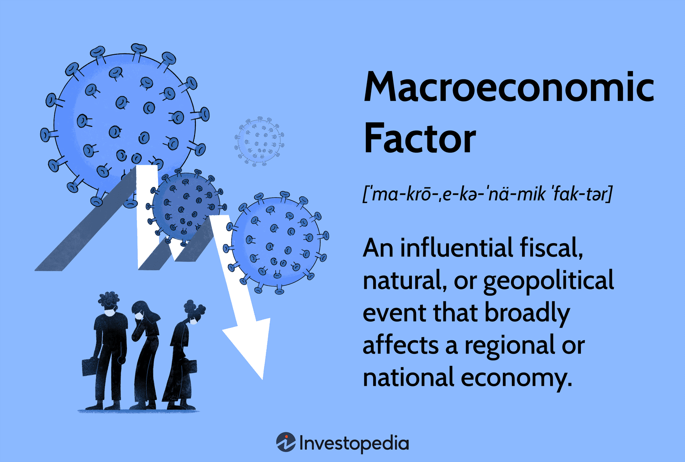

The global economy functions as a multifaceted network comprising interdependent nations, where trade balances are pivotal in assessing economic health. Trade balance, defined as the difference between a country's exports and imports, serves as a key indicator of a nation’s economic performance. A positive trade balance, or surplus, suggests that a country exports more than it imports, while a negative trade balance, or deficit, indicates the opposite. This dynamic interplay can significantly influence a nation's GDP, employment rates, and overall economic stability.

Several factors substantially affect international trade dynamics, including trade policies, exchange rates, and technological advancements. Trade policies, such as tariffs and quotas, are instrumental in shaping trade balances by facilitating or restricting international commerce. Moreover, exchange rates, which dictate the value of one currency relative to another, can alter the competitive landscape. For instance, a weaker domestic currency makes exports cheaper and more attractive in the global market, potentially improving a nation's trade balance.

Technological advancements also play a significant role in redefining global trade. Innovations in digital technology, automation, and transportation have not only expedited the exchange of goods and services but have also expanded the reach of international markets. E-commerce platforms and digital payment systems have further transformed traditional trading models, enabling seamless global transactions.

Understanding trade balance intricacies, international trade mechanisms, and the advent of algorithmic trading offers deeper insights into global economic patterns. Algorithmic trading, which involves using computer algorithms to execute trades at high speed, has introduced a paradigm shift in financial markets by enhancing efficiency, liquidity, and market transparency.

This article seeks to unravel the major economic factors impacting trade balance, explore the evolution of international trade, and examine the comprehensive effects of algorithmic trading. Through a systematic analysis of these components, the article aims to provide a clarifying perspective on the complexities of global economics, emphasizing the necessity for adaptive strategies in an ever-evolving economic landscape.

## Table of Contents

## Economic Factors Influencing Trade Balance

A nation's trade balance, defined as the difference between the value of its exports and imports, serves as a significant indicator of economic health and competitiveness. Several economic factors influence this balance, shaping the flow of goods and services across borders.

Factor endowments, which consist of a nation's labor pool and natural resources, form the bedrock of its production capabilities and trade potential. Nations abundant in specific resources or labor can specialize in producing goods or services where they hold a comparative advantage, thereby influencing trade patterns. For instance, a country rich in minerals but lacking industrial capabilities might primarily export raw materials while importing manufactured goods.

Trade policies, such as tariffs, import quotas, and export subsidies, are instrumental in shaping a country's trade balance. Tariffs, taxes imposed on imported goods, can protect domestic industries from foreign competition but may also lead to retaliation from trading partners. Import quotas restrict the quantity of foreign products entering a market, potentially reducing trade deficits by limiting imports. These tools, however, must be wielded cautiously, as excessively protective measures can provoke trade wars, disrupting global supply chains and economic relations.

Monetary factors, including exchange rates, inflation, and foreign currency reserves, also play a crucial role in determining trade balance outcomes. Exchange rate fluctuations can alter the competitiveness of a nation's goods and services. A depreciation in the local currency makes exports cheaper and imports more expensive, potentially improving the trade balance. Conversely, an appreciation may have the opposite effect. Inflation impacts trade by affecting purchasing power; higher domestic inflation can erode the competitiveness of exports while making imports relatively cheaper.

Foreign currency reserves represent a country's buffer against economic shocks and its ability to influence exchange rates. By managing these reserves, a nation can stabilize its currency, thereby indirectly affecting its trade balance. In essence, the careful orchestration of economic policies and management of intrinsic resources determines the robustness of a nation's trade balance, reflecting its economic vitality and positioning in the global market.

## The Role of Technological Advancements in Trade

Technological advancements are pivotal in enhancing productivity and augmenting a country's competitive edge on the global stage. These advancements can diversify export portfolios by introducing new products and services to international markets. The advent of e-commerce and digital platforms has radically altered traditional trade, facilitating more efficient and widespread global reach. By enabling businesses to connect with consumers worldwide, these platforms reduce the barriers associated with physical distance and local market access. This transformation allows even small and medium-sized enterprises to participate in international commerce, thereby expanding their potential customer base.

Investments in technology significantly impact the optimization of supply chains and improve the value of exports through enhanced product quality. Advanced technologies such as [artificial intelligence](/wiki/ai-artificial-intelligence), [machine learning](/wiki/machine-learning), and the Internet of Things (IoT) contribute to more sophisticated and responsive supply chain management. These innovations allow for real-time tracking, predictive maintenance, and demand forecasting, which streamline operations and reduce costs. Companies can thus offer higher-quality products with increased efficiency, making them more attractive in competitive global markets.

However, realizing the full benefits of technological advancements requires robust infrastructure and a global market that demands innovative goods. Infrastructure encompasses reliable internet connectivity, secure payment systems, and efficient logistics services, all of which are essential for supporting the technological backbone of modern trade. Moreover, the demand for cutting-edge products and services drives the economic viability of investing in technology. Countries must actively invest in education and training to build a workforce capable of utilizing these technologies, ensuring sustained growth and competitiveness. As such, the intersection of technology, infrastructure, and global demand forms the foundation for capitalizing on technological advancements in trade.

## Algorithmic Trading and Its Impact on International Trade

Algorithmic trading refers to the use of computer programs and mathematical models to execute trades at high speeds and volumes in financial markets. This practice is recognized for its ability to enhance market efficiency through promoting transparency, reducing transaction costs, and improving [liquidity](/wiki/liquidity-risk-premium). These enhancements can lead to more competitive pricing and increased market participation, ultimately benefitting both traders and investors.

In terms of market efficiency, [algorithmic trading](/wiki/algorithmic-trading) facilitates transparency by enabling the rapid dissemination and processing of information across market participants. The use of sophisticated models and high-frequency trading allows for the quick adjustment of prices to reflect new information, often within milliseconds. This rapid response time is critical in ensuring that markets remain efficient and reflective of the latest data.

Algorithmic trading significantly reduces transaction costs by optimizing order execution. Traditionally, trading would require human intervention, which can be slower and more expensive. With algorithms, orders can be split into smaller segments and executed over time or across multiple markets to achieve the best possible prices, minimizing market impact and transaction fees.

Liquidity is another major benefit of algorithmic trading. By providing continuous bid and ask quotes, algorithms increase the number of trades that can be executed without substantial price changes. This increased liquidity is essential for large trades, ensuring that they can be executed without causing significant market disruptions.

While algorithmic trading is predominantly utilized in stock markets, it also plays a critical role in currency trading and the broader sphere of international financial transactions. In [forex](/wiki/forex-system) markets, for instance, algorithmic trading is employed to exploit minute price discrepancies across different currency pairs, enhancing market efficiency and influencing international financial flows.

However, the proliferation of algorithmic trading has introduced concerns about market [volatility](/wiki/volatility-trading-strategies). The speed and automation involved can lead to swift and significant market movements, sometimes resulting in flash crashes – abrupt, deep price drops followed by quick recoveries. Understanding these dynamics is crucial for developing regulatory frameworks that mitigate potential risks without stifling innovation.

Regulatory challenges in algorithmic trading include ensuring fair access to market data and infrastructure, preventing market manipulation, and maintaining systemic stability. Regulators around the world, such as the U.S. Securities and Exchange Commission (SEC) and the European Securities and Markets Authority (ESMA), are working to address these challenges by implementing rules that ensure transparency and safeguard against market abuse.

In conclusion, while algorithmic trading has revolutionized market operations by enhancing efficiency and liquidity, it also necessitates careful consideration of its impact on volatility and regulatory aspects. Balancing the benefits of technology with the need for market stability will be a pivotal area of focus for policymakers and market participants alike.

## Global Economic Conditions and Income Levels

Global economic conditions significantly affect trade balances by shaping both supply and demand on an international scale. Key factors such as growth rates and consumer demand directly impact a nation's exports and imports, which are pivotal components of trade balances.

High-income levels in developed countries tend to boost the demand for luxury goods. These countries have a consumer base with substantial purchasing power, often translating their affluence into a preference for high-end products, both domestic and imported. This demand affects international trade dynamics by increasing the [volume](/wiki/volume-trading-strategy) and value of imports from countries specialized in luxury goods production. Consequently, nations exporting these goods often experience positive trade balances due to elevated global demand.

Conversely, economic recessions can have a detrimental effect on trade activities. A downturn typically reduces consumer spending power and leads to lower demand for both domestic and foreign goods. This contraction in demand results in a decrease in the volume of trade, adversely affecting the trade balances of both importing and exporting countries. During such periods, safeguarding a favorable trade balance becomes challenging as nations must navigate reduced incomes and constricted markets.

Understanding domestic and international income levels is imperative for predicting economic trends and shaping effective trade policies. A nuanced analysis of income distribution can help policymakers anticipate shifts in trade patterns and adjust strategies accordingly. For instance, tracking changes in income levels can provide valuable insights into emerging consumer behavior, guiding countries in identifying potential markets for their exports or adjusting to variations in import demand.

Mathematically, trade balance $TB$ can be expressed as the difference between exports $X$ and imports $M$:

$$
TB = X - M
$$

When economic conditions lead to increased demand, particularly in high-income countries, exports $X$ rise, potentially leading to a surplus where $TB > 0$. In contrast, during economic recessions, imports $M$ may escalate relative to exports due to dwindling production capabilities or changing consumer preferences, causing a trade deficit where $TB < 0$.

By leveraging economic data and advanced modeling techniques, stakeholders can create predictive frameworks to forecast international trade dynamics. This enables governments and businesses to devise strategies that capitalize on favorable economic conditions or mitigate adverse impacts during downturns. Understanding these intricacies provides a roadmap for enhancing trade policies that align with evolving global economic scenarios.

## Conclusion

The interplay between economic factors, technological advancements, and algorithmic trading is significantly reshaping global trade. Economic factors, such as currency fluctuations, trade policies, and market dynamics, have long been influential in defining trade balance. However, the integration of technology into these processes has amplified their impact, enabling faster and more efficient trading methods. With advancements in technology, nations can improve their production capabilities and compete more effectively on a global scale, thereby influencing their trade balance.

Efforts to sustain a favorable trade balance necessitate strategic policymaking and robust infrastructure investments. Policymakers must focus on adapting regulations that not only encourage innovation but also maintain a level playing field in international markets. Investments in infrastructure, including technological frameworks, can enhance a country's attractiveness as a trading partner, facilitating smoother trading operations and bolstering economic growth.

As the global economic landscape continues to evolve, stakeholders must actively evaluate the diverse aspects of international trade. An understanding of the synergies between economic forces and technological innovations can help identify opportunities for growth and address potential challenges. For instance, while algorithmic trading promotes efficiency and liquidity in financial markets, it also presents regulatory challenges that require careful navigation to prevent adverse market behaviors.

Future economic success hinges on the ability to adapt to technological advancements and capitalize on emerging trading strategies. Nations that invest in technology and education to foster innovation are likely to achieve a competitive advantage in international trade. Moreover, embracing new trade strategies that leverage technology can open up new markets and revenue streams, further strengthening the global economic fabric. By aligning economic policies with technological growth, nations can not only enhance their trade balance but also contribute positively to the global economy.

## References & Further Reading

[1]: Krugman, P. R., & Obstfeld, M. (2006). ["International Economics: Theory and Policy,"](https://archive.org/details/internationaleco0008krug) 8th Edition. Pearson Education.

[2]: Bhagwati, J. (2008). ["In Defense of Globalization."](https://archive.org/details/indefenseofglob00bhag) Oxford University Press.

[3]: Dornbusch, R., Fischer, S., & Startz, R. (2010). ["Macroeconomics."](https://archive.org/details/macroeconomics0000dorn_r1w2) McGraw-Hill Education.

[4]: Acemoglu, D., Robinson, J. A. (2012). ["Why Nations Fail: The Origins of Power, Prosperity, and Poverty."](https://ia800606.us.archive.org/15/items/WhyNationsFailTheOriginsODaronAcemoglu/Why-Nations-Fail_-The-Origins-o-Daron-Acemoglu.pdf) Crown Publishers.

[5]: Baldwin, R. & Forslid, R. (2000). ["Trade liberalization and endogenous growth: A q-theory approach."](https://www.sciencedirect.com/science/article/pii/S0022199699000082) Journal of International Economics.

[6]: Cerny, A. (2008). ["Mathematics of Financial Markets."](https://www.jstor.org/stable/j.ctt1f89t04) Cambridge University Press.

[7]: Lopez de Prado, M. (2018). ["Advances in Financial Machine Learning."](https://www.amazon.com/Advances-Financial-Machine-Learning-Marcos/dp/1119482089) Wiley.

[8]: Keyes, L. (2005). ["Technology and the Global Economy."](https://www.annualreviews.org/content/journals/10.1146/annurev-economics-080218-025541) Entrepreneur Press.

[9]: Grossman, G., & Helpman, E. (1991). ["Innovation and Growth in the Global Economy."](https://scholar.harvard.edu/helpman/publications/innovation-and-growth-teh-global-economy) MIT Press.

[10]: Grossman, S. J., & Stiglitz, J. E. (1980). ["On the Impossibility of Informationally Efficient Markets."](https://www.aeaweb.org/aer/top20/70.3.393-408.pdf) The American Economic Review.