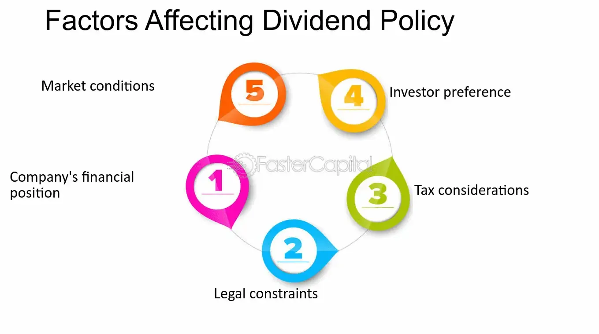

## Table of Contents

## What is a dividend and why is it important for investors?

A dividend is money that a company pays to its shareholders, usually from its profits. It's like a reward for owning part of the company. Companies can choose to pay dividends regularly, like every three months, or they might pay them once a year or not at all. The amount of the dividend depends on how well the company is doing and how much profit it makes.

Dividends are important for investors because they provide a steady income. This can be especially helpful for people who are retired and need money to live on. Also, dividends can make an investment more attractive because they add to the total return an investor gets. Even if the price of the stock doesn't go up, the dividends can still give the investor some profit. This makes dividends a key part of many investment strategies.

## How does a company's profitability affect its dividend policy?

A company's profitability plays a big role in deciding its dividend policy. If a company makes a lot of profit, it might decide to share some of that profit with its shareholders by paying dividends. This makes shareholders happy because they get extra money just for owning the company's stock. On the other hand, if a company isn't making much profit or is losing money, it might cut back on dividends or stop paying them altogether. The company needs to keep enough money to run its business and invest in new projects, so it can't always afford to pay out dividends.

Sometimes, even if a company is profitable, it might choose to keep the money to grow the business instead of paying dividends. This can be a good strategy if the company thinks it can use the money to make even more profit in the future. But if shareholders expect regular dividends, the company has to balance between keeping money for growth and paying out dividends to keep investors happy. So, a company's profitability directly affects its ability and willingness to pay dividends, and this decision can impact how investors see the company.

## What role does a company's growth stage play in dividend complexity?

A company's growth stage is really important when it comes to deciding about dividends. When a company is young and still growing fast, it usually doesn't pay dividends. That's because it needs all its money to grow bigger. It might want to build new factories, hire more people, or start selling in new places. If the company pays out money as dividends, it won't have enough left to do these things. So, young and growing companies often keep their profits to help them get bigger and stronger.

As a company gets older and its growth slows down, it might start paying dividends. This is because it doesn't need as much money to grow anymore. It might already have all the factories and stores it needs. So, it can share some of its profits with shareholders. This makes shareholders happy because they get extra money. But even then, the company has to be careful. It still needs to keep some money for unexpected problems or new opportunities. So, the stage of growth a company is in can make a big difference in whether it pays dividends and how much it pays.

## How do different industries impact dividend strategies?

Different industries have different ways of thinking about dividends because they have different needs and goals. For example, big companies in industries like utilities or consumer goods, like electric companies or makers of soap, often pay steady dividends. These industries usually don't grow super fast, but they make steady profits. So, they can share some of their profits with shareholders without worrying too much about needing the money for growth.

On the other hand, tech companies and other fast-growing industries often don't pay dividends. They are usually more focused on growing their business and making new products. They need all their money to do this, so they keep their profits instead of paying them out as dividends. Shareholders in these companies are usually okay with this because they hope the company will grow a lot and the value of their shares will go up.

Sometimes, industries like oil and gas can be a bit different. These companies might pay dividends, but how much they pay can change a lot depending on the price of oil. When oil prices are high, they might pay big dividends, but when prices fall, they might cut back. This shows how the specific conditions of an industry can really affect its dividend strategy.

## What are the tax implications of dividends for investors?

When investors get dividends, they have to pay taxes on them. The tax rate depends on whether the dividends are "qualified" or "non-qualified." Qualified dividends are taxed at a lower rate, like the rate for long-term capital gains, which can be 0%, 15%, or 20% depending on your income. Non-qualified dividends are taxed at your regular income tax rate, which can be higher. To be qualified, the dividends must come from a U.S. company or a qualified foreign company, and the investor must have held the stock for a certain amount of time.

The tax rules can make a big difference in how much money investors keep from their dividends. For example, if you're in a high tax bracket, you might prefer qualified dividends because they are taxed at a lower rate. But if you're in a lower tax bracket, the difference might not matter as much. Also, some investors might choose to invest in companies that don't pay dividends but instead reinvest their profits, which can grow the value of the stock without the investor having to pay taxes right away. So, understanding the tax implications of dividends is important for making smart investment choices.

## How do interest rates influence a company's dividend decisions?

Interest rates can affect a company's decision about paying dividends. When interest rates are low, it's cheaper for companies to borrow money. They might choose to borrow money to grow their business instead of paying out dividends. This can be a good strategy because it helps the company get bigger without using up its own cash. But if shareholders really want dividends, the company might still pay them, even if interest rates are low.

On the other hand, when interest rates are high, borrowing money becomes more expensive. Companies might be more careful about spending money and might decide to pay dividends instead of borrowing to grow. This can make shareholders happy because they get more money from dividends. But the company has to make sure it has enough money left over to run the business and handle the higher cost of borrowing. So, interest rates can play a big role in whether a company decides to pay dividends or not.

## What is the significance of a company's payout ratio in dividend analysis?

The payout ratio is a key number that investors look at when they want to understand a company's dividend policy. It tells you what part of the company's earnings is being paid out as dividends. You can find the payout ratio by dividing the total dividends paid by the company's net income. A high payout ratio means the company is giving a big part of its earnings to shareholders. A low payout ratio means the company is keeping more of its earnings for other things, like growing the business.

The payout ratio is important because it can show if a company's dividends are sustainable. If the payout ratio is very high, like over 100%, it might mean the company is paying out more than it's [earning](/wiki/earning-announcement). This can't last forever because the company needs money to run its business. On the other hand, a lower payout ratio might mean the company has room to increase its dividends in the future. Investors use the payout ratio to decide if a company's dividends are a good, steady source of income or if they might be cut in the future.

## How do regulatory environments affect dividend policies?

Regulatory environments can have a big impact on a company's dividend policies. Different countries have different rules about how much money companies can pay out as dividends. For example, some countries might have laws that say companies have to keep a certain amount of money in reserve before they can pay dividends. This is to make sure the company stays financially healthy. If the rules are strict, companies might not be able to pay as much in dividends as they would like.

Also, industries like banking and insurance are often heavily regulated. These companies might have to follow special rules about how much they can pay in dividends. For instance, banks might need to keep a lot of money on hand to cover any losses, which can limit how much they can pay out to shareholders. So, the regulatory environment can make companies more cautious about paying dividends, and investors need to understand these rules when they look at a company's dividend policy.

## What are the effects of macroeconomic conditions on dividend stability?

Macroeconomic conditions, like the overall health of the economy, can really affect how stable a company's dividends are. When the economy is doing well, companies usually make more money. This means they can afford to pay bigger dividends to their shareholders. But if the economy starts to slow down or goes into a recession, companies might not make as much money. They might have to cut back on dividends to save cash and keep their business running smoothly. So, the ups and downs of the economy can make dividends go up or down.

Sometimes, other big economic factors like inflation or interest rates can also shake up dividend stability. If inflation is high, the cost of everything goes up, and companies might not have as much profit left over to pay dividends. High interest rates can make it more expensive for companies to borrow money, which might lead them to keep more cash on hand instead of paying it out as dividends. Investors need to keep an eye on these big economic trends because they can change how much money they get from dividends.

## How do shareholders' expectations and company communication impact dividend complexity?

Shareholders' expectations play a big role in how a company decides to handle its dividends. If shareholders expect regular and high dividends, the company might feel pressure to keep paying them, even if it means not having as much money to grow the business. This can make things tricky for the company because it has to balance what shareholders want with what's best for the business in the long run. If the company doesn't meet these expectations, shareholders might get upset and sell their shares, which can make the stock price go down.

Company communication is also really important when it comes to dividends. If a company is clear about its plans and keeps shareholders informed, it can help manage their expectations. For example, if a company says it's going to focus on growth and might not pay big dividends for a while, shareholders will know what to expect. Good communication can make shareholders more patient and understanding, even if dividends aren't as high as they hoped. On the other hand, if a company doesn't talk much about its plans, shareholders might be surprised or disappointed if dividends change, which can lead to more problems.

## What advanced financial metrics should be used to assess dividend sustainability?

When you want to know if a company can keep paying its dividends, you should look at some important numbers. One key number is the payout ratio, which tells you what part of the company's earnings goes to dividends. A payout ratio that's too high, like over 100%, means the company is paying out more than it's earning, which isn't good for the long run. Another number to check is the free cash flow. This is the money left over after the company pays for everything it needs to run its business. If the free cash flow is strong, the company can probably keep paying its dividends without problems.

Another useful metric is the dividend coverage ratio, which shows how many times the company's earnings can cover its dividend payments. A higher ratio means the dividends are more secure. You should also look at the company's debt-to-equity ratio. If a company has a lot of debt compared to its equity, it might have to use its earnings to pay off that debt instead of paying dividends. By looking at these numbers, you can get a good idea of whether a company's dividends will stay steady or if they might be cut in the future.

## How can investors use dividend reinvestment plans (DRIPs) to enhance their investment strategy?

Investors can use dividend reinvestment plans (DRIPs) to grow their investments over time. When a company pays a dividend, instead of taking the money, investors can choose to automatically buy more shares of the company with that dividend. This means they end up owning more of the company without having to spend extra money. Over time, as they keep reinvesting their dividends, they can own a lot more shares than they started with. This can help their investment grow faster because they're buying more shares, and if the stock price goes up, the value of their investment goes up too.

DRIPs can also help investors take advantage of compound growth. When dividends are reinvested, the new shares start earning dividends too. This means the investor's total dividend payments can grow bigger each time, leading to even more shares being bought. It's like a snowball effect where the investment keeps getting bigger and bigger. This can be a smart way for investors to build wealth over the long term, especially if they're patient and don't need the dividend money right away.

## What is Understanding Dividend Investments?

Dividend investments involve the acquisition of stocks that disburse regular payments to shareholders in the form of dividends. This dual-faceted strategy enables investors to achieve both capital appreciation and consistent income generation, appealing to those seeking stable financial growth.

A crucial [factor](/wiki/factor-investing) in dividend investment is the dividend yield, typically expressed as a percentage. Calculated as the annual dividend per share divided by the stock's price per share, it provides investors with an estimation of the income they can expect relative to their investment. For instance, if a company pays an annual dividend of $2 per share and its current stock price is $50, the dividend yield would be:

$$
\text{Dividend Yield} = \left( \frac{\$2}{\$50} \right) \times 100 = 4\%
$$

Alongside dividend yield, investors pay attention to the payout ratio, which reflects the portion of a company's earnings paid out as dividends. This ratio helps assess the sustainability of a company's dividend payments. A lower payout ratio might suggest that a company is reinvesting more of its earnings into growth, whereas a higher ratio could indicate a commitment to providing substantial returns to shareholders, or a potential risk if earnings decline.

The financial stability of a company is pivotal when selecting dividend-paying stocks. Investors analyze various financial metrics, such as earnings growth, cash flow, and debt levels, to gauge a company's ability to maintain and potentially increase its dividend payments over time. Companies with a solid track record of stable or rising dividends are often considered more reliable.

Dividend reinvestment plans (DRIPs) offer another compelling feature of dividend investing. These plans allow investors to use their dividend payouts to purchase additional shares of the company's stock, often without incurring brokerage fees. By reinvesting dividends, investors harness the power of compounding, potentially enhancing their returns over time. The formula for compound interest can be adapted to model the growth of reinvested dividends:

$$
A = P \left(1 + \frac{r}{n}\right)^{nt}
$$

where:
- $A$ is the amount of money accumulated after n years, including reinvested dividends.
- $P$ is the initial principal balance (initial investment).
- $r$ is the annual dividend yield.
- $n$ is the number of compounding periods per year.
- $t$ is the number of years.

Balancing risk and income stability is a significant aspect of dividend investing. While dividends provide a steady income stream, investors must be cognizant of market risks and economic fluctuations that can impact dividend payments. Diversifying a dividend portfolio can help manage these risks by spreading investments across different sectors and industries, thus reducing exposure to any single company's financial challenges.

Overall, dividend investments can be a prudent strategy for investors prioritizing income and growth, provided they carefully evaluate the key indicators and maintain a well-rounded investment portfolio.

## What are the complexities of dividend investing?

Dividend investing requires a comprehensive understanding of a company's financial health and history. This necessitates an in-depth analysis of financial statements, including income statements, balance sheets, and cash flow statements. Critical ratios such as the dividend yield and payout ratio provide insights into the sustainability of dividends. The dividend yield, a measure of return on investment, is calculated as:

$$
\text{Dividend Yield} = \frac{\text{Annual Dividends per Share}}{\text{Price per Share}}
$$

A higher yield indicates a potentially lucrative income stream but might also signal financial distress if unsustainable. The payout ratio, which is the proportion of earnings paid as dividends, ought to be carefully analyzed. An optimal payout ratio indicates a balance between rewarding shareholders and retaining earnings for growth.

Investors must keep abreast of economic factors influencing corporate profits, as these directly affect dividend payouts. Economic indicators such as interest rates, inflation, and global economic conditions play significant roles. Changes in interest rates, for instance, can impact a company's borrowing costs and profit margins, thereby affecting its dividend-paying capability.

Risks in dividend investing include dividend cuts, which occur when companies reduce their payout due to declining profits or to support internal financing needs. Market [volatility](/wiki/volatility-trading-strategies) also presents challenges as it can lead to fluctuations in stock prices, impacting the value of dividend income. Diversification is a strategic method to mitigate these risks. By selecting a diversified portfolio of dividend stocks across various sectors and geographies, investors can reduce exposure to company-specific risks.

Lastly, understanding the tax implications of dividends is crucial. Dividends can be classified as qualified or non-qualified, impacting the tax rate applied. Qualified dividends are taxed at the capital gains rate, which is generally lower than the ordinary income tax rate applied to non-qualified dividends. Efficient tax strategies enhance overall investment returns by optimizing net dividend income. Thus, a sound understanding of these complexities can enhance the effectiveness of dividend investing strategies.

## References & Further Reading

[1]: ["Dividends: Insights and Options for Income Investors"](https://www.blackrock.com/us/financial-professionals/insights/income-investor-outlook) by CFA Institute

[2]: ["Algorithmic Trading and DMA: An Introduction to Direct Access Trading Strategies"](https://archive.org/details/algorithmictradi0000john) by Barry Johnson

[3]: ["Financial Markets and Corporate Strategy"](https://www.amazon.com/Financial-Markets-Corporate-Strategy-Grinblatt/dp/0072294337) by Mark Grinblatt and Sheridan Titman

[4]: Knight, F. & Satchell, S. (2007). ["Forecasting Volatility in the Financial Markets"](https://www.sciencedirect.com/book/9780750669429/forecasting-volatility-in-the-financial-markets). Elsevier.

[5]: ["Millennials and the Future of Wealth Management"](https://www.cbinsights.com/research/report/millennials-and-the-future-of-wealth-management/) by CFA Institute

[6]: "MiFID II's Influence on Algorithmic Trading: An Overview," available on [Investopedia](https://www.investopedia.com/smart-money-awards-8693123).