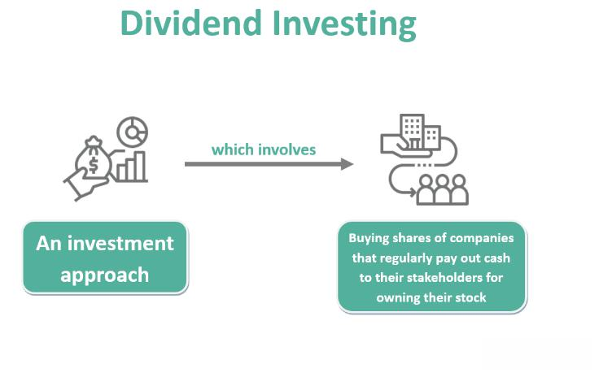

In the world of finance, dividends and algorithmic trading are two prominent strategies employed by investors, each offering distinct complexities and advantages. Dividend investing focuses on acquiring stocks that generate regular income through dividend payouts, appealing to investors who prioritize consistent returns. This approach requires careful evaluation of a company's financial health, dividend yield, and stability, offering the potential for both capital appreciation and regular income. On the other hand, algorithmic trading leverages computer algorithms to execute trades based on pre-defined criteria, providing speed and efficiency. This method is favored by tech-savvy investors who can navigate its complexity, utilizing advanced computational resources and statistical models to capitalize on short-term market movements.

As investors seek to balance these strategies, understanding the nuances and potential challenges of each is crucial. Dividends play a pivotal role for income-focused investors by providing a steady income stream, reducing reliance on market volatility. However, changes in interest rates or economic conditions can impact dividend payouts, posing a risk to returns. Conversely, algorithmic trading offers a dynamic and cutting-edge avenue for investors keen on leveraging technology to optimize trading strategies. Yet, the approach demands robust algorithms and constant adaptation to evolving market conditions to avoid risks like flash crashes.



This article will explore how investors can effectively navigate the intricacies of dividends and algorithmic trading, the strategies involved, and the challenges they may encounter. By examining these methodologies, investors can make informed decisions to construct more resilient and profitable portfolios, ultimately enhancing their financial success.

## Table of Contents

## Understanding Dividend Investments

Dividend investments involve the acquisition of stocks that disburse regular payments to shareholders in the form of dividends. This dual-faceted strategy enables investors to achieve both capital appreciation and consistent income generation, appealing to those seeking stable financial growth.

A crucial factor in dividend investment is the dividend yield, typically expressed as a percentage. Calculated as the annual dividend per share divided by the stock's price per share, it provides investors with an estimation of the income they can expect relative to their investment. For instance, if a company pays an annual dividend of $2 per share and its current stock price is $50, the dividend yield would be:

$$
\text{Dividend Yield} = \left( \frac{\$2}{\$50} \right) \times 100 = 4\%
$$

Alongside dividend yield, investors pay attention to the payout ratio, which reflects the portion of a company's earnings paid out as dividends. This ratio helps assess the sustainability of a company's dividend payments. A lower payout ratio might suggest that a company is reinvesting more of its earnings into growth, whereas a higher ratio could indicate a commitment to providing substantial returns to shareholders, or a potential risk if earnings decline.

The financial stability of a company is pivotal when selecting dividend-paying stocks. Investors analyze various financial metrics, such as earnings growth, cash flow, and debt levels, to gauge a company's ability to maintain and potentially increase its dividend payments over time. Companies with a solid track record of stable or rising dividends are often considered more reliable.

Dividend reinvestment plans (DRIPs) offer another compelling feature of dividend investing. These plans allow investors to use their dividend payouts to purchase additional shares of the company's stock, often without incurring brokerage fees. By reinvesting dividends, investors harness the power of compounding, potentially enhancing their returns over time. The formula for compound interest can be adapted to model the growth of reinvested dividends:

$$
A = P \left(1 + \frac{r}{n}\right)^{nt}
$$

where:
- $A$ is the amount of money accumulated after n years, including reinvested dividends.
- $P$ is the initial principal balance (initial investment).
- $r$ is the annual dividend yield.
- $n$ is the number of compounding periods per year.
- $t$ is the number of years.

Balancing risk and income stability is a significant aspect of dividend investing. While dividends provide a steady income stream, investors must be cognizant of market risks and economic fluctuations that can impact dividend payments. Diversifying a dividend portfolio can help manage these risks by spreading investments across different sectors and industries, thus reducing exposure to any single company's financial challenges.

Overall, dividend investments can be a prudent strategy for investors prioritizing income and growth, provided they carefully evaluate the key indicators and maintain a well-rounded investment portfolio.

## The Complexities of Dividend Investing

Dividend investing requires a comprehensive understanding of a company's financial health and history. This necessitates an in-depth analysis of financial statements, including income statements, balance sheets, and cash flow statements. Critical ratios such as the dividend yield and payout ratio provide insights into the sustainability of dividends. The dividend yield, a measure of return on investment, is calculated as:

$$
\text{Dividend Yield} = \frac{\text{Annual Dividends per Share}}{\text{Price per Share}}
$$

A higher yield indicates a potentially lucrative income stream but might also signal financial distress if unsustainable. The payout ratio, which is the proportion of earnings paid as dividends, ought to be carefully analyzed. An optimal payout ratio indicates a balance between rewarding shareholders and retaining earnings for growth.

Investors must keep abreast of economic factors influencing corporate profits, as these directly affect dividend payouts. Economic indicators such as interest rates, inflation, and global economic conditions play significant roles. Changes in interest rates, for instance, can impact a company's borrowing costs and profit margins, thereby affecting its dividend-paying capability.

Risks in dividend investing include dividend cuts, which occur when companies reduce their payout due to declining profits or to support internal financing needs. Market [volatility](/wiki/volatility-trading-strategies) also presents challenges as it can lead to fluctuations in stock prices, impacting the value of dividend income. Diversification is a strategic method to mitigate these risks. By selecting a diversified portfolio of dividend stocks across various sectors and geographies, investors can reduce exposure to company-specific risks.

Lastly, understanding the tax implications of dividends is crucial. Dividends can be classified as qualified or non-qualified, impacting the tax rate applied. Qualified dividends are taxed at the capital gains rate, which is generally lower than the ordinary income tax rate applied to non-qualified dividends. Efficient tax strategies enhance overall investment returns by optimizing net dividend income. Thus, a sound understanding of these complexities can enhance the effectiveness of dividend investing strategies.

## An Overview of Algorithmic Trading

Algorithmic trading employs computer programs to execute trades according to pre-defined criteria, revolutionizing how transactions are conducted in financial markets. This method leverages speed and efficiency, enabling trades to be performed at optimal prices with minimal human intervention. The core advantage lies in its ability to react to market movements in milliseconds, a feat unachievable by human traders. 

Algorithmic strategies are designed to capitalize on short-term price fluctuations and manage substantial transaction volumes. For example, high-frequency trading ([HFT](/wiki/high-frequency-trading-strategies)), a subset of [algorithmic trading](/wiki/algorithmic-trading), focuses on extremely rapid trade execution to exploit minute pricing inefficiencies. These trades are often held for mere seconds, underscoring the value of speed in capturing profits.

Implementing algorithmic trading requires significant technical expertise and access to sophisticated computational resources. Traders use a variety of tools, including technical indicators like moving averages, and complex statistical models to predict market behavior. Moving Average Convergence Divergence (MACD) or Relative Strength Index (RSI) are common indicators incorporated into algorithms to assess market [momentum](/wiki/momentum) and execution timing.

Machine learning has introduced an additional layer of sophistication, enabling systems to improve decision-making over time as they learn from data patterns. These algorithms are designed to adapt to varying market conditions, often utilizing robust [backtesting](/wiki/backtesting) to validate their effectiveness before deployment.

The implementation of algorithmic trading can be illustrated with a simple Python script that uses moving average crossovers to decide buying and selling actions:

```python
import pandas as pd
import numpy as np

# Sample data: closing prices of a stock
data = pd.read_csv('stock_prices.csv')
prices = data['Close']

# Calculate moving averages
short_window = 40
long_window = 100
signals = pd.DataFrame(index=data.index)
signals['signal'] = 0.0

# Short moving average
signals['short_mavg'] = prices.rolling(window=short_window, min_periods=1).mean()
# Long moving average
signals['long_mavg'] = prices.rolling(window=long_window, min_periods=1).mean()

# Generate signals
signals['signal'][short_window:] = np.where(signals['short_mavg'][short_window:] 
                                            > signals['long_mavg'][short_window:], 1.0, 0.0)

# Positions are the difference between current and previous signals
signals['positions'] = signals['signal'].diff()

print(signals)
```

This code identifies buy signals when the short-term moving average surpasses the long-term moving average, and sell signals in the opposite scenario. While this is a simplified example, real-world applications are significantly more complex, demanding continuous optimization and adaptation to maintain a competitive edge. 

In conclusion, algorithmic trading stands as a cornerstone of modern finance, transforming trade execution with precision and speed. Its strength resides in the intricate interplay of data analysis, computational prowess, and strategic design, providing an unparalleled platform for executing trades in volatile markets.

## Challenges of Algorithmic Trading for Investors

Algorithmic trading presents a unique set of challenges for investors and developers alike, primarily revolving around the robustness and adaptability of the algorithms used. Ensuring that an algorithm is not only effective but also resilient under diverse market conditions is a foundational aspect of this trading strategy. Algorithms must be tested against a variety of scenarios, using historical data to simulate performance and stress-testing under abnormal market conditions to identify potential weaknesses.

One significant issue in algorithmic trading is the risk of market anomalies, such as flash crashes. These events occur due to the high-speed nature of algorithmic trades, which can execute large volumes within milliseconds. The 2010 Flash Crash is a prominent example, where rapid selling triggered by algorithms led to a sharp, albeit brief, market collapse. Such incidents highlight the need for algorithms to include safeguards that limit execution speed or halt trading under specific conditions.

Regulatory compliance represents another critical challenge. Algorithmic trading is subject to complex regulations designed to ensure market stability and fairness. The European Union's Markets in Financial Instruments Directive II (MiFID II) and the United States' Securities and Exchange Commission (SEC) have established guidelines that algorithmic trading entities must follow. These regulations mandate comprehensive reporting and require that firms maintain detailed logs of their trading activity to ensure transparency and accountability.

Continuous optimization and adaptation to market changes are essential for investors utilizing algorithmic trading. Markets are dynamic, and algorithms that do not evolve can quickly become obsolete. Investors and developers must frequently update their algorithms to incorporate the latest market trends, indicators, and technologies such as [machine learning](/wiki/machine-learning), which enables more adaptive and predictive capabilities.

Access to accurate data and real-time processing is critical for maintaining competitiveness in algorithmic trading. Algorithms depend heavily on precise and timely data to make informed decisions. Delayed or incorrect data can lead to poor trading decisions and financial losses. Consequently, investment in high-quality data feeds, robust infrastructure, and cutting-edge technology is imperative to ensure that algorithms operate effectively and efficiently.

Overall, the challenges of algorithmic trading are complex and multifaceted, necessitating a diligent approach to algorithm development, rigorous compliance with regulatory standards, and a commitment to technological advancement. Through careful management and strategic innovation, these challenges can be navigated effectively to capitalize on the opportunities presented by algorithmic trading.

## Synergies Between Dividend Investing and Algo Trading

Investors seeking to maximize their financial strategies can benefit from combining dividend investing with algorithmic trading. This dual approach allows for the efficient identification of high-quality dividend stocks by deploying algorithms to scan and evaluate large datasets, assessing key factors such as dividend yield, payout ratio, and company stability. Algorithmic trading enhances decision-making capabilities by processing financial data at scale, using pattern recognition and predictive analysis to drive more informed investment choices.

Managing a dividend portfolio alongside algorithms for tactical trades can optimize overall returns. This methodology ensures that the stability provided by dividends is complemented by the dynamic potential of algorithmic trading. An integrated strategy could involve using algorithms to identify opportune moments for buying or selling dividend stocks, based on market trends and statistical models, thereby improving the timing of trades and enhancing portfolio performance.

For effective integration, investors need an in-depth understanding of both the nuances of dividend stock evaluation and the intricacies of algorithm development. This entails a balance between risk management, financial analysis, and technical expertise in algorithm design and deployment. 

Moreover, technology facilitates the automation of dividend reinvestment plans (DRIPs), which can compound returns by automatically reinvesting dividends received into additional shares of stock. Such automation not only simplifies the reinvestment process but also leverages compounding to grow the investment over time more efficiently. By combining these strategies, investors can create a robust, adaptive portfolio that aligns with their financial goals and risk tolerance.

## Conclusion

Navigating the investment landscape necessitates proficiency in both traditional and modern strategies, with each offering distinct advantages that can be leveraged for financial success. Dividend investing presents a stable approach by providing consistent income streams through periodic dividend payouts, appealing to those who prioritize income stability and long-term wealth growth. It is particularly beneficial for investors seeking reliable returns and minimal portfolio volatility, anchored on the financial health and payout capacity of companies.

In contrast, algorithmic trading introduces a dynamic and innovative dimension to investing, characterized by the speed and precision of executing trades. This method harnesses computational power to analyze market data and execute trades based on pre-set criteria, allowing for rapid adjustments in response to market changes. Algorithmic trading is ideal for those interested in exploiting short-term price movements and managing large transaction volumes.

Understanding both approaches' complexities and challenges is critical in constructing robust portfolios. Dividend investing requires ongoing research into corporate health and dividend sustainability, balancing potential risks like dividend cuts and [interest rate](/wiki/interest-rate-trading-strategies) fluctuations. Similarly, algorithmic trading demands robust algorithms capable of adapting to varying market conditions, coupled with a keen awareness of regulatory requirements and real-time data processing needs.

Investors must also consider their risk tolerance and financial goals when integrating these strategies. A balanced approach can align the steady income focus of dividend investing with the agile, data-driven nature of algorithmic trading. This dual strategy requires a nuanced understanding to avoid potential pitfalls while maximizing returns.

Ultimately, the synergy between human insight and technological advancement can yield significant financial gains. By carefully aligning traditional investing wisdom with the cutting-edge tactics of algorithmic trading, investors position themselves to capitalize on a well-rounded investment strategy. This integration not only enhances portfolio resilience but also offers the opportunity for superior financial performance in an increasingly complex market environment.

## References & Further Reading

[1]: ["Dividends: Insights and Options for Income Investors"](https://www.blackrock.com/us/financial-professionals/insights/income-investor-outlook) by CFA Institute

[2]: ["Algorithmic Trading and DMA: An Introduction to Direct Access Trading Strategies"](https://archive.org/details/algorithmictradi0000john) by Barry Johnson

[3]: ["Financial Markets and Corporate Strategy"](https://www.amazon.com/Financial-Markets-Corporate-Strategy-Grinblatt/dp/0072294337) by Mark Grinblatt and Sheridan Titman

[4]: Knight, F. & Satchell, S. (2007). ["Forecasting Volatility in the Financial Markets"](https://www.sciencedirect.com/book/9780750669429/forecasting-volatility-in-the-financial-markets). Elsevier.

[5]: ["Millennials and the Future of Wealth Management"](https://www.cbinsights.com/research/report/millennials-and-the-future-of-wealth-management/) by CFA Institute

[6]: "MiFID II's Influence on Algorithmic Trading: An Overview," available on [Investopedia](https://www.investopedia.com/smart-money-awards-8693123).