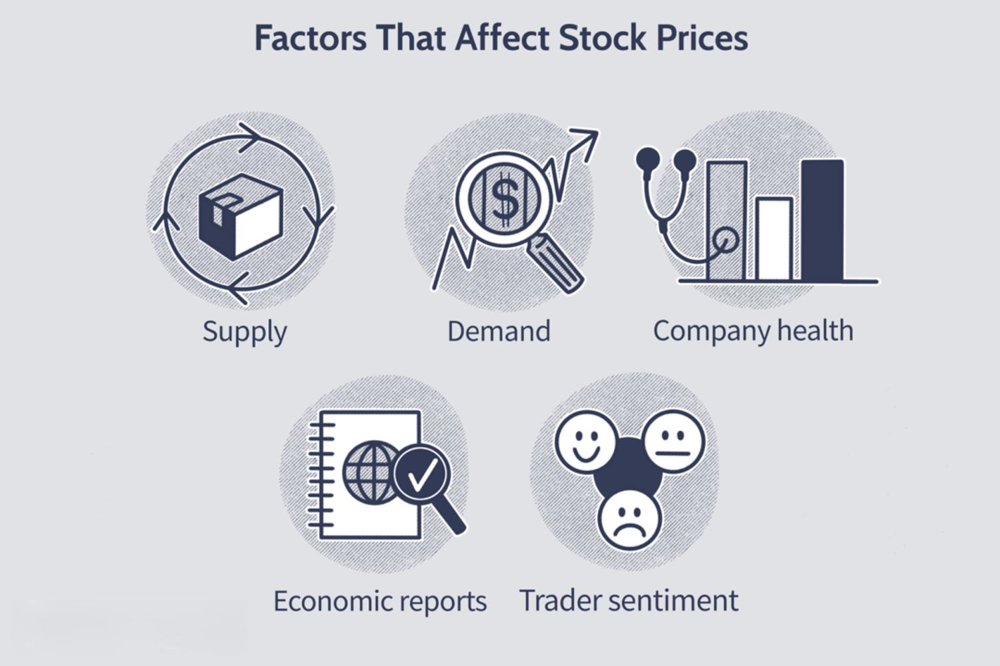

In stock trading, the intricacies of opening and closing prices are pivotal for traders at all levels. These prices serve not only as foundational elements for daily trading strategies but also as indicators of broader market sentiment. The closing price represents the final trading price during regular market hours, providing a snapshot of daily market performance. Meanwhile, the opening price, set by the first trade executed at the market's start, can reveal reactions to news that arose outside of trading hours.

Algorithmic trading, or algo trading, has gained substantial traction in dictating these crucial price points. By employing complex algorithms to automate trading based on pre-set criteria, algo trading influences market movements with incredible speed and precision. Algorithms can swiftly digest and respond to vast quantities of data, establishing them as decisive players in setting opening and closing prices.



This article examines the complex relationship between closing and opening prices, the patterns they form, and the impact of algorithmic trading on these dynamics. Understanding these components is essential for traders looking to optimize their approaches and capitalize on market fluctuations.

## Table of Contents

## Understanding Closing and Opening Prices

In stock trading, the closing price is defined as the last transaction price recorded during standard market hours for a given trading day. This price serves as an essential benchmark, providing traders and analysts with a reference for evaluating market performance, calculating daily returns, and comparing against opening and past closing prices. Closing prices also become focal points in determining market trends and conducting technical analysis, such as moving averages and other indicators.

Conversely, the opening price is derived from the first trade executed at the commencement of a trading day. It encapsulates the investor sentiment from overnight developments, encompassing after-hours trading activities and pertinent global economic events. Both closing and opening prices are vital for forming the price gaps seen at the beginning of each trading day. Such gaps often signal market shifts based on trading volumes and price variations that transpire outside regular trading sessions.

Several factors can affect these prices, with after-hours trading standing out as a significant influence. This period allows investors to react to information released outside standard trading hours, such as earnings reports, economic announcements, or geopolitical occurrences, which may not be priced into the market until the next trading day begins. Additionally, economic indicators, like inflation rates or employment reports, can provoke market participants to adjust their positions, thereby affecting the opening price relative to the prior closing price.

Differences between closing and opening prices often reflect overnight activities and news impacts. They can offer insights into investor expectations and potential market movements. A notable difference between these prices might indicate significant overnight developments that traders need to consider in their daily trading strategies. As these changes manifest, they provide opportunities for traders to assess market sentiment and adjust accordingly. Overall, understanding the closing and opening prices within the broader scope of market data and events is crucial for informed decision-making in stock trading.

## What Affects Stock Prices Between Trading Sessions?

After-hours trading, enabled by electronic communication networks (ECNs), allows investors to respond to news beyond regular market hours. This flexibility is crucial because major company announcements, economic reports, and geopolitical events can occur outside of standard trading times, leading to significant stock price shifts. For instance, a company releasing an earnings report after the market closes can cause its stock price to fluctuate considerably based on the report's contents.

ECNs have democratized access to after-hours trading, allowing more investors to participate. These networks connect buyers and sellers directly without the need for a traditional stock exchange. This increase in participation can enhance market [liquidity](/wiki/liquidity-risk-premium) but also adds to [volatility](/wiki/volatility-trading-strategies) since fewer traders may lead to wider price swings due to lower trading volumes.

Economic indicators released outside normal trading hours, such as unemployment rates, inflation data, or central bank decisions, can influence market sentiment and expectations, causing prices to adjust accordingly upon opening. Geopolitical events, such as elections, international conflicts, or trade negotiations, often have far-reaching effects on markets, influencing stock prices as traders reassess risks and opportunities.

ECNs help bridge the gap between closing and opening prices by facilitating these after-hours transactions, enabling markets to incorporate new information more swiftly and adjusting to potential price disparities caused by overnight developments. This process is part of the broader trend towards continuous trading and market efficiency, highlighting the shifts in traditional trading paradigms due to technological advancements.

## Algorithmic Trading: Definition and Benefits

Algorithmic trading involves using computer algorithms to automate trading processes by executing trades based on predefined parameters. These algorithms can assess numerous market variables, including price, timing, and [volume](/wiki/volume-trading-strategy), with remarkable speed and accuracy.

One of the major benefits of [algorithmic trading](/wiki/algorithmic-trading) is the enhanced execution speed. Algorithms can process large volumes of data and make trading decisions in microseconds. This increased speed provides traders with the advantage of market responsiveness, enabling them to capitalize on price movements as they occur.

Algorithmic trading also minimizes errors associated with manual trading. Human traders are susceptible to emotional and psychological biases that can lead to poor decision-making. Algorithms, however, execute trades based on logical criteria, thus reducing the likelihood of errors.

Moreover, algorithmic trading has the ability to handle extensive trade volumes and implement intricate strategies. Traders can design algorithms to perform simple tasks, such as executing a large order at the close of the market, or complex strategies involving multiple market indicators and variables.

An example of a simple strategy used in algorithmic trading is the [arbitrage](/wiki/arbitrage) strategy, where the algorithm detects and exploits price discrepancies between correlated securities. Consider the Python example:

```python
# Python example for a simple arbitrage algorithm
def detect_arbitrage(asset1_price, asset2_price, threshold):
    if abs(asset1_price - asset2_price) > threshold:
        execute_trade(asset1_price, asset2_price)

def execute_trade(asset1_price, asset2_price):
    print("Executing trade: Buy Asset1, Sell Asset2")
```

Algorithmic trading takes advantage of differences in closing and opening prices to exploit short-term opportunities. Closing prices reflect a 24-hour sentiment on a stock, while opening prices integrate overnight developments such as corporate announcements or geopolitical events. Algorithms can identify and act on these variations, securing profits on the brief disparities between closing and opening prices. This ability to act swiftly on market inefficiencies places algorithmic traders at a strategic advantage.

## The Impact of Algorithmic Trading on Market Prices

Algorithmic trading, particularly high-frequency trading ([HFT](/wiki/high-frequency-trading-strategies)), plays a significant role in shaping both opening and closing stock prices. HFT leverages sophisticated computer algorithms to execute trades at speeds and frequencies much higher than human capability, thus exerting substantial influence on market prices.

The core advantage of algo trading lies in its ability to process vast amounts of data instantaneously, allowing it to react swiftly to market-moving news or data releases. This rapid response capacity enables algorithms to often set the tone for initial trading trends at market open. For instance, overnight economic reports or unexpected geopolitical events can be immediately assessed and acted upon, with orders being placed before human traders have a chance to react. This ability to preemptively engage with market trends can result in a markedly dynamic opening phase, where price gaps between the previous close and the new open are common.

The impact of algorithmic trading on market sessions also manifests through frequent and sometimes significant price volatility at the beginning and end of trading days. Algorithms capitalize on the slightest price differentials by executing numerous trades in fractions of a second. This activity generates a high liquidity environment but can also lead to abrupt price swings. The volatility catalyzed by these rapid trades often provides opportunities for profit, as algorithms exploit short-term inefficiencies in price movements.

In essence, the influence of algorithmic trading is a double-edged sword: it enhances market liquidity and efficiency, yet it also contributes to price volatility, especially around market open and close. This dynamic emphasizes the importance of robust risk management strategies for traders participating in markets heavily influenced by algorithmic activities. By understanding these impacts, traders can better align their strategies to anticipate and capitalize on the price movements induced by algorithmic trading.

## Strategies Leveraging Closing and Opening Prices

Traders employ various strategies to capitalize on the movements between closing and opening prices. One such strategy is the 'closing auction' approach, which focuses on imbalances in market-on-close (MOC) orders. The closing auction is the period at the end of the trading day when final prices are determined, heavily influenced by the supply and demand dynamics from MOC orders. Traders aim to identify and act on the discrepancies between anticipated demand and supply volumes, potentially profiting from the price adjustments required to match the orders. Accurate assessment of these imbalances requires real-time data analysis and the ability to foresee how large institutional orders might move closing prices.

Another prevalent strategy is the 'opening range [breakout](/wiki/breakout-trading)', which leverages the volatility that typically occurs during the initial minutes of a trading session. The opening price is characterized by substantial fluctuations as traders react to news, overnight developments, and updated economic data. The key to this strategy is identifying the 'opening range'—the high and low prices set within the initial minutes of trading—and executing trades based on whether the price breaks above or below this established range. Success in this strategy depends on swift analysis and execution since these breaks can lead to significant price movements.

Effectively implementing these strategies necessitates a deep understanding of market sentiment and the multiple factors that influence closing and opening prices. Traders must consider macroeconomic indicators, geopolitical events, and corporate announcements, all of which can affect trader sentiment and cause abrupt price changes. By analyzing sentiment indicators and news feeds, traders can better predict and react to market behavior, increasing their chances of a successful trade.

Moreover, leveraging algorithmic tools can enhance these strategies by providing rapid computational power to identify and act on opportunities that arise quickly during market transitions. Using algorithms for real-time data analysis and trade execution allows traders to respond to market conditions that are in a constant state of flux. The integration of algorithmic support in strategy execution enables traders to maintain a competitive edge in contemporary trading environments, where speed and precision are paramount for success.

## Risks and Challenges in Algorithmic Trading

Algorithmic trading, despite its numerous benefits, presents several inherent risks and challenges that can impact the stability of financial markets. One significant risk is the possibility of technical failures or algorithmic errors. Given the complexity of algorithms and the technical infrastructure required to execute them, there is always a chance that errors in code, data feed issues, or hardware malfunctions can lead to unintended trading activities. These malfunctioned trades could result in substantial financial losses or disrupt normal market operations.

Market flash crashes exemplify the potential consequences of algorithmic trading gone awry. These events are characterized by dramatic, rapid declines in security prices, typically followed by an equally swift recovery. The May 6, 2010 Flash Crash is a notable example, where the Dow Jones Industrial Average plummeted nearly 1,000 points within minutes, largely driven by algorithmic and high-frequency trading activities. The speed and volume at which algorithmic trades are executed can amplify market volatility, leading to such destabilizing occurrences.

Regulators are increasingly scrutinizing algorithmic trading to mitigate these risks. There is a growing emphasis on ensuring transparency, stability, and fairness in markets heavily influenced by algorithms. Regulatory bodies have introduced measures such as circuit breakers that temporarily halt trading when excessive volatility is detected. Additionally, there are requirements for firms to conduct regular testing and audits of their trading algorithms to prevent errant trading behaviors.

As algorithmic trading continues to evolve, balancing innovation with risk management remains crucial. Traders and firms must ensure robust risk management frameworks are in place to address these challenges, while regulatory oversight adapts to the changing dynamics of modern financial markets.

## Conclusion

The relationship between closing and opening prices is a fundamental aspect for traders trying to grasp market dynamics. These price points serve as indicators of market sentiment and are significant in shaping trading strategies. The closing price reflects the final consensus of value for a stock at the end of a trading day, while the opening price sets the tone for the day ahead, integrating overnight news and events. Understanding these price behaviors enables traders to predict potential market movements and make more informed decisions.

Algorithmic trading is reshaping these traditional trading practices, introducing both opportunities and challenges. By using sophisticated algorithms, traders can now execute high-frequency trades that keenly react to minute market changes, including the gaps between closing and opening prices. This ability offers a chance to capitalize on short-term market inefficiencies and leverage rapid price movements. However, the substantial speed and volume associated with algorithmic trading can also contribute to increased market volatility. It requires traders to not only develop robust algorithms but also to implement stringent risk management strategies in order to mitigate potential pitfalls such as technical failures or flash crashes.

By understanding the interplay between closing and opening prices, alongside the dynamics interwoven by algorithmic trading, traders can enhance their ability to navigate and possibly capitalize on market volatilities. Those equipped with this knowledge can position themselves advantageously, adapting quickly to the ever-evolving landscape of global financial markets. Understanding these aspects isn't just an option for modern traders—it's a necessity to thrive in today's trading environment.

## References & Further Reading

[1]: Bergstra, J., Bardenet, R., Bengio, Y., & Kégl, B. (2011). ["Algorithms for Hyper-Parameter Optimization."](https://papers.nips.cc/paper/4443-algorithms-for-hyper-parameter-optimization) Advances in Neural Information Processing Systems 24.

[2]: ["Advances in Financial Machine Learning"](https://www.amazon.com/Advances-Financial-Machine-Learning-Marcos/dp/1119482089) by Marcos Lopez de Prado

[3]: ["Evidence-Based Technical Analysis: Applying the Scientific Method and Statistical Inference to Trading Signals"](https://www.amazon.com/Evidence-Based-Technical-Analysis-Scientific-Statistical/dp/0470008741) by David Aronson

[4]: ["Machine Learning for Algorithmic Trading"](https://github.com/stefan-jansen/machine-learning-for-trading) by Stefan Jansen

[5]: ["Quantitative Trading: How to Build Your Own Algorithmic Trading Business"](https://www.amazon.com/Quantitative-Trading-Build-Algorithmic-Business/dp/1119800064) by Ernest P. Chan

[6]: Aldridge, I. (2013). ["High-Frequency Trading: A Practical Guide to Algorithmic Strategies and Trading Systems"](https://www.ahmetbeyefendi.com/wp-content/uploads/2020/07/High-Frequency-Trading-Irene-Aldridge.pdf) by Irene Aldridge

[7]: Hendershott, T., Jones, C. M., & Menkveld, A. J. (2011). ["Does Algorithmic Trading Improve Liquidity?"](https://onlinelibrary.wiley.com/doi/full/10.1111/j.1540-6261.2010.01624.x) The Journal of Finance, 66(1), 1-33.