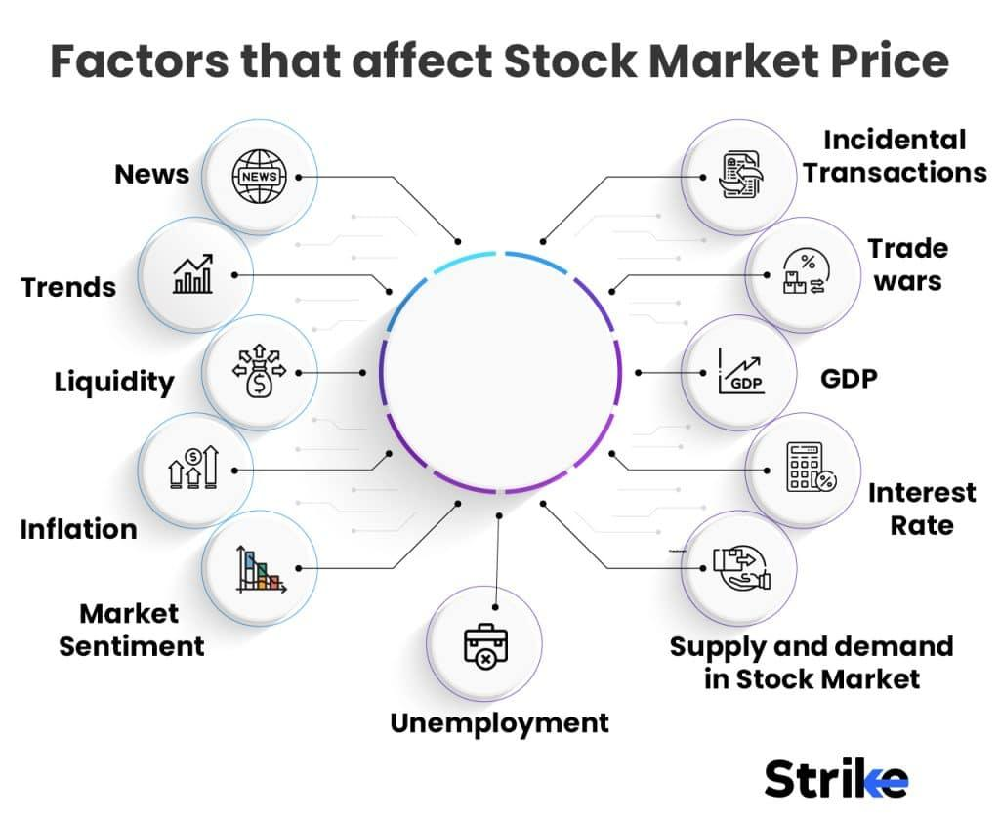

## Table of Contents

## What is stock value and why does it fluctuate?

Stock value, or stock price, is the amount of money it costs to buy one share of a company's stock. When you buy a stock, you are buying a small piece of that company. The stock value is determined by what people are willing to pay for it at any given time. If more people want to buy the stock than sell it, the price goes up. If more people want to sell the stock than buy it, the price goes down.

The stock value fluctuates because many things can affect how people feel about a company and its future. For example, if a company makes more money than expected, people might think it's a good investment and the stock price might go up. On the other hand, if a company has bad news, like losing a big customer or having a product fail, people might think it's a bad investment and the stock price might go down. Other things like the overall economy, interest rates, and even news events can also make the stock value change.

## Can you explain what 'positive news' means in the context of stocks?

Positive news in the context of stocks means any news or information that makes people feel good about a company. This could be things like the company making more money than expected, launching a new popular product, or even getting a new CEO that people think will do a good job. When people hear this kind of news, they might want to buy more of the company's stock because they think the company will do well in the future.

When a lot of people want to buy the stock because of positive news, the price of the stock usually goes up. This is because there are more people wanting to buy than there are people wanting to sell. So, positive news can make the stock value go up, which is good for people who own the stock because their investment becomes worth more money.

## What are some common reasons a stock might decline despite positive news?

Sometimes a stock might go down even when there's good news about the company. This can happen if the overall stock market is doing badly. If people are worried about the economy or other big things happening in the world, they might sell their stocks, even the ones with good news. This means there are more people selling than buying, so the stock price goes down.

Another reason is if the good news was already expected by people. If everyone already thought the company would do well, the stock price might have already gone up before the news came out. So, when the good news is announced, it's not a surprise and the stock price might not go up more. Instead, if people start to think the company won't do as well as they hoped, they might sell the stock, making the price go down.

Lastly, sometimes other news can be more important than the good news about the company. For example, if there's bad news about the company's industry or if something big happens in the world, people might focus on that instead. This can make them sell the stock, even if the company itself had good news, causing the stock price to decline.

## How does market sentiment affect stock prices?

Market sentiment is how people feel about the stock market or a specific stock. If people feel good and think the market or a stock will do well, they are more likely to buy stocks. This makes the stock prices go up because there are more people wanting to buy than sell. On the other hand, if people feel bad and think the market or a stock will do poorly, they might sell their stocks. This makes the stock prices go down because there are more people wanting to sell than buy.

Sometimes, market sentiment can be affected by things like news, economic reports, or even rumors. For example, if there's good news about a company, people might feel more positive and buy more of that company's stock, making the price go up. But if there's bad news, like a company not making as much money as expected, people might feel more negative and sell the stock, making the price go down. Market sentiment can change quickly and can make stock prices move a lot, even if the company itself hasn't changed.

## What role does the broader economic environment play in stock value changes?

The broader economic environment can have a big impact on stock values. If the economy is doing well, people might feel more confident about their jobs and money. They might be more likely to invest in stocks, which can push stock prices up. For example, if there are more jobs and people are [earning](/wiki/earning-announcement) more money, they might have extra money to buy stocks. Also, when the economy is growing, companies usually make more money, which can make people want to buy their stocks.

On the other hand, if the economy is not doing well, people might feel worried about their jobs and money. They might sell their stocks to have more cash, which can push stock prices down. For example, if there's a recession and people are losing jobs, they might need to sell their stocks to pay bills. Also, when the economy is struggling, companies might make less money, which can make people want to sell their stocks. So, the overall health of the economy can make stock prices go up or down.

## How can sector-specific issues impact a stock's performance?

Sector-specific issues can really affect how a stock does. Imagine a company that makes cars. If there's a big problem in the car industry, like a shortage of parts or new rules that make it harder to sell cars, that company's stock might go down. People might not want to buy the stock if they think the car industry is in trouble. So, even if the company itself is doing okay, the stock price can still drop because of what's happening in the whole sector.

Also, good things in a sector can help a stock go up. Let's say there's a new technology that makes solar panels cheaper and better. If a company makes solar panels, its stock might go up because people think the whole solar industry is going to do well. They might want to buy the stock because they think the company will make more money. So, what's happening in the sector can make people feel good or bad about a company's stock.

## What is the impact of company-specific events on stock value?

Company-specific events can really change how much a stock is worth. If a company does something good, like making more money than people thought or coming out with a cool new product, people might want to buy the stock. This makes the stock price go up because more people want to buy it than sell it. For example, if a company says it made a lot more money than last year, people might think it's a good investment and the stock price could go up.

On the other hand, if something bad happens to the company, like losing a big customer or having to pay a lot of money because of a lawsuit, people might want to sell the stock. This can make the stock price go down because more people want to sell than buy. For instance, if a company has to recall a product because it's not safe, people might think the company will lose money and the stock price could go down. So, what happens to the company itself can make a big difference in its stock value.

## How do technical analysis indicators signal potential stock declines?

Technical analysis indicators are tools that help people guess if a stock's price might go down. One common indicator is the moving average. It's like an average price of a stock over a certain time, like 50 days or 200 days. If a stock's price goes below its moving average, it might mean the stock is going to go down more. Another indicator is the Relative Strength Index (RSI). If the RSI is over 70, it means the stock might be too expensive and could go down soon.

Another useful indicator is the MACD, which stands for Moving Average Convergence Divergence. It shows the relationship between two moving averages of a stock's price. If the MACD line crosses below the signal line, it can mean the stock's price might start to go down. Also, chart patterns like head and shoulders or double tops can signal that a stock's price might fall. These patterns show that the stock's price has been going up but might be ready to go down. By watching these indicators, people can try to guess when a stock might decline.

## What are the effects of institutional investor behavior on stock prices?

Institutional investors, like big banks or pension funds, have a lot of money to invest. When they buy or sell a lot of a company's stock, it can really change the stock's price. If a big institutional investor decides to buy a lot of a company's stock, it can make the stock price go up because there are more people wanting to buy than sell. On the other hand, if they decide to sell a lot of the stock, it can make the price go down because there are more people wanting to sell than buy. So, what these big investors do can move the stock price a lot.

Also, when institutional investors make big moves, it can make other people pay attention. If a big investor buys a lot of a stock, other people might think it's a good idea and buy the stock too. This can make the stock price go up even more. But if a big investor starts selling, it can make other people worried and they might sell too, making the stock price go down even more. So, the actions of institutional investors can not only change the stock price right away but also affect what other people do with their investments.

## How do short selling and other trading strategies influence stock value?

Short selling is when someone borrows a stock and sells it, hoping to buy it back later at a lower price to make a profit. If a lot of people are short selling a stock, it can make the stock's price go down. This is because there are more people selling the stock than buying it. Short sellers might do this if they think the company is going to do badly or if they see signs that the stock price is going to drop. When a lot of short selling happens, it can make other people worried and they might sell their stock too, which can make the price go down even more.

Other trading strategies can also affect stock value. For example, some traders use options, which are agreements to buy or sell a stock at a certain price in the future. If a lot of people are buying options that bet on the stock going down, it can make the stock price go down right away. Another strategy is called [momentum](/wiki/momentum) trading, where people buy stocks that are going up and sell stocks that are going down. If a lot of momentum traders start selling a stock, it can make the stock's price drop quickly. So, different trading strategies can push stock prices up or down depending on what traders are doing.

## Can you discuss the role of regulatory changes in stock market dynamics?

Regulatory changes can really shake things up in the stock market. When the government makes new rules or changes old ones, it can affect how companies do business and how investors feel about them. For example, if the government makes new rules that make it harder for a company to make money, like stricter environmental laws, the company's stock price might go down. People might think the company will have a harder time making profits, so they might sell the stock. On the other hand, if the government makes rules that help a company, like tax breaks, the stock price might go up because people think the company will make more money.

These changes can also make the whole market move. If the government changes rules that affect a lot of companies, like new banking regulations, it can make the whole stock market go up or down. For example, if new rules make it easier for banks to lend money, it might make the stock market go up because more people can borrow money to invest. But if the rules make it harder for banks, it might make the stock market go down because people might not be able to borrow as much. So, regulatory changes can have a big impact on how the stock market works and how stock prices move.

## What advanced statistical models are used to predict stock value movements despite positive news?

Advanced statistical models like [machine learning](/wiki/machine-learning) and [artificial intelligence](/wiki/ai-artificial-intelligence) are used to predict stock value movements even when there's good news about a company. These models look at a lot of different things, not just the news. They can study past stock prices, how much people are buying and selling, and even what people are saying on social media. By looking at all this information, these models can find patterns that might not be easy for people to see. They can guess if the stock price might go down even if the news is good, because they see other signs that people might start selling the stock.

For example, a model might use something called sentiment analysis to see if people are talking about the company in a bad way on social media, even if the news is good. Another model might use time series analysis to look at how the stock has moved in the past and predict how it might move in the future. These models can also look at things like how much people are short selling the stock or if there are other big things happening in the economy that might make the stock go down. By putting all this information together, these advanced models can give a better guess about what might happen to the stock price, even when the news seems good.

## References & Further Reading

[1]: Lo, A. W. (2004). ["The Adaptive Markets Hypothesis: Market Efficiency from an Evolutionary Perspective."](https://papers.ssrn.com/sol3/papers.cfm?abstract_id=602222) Journal of Portfolio Management.

[2]: Chordia, T., Roll, R., & Subrahmanyam, A. (2002). ["Order Imbalance, Liquidity, and Market Returns."](https://www.sciencedirect.com/science/article/pii/S0304405X02001368) Review of Financial Studies.

[3]: Carhart, M. M. (1997). ["On Persistence in Mutual Fund Performance."](https://onlinelibrary.wiley.com/doi/full/10.1111/j.1540-6261.1997.tb03808.x) Journal of Finance.

[4]: Jegadeesh, N., & Titman, S. (1993). ["Returns to Buying Winners and Selling Losers: Implications for Stock Market Efficiency."](https://www.bauer.uh.edu/rsusmel/phd/jegadeesh-titman93.pdf) Journal of Finance.

[5]: Barberis, N., & Thaler, R. H. (2002). ["A Survey of Behavioral Finance."](https://www.nber.org/papers/w9222) Handbook of the Economics of Finance.

[6]: Aldridge, I. (2009). ["High-Frequency Trading: A Practical Guide to Algorithmic Strategies and Trading Systems."](https://www.ahmetbeyefendi.com/wp-content/uploads/2020/07/High-Frequency-Trading-Irene-Aldridge.pdf) Wiley. 

[7]: Heston, S. L., & Sinha, N. R. (2017). ["News vs. Sentiment: Predicting Stock Returns from News Stories."](https://papers.ssrn.com/sol3/papers.cfm?abstract_id=2792559) Review of Financial Studies.

[8]: Fama, E. F. (1998). ["Market efficiency, long-term returns, and behavioral finance."](https://www.sciencedirect.com/science/article/pii/S0304405X98000269) Journal of Financial Economics.