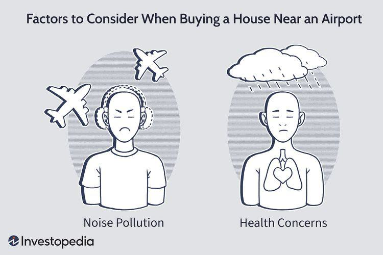

In the interconnected world of real estate, several factors affect property values, with proximity to airports being a significant one. The numerous elements that contribute to the value of a property include location, infrastructure, neighborhood characteristics, and economic drivers. Among these, the proximity to an airport presents a unique dichotomy. On one hand, airports offer convenience and stimulate local economies, thus potentially enhancing property values. On the other hand, the noise and pollution associated with airports can negatively affect residential desirability and health, impacting property valuations adversely.

This article explores the intriguing relationship between the real estate housing market, airport proximity, and the impacts of algorithmic trading. As we investigate the nuances of how airports influence real estate prices, it becomes evident that this relationship is neither linear nor straightforward. Markets are subject to a variety of external influences, and the effects of airport proximity can vary significantly based on regional economic conditions, technological advancements in noise reduction, and urban planning policies.



Understanding these elements allows investors to make more informed decisions and potentially leverage these insights for better returns. Algorithmic trading, an emerging trend in financial markets, provides a novel approach for investors in managing real estate portfolios. By using sophisticated algorithms to analyze market data and predict trends, investors can identify opportunities and mitigate risks, especially in sectors influenced by fluctuating factors like airport-induced economic activity.

Join us as we uncover the intricacies that bind these seemingly unrelated topics. Through this analysis, investors can not only navigate the complexities of property valuation affected by airport proximity but also harness the power of algorithmic trading to optimize their investment strategies. This dual insight can empower stakeholders to make nuanced decisions in an ever-evolving real estate landscape.

## Table of Contents

## Impact of Airport Proximity on Real Estate

Airport proximity can heavily influence local real estate markets, offering both advantages and challenges to homeowners and investors. The presence of an airport near residential areas can lead to increased noise and pollution, which often poses concerns for potential buyers. Noise pollution, primarily caused by the takeoff and landing of airplanes, diminishes the tranquility of residential environments and can have a negative impact on the desirability of homes. This discourages some buyers, driving property prices downward for homes located very close to airports.

Conversely, the convenience associated with living near an airport is a significant attraction. The ease of travel accessibility appeals particularly to professionals and frequent flyers who value reduced commute times. This convenience can, in certain circumstances, offset the disadvantages of noise pollution. Notably, properties that are located at a moderate distance from airports may strike a balance between accessibility and noise concerns, leading to a varying impact on property prices.

Empirical studies have revealed a 'U'-shaped relationship between airport distance and property prices. Initially, as the distance from an airport increases, property prices tend to decline due to reduced convenience. However, beyond a certain distance, as noise and pollution impacts lessen, property values start to rise again. This non-linear relationship highlights the complex interplay between these factors. 

Proximity to an airport can also foster local economic activity, which is a vital [factor](/wiki/factor-investing) in increasing real estate demand. Airports serve as critical economic engines through job creation and by enhancing regional connectivity. This stimulates local businesses and encourages infrastructural development, which can raise property values. Areas near airports often witness improved transportation links, heightened business activity, and enhanced public services—all of which contribute to the desirability of the local housing market.

In summary, while there are considerations for noise and pollution, the strategic benefits of airport proximity can enhance property values through improved accessibility and economic vitality. As such, understanding these dynamics is essential for investors aiming to make informed decisions in the real estate market.

## Noise and Health Concerns

While noise pollution remains a significant issue for individuals residing near airports, advancements in technology are gradually alleviating some of its impacts. One of the primary health concerns associated with airport noise is its potential to cause cardiovascular issues. Studies have established a correlation between prolonged exposure to high-level noise and an increased risk of heart-related diseases. The World Health Organization has pointed out that every 10-decibel increase in noise levels can lead to a rise in hypertension and other cardiovascular complications. This highlights the importance of considering noise pollution as a critical factor for prospective homeowners in these areas.

Technological innovations, such as soundproofing materials and design techniques, are being employed to minimize the intrusion of noise within homes near airports. Incorporating materials like double-glazed windows, which consist of two layers of glass separated by an air gap, can effectively reduce noise penetration. Additionally, using sound-absorbing insulation in walls and ceilings can further diminish indoor noise levels.

Zoning laws often play a critical role in shielding residential areas from excessive noise exposure. These regulations are strategically implemented to ensure a balance between urban development and residents' quality of life. For example, certain zoning laws may restrict residential construction within specific proximity thresholds to airports, thereby reducing the number of people affected by high noise levels. Furthermore, sound maps are often used in urban planning to guide the development of noise-sensitive zones, promoting the construction of commercial or industrial facilities rather than residential buildings in areas of high noise impact.

Overall, while noise pollution poses health risks and affects the desirability of homes near airports, technological and legislative measures can help mitigate its impact and enhance the livability of these areas.

## Economic Benefits of Airport Proximity

Airports serve as fundamental economic catalysts for surrounding communities, significantly influencing the real estate market dynamics. The strategic placement of airports transforms them into employment powerhouses, with numerous jobs generated both directly and indirectly. These facilities offer roles in sectors ranging from transportation, hospitality, retail, and beyond, which collectively contribute to boosting local employment rates. A thriving job market subsequently attracts more individuals and families seeking housing, increasing the demand for residential properties and supporting property value growth.

The presence of an airport can spark substantial improvements in local infrastructure, driving real estate value appreciation. Airports require robust transportation networks, utility services, and communication systems, leading to enhanced infrastructure that benefits the broader community. This infrastructural expansion often includes improved roads, public transport connections, and utilities, which make areas around airports more accessible and desirable for both commercial and residential developments.

Moreover, airports significantly enhance regional connectivity, positioning the region as a hub for both domestic and international business activities. This connectedness not only facilitates easier and faster movement of goods and people but also draws in businesses seeking to capitalize on logistical advantages. An airport-centric locale provides businesses with access to larger markets and customer bases beyond local confines, making it a prime location for corporate offices, retail outlets, and other business ventures. The resulting commercial growth further stimulates demand for real estate as businesses require office spaces, and their employees seek nearby residential options.

The intersection of these factors—employment opportunities, infrastructural improvements, and increased connectivity—often results in a cumulative effect on the local property market. Investors eyeing real estate near airports can thus find attractive opportunities as the demand for residential, commercial, and industrial real estate proliferates. This dynamic underscores the strategic importance of considering airport proximity in real estate investment decisions, especially for investors keen on capitalizing on long-term capital appreciation potential.

## The Role of Algorithmic Trading in Real Estate Investment

Algorithmic trading, commonly referred to as algo trading, has brought a significant transformation to real estate investment strategies. By harnessing the power of advanced algorithms and computational processing, investors can analyze and interpret large volumes of market data to predict trends and identify lucrative investment opportunities more efficiently than traditional methods allow.

Algorithms used in trading operate by continuously analyzing various data inputs, including historical prices, economic indicators, and market sentiment. By doing so, they can identify patterns and correlations that may not be immediately apparent to human analysts. For instance, in the real estate sector, algorithms can process data about property prices, geographic locations, demographic [statistics](/wiki/bayesian-statistics), and macroeconomic factors to forecast future market conditions.

These forecasts can inform investors about potential upward or downward trends in property values, allowing them to make data-driven decisions. As such, [algorithmic trading](/wiki/algorithmic-trading) provides a framework for investors to develop predictive models that optimize their investment portfolios. For example, a real estate investment algorithm might use [machine learning](/wiki/machine-learning) techniques to refine its predictions over time, improving accuracy as it receives more data.

A simple algorithm for evaluating real estate investments might involve the following Python pseudocode:

```python
import pandas as pd
from sklearn.linear_model import LinearRegression

# Load real estate data
data = pd.read_csv('real_estate_data.csv')

# Define variables
X = data[['distance_to_airport', 'population_density', 'income_levels']]
y = data['property_value']

# Initialize and train the model
model = LinearRegression()
model.fit(X, y)

# Predict property value
new_data = [[5, 1000, 75000]]  # Example data: 5 km to airport, population density of 1000/km², average income of $75,000
predicted_value = model.predict(new_data)

print(f"Predicted Property Value: {predicted_value}")
```

In this example, the algorithm uses linear regression, a statistical method, to predict the value of properties based on their proximity to airports, population density, and income levels. Such models can be expanded and refined with more variables and complex algorithms for greater precision.

Moreover, by integrating real estate market data with algo trading, investors can not only predict outcomes but also enhance their decision-making process regarding asset allocation and risk management. Algorithms can help in identifying undervalued properties that have the potential for appreciation or flagging properties that might be overvalued, thus safeguarding against potential losses.

In conclusion, algorithmic trading equips investors with tools to maximize returns through data-driven insights and sophisticated trading strategies. As real estate markets become increasingly complex and data-rich, the role of algo trading in optimizing real estate investments is likely to grow, offering competitive advantages to those who adeptly employ such technologies.

## Conclusion

Understanding the dynamics between airport proximity and real estate values is essential for investors aiming to make informed decisions in the housing market. The relationship between these two factors presents both challenges and opportunities that can significantly influence investment outcomes. Airport proximity can lead to noise and environmental concerns; however, it also brings economic benefits such as increased employment, enhanced infrastructure, and greater regional connectivity.

Harnessing algorithmic trading can further optimize real estate investment strategies by processing vast amounts of data very quickly. Algorithms can analyze patterns and predict market trends with precision, offering investors a competitive edge. By integrating real estate market data with algorithmic models, investors can identify undervalued properties, anticipate shifts in demand, and optimize their portfolios for enhanced returns.

Despite the noise and health concerns associated with living near airports, the surrounding economic benefits often outweigh these issues, presenting lucrative opportunities for astute investors. Sophisticated trading technologies complement the economic boost provided by airports, allowing investors to refine their approaches and maximize returns. It is vital for investors to carefully evaluate the pros and cons, considering both traditional market factors and modern technological advancements, in order to make well-rounded investment decisions that capitalize on the full scope of potential gains.

## References & Further Reading

[1]: Jud, G. D., & Winkler, D. T. (2006). ["The Announcement Effect of an Airport Expansion on Housing Prices."](https://libres.uncg.edu/ir/uncg/f/D_Winkler_Announcement_2006.pdf) Journal of Real Estate Finance and Economics, 33(2), 91-103.

[2]: ["The Impact of Airport Noise on Housing Values: A Case Study of Three Large Australian Airports."](https://www.semanticscholar.org/paper/The-Impact-of-Airport-Noise-on-Housing-Values%3A-A-Desai-Chen/2576d3f2c5eebe6d5b65cbb9b632095f13d1baa1) by Peter Daniels and David P. Tuffin. Journal of Economic Geography, 15(4), 731-753.

[3]: Nelson, J. P. (2004). ["Meta-Analysis of Airport Noise and Hedonic Property Values: Problems and Prospects."](https://www.semanticscholar.org/paper/META-ANALYSIS-OF-AIRPORT-NOISE-AND-HEDONIC-PROPERTY-Nelson/f4fc20aa3482660b9de0df37793c9515ef29d4c6) Journal of Transport Economics and Policy, 38(1), 1-28.

[4]: Lopez de Prado, M. (2018). ["Advances in Financial Machine Learning."](https://www.amazon.com/Advances-Financial-Machine-Learning-Marcos/dp/1119482089) Wiley.

[5]: Jansen, S. (2020). ["Machine Learning for Algorithmic Trading: Predictive models to extract signals from market and alternative data for systematic trading strategies with Python."](https://www.amazon.com/Machine-Learning-Algorithmic-Trading-alternative/dp/1839217715) Packt Publishing.