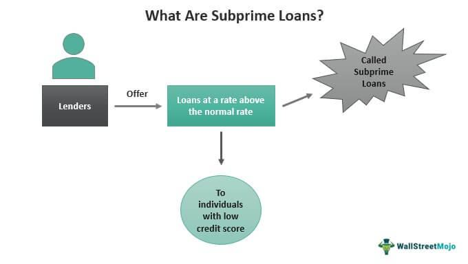

The financial crisis of 2007-2008 marked a significant disruption in the global financial landscape, primarily instigated by the collapse of the subprime mortgage housing bubble. This period is characterized by widespread financial instability, leading to the most severe global economic downturn since the Great Depression. At the heart of this crisis were subprime mortgages, which were extended to borrowers with poor credit histories, increasing their susceptibility to default. Financial institutions significantly contributed to the crisis by creating and heavily investing in mortgage-backed securities, products that promised high returns but also carried substantial risks. These securities were often based on subprime mortgages, leading to a cascading effect when defaults occurred.

Another critical factor was the role of algorithmic trading, which exacerbated market volatility during the crisis. High-frequency trading algorithms prioritized speed and efficiency, inadvertently increasing liquidity issues and market instability. As the housing market peaked and eventually began to decline, financial institutions suffered massive losses due to their reliance on these risky assets. The interconnectedness of global financial markets meant that the crisis quickly spread beyond the United States, leading to a worldwide credit crunch.

Understanding the dynamics of these contributing factors—subprime mortgages, the actions of financial institutions, and the impact of algorithmic trading—is crucial for preventing a similar economic disruption in the future. By examining these elements, policymakers and financial entities can identify strategies to enhance the resilience of financial systems, promote transparent financial practices, and ensure sustainable economic growth.

## Table of Contents

## Understanding Subprime Mortgages

Subprime mortgages played a critical role in precipitating the financial crisis of 2007-2008. These mortgage loans were extended to borrowers with poor credit histories, often marked by low credit scores, limited debt-to-income ratios, or insufficient savings. Due to the higher risk associated with these borrowers, subprime mortgages typically carried higher interest rates compared to prime loans. The objective was to compensate lenders for the increased likelihood of default.

The widespread issuance of subprime mortgages was facilitated by financial innovation and deregulation. Lenders, seeking to capitalize on the seemingly ever-increasing housing market, repackaged these high-risk loans into mortgage-backed securities (MBS). Mortgage-backed securities are financial instruments that pool together various types of debt, including mortgages, and sell shares in the cash flow to investors. This process, known as securitization, allowed lenders to transfer the risk associated with individual loans to a broader range of investors.

A crucial aspect of the securitization process was the creation of tranches, or layers, within the MBS. These tranches were rated differently, with some receiving higher credit ratings despite the risky nature of the underlying subprime mortgages. This high rating falsely assured investors of the security's low risk, encouraging widespread investment across the financial sector. However, the inherent risk did not dissipate; it was merely redistributed across the financial system.

The availability and popularity of subprime loans significantly contributed to the formation of a housing bubble. With more individuals gaining access to credit, the demand for homes surged, driving up housing prices. This increase in home prices created a perception of perpetual growth in the real estate market, further incentivizing speculative investment. The artificially inflated demand, driven by easy access to subprime financing, was unsustainable, setting the stage for an eventual market correction. Consequently, understanding the dynamics and eventual failure of subprime mortgages is key to preventing similar future crises.

## The Housing Bubble's Formation

The formation of the housing bubble in the mid-2000s was significantly influenced by a confluence of factors leading to unsustainable growth in the real estate market. A key driver of the bubble was the continuous rise in home prices, which attracted a large number of buyers and investors into the market. Between 1997 and 2006, the Case-Shiller home price index showed a steady increase in real estate prices, as reported by economists Shiller and others. This sustained growth spurred consumer confidence in real estate as a lucrative investment.

Financial institutions played a crucial role by channeling substantial investments into mortgage-backed securities (MBS). These securities offered attractive returns, primarily due to the diversification of mortgage risk and the inclusion of subprime loans with their higher interest rates. Investment banks and other financial entities viewed MBS as lucrative financial products, leading to a surge in demand and, consequently, a continuous cycle of home financing.

Additionally, the escalation in housing prices encouraged speculative buying, further inflating the bubble. Speculators, driven by the expectation of ever-increasing property values, purchased homes not for personal use but to sell them later at a profit. This behavior added to the artificial demand in the housing market, thus pushing prices higher.

The interconnectedness of these factors created an environment where the housing market appeared robust, while in reality, it was becoming increasingly precarious. The boom in prices was unsustainable, built on the fragile foundation of risky investments and speculative fervor. The eventual stabilization and decline of home prices were inevitable, setting the stage for the broader financial crisis that followed.

## Role of Financial Institutions and Asset-backed Securities

During the financial crisis of 2007-2008, financial institutions played a critical role through the creation and distribution of complex financial products, namely mortgage-backed securities (MBS) and collateralized debt obligations (CDOs). These products were at the heart of the financial system's vulnerabilities that led to the crisis.

Mortgage-backed securities are a type of asset-backed security that is secured by a collection of mortgages. Investment banks and other financial entities bundled numerous home loans into these securities, which were then sold to investors. This process was intended to free up capital for lenders, allowing them to issue additional loans. However, the repackaging of these loans, many of which were subprime with high default risks, created a system heavily reliant on continuous home price appreciation.

Collateralized debt obligations took this concept a step further. CDOs pooled a variety of asset-backed securities, including MBS, and divided them into tranches with varying risk levels and returns. The higher tranches were considered safer and were thus given high credit ratings by rating agencies, often AAA. This high rating was supposed to reflect the low risk of default despite the underlying assets being of questionable quality. The misalignment of risk perception and reality was primarily due to the flawed models and assumptions used by credit rating agencies.

The dependency on these products posed severe risks to financial institutions. As the housing market began to show signs of stress, it became evident that the default rates on the underlying subprime mortgages were higher than anticipated. Financial institutions holding large inventories of MBS and CDOs faced significant losses when these securities plummeted in value. This was compounded by the fact that these products were highly leveraged, amplifying the financial impact as asset values fell.

The entangled nature of financial institutions with these securities led to widespread solvency and [liquidity](/wiki/liquidity-risk-premium) issues. Many institutions were unable to meet their financial obligations as the market for these securities dried up, leading to a crisis of confidence and a subsequent credit crunch. As institutions across the globe had invested in these products, the risks spread internationally, precipitating a worldwide financial crisis.

The role of financial institutions in creating and propagating these complex securities highlights the necessity for more robust risk management and greater oversight in financial product innovation to prevent future systemic risks.

## The Burst of the Bubble

The housing market experienced a critical turning point when property values peaked, leading to stagnation and a subsequent decline. This decline was largely precipitated by the increased default rates on subprime mortgages. As homeowners, many of whom had been granted loans despite poor credit histories, began to default, financial institutions faced significant financial strain. These institutions had heavily invested in mortgage-backed securities that were suddenly losing value as the underlying asset—housing—depreciated.

The chain reaction set off by these defaults had profound implications. Financial institutions, many of which had leveraged their positions in mortgage-backed securities and related derivatives using borrowed funds, faced substantial losses. The losses were exacerbated by the complexity and opacity of these financial products, which masked their inherent risk levels. The resulting financial distress was not confined to the United States but quickly became a global phenomenon, as international banks and investors were also deeply entwined in the mortgage and real estate markets.

A noteworthy aspect of the crisis was the mechanism by which the fallout spread globally, leading to a severe credit crunch. As confidence waned, lending between banks decreased dramatically, and liquidity in financial markets dried up. This was compounded by the interconnectedness of global financial institutions, many of which were caught holding or were directly exposed to toxic assets from the U.S. market. The resulting lack of trust in financial health precipitated a widespread contraction in lending, impacting economies worldwide.

The global credit crunch highlighted the vulnerabilities in the financial system, emphasizing reliance on short-term funding and the intricate network of international finance. As liquidity evaporated, even well-established firms struggled to meet their short-term obligations, leading to broader economic implications. The ripple effects included reductions in consumer spending, cutbacks in industrial production, and ultimately significant declines in GDP across many nations. This underscored the systemic risks posed by financial innovation without corresponding regulatory oversight and stressed the importance of maintaining adequate capital reserves and rigorous risk evaluation procedures in financial operations.

## The Impact of Algorithmic Trading

Algorithmic trading, a method that uses computer algorithms to automate trading decisions, played a significant role in amplifying market [volatility](/wiki/volatility-trading-strategies) during the financial crisis of 2007-2008. High-frequency trading ([HFT](/wiki/high-frequency-trading-strategies)), a subset of [algorithmic trading](/wiki/algorithmic-trading), became particularly prominent due to its capability to execute thousands of orders in milliseconds. While these technologies offered certain efficiencies and liquidity under normal market conditions, they intensified market instability during the crisis.

High-frequency trading algorithms rely on complex mathematical models to determine trading strategies based on market conditions. During the crisis, these algorithms exacerbated liquidity issues by rapidly withdrawing from markets at signs of instability, leading to sharp fluctuations in asset prices. This behavior created a feedback loop, as the rapid price changes caused by one algorithm could trigger others to buy or sell in quick succession, thereby magnifying market movements.

A key mechanism by which algorithmic trading affected markets was through latency [arbitrage](/wiki/arbitrage), where traders use high-speed connectivity to exploit differences in security prices across different markets. The intense speed and [volume](/wiki/volume-trading-strategy) of trading associated with this approach often led to the depletion of available liquidity sources. With traditional market makers retreating amidst heightened volatility, the absence of liquidity providers further stressed the financial markets, contributing to a global credit crunch.

Understanding algorithmic trading's role in financial instability is crucial for developing appropriate regulatory measures. Current regulations focus on improving market resilience by requiring better risk management practices among trading firms. Initiatives include implementing circuit breakers to curb excessive volatility and mandating transparency to monitor algorithmic trade flows.

Future vigilance is necessary to ensure that algorithmic trading systems are designed to enhance, rather than destabilize, market dynamics. While technology can bring efficiencies, unchecked algorithmic trading in high-stakes financial environments underscores the need for well-balanced regulatory oversight to protect market integrity.

## Lessons Learned and Reforms

The financial crisis of 2007-2008 underscored several critical lessons that have since shaped global financial practices and regulatory frameworks. One of the primary takeaways was the urgent need for stricter mortgage lending standards. During the lead-up to the crisis, lax lending practices allowed high-risk borrowers to access credit, significantly contributing to the housing bubble. In response, reforms were instituted to tighten credit assessments and ensure borrowers met more stringent eligibility criteria. This move was essential in curbing the issuance of subprime mortgages, which were central to the crisis.

Additionally, the crisis exposed the lack of transparency in financial products, particularly mortgage-backed securities and collateralized debt obligations. The opacity of these products made it difficult for investors to accurately assess risk, leading to widespread financial instability. Post-crisis reforms have thus emphasized the necessity for greater transparency within financial markets. Regulations such as the Dodd-Frank Wall Street Reform and Consumer Protection Act in the United States were established to improve the clarity of financial products and enhance the disclosure requirements for complex securities.

Enhancing risk management and regulatory oversight became another focus area for reform. Financial institutions have been encouraged to adopt more comprehensive risk management frameworks to better identify and mitigate potential threats. Moreover, regulatory bodies such as the Financial Stability Oversight Council (FSOC) were created to monitor systemic risks and ensure that no entity or activity poses a threat to the financial system’s stability.

Collaboration between policymakers and financial institutions is crucial in addressing systemic risks. The interconnected nature of modern financial systems requires coordinated efforts to prevent the kind of cascading failures experienced during the crisis. Thus, continuous dialogue and cooperation have been encouraged to develop policies that balance innovation with safety and soundness.

Overall, the reforms initiated in the wake of the 2007-2008 crisis aim to build a more resilient and transparent financial system. Stricter standards, improved risk management, and enhanced regulatory oversight all contribute to reducing the likelihood of similar crises in the future.

## Conclusion

The 2007-2008 financial crisis was a watershed event that revealed the complex interconnections between housing markets and financial systems globally. At its core, the crisis highlighted inherent vulnerabilities precipitated by risky lending practices and the proliferation of sophisticated financial instruments like mortgage-backed securities (MBS) and collateralized debt obligations (CDOs).

The crisis underscored the critical need for vigilance concerning subprime lending. Subprime mortgages were a significant trigger, as they were extended to borrowers with inadequate credit histories, leading to unsustainable levels of default when the housing bubble burst. The repackaging of these high-risk loans into opaque financial products resulted in widespread systemic risk, underscoring the necessity for stricter mortgage lending regulations and lending transparency.

Furthermore, algorithmic trading played a substantial role in exacerbating market instability during the crisis. High-frequency trading (HFT) algorithms, programmed to execute trades at lightning speed, contributed to increased market volatility and liquidity challenges. Proper regulation of these automated trading systems is crucial to preventing similar upheaval in the future. Implementing comprehensive oversight ensures these algorithms enhance market efficiency rather than undermine it.

In response to the crisis, numerous reforms have been instituted to bolster financial stability, focusing on risk management and regulatory oversight. These measures are indispensable for mitigating systemic risks and fostering a resilient financial system. The lessons drawn from the crisis reinforce the vital importance of sustainable financial practices that prioritize transparency, accountability, and prudent risk management. These elements are fundamental to maintaining economic equilibrium and preventing the recurrence of such disruptive financial catastrophes.

## References & Further Reading

[1]: Shiller, R. J. (2008). ["The Subprime Solution: How Today's Global Financial Crisis Happened, and What to Do about It."](https://www.economist.com/media/pdf/subprime_solution_schiller_.pdf) Princeton University Press.

[2]: Lewis, M. (2011). ["The Big Short: Inside the Doomsday Machine."](https://books.google.com/books/about/The_Big_Short_Inside_the_Doomsday_Machin.html?id=eParwQ0YdrcC) W. W. Norton & Company.

[3]: Gorton, G. B. (2010). ["Slapped by the Invisible Hand: The Panic of 2007."](https://papers.ssrn.com/sol3/papers.cfm?abstract_id=1401882) Oxford University Press.

[4]: Acharya, V. V., & Richardson, M. (Eds.). (2009). ["Restoring Financial Stability: How to Repair a Failed System."](https://onlinelibrary.wiley.com/doi/book/10.1002/9781118258163) Wiley Finance.

[5]: Rebonato, R. (2010). ["Copulas Made Simple: Insights from Theory and Examples in Less Than 90 Pages."](https://link.springer.com/book/10.1007/0-387-28678-0) Springer.