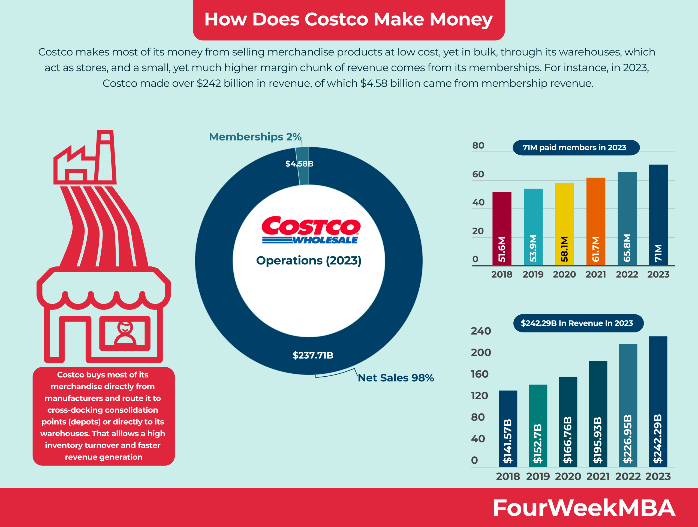

This article aims to explore the remarkable business success of Costco, focusing on the company's strengths and how these insights can inform algorithmic trading strategies. As a leading wholesale retailer, Costco has consistently demonstrated a robust business model characterized by stable revenue streams, customer loyalty, and efficient operations. Understanding and analyzing such a successful business model is crucial, not only for strategic business planning but also for making informed financial investments. By studying Costco's fundamental business principles, investors and analysts can glean insights that are applicable to broader financial strategies, particularly within algorithmic trading.

Algorithmic trading, which involves the use of computer algorithms to execute trades based on predefined criteria, can greatly benefit from the insights derived from successful business models like Costco's. The synergy between business operations and algorithmic trading lies in the potential to leverage data-driven strategies for mutual benefits. By integrating aspects of Costco’s business operations—such as customer loyalty, supply chain efficiency, and cost-effective practices—into trading algorithms, one can potentially enhance decision-making processes and optimize trading outcomes.



The intersection of Costco's business strategies and algorithmic trading exemplifies the potential for cross-disciplinary applications in the financial sector. This approach not only offers a framework for developing predictive trading models but also emphasizes the importance of continuous adaptation and learning from successful businesses in shaping effective investment practices. Through this exploration, the article encourages the application of strong, proven business principles to create robust and responsive trading strategies.

## Table of Contents

## Costco's Business Model: The Foundation of Success

Costco Wholesale Corporation operates on a distinctive membership-based business model that has become the cornerstone of its success. This model provides Costco with a stable and predictable revenue stream, as members pay an annual fee for the privilege of shopping at Costco stores. According to Costco's financial reports, membership fees account for a significant portion of the company's profitability, allowing the company to operate on thin margins while still ensuring steady income. This structure not only incentivizes members to maximize their membership value by purchasing in bulk but also fosters customer loyalty as members become habituated to the Costco experience.

A crucial aspect of Costco’s model is its commitment to low prices and bulk sales, which are central to its competitive pricing power. By offering products in large quantities at reduced prices, Costco attracts cost-conscious consumers who seek value for their money. This approach not only allows Costco to maintain a competitive edge over other retailers but also enhances its bargaining power with suppliers, enabling it to secure products at lower costs. The company’s ability to keep prices low has cultivated a loyal customer base that frequently returns for high-quality products at unbeatable prices.

In addition to its membership and pricing strategies, Costco provides ancillary services that add substantial value to its members. These services include pharmacy options, optical services, gas stations, and travel offerings, which are designed to enhance the overall Costco membership experience. By bundling these value-added services with their core retail offerings, Costco effectively increases customer retention and engagement. The variety of services means members have multiple touchpoints that encourage frequent interactions with the brand, thereby reinforcing loyalty. 

Moreover, Costco leverages its ancillary services to create a comprehensive shopping experience that goes beyond traditional retail, making its membership model even more attractive. This holistic approach not only contributes to Costco’s revenue through diversified streams but also solidifies its position as a multifaceted retail giant in a competitive business landscape.

## Strengths of Costco's Business Strategy

Costco's business strategy is renowned for its strong brand reputation and effective utilization of economies of scale, which collectively contribute to cost efficiency and market dominance. One of the primary strengths of Costco is its ability to harness economies of scale by leveraging its massive buying power to negotiate lower prices from suppliers. These savings are passed on to consumers, reinforcing Costco’s image as a low-cost provider and fostering customer loyalty. The company’s vast network of warehouses, strategically located across various regions, further supports cost efficiency by optimizing distribution logistics and reducing transportation costs.

Another pivotal aspect of Costco's strategy is its efficient supply chain management. Costco maintains an inventory system that minimizes overhead by keeping only fast-selling products. This strategy reduces storage costs and ensures a quick turnover, keeping the inventory fresh and relevant to consumer needs. Additionally, Costco's relationships with suppliers are founded on long-term partnerships, which enable streamlined processes and mutual benefits in cost and operational efficiencies. 

Employee satisfaction is another distinguishing [factor](/wiki/factor-investing) in Costco's business strategy. The company is committed to paying above-average wages and offering comprehensive benefits, which results in low employee turnover and high levels of productivity and morale. Employees who are satisfied and motivated contribute to a positive customer experience, which is critical for maintaining Costco's reputation as a trusted brand. This focus on employee welfare not only enhances customer service but also reduces costs associated with hiring and training new staff.

Costco’s private label, Kirkland Signature, plays a crucial role in establishing brand trust and customer loyalty. By offering a wide range of quality products under the Kirkland Signature label, Costco differentiates itself in the competitive retail market. The label ensures consistent quality at lower prices compared to national brands, which strengthens consumer trust and encourages repeat purchases. In 2021, Kirkland Signature accounted for approximately one-third of Costco's sales, underscoring its importance to the company's overall strategy.

In summary, the strengths of Costco's business strategy are rooted in its robust brand reputation, economies of scale, efficient supply chain management, and commitment to employee satisfaction. The success of Kirkland Signature further exemplifies Costco's adeptness at cultivating a loyal customer base through quality and value, solidifying its position as a leader in the retail industry.

## Challenges and Opportunities in the Retail Landscape

Costco's business model, while robust, is not without its challenges. One prominent weakness is the limited variety of products offered due to the company's strategic focus on a narrow selection of high-quality goods. This approach, while fostering operational efficiency and cost savings, can alienate a segment of consumers who value diversity and choice. Additionally, Costco's heavy reliance on membership fees as a source of revenue presents a vulnerability; any dip in membership renewals or new subscriptions could significantly impact financial performance. 

External threats are also significant, with fierce competition from retail giants such as Amazon and Walmart. Amazon's dominance in online retail, characterized by its vast product range and rapid delivery services, poses a substantial challenge to Costco's traditional warehouse-club format. Similarly, Walmart, with its expansive physical and digital footprint, can leverage its buying power to offer competitive prices, directly challenging Costco's pricing strategy.

Despite these challenges, there are substantial opportunities for Costco. Expanding its digital presence is imperative, as e-commerce continues to grow rapidly. Developing a more robust online platform could enhance customer convenience and attract a broader audience. Furthermore, global market penetration presents a considerable growth opportunity. By expanding into emerging markets, Costco could tap into new consumer bases and diversify its revenue streams, mitigating risks associated with domestic market saturation.

In conclusion, while Costco faces notable challenges, strategic initiatives focusing on digital expansion and international growth present viable pathways to enhance its competitive position in the retail industry.

## Algorithmic Trading: Learning from Costco's Success

Algorithmic trading, a method that employs computer algorithms to execute a large number of trade orders in financial markets, thrives on the analysis of large datasets to identify profitable trading opportunities. This methodology can significantly benefit from insights derived from robust business models like Costco's, which offer lessons in stability, efficiency, and customer engagement.

Costco's success is partly attributed to its strong brand loyalty and the massive amount of customer data it generates from its membership model. Algorithmic trading can leverage such data to better predict market behavior. By analyzing trends in customer loyalty, trading algorithms can hone in on stocks associated with high levels of consumer retention, thus identifying corporations with stable growth potential. This stability is attractive as it typically correlates with reduced [volatility](/wiki/volatility-trading-strategies) in stock performance. A predictive model might incorporate customer spending patterns, purchasing frequency, and membership renewal rates to gauge brand strength, which can then be extrapolated to assess market confidence in related stock valuations.

Furthermore, Costco's low-price, bulk sales strategy highlights another key element: risk minimization through cost efficiency. Algorithmic trading strategies that intend to minimize risk can draw parallels from this model. Portfolio diversification strategies might focus on companies that exemplify cost leadership and efficient operational models, akin to Costco. By modeling a portfolio that balances high-yield, high-risk investments with stable, low-risk entities that practice cost control measures, one can achieve a stabilized return profile. 

Below is a simplified example of how such strategies can be implemented in Python:

```python
import numpy as np
import pandas as pd

# Example stock data
data = {'Stock': ['Stock_A', 'Stock_B', 'Stock_C'],
        'Loyalty_Index': [0.8, 0.6, 0.9],  # Hypothetical index representing brand loyalty
        'Risk': [0.2, 0.4, 0.1]}  # Risk associated with each stock based on historical data

df = pd.DataFrame(data)

# Function to calculate portfolio allocation based on loyalty and risk
def allocate_portfolio(df):
    # Normalize loyalty index
    df['Loyalty_Index'] = df['Loyalty_Index'] / df['Loyalty_Index'].sum()

    # Allocate more to stocks with high loyalty index and lower risk
    df['Allocation'] = df['Loyalty_Index'] * np.exp(-df['Risk'])
    df['Allocation'] /= df['Allocation'].sum()  # Normalize allocations

    return df

portfolio = allocate_portfolio(df)
print(portfolio)
```

This example illustrates a basic mechanism for weighting stocks within a portfolio focusing on loyalty index as a proxy for stability, adjusted by the inverse of risk. It ensures that higher allocations are given to stocks that exhibit a robust brand presence and lower associated risk, much like Costco's approach to maintaining cost efficiencies and customer loyalty.

In summary, insights from successful business models provide valuable data points and principles that can be mapped into [algorithmic trading](/wiki/algorithmic-trading) strategies, emphasizing stability, risk management, and consumer engagement.

## Synergizing Business Operations with Algorithmic Trading

The convergence of business operations and algorithmic trading offers a compelling opportunity to capitalize on market trends. Successful retailers like Costco provide valuable case studies in operational efficiency and customer engagement, elements that can be extrapolated to refine trading strategies. Algorithmic trading relies on data-driven decision-making, where insights drawn from Costco’s operational excellence can serve as inputs to model market behavior effectively.

Costco's disciplined, efficient operations are characterized by strategic inventory management, limited SKU assortments, and robust supplier relationships. These elements drive cost efficiency and customer satisfaction, leading to consistent revenue streams. In algorithmic trading, a similar disciplined approach is necessary. Algorithms could be designed to mimic this efficiency by setting strict entry and [exit](/wiki/exit-strategy) points, reducing transaction costs, and ensuring optimal allocation of resources. For instance, traders might use large datasets to find statistical inefficiencies that mirror Costco’s ability to leverage economies of scale. A mathematical model referencing Costco’s pricing power might express this as:

$$
\text{Profit} = P \times (Q - C)
$$

Where $P$ is the average price level establishing competitive pricing, $Q$ denotes quantity sold, and $C$ represents cost efficiency achieved by Costco.

Continuous learning and adaptation are crucial in both business operations and trading strategies to maintain a competitive edge. Costco’s adaptability to consumer trends and market dynamics ensures long-term growth, which algorithmic trading can emulate via [machine learning](/wiki/machine-learning) algorithms. These algorithms can adapt to new data inputs rapidly, improving predictive accuracy for future market conditions.

In Python, a basic example to implement a learning mechanism could use a [reinforcement learning](/wiki/reinforcement-learning) model, which dynamically adjusts strategies based on market feedback:

```python
import numpy as np

class TradingStrategy:
    def __init__(self):
        self.position = 0

    def update_position(self, market_data):
        decision = np.sign(np.dot(market_data, self.learning_weights))
        self.position += decision
        self.learn_from_market(market_data)

    def learn_from_market(self, market_data):
        # Logic to update learning weights based on feedback from market data
        self.learning_weights += learning_rate * market_data * (self.position - np.dot(market_data, self.learning_weights))
```

In this code snippet, `market_data` acts as input similar to consumer data that informs Costco's operations. The `update_position` method takes a disciplined trading stance akin to Costco's strategies, while the `learn_from_market` method exemplifies continuous adaptation.

Ultimately, harnessing the principles of successful operations like those at Costco to inform algorithmic trading can lead to robust trading strategies that are not only efficient but also adaptable to changing market conditions. The synergy between these domains fosters a holistic approach to market engagement, ensuring sustained competitive advantages.

## Conclusion

Costco's business model offers valuable insights for enhancing algorithmic trading strategies. By analyzing its strengths, traders can gain a deeper understanding of how robust business practices translate into financial success. Costco’s membership-based model ensures a stable revenue stream, fostering customer loyalty and repeat business. This approach can be mirrored in trading strategies that prioritize long-term investments and a loyal client base, potentially leading to more stable financial outcomes.

The company's focus on low prices and bulk sales contributes to its competitive edge, as it attracts price-sensitive consumers and encourages larger purchase volumes. In algorithmic trading, similar principles can be applied by adopting strategies that minimize transaction costs and maximize trading [volume](/wiki/volume-trading-strategy) efficiency, optimizing the overall profitability of trades. For instance, using bulk data transactions or consolidating trades to achieve economy of scale in trading execution can enhance cost efficiency.

Costco's brand reputation and supply chain management are pivotal in maintaining its market position. Algorithmic trading can learn from Costco's disciplined operations by employing predictive models that integrate brand strength and consumer behavior, enabling more informed decision-making. Using historical data and machine learning algorithms, traders can predict stock movements, factoring in brand performance metrics and consumer trends.

Additionally, Costco’s private label strategy with Kirkland Signature exemplifies how a strong brand can foster customer loyalty and trust. In trading, a focus on developing proprietary indicators or trading signals can create a competitive advantage, akin to Costco's private label success. This can involve developing algorithms that leverage exclusive market insights or datasets to inform trading decisions.

In conclusion, the principles underlying Costco's business success emphasize the value of incorporating strong business models into financial practices. These insights suggest that by leveraging strategies from successful business operations, traders can potentially enhance their trading systems, improve decision-making, and achieve more consistent returns. This approach advocates for continuous exploration and integration of effective business strategies, highlighting the interconnected nature of disciplined business management and strategic financial investments.

## References & Further Reading

[1]: Bergstra, J., Bardenet, R., Bengio, Y., & Kégl, B. (2011). ["Algorithms for Hyper-Parameter Optimization."](https://papers.nips.cc/paper/4443-algorithms-for-hyper-parameter-optimization) Advances in Neural Information Processing Systems 24.

[2]: ["Advances in Financial Machine Learning"](https://www.amazon.com/Advances-Financial-Machine-Learning-Marcos/dp/1119482089) by Marcos Lopez de Prado

[3]: ["Evidence-Based Technical Analysis: Applying the Scientific Method and Statistical Inference to Trading Signals"](https://books.google.com/books/about/Evidence_Based_Technical_Analysis.html?id=MeoJAQAAMAAJ) by David Aronson

[4]: ["Machine Learning for Algorithmic Trading"](https://github.com/stefan-jansen/machine-learning-for-trading) by Stefan Jansen

[5]: ["Quantitative Trading: How to Build Your Own Algorithmic Trading Business"](https://www.amazon.com/Quantitative-Trading-Build-Algorithmic-Business/dp/1119800064) by Ernest P. Chan