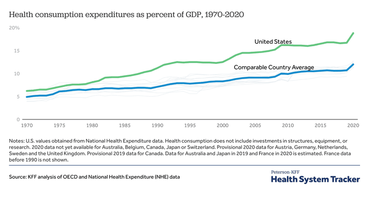

In the United States, healthcare costs have long been a subject of concern, as they are among the highest globally, placing substantial economic demands on individuals and the nation. According to the Centers for Medicare & Medicaid Services (CMS), healthcare expenditures reached $3.8 trillion in 2019, representing nearly 18% of the GDP.[^1] These elevated costs can be attributed to a multifaceted system where various factors converge, making navigation and management increasingly challenging for policymakers, healthcare providers, and consumers seeking to alleviate financial strain.

The U.S. operates a healthcare system characterized by its diversity in insurance coverage, consisting of private plans, employer-based plans, and government programs such as Medicare and Medicaid. This complexity contributes to administrative burdens and inefficiencies, further inflating costs.[^2] Consumer costs, including premiums, deductibles, and out-of-pocket expenses, remain significant obstacles to access and affordability.

Moreover, a distinct yet related economic element influences this scenario: algorithmic trading. This technology-driven practice utilizes algorithms to execute trades at speeds beyond human capability, thereby reshaping market dynamics.[^3] Algorithmic trading is pivotal in the financial sector, affecting economic health on a broader scale, including how healthcare funds are managed and allocated. Financial markets' movements, driven by algorithmic trading, can alter interest rates, investment portfolios, and public sector budgets, indirectly impacting healthcare financing.

Through examining these intricate relationships, it becomes apparent that understanding healthcare expenditure requires a comprehensive view of its primary cost drivers alongside the financial forces at play in modern markets.

[^1]: Centers for Medicare & Medicaid Services. (2019). National Health Expenditure Data. 
[^2]: Blanchfield, B. B., & Hefferman, J. (2010). Saving billions of dollars—and physicians’ time—by streamlining billing practices. *Health Affairs*.
[^3]: Hendershott, T., & Riordan, R. (2011). Algorithmic Trading and Information. *Division of Economic and Risk Analysis*.

## Table of Contents

## Factors Driving Healthcare Costs in the United States

The U.S. healthcare system is characterized by its inherent complexity and the numerous interacting components that contribute to its high costs. Among the primary factors are:

### Multiple Systems

The healthcare landscape in the United States comprises a multitude of diverse systems with distinct rules, funding mechanisms, and costs. This fragmentation leads to increased administrative expenses as each system—whether private insurance, Medicare, or Medicaid—requires its own billing and paperwork processes. The complexity of navigating these systems adds overhead costs, which are eventually passed on to consumers.

### Rising Drug Costs

Americans pay significantly more for pharmaceutical drugs compared to individuals in other developed nations. This is largely a consequence of the lack of regulation in pricing, coupled with market-driven forces. Unlike many other countries where governments negotiate or control drug prices, U.S. drug prices are primarily influenced by what the market will bear, leading to higher costs for consumers.

### Higher Salaries

Medical professionals in the United States, especially physicians, command higher salaries than their counterparts in other countries. This is partly driven by the high cost of medical education and the need to repay substantial student loans. Additionally, the demand for medical services and limited supply of professionals contribute to elevated salary levels, which are a significant [factor](/wiki/factor-investing) in the overall cost of healthcare.

### Profit-Driven Hospitals

Hospitals in the U.S. often operate as profit-driven entities, focusing on financial performance as a key metric. This emphasis on profitability can lead to higher service charges, particularly for inpatient care, which is substantially more expensive in the U.S. than in other countries. The need to generate profits can result in prioritizing high-revenue services and procedures, driving up costs without necessarily correlating to higher-quality care.

### Defensive Medical Practices

Healthcare providers in the United States frequently engage in defensive medicine—ordering unnecessary tests and procedures as a legal safeguard against potential malpractice suits. While intended to protect medical practitioners, this practice often incurs unnecessary costs without improving patient outcomes, thereby contributing to the overall healthcare expenditure.

### Varying Pricing

The absence of standardized pricing in the U.S. healthcare system allows providers to charge different rates for the same services. This lack of price transparency leads to significant discrepancies, with patients often facing vastly different charges for identical procedures based on their geographical location, the facility they visit, or their insurance coverage. As a result, consumers may struggle to make informed decisions regarding their healthcare, contributing to broader economic inefficiencies. 

Addressing these factors is crucial for policymakers and stakeholders aiming to mitigate financial burdens while improving healthcare accessibility and efficiency.

## Algorithmic Trading and Its Economic Impact

Algorithmic trading, an automated process that utilizes computer algorithms to execute trades on financial markets at high speed, has become a dominant force in modern trading environments. This technological advancement offers several key economic impacts, particularly in terms of enhancing market [liquidity](/wiki/liquidity-risk-premium), introducing market [volatility](/wiki/volatility-trading-strategies), and affecting national budgets, including those earmarked for healthcare funding.

**Enhanced Liquidity:** Algorithmic trading significantly increases the frequency and volume of trades, thereby improving market liquidity. Liquidity refers to the ease with which assets can be bought or sold in the market without affecting their price. When markets are liquid, they operate more efficiently, facilitating smoother transactions and potentially stabilizing pricing mechanisms. For national budgets, improved liquidity means better management of public funds, as government bonds and securities can be traded more efficiently. This efficiency extends to healthcare funding, where rapid and cost-effective trading can help allocate resources more dynamically, potentially leading to optimized healthcare financing.

**Market Volatility:** Despite its advantages, algorithmic trading also introduces higher levels of volatility to financial markets. Algorithms can execute trades in milliseconds, reacting instantly to market conditions or external data inputs. While this responsiveness can be beneficial, it also leads to rapid fluctuations in asset prices, contributing to increased market instability. Volatility can affect economic stability, influencing investor confidence and making future economic outcomes harder to predict. For healthcare financing, this instability might result in unpredictable funding allocations, as fluctuating market conditions can impact the financial resources available for public health programs and initiatives.

**Effect on National Budgets:** The broader financial landscape is shaped significantly by algorithmic trading, which influences how national resources are allocated. Governments rely on stable financial markets to manage their budgets effectively, and algorithmic trading's impact on liquidity and volatility directly affects this stability. Efficient algorithmic trading enhances the fiscal capacity to allocate resources where they are most needed, including healthcare. Conversely, excessive volatility can challenge budget predictability, potentially constraining healthcare funding. Policymakers must thus consider the implications of algorithmic trading when designing economic and budgetary strategies, ensuring that public sector funding, such as healthcare, is safeguarded against market-induced financial disruptions.

In conclusion, while [algorithmic trading](/wiki/algorithmic-trading) offers benefits in terms of speed and liquidity, it also presents challenges related to volatility and economic stability. Understanding its impacts is essential for crafting policies that promote effective healthcare financing and overall economic resilience.

## The Interplay of Healthcare Costs and Algorithmic Trading

Healthcare funding and algorithmic trading manifest a complex interplay, significantly impacting public sector budgets and healthcare allocations in the United States. The dynamics of this relationship stem from the influence algorithmic trading has on economic stability and how it can affect the allocation of funds, including those dedicated to healthcare.

Algorithmic trading, characterized by high-frequency transactions executed through intricate algorithms, has the potential to affect market liquidity and volatility. Enhanced liquidity brought on by increased trading volumes can, in theory, stabilize markets and positively impact national budgets by creating a conducive environment for investment and economic growth. This environment can benefit public sectors reliant on budget allocations, such as healthcare, by potentially providing more robust funding through increased economic activity and tax revenues.

Conversely, the rapid transactions inherent in algorithmic trading can introduce significant volatility in financial markets. Such volatility poses risks to economic stability, as sudden market shifts can lead to broader economic disruptions. These disruptions may necessitate reallocating public funds to stabilize critical sectors, potentially diverting resources away from healthcare or leading to funding uncertainties. For example, a market downturn influenced by volatile trading could compel policymakers to redirect funds toward economic recovery efforts, impacting scheduled healthcare allocations.

The intersection of algorithmic trading and healthcare funding requires nuanced policy approaches from stakeholders. Regulatory frameworks that balance the benefits of increased liquidity with the risks of market volatility are essential to protecting public interests. Policymakers must ensure that algorithmic trading mechanisms operate transparently and that they incorporate safeguards to mitigate market instability. Additionally, there is a need for strategic coordination between financial regulators and healthcare policymakers. Such collaboration can help anticipate financial developments that might affect healthcare funding and create strategies to manage these impacts effectively.

In summary, as algorithmic trading continues to evolve and exert influence over financial markets, its role in shaping public funding landscapes, including healthcare, becomes increasingly significant. Policymakers and stakeholders must work collaboratively to understand these dynamics and mitigate risks, ensuring that healthcare funding remains stable and sufficient amid changing economic conditions.

## Challenges and Opportunities

Addressing high healthcare costs in the United States necessitates strategic policy interventions that leverage both technological advancements and international collaboration. These approaches offer viable opportunities to enhance the efficiency and sustainability of healthcare systems.

**Technological Advancements:** The integration of digital health technologies has the potential to significantly enhance healthcare delivery and cost management. Technologies such as telemedicine, electronic health records (EHRs), and artificial intelligence (AI) are transforming how healthcare services are provided. Telemedicine, for instance, reduces the necessity for physical visits, thereby lowering overhead costs for providers and travel expenses for patients. EHRs streamline patient data management, reducing administrative burden and minimizing errors. Moreover, AI applications in diagnostics can lead to early detection of diseases, decreasing the need for costly treatments at advanced stages. Implementing value-based care models, which focus on patient outcomes rather than service volume, is another promising strategy. By incentivizing healthcare providers based on the quality of care they provide, these models can drive down costs while improving patient outcomes.

**Global Cooperation:** International collaboration offers substantial opportunities to optimize healthcare systems through shared learning and resources. Countries around the world face similar challenges in cost management and healthcare delivery; hence, exchanging successful strategies can be beneficial. For example, many European countries have successfully implemented universal healthcare systems that control costs effectively, which can provide valuable insights for U.S. policymakers. Moreover, global partnerships in pharmaceutical research and vaccine development can lead to cost reductions through economies of scale. Collaborative efforts in combating global health threats also highlight the necessity for cohesive international action, with shared resources mitigating individual country expenditures.

In conclusion, leveraging technological innovation and fostering global cooperation are pivotal strategies in managing rising healthcare costs. Embracing these opportunities can lead to more sustainable and equitable healthcare systems capable of meeting future challenges.

## Concluding Thoughts

Optimizing healthcare spending in the United States while acknowledging the broader economic influences of algorithmic trading is essential for achieving an efficient and equitable healthcare system. Understanding the intricate web of factors that elevate healthcare costs—from administrative complexities, unregulated pharmaceutical pricing, and the high remuneration of medical professionals, to the profit-oriented nature of hospitals—offers a foundation for actionable insights. Engaging with these insights, policymakers and healthcare providers can work towards reducing financial strains on individuals and the nation.

Algorithmic trading, with its profound influence on financial market dynamics, adds an additional layer of complexity to healthcare financing. It offers both opportunities and challenges, such as improved market liquidity and potential volatility, which can impact economic stability and resource allocation for healthcare. Addressing these factors requires a comprehensive approach that considers the interaction between healthcare provision and financial market movements.

By strategically managing healthcare costs and examining their intersection with algorithmic trading, stakeholders can better plan for future financial sustainability. This approach not only promises to uphold the accessibility of healthcare services but also ensures that advancements in financial and healthcare technologies contribute positively to the nation's economic health. Continued cooperation among policymakers, healthcare administrators, and financial experts is necessary to foster a system where economic and healthcare objectives align, ultimately benefiting the population.

## References & Further Reading

[1]: Centers for Medicare & Medicaid Services. (2019). ["National Health Expenditure Data."](https://www.cms.gov/data-research/statistics-trends-and-reports/national-health-expenditure-data)

[2]: Blanchfield, B. B., & Hefferman, J. (2010). ["Saving billions of dollars—and physicians’ time—by streamlining billing practices."](https://pubmed.ncbi.nlm.nih.gov/20430822/) Health Affairs.

[3]: Hendershott, T., & Riordan, R. (2011). ["Algorithmic Trading and Information."](https://www.jstor.org/stable/43303831) Division of Economic and Risk Analysis, SEC.

[4]: Himmelstein, D. U., et al. (2014). ["A comparison of hospital administrative costs in eight nations: US costs exceed all others by far."](https://pubmed.ncbi.nlm.nih.gov/25201663/) Health Affairs.

[5]: Orszag, P. R., & Emanuel, E. J. (2010). ["Health care reform and cost control."](https://www.nejm.org/doi/full/10.1056/NEJMp1006571) New England Journal of Medicine.

[6]: Frakt, A. B. (2014). ["The elasticity of demand for health care: a review of the literature and its application to the military health system."](https://www.rand.org/pubs/monograph_reports/MR1355.html) Health Affairs.

[7]: Lopez de Prado, M. (2018). ["Advances in Financial Machine Learning."](https://www.amazon.com/Advances-Financial-Machine-Learning-Marcos/dp/1119482089) Wiley.

[8]: Chan, E. P. (2009). ["Quantitative Trading: How to Build Your Own Algorithmic Trading Business."](https://github.com/ftvision/quant_trading_echan_book) Wiley.