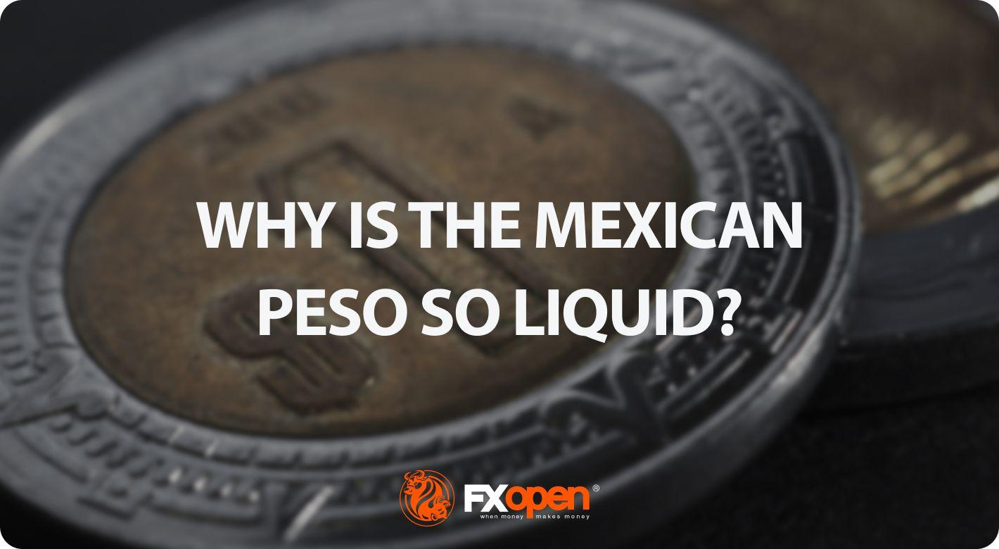

## Table of Contents

## What is liquidity in the context of currency?

Liquidity in the context of currency refers to how easily you can buy or sell a currency without affecting its price. If a currency is very liquid, it means there are a lot of people and businesses wanting to trade it, so you can quickly exchange it for another currency or use it to buy things without waiting or causing big price changes.

For example, the US dollar is very liquid because it's used all over the world. You can easily exchange dollars for euros or yen, and the price won't change much because so many people are trading dollars every day. On the other hand, a currency from a small country might not be as liquid. If you try to exchange a lot of that currency at once, it might be hard to find someone to trade with, and the price could change a lot.

## Why is the liquidity of the Mexican peso important?

The liquidity of the Mexican peso is important because it affects how easily people and businesses can use it for trading and investing. If the peso is liquid, it means there are many people and businesses wanting to buy and sell it. This makes it easier for someone in Mexico to buy things from other countries or for someone from another country to invest in Mexico. When a currency is liquid, it helps the economy grow because it makes trading smoother and more predictable.

On the other hand, if the Mexican peso is not very liquid, it can cause problems. It might be hard for businesses to get the pesos they need to buy things or pay workers. It can also make it harder for people to exchange pesos for other currencies, like dollars or euros, which they might need for travel or buying things from other countries. A less liquid peso can make the economy less stable and can make it harder for Mexico to trade with other countries.

## What are the basic economic factors affecting the liquidity of the Mexican peso?

The liquidity of the Mexican peso is affected by several basic economic factors. One big factor is the overall health of the Mexican economy. If the economy is doing well, with businesses making money and people having jobs, more people will want to use the peso. This makes it easier to buy and sell the peso, increasing its liquidity. Another factor is the interest rates set by the Bank of Mexico. If interest rates are high, it can attract more foreign investors who want to put their money in Mexican banks or buy Mexican bonds. More investors mean more people wanting to buy pesos, which also helps with liquidity.

Another important factor is how much Mexico trades with other countries. If Mexico exports a lot of goods, like cars or oil, to other countries, it means more foreign money is coming into Mexico. This can increase the demand for pesos, making it more liquid. On the other hand, if Mexico imports a lot, it might need to use more of its pesos to buy things from other countries, which can affect the peso's liquidity. Finally, the stability of the Mexican government and its policies can also play a role. If people trust the government and think it's doing a good job, they'll be more likely to use and hold onto pesos, which helps keep the currency liquid.

## How does the Mexican government's monetary policy influence the peso's liquidity?

The Mexican government's monetary policy, which is managed by the Bank of Mexico, has a big impact on the peso's liquidity. One way it does this is by setting interest rates. If the Bank of Mexico raises interest rates, it can make the peso more attractive to foreign investors. They might want to put their money in Mexican banks or buy Mexican bonds because they can earn more interest. More investors wanting to buy pesos means the currency becomes more liquid because there are more people trading it.

Another way the Mexican government's monetary policy affects the peso's liquidity is through managing the money supply. If the government decides to print more pesos, it can make the currency less liquid. When there are more pesos in circulation, each peso might be worth less, and people might not want to hold onto them. This can make it harder to buy and sell pesos quickly without affecting the price. On the other hand, if the government keeps the money supply stable, it can help keep the peso's value steady and make it easier for people to trade it, increasing its liquidity.

## What role does the Bank of Mexico play in managing the peso's liquidity?

The Bank of Mexico plays a big role in managing the peso's liquidity. One way it does this is by setting interest rates. If the Bank of Mexico raises interest rates, it can make the peso more attractive to foreign investors. They might want to put their money in Mexican banks or buy Mexican bonds because they can earn more interest. More investors wanting to buy pesos means the currency becomes more liquid because there are more people trading it.

Another way the Bank of Mexico manages the peso's liquidity is by controlling the amount of money in circulation. If the Bank prints more pesos, it can make the currency less liquid. When there are more pesos around, each peso might be worth less, and people might not want to hold onto them. This can make it harder to buy and sell pesos quickly without changing the price. By keeping the money supply stable, the Bank of Mexico can help keep the peso's value steady and make it easier for people to trade it, increasing its liquidity.

## How do international trade relationships impact the liquidity of the Mexican peso?

International trade relationships have a big impact on the liquidity of the Mexican peso. When Mexico exports a lot of goods, like cars or oil, to other countries, it means more foreign money is coming into Mexico. This can increase the demand for pesos because people in other countries need to buy pesos to pay for Mexican goods. More demand for pesos makes it easier to trade them, which means the peso becomes more liquid. On the other hand, if Mexico imports a lot, it might need to use more of its pesos to buy things from other countries. This can decrease the demand for pesos and make it harder to trade them quickly, reducing their liquidity.

The stability and strength of Mexico's trade relationships also play a role. If Mexico has strong and stable trade agreements with big economies like the United States, it can make the peso more attractive to investors. People and businesses from other countries might feel more confident about putting their money into Mexico if they know the trade relationships are stable. This can increase the demand for pesos and improve their liquidity. If trade relationships are weak or unstable, it can make investors nervous, and they might not want to hold onto pesos, which can hurt the currency's liquidity.

## What effect do foreign investments have on the liquidity of the Mexican peso?

Foreign investments can make the Mexican peso more liquid. When people from other countries want to invest in Mexico, they need to buy pesos to do it. This means more people are trading pesos, which makes it easier to buy and sell them. If a lot of foreign money comes into Mexico because of investments, it can make the peso more popular and easier to trade. This is good for the peso's liquidity because more people wanting to trade it means the price stays stable and it's easier to exchange.

But, if foreign investors suddenly decide to take their money out of Mexico, it can hurt the peso's liquidity. When investors pull their money out, they need to sell their pesos to get their money back in their own currency. If a lot of people try to sell pesos at the same time, it can be hard to find buyers, and the price of the peso might go down. This can make the peso less liquid because it's harder to trade it without affecting the price. So, while foreign investments can help the peso's liquidity, they can also make it less stable if the investments are not steady.

## How does the stability of the Mexican economy contribute to the peso's liquidity?

The stability of the Mexican economy is really important for the peso's liquidity. When the economy is doing well, with businesses making money and people having jobs, more people want to use the peso. This makes it easier to buy and sell the peso because there are a lot of people trading it. A stable economy also means that people trust the peso more. They are more likely to keep their money in pesos instead of changing it to another currency, which helps keep the peso liquid.

But if the Mexican economy is not stable, it can hurt the peso's liquidity. If businesses are struggling and people are losing their jobs, fewer people might want to use the peso. This can make it harder to trade the peso because there are fewer people wanting to buy it. Also, if people don't trust the economy, they might want to change their pesos to a different currency, like dollars. This can make the peso less liquid because it's harder to find people who want to trade it.

## What are the impacts of global economic conditions on the liquidity of the Mexican peso?

Global economic conditions can have a big effect on the liquidity of the Mexican peso. When the world economy is doing well, more people and businesses from other countries might want to invest in Mexico. They need pesos to do this, so more people are buying and selling pesos. This makes the peso more liquid because it's easier to trade. Also, if other countries are buying a lot of things from Mexico, like cars or oil, they need pesos to pay for these goods. This increases the demand for pesos and helps keep them liquid.

But if the global economy is not doing well, it can hurt the peso's liquidity. When other countries are struggling, they might not want to invest in Mexico or buy as many Mexican goods. This means fewer people need pesos, so it can be harder to trade them. Also, if people in other countries are worried about their own economies, they might not want to hold onto pesos. They might try to change their pesos to another currency, like dollars, which can make the peso less liquid because there are fewer people wanting to trade it.

## How do speculative activities in the forex market affect the liquidity of the Mexican peso?

Speculative activities in the forex market can really affect how easy it is to buy and sell the Mexican peso. When people speculate, they are betting on whether the peso will go up or down in value. If a lot of people think the peso will go up, they will buy more pesos. This makes the peso more liquid because more people are trading it. But if everyone suddenly thinks the peso will go down, they might all try to sell their pesos at the same time. This can make it harder to trade pesos because there are a lot of people trying to sell and not enough people wanting to buy, which can make the peso less liquid.

These speculative activities can also make the value of the peso change a lot. If the value of the peso goes up and down a lot, it can make people nervous. They might not want to hold onto pesos because they are worried about losing money. This can make the peso less liquid because fewer people want to trade it. On the other hand, if the peso's value stays pretty steady, people might feel more comfortable using it, which can help keep the peso liquid. So, the way people speculate in the forex market can have a big impact on how easy it is to trade the Mexican peso.

## What advanced financial instruments are used to manage the liquidity of the Mexican peso?

One advanced financial instrument used to manage the liquidity of the Mexican peso is currency swaps. A currency swap is like a deal where two parties agree to exchange pesos for another currency, like dollars, at a set rate for a certain time. This can help keep the peso liquid because it makes it easier for people to trade pesos without worrying too much about the price changing. The Bank of Mexico might use currency swaps to make sure there are always enough pesos around for people to use, which helps keep the economy running smoothly.

Another tool is forward contracts. These are agreements to buy or sell pesos at a future date for a price that's set today. Forward contracts can help businesses and investors feel more sure about trading pesos because they know what the price will be later. This can make more people want to use pesos, which helps keep them liquid. The Bank of Mexico and other financial institutions can use forward contracts to help control how many pesos are being traded and make sure there's enough liquidity in the market.

## How can predictive models and economic indicators be used to forecast changes in the liquidity of the Mexican peso?

Predictive models and economic indicators can help forecast changes in the liquidity of the Mexican peso by looking at different pieces of information that might affect how easy it is to trade the peso. For example, economic indicators like the unemployment rate, inflation, and interest rates in Mexico can show if the economy is doing well or not. If the economy is strong, more people might want to use the peso, making it more liquid. Predictive models use these indicators to guess what might happen in the future. They can look at past data to find patterns and use math to predict if the peso will be easier or harder to trade in the coming months.

Another way to forecast changes in the peso's liquidity is by looking at global economic conditions and international trade data. If big countries like the United States are doing well and buying a lot from Mexico, it can make the peso more liquid because more people need pesos to pay for Mexican goods. Predictive models can use this information to guess how much demand there will be for pesos in the future. They can also look at things like foreign investment and speculative activities in the forex market to see if more people will want to buy or sell pesos. By putting all this information together, predictive models can give a good idea of how the liquidity of the Mexican peso might change.

## How do higher interest rates affect carry trade?

Mexico's [interest rate](/wiki/interest-rate-trading-strategies) landscape is characterized by comparatively higher rates than those found in the United States. This differential attracts a substantial amount of foreign capital, particularly in the form of the [carry](/wiki/carry-trading) trade. In essence, carry trade involves borrowing money in a currency with low-interest rates and investing it in a currency offering higher rates, profiting from the interest rate differential.

Two main factors contribute to Mexico's elevated interest rates: domestic economic policy and inflation management. Mexican authorities often set higher rates to control inflation and attract foreign investment, which strengthens the Peso by increasing demand. These higher yields on Mexican government bonds and other financial instruments present an appealing opportunity for investors looking for higher returns.

The profitability of engaging in a carry trade with the Mexican Peso can be primarily expressed by the interest rate differential between Mexico and the borrowing country, typically the United States. The potential profit (P) can be estimated using:

$$
P = (i_{MXN} - i_{USD}) \times \text{Investment amount} - \text{Transaction Costs}
$$

where $i_{MXN}$ is the interest rate in Mexico, and $i_{USD}$ is the interest rate in the United States. However, this straightforward approach is moderated by the inherent risk of currency volatility. The USD/MXN exchange rate fluctuations can significantly impact the carry trade's profitability. If the Peso weakens against the USD during the investment period, any gains from the interest rate differential could be negated or even result in losses when converting back to USD.

Investors must employ risk management strategies like hedging through derivatives or maintaining diversified portfolios to mitigate these risks. While the Mexican Peso's higher interest rates can offer lucrative returns, the associated [volatility](/wiki/volatility-trading-strategies) requires careful consideration and strategic planning to avoid potential financial pitfalls.

## References & Further Reading

[1]: Brière, M., Chapelle, A., & Szafarz, A. (2012). ["No contagion, only globalization and flight to quality."](https://www.sciencedirect.com/science/article/abs/pii/S0261560612000757) Journal of International Money and Finance, 31(6), 1729-1757.

[2]: ["Carry Trade and Emerging Markets: The Mexican Peso and the US Dollar"](https://www.bloomberglinea.com/english/mexicos-super-peso-is-no-longer-the-most-attractive-carry-trade-in-latam/) by Leonardo Gambacorta and David López-Salido

[3]: Lopez, J. A. (2001). ["Exchange Rate Stabilization and the Mexican Peso."](https://www.sciencedirect.com/science/article/pii/S0304387800001310) The Journal of Finance, 56(2), 555-576.

[4]: ["The Mexican financial system: reforms and evolution"](https://www.bis.org/publ/bppdf/bispap28s.pdf) by Alberto Ize, Journal of Banking & Finance, 2003

[5]: ["Advances in Financial Machine Learning"](https://www.amazon.com/Advances-Financial-Machine-Learning-Marcos/dp/1119482089) by Marcos Lopez de Prado

[6]: ["Official website of the Office of the United States Trade Representative"](https://ustr.gov/)

[7]: Menkhoff, L., Sarno, L., Schmeling, M., & Schrimpf, A. (2012). ["Carry Trades and Global Foreign Exchange Volatility."](https://onlinelibrary.wiley.com/doi/abs/10.1111/j.1540-6261.2012.01728.x) The Review of Financial Studies, 25(3), 793-822.