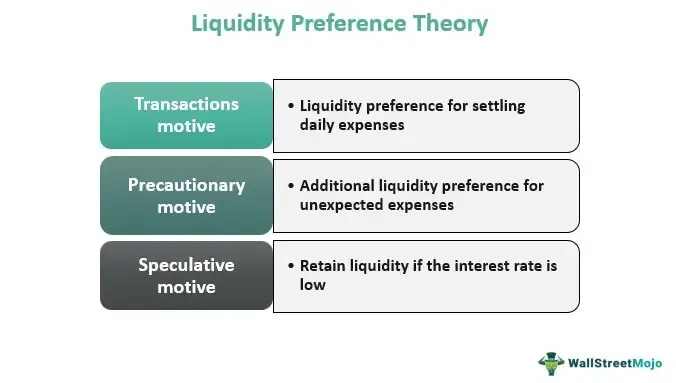

The financial markets offer a diverse range of opportunities for both individual and institutional investors. Among these opportunities, the Mexican Peso (MXN) stands out due to its significant liquidity and the pivotal role it plays in the global foreign exchange market. As one of the most actively traded emerging market currencies, the Peso's liquidity is a key factor that attracts traders and investors worldwide.

The Mexican Peso's substantial liquidity can be attributed to several interrelated factors. Firstly, Mexico's relatively higher interest rates compared to developed economies such as the United States make the Peso an attractive candidate for carry trade strategies. In a carry trade, investors profit from the interest rate differential between two currencies, borrowing in a low-interest-rate currency and investing in a high-interest-rate currency like the MXN. This strategy can boost the demand for the Peso, thus enhancing its liquidity.



Geographically, Mexico's proximity to the United States has fostered strong trade relationships, further increasing the Peso's accessibility in the financial markets. This proximity is reinforced by trade agreements, such as the United States-Mexico-Canada Agreement (USMCA), which bolster economic ties and promote cross-border trade. These factors collectively contribute to the Peso's significant trading volume and liquidity.

Additionally, Mexico's role as a major oil producer links the Peso's liquidity to global crude oil prices. Fluctuations in oil prices can directly impact Mexico's economic health and subsequently influence the liquidity of its currency. During periods of high oil prices, Mexico experiences an economic boost, which can lead to an increase in Peso liquidity as international investors seek exposure to Mexican markets.

Algorithmic trading has become increasingly prevalent in foreign exchange markets, including trading the Mexican Peso. The adoption of advanced algorithms allows traders to capitalize on market liquidity and volatility more effectively. Algorithmic trading enhances price discovery and market efficiency, further solidifying the Peso's position in the global forex landscape.

In summary, the Mexican Peso plays a crucial role in the global financial markets, with its liquidity supported by factors such as interest rate differentials, strong trade relationships, and its link to oil production. The growing adoption of algorithmic trading also contributes to its dynamic presence in the forex market, providing a rich terrain for investment and trading activities.

## Table of Contents

## The Mexican Peso in the Global Economy

The Mexican Peso (MXN) stands as a prominent emerging market currency, frequently ranked among the most traded currencies worldwide. This status can be attributed to various factors intrinsic to Mexico's economic landscape and external global economic trends. As of 2020, the Mexican Peso was recognized as the 15th most traded currency in the [forex](/wiki/forex-system) market, underscoring its significant presence on the global stage. The stability and [liquidity](/wiki/liquidity-risk-premium) of the Peso are deeply interconnected with Mexico's economic policies, trade activities, and broader global financial developments.

Mexico's economic conditions heavily influence the liquidity of the Peso. The nation's macroeconomic policies, including fiscal discipline and the implementation of structural reforms, enhance investor confidence, thereby increasing the Peso's attractiveness. Moreover, Mexico's robust trade activities, notably with the United States, further solidify the Peso's liquidity. This significant trade [volume](/wiki/volume-trading-strategy) ensures a steady demand and supply for the currency, contributing to its stable standing in the foreign exchange markets.

The Peso also mirrors global economic patterns. During periods of global economic expansion, emerging market currencies like the Mexican Peso often present lucrative growth opportunities for investors seeking higher yields in a low-interest-rate environment. Investors typically gravitate towards these markets during economic upturns, driven by the potential for returns that outweigh those available in developed economies. This shift enhances the liquidity and, consequently, the marketability of such currencies.

In summary, the Mexican Peso's pivotal role in the global economy is bolstered by the interplay of Mexico's domestic economic strategies and global economic trends. The currency offers growth opportunities linked to emerging markets and remains a critical component of international trade and investment portfolios, especially during periods of economic growth.

## Higher Interest Rates and Carry Trade

Mexico's [interest rate](/wiki/interest-rate-trading-strategies) landscape is characterized by comparatively higher rates than those found in the United States. This differential attracts a substantial amount of foreign capital, particularly in the form of the [carry](/wiki/carry-trading) trade. In essence, carry trade involves borrowing money in a currency with low-interest rates and investing it in a currency offering higher rates, profiting from the interest rate differential.

Two main factors contribute to Mexico's elevated interest rates: domestic economic policy and inflation management. Mexican authorities often set higher rates to control inflation and attract foreign investment, which strengthens the Peso by increasing demand. These higher yields on Mexican government bonds and other financial instruments present an appealing opportunity for investors looking for higher returns.

The profitability of engaging in a carry trade with the Mexican Peso can be primarily expressed by the interest rate differential between Mexico and the borrowing country, typically the United States. The potential profit (P) can be estimated using:

$$
P = (i_{MXN} - i_{USD}) \times \text{Investment amount} - \text{Transaction Costs}
$$

where $i_{MXN}$ is the interest rate in Mexico, and $i_{USD}$ is the interest rate in the United States. However, this straightforward approach is moderated by the inherent risk of currency volatility. The USD/MXN exchange rate fluctuations can significantly impact the carry trade's profitability. If the Peso weakens against the USD during the investment period, any gains from the interest rate differential could be negated or even result in losses when converting back to USD.

Investors must employ risk management strategies like hedging through derivatives or maintaining diversified portfolios to mitigate these risks. While the Mexican Peso's higher interest rates can offer lucrative returns, the associated [volatility](/wiki/volatility-trading-strategies) requires careful consideration and strategic planning to avoid potential financial pitfalls.

## Proximity to the United States and Trade Relationships

Mexico's geographical proximity to the United States plays a pivotal role in shaping its economic and trading dynamics. This proximity facilitates extensive trade relationships, significantly impacting the liquidity of the Mexican Peso (MXN). The geographical closeness not only reduces transportation costs but also enhances bilateral trade efficiency, making the United States Mexico's most significant trading partner. According to data from the Office of the United States Trade Representative, in 2019, Mexican-American trade amounted to $614.5 billion, highlighting the profound interdependence between the two economies.

Trade agreements, such as the United States-Mexico-Canada Agreement (USMCA), are central to strengthening these commercial ties. Implemented on July 1, 2020, the USMCA replaced the North American Free Trade Agreement (NAFTA) and aimed to enhance economic integration and fairness in trade among the three countries. The agreement encompasses areas such as automotive manufacturing, digital trade, labor conditions, and environmental protections, which collectively serve to increase trade predictability and stability. This predictability is crucial in enhancing the liquidity of the Mexican Peso, as it encourages cross-border investments and financial transactions.

However, trade policies are not static, and shifts can lead to increased volatility in the USD/MXN exchange rate. Policy changes could result from economic policies, political shifts, or changes in leadership in either country. Such shifts may introduce uncertainty, affecting the currency's liquidity as investors and businesses adjust their strategies in response to new trade regulations or tariffs. The uncertainty often results in increased hedging activities among businesses and investors to mitigate potential currency risks.

In summary, Mexico's trade relationship with the United States is fundamental to the liquidity and stability of the Mexican Peso. A stable and predictable trade environment fostered by agreements like the USMCA supports the Peso's robustness in the global financial market. However, potential volatility in trade policies necessitates continuous monitoring and strategic adjustment by market participants.

## Crude Oil's Influence on the Peso

As a major oil producer, Mexico's economy and currency are heavily influenced by [crude oil](/wiki/crude-oil) prices. The Mexican Peso often sees increased liquidity in times of rising oil prices due to the enhanced revenue potential from oil exports, which bolsters the country's trade balance and economic standing. High crude oil prices can lead to a stronger Peso, as they increase the influx of foreign currency into Mexico, improving the nation's foreign reserves and reducing the need for external borrowing.

The relationship between oil prices and the Peso is complex and influenced by numerous market factors. For example, when global oil prices climb, it generally results in a positive impact on Mexico's growth, leading to a potentially stronger currency. This is because the revenues from oil exports constitute a significant portion of national income, contributing to governmental fiscal stability and attracting foreign investment.

However, the volatility in oil prices represents a double-edged sword for investors dealing in Mexican Pesos. Sudden declines in oil prices can lead to adverse economic conditions, prompting depreciation of the Peso. This volatility can deter investors, particularly those engaged in carry trade strategies, where currency values are crucial for maintaining profitable positions. A sharp drop in oil prices could decrease foreign investment, as the anticipated returns become uncertain.

Moreover, fluctuations in oil prices not only affect foreign investors but also impact domestic economic policies. The Mexican government might need to adjust fiscal policies, influencing interest rates and foreign exchange regulations, to stabilize economic fluctuations caused by oil price changes. Consequently, traders and investors need to be acutely aware of global oil market trends when engaging with the Mexican Peso, as these trends can either enhance or diminish their returns based on the direction and magnitude of oil price movements. 

Interestingly, [algorithmic trading](/wiki/algorithmic-trading) in forex markets, including the Mexican Peso, factors this volatility into its models, allowing traders to quickly respond to changes in oil prices, thus maintaining liquidity and market efficiency even during periods of financial uncertainty.

## Algorithmic Trading in the Mexican Peso Market

Algorithmic trading has gained significant traction in modern forex markets, and trading the Mexican Peso (MXN) is no exception. The deployment of algorithms allows traders to navigate the complexities of the forex market with greater precision and speed. By utilizing complex mathematical models and computational algorithms, traders can effectively capitalize on the liquidity and volatility characteristic of the Mexican Peso market. This approach not only optimizes trading strategies but also enhances the predictability of price movements.

The implementation of algorithmic trading in the MXN market typically involves strategies such as statistical [arbitrage](/wiki/arbitrage), [trend following](/wiki/trend-following), and [market making](/wiki/market-making). Statistical arbitrage, for example, uses historical price data to identify and exploit pricing inefficiencies. Trend-following strategies rely on algorithms to detect and capitalize on market [momentum](/wiki/momentum), while market-making algorithms continuously provide buy and sell quotes, thus increasing liquidity.

Python, with its robust libraries such as pandas, NumPy, and scikit-learn, offers a powerful toolkit for developing trading algorithms. For instance, traders might use a simple moving average crossover strategy in Python:

```python
import pandas as pd

# Load historical MXN data
prices = pd.read_csv('mxn_data.csv')

# Calculate moving averages
short_window = 40
long_window = 100

prices['short_mavg'] = prices['Close'].rolling(window=short_window, min_periods=1).mean()
prices['long_mavg'] = prices['Close'].rolling(window=long_window, min_periods=1).mean()

# Trading signal
prices['signal'] = 0
prices['signal'][short_window:] = \
    np.where(prices['short_mavg'][short_window:] > prices['long_mavg'][short_window:], 1, 0)

# Generate the trading orders
prices['positions'] = prices['signal'].diff()
```

Algorithmic trading enhances price discovery by ensuring that prices reflect all available information more rapidly than traditional trading methods. This leads to narrower bid-ask spreads and a more efficient market overall. Moreover, algorithmic trading minimizes human emotional intervention, providing more consistent and objective trading decisions. As a result, the increased volume and participation associated with algorithmic trading contribute to the overall liquidity of the Mexican Peso, strengthening its role in global financial markets.

## Conclusion: Financial Markets and the Mexican Peso

The Mexican Peso remains a crucial element in financial markets, primarily because of its significant liquidity and the dynamic nature of its market environment. The factors that influence its standing include interest rates, trade relations, and commodity prices, particularly oil. Higher interest rates in Mexico serve to attract foreign investments, leading to increased demand for the Peso. This condition frequently attracts carry trade investors who seek to capitalize on interest rate differentials between countries.

Trade relationships further strengthen the Peso's liquidity. Mexico's proximity to the United States and robust trade agreements such as the United States-Mexico-Canada Agreement (USMCA) solidify its trading ties, subsequently increasing liquidity in the MXN currency. Conversely, changes in trade policies can cause fluctuations in the USD/MXN exchange rate, adding a layer of complexity for investors.

Commodity pricing, especially of crude oil, significantly affects the Peso. As a major oil-exporting nation, Mexico's fiscal health and currency valuation are sensitive to fluctuations in oil prices. Higher oil prices typically enhance the Peso's liquidity, while price declines pose challenges to stability and trading conditions.

Algorithmic trading plays a pivotal role in heightening the trading activity and market participation involving the Mexican Peso. The use of sophisticated algorithms allows traders to efficiently navigate and exploit both liquidity and market volatility, leading to more accurate price discovery and increased market efficiency. As algorithmic trading continues to evolve, it ensures that the Peso maintains a strong presence in the global trading landscape.

## References & Further Reading

[1]: Brière, M., Chapelle, A., & Szafarz, A. (2012). ["No contagion, only globalization and flight to quality."](https://www.sciencedirect.com/science/article/abs/pii/S0261560612000757) Journal of International Money and Finance, 31(6), 1729-1757.

[2]: ["Carry Trade and Emerging Markets: The Mexican Peso and the US Dollar"](https://www.bloomberglinea.com/english/mexicos-super-peso-is-no-longer-the-most-attractive-carry-trade-in-latam/) by Leonardo Gambacorta and David López-Salido

[3]: Lopez, J. A. (2001). ["Exchange Rate Stabilization and the Mexican Peso."](https://www.sciencedirect.com/science/article/pii/S0304387800001310) The Journal of Finance, 56(2), 555-576.

[4]: ["The Mexican financial system: reforms and evolution"](https://www.bis.org/publ/bppdf/bispap28s.pdf) by Alberto Ize, Journal of Banking & Finance, 2003

[5]: ["Advances in Financial Machine Learning"](https://www.amazon.com/Advances-Financial-Machine-Learning-Marcos/dp/1119482089) by Marcos Lopez de Prado

[6]: ["Official website of the Office of the United States Trade Representative"](https://ustr.gov/)

[7]: Menkhoff, L., Sarno, L., Schmeling, M., & Schrimpf, A. (2012). ["Carry Trades and Global Foreign Exchange Volatility."](https://onlinelibrary.wiley.com/doi/abs/10.1111/j.1540-6261.2012.01728.x) The Review of Financial Studies, 25(3), 793-822.