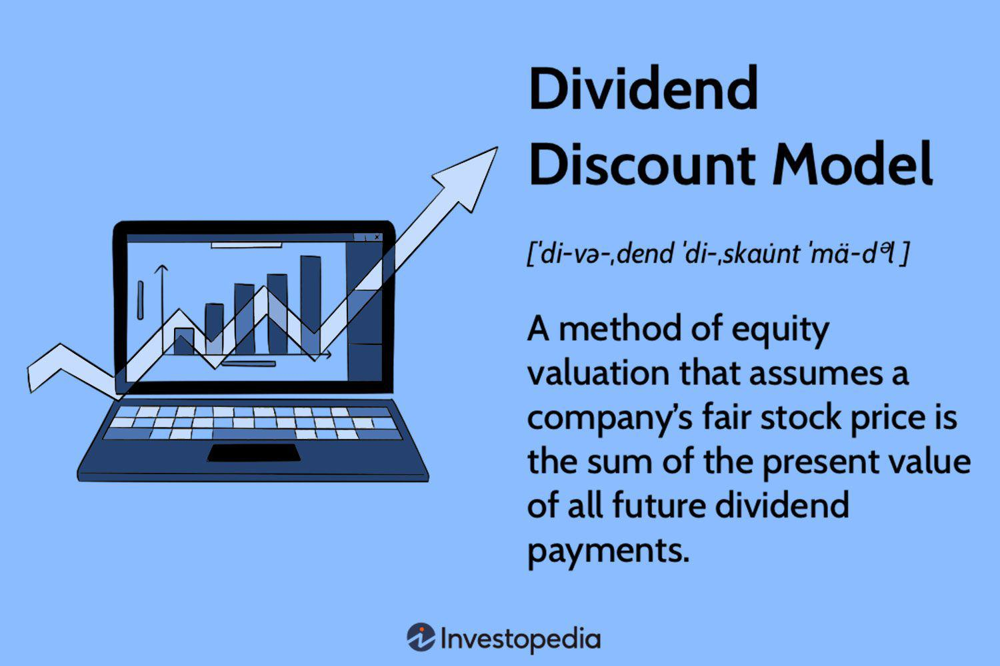

Understanding the interconnected nature of dividends, shareholder distribution, financial performance, and algorithmic trading strategies is crucial for modern investors. Dividends represent a portion of a company's earnings returned to shareholders, serving as both a reward for their investment and an indicator of the company's underlying fiscal health. The methodologies by which companies determine shareholder distribution, including dividends, are often reflective of broader financial stability and strategic goals. Analyzing these methodologies provides insight into the organization's operations and long-term sustainability.

Dividends and shareholder distributions also significantly influence market perception and investor sentiment, impacting stock valuations and trading behaviors. Companies with consistent and reliable dividend payments, such as Johnson & Johnson, often attract investors seeking steady income streams, thereby stabilizing stock prices during volatile market conditions.

The role of algorithmic trading cannot be understated in this context. By leveraging sophisticated algorithms, investors can enhance their strategies around dividend-paying stocks, optimizing timing and execution to maximize returns. This technological advancement allows for superior speed and accuracy in processing vast amounts of financial data, facilitating investment decisions that are more informed and strategic.

This article aims to equip readers with an understanding of how these components interact and how modern investors can harness them to build robust portfolios. By exploring the fundamental aspects of dividends, shareholder distributions, and their ties to financial performance, alongside the transformative effects of algorithmic trading, investors can develop a more refined approach to navigating the ever-evolving financial landscape.

## Table of Contents

## Understanding Dividends and Shareholder Distribution

Dividends are financial rewards that companies distribute to their shareholders, typically derived from the profits earned by the company. They represent a critical component of shareholder returns, providing a consistent income stream that can enhance portfolio stability. The distribution of dividends is a key indicator of a company’s financial health and can signal its stability and ongoing profitability.

Shareholder distribution strategies vary significantly among companies. Some firms might employ a conservative approach, prioritizing stability and steady payouts, often seen in mature companies with reliable revenue streams. Other companies, particularly those in growth phases, might prefer to reinvest profits into the business rather than distribute them, resulting in lower or infrequent dividend payments. These strategies reflect the company’s financial philosophy and goals, influencing investor perception and market behavior.

The mechanics of dividend distribution involve several key dates that are essential for investors to understand:

1. **Declaration Date**: This is when the company’s board of directors announces the dividend payment, including the dividend amount and the record and payment dates. This announcement can impact investor sentiment and stock prices, as it reflects the company’s financial performance and future outlook.

2. **Ex-Dividend Date**: This is the critical date on which the stock begins trading without the value of its next dividend payment. To be eligible to receive the declared dividend, shareholders must have acquired the stock before this date. Consequently, stock prices typically drop by approximately the dividend amount on the ex-dividend date, reflecting the reduction in company assets.

3. **Record Date**: Following the ex-dividend date, this is when the company reviews its records to determine the eligible shareholders who will receive the dividend. Only those listed as shareholders by the close of business on the record date will receive the dividend distribution.

4. **Payment Date**: This is when the dividend payment is actually made to the shareholders. Investors rely on this date for cash flow planning, as they receive their share of the profitability in tangible form.

Understanding how these dividend distributions impact stock prices and investor sentiment is essential for both individual and institutional investors. Stock prices often react to dividend announcements, and the anticipation of future dividends can play a significant role in stock valuation. Market participants might view a stable or increasing dividend as a sign of financial strength and a positive future outlook, potentially boosting investor confidence and demand for the stock.

Conversely, cutting or omitting dividends might suggest underlying financial challenges, impacting investor sentiment negatively and possibly leading to a decline in stock prices. Therefore, dividends not only serve as a source of income but also [carry](/wiki/carry-trading) substantial information about a company’s financial condition, influencing market dynamics and investment strategies.

## Financial Performance and Its Role in Dividend Policies

Companies determine dividend payments based on a careful assessment of financial performance indicators such as profitability, cash flow, and strategic growth plans. Profitability, often measured by net income or earnings per share (EPS), serves as a fundamental determinant. A higher EPS typically suggests sufficient earnings to support dividend distributions. Additionally, consistent cash flow is critical, ensuring the company can meet its short-term obligations while maintaining dividend payments.

Strategic growth plans also impact dividend policies. Firms may choose to retain earnings for reinvestment to support expansion initiatives or research and development, often seen in growth-oriented companies. Conversely, mature companies with stable revenue streams might prefer higher dividend payouts, appealing to income-focused investors.

Several factors influencing a company's dividend performance are:

1. **Earnings and Reinvestment Opportunities**: Companies must balance between distributing dividends and reinvesting earnings into business growth. The retention ratio, calculated as:
$$
   \text{Retention Ratio} = 1 - \text{Dividend Payout Ratio}

$$

   helps demonstrate this balance. High growth potential may lead to retainment of earnings, impacting dividend policies.

2. **Market Conditions**: Economic downturns often compel firms to re-evaluate their dividend policies. During such periods, a company may need to cut or suspend dividends to preserve capital, affecting shareholder returns.

Economic cycles play a significant role in dividend sustainability. During expansion phases, companies tend to enhance dividends due to improved earnings. Conversely, recessions might lead to reduced dividends as firms prioritize [liquidity](/wiki/liquidity-risk-premium) and financial resilience. The response of dividend payments to economic cycles can provide insights into management's confidence in their operational stability and growth prospects.

Notably, some companies maintain a consistent dividend track record despite economic fluctuations, signaling robust financial health and management efficacy. Johnson & Johnson is a prime example of this. The company has a history of increasing dividends for over 50 years, showcasing resilience and a commitment to returning value to shareholders. Their approach reflects a well-managed balance between profitable operations and strategic resource allocation.

In conclusion, understanding the interplay between financial performance and dividend policies is essential for investors. Companies with solid earnings, steady cash flows, and prudent management are often better positioned to offer sustainable dividends, providing reliable income streams to shareholders.

## Algorithmic Trading: Enhancing Dividend Investment Strategies

Algorithmic trading has revolutionized the approach to investing in dividend-paying stocks by introducing speed, precision, and the capacity to handle vast datasets efficiently. These capabilities provide a significant edge to investors looking to optimize their dividend investment strategies.

One of the primary advantages of [algorithmic trading](/wiki/algorithmic-trading) is its ability to process and analyze large volumes of financial data at unparalleled speeds. This efficiency is crucial when dealing with dividend stocks, as it allows traders to make informed decisions based on real-time market data. For instance, algorithms can quickly evaluate a stock's historical dividend performance, its current financial health, and market conditions to forecast potential returns. This rapid processing is critical around key dividend dates, such as the ex-dividend date, where stock price adjustments occur, influencing investment strategies.

Dividend capture strategies are particularly enhanced by algorithmic trading. These strategies involve purchasing stocks just before the ex-dividend date to capture the declared dividend, and then selling them shortly after. This approach requires precise timing and execution to be profitable, as stock prices typically drop on the ex-dividend date by an amount approximately equal to the dividend. Algorithmic trading can optimize this process by using high-frequency trading ([HFT](/wiki/high-frequency-trading-strategies)) techniques, allowing for extremely fast execution of buy and sell orders, thus capturing small price discrepancies efficiently.

High-frequency trading leverages advanced computational algorithms to execute a large number of orders at extremely fast speeds, often within microseconds. This speed advantage enables traders to react instantly to market changes and execute strategies like statistical [arbitrage](/wiki/arbitrage). In the context of dividend investing, [statistical arbitrage](/wiki/statistical-arbitrage) can be employed to identify and exploit pricing inefficiencies around dividend announcement dates. By analyzing correlations and patterns in stock price movements, algorithms can predict temporary mispricings, enabling traders to make profitable trades with minimal risk.

In summary, the integration of algorithmic trading into dividend investment strategies offers significant enhancements, including improved timing, precision in execution, and the ability to swiftly analyze and react to market data. These enhancements not only increase the potential for capturing dividend-related gains but also mitigate the risks associated with manual trading methods.

## Risks and Considerations in Dividend Investing and Algo Trading

Dividend investing and algorithmic trading both present unique opportunities and challenges, primarily due to the inherent risks and considerations associated with these strategies. 

Market risks impact dividend stocks significantly. Volatility and [interest rate](/wiki/interest-rate-trading-strategies) fluctuations are two of the primary market risks. Volatility affects stock prices and, by extension, their dividend yields. High [volatility](/wiki/volatility-trading-strategies) can lead to increased fluctuations in stock prices, making income from dividends less predictable. Interest rate changes can also affect dividend stocks; when interest rates rise, dividend yields become comparatively less attractive, potentially leading to a decrease in stock prices.

Company-specific risks are another concern. A company's financial performance and any strategic shifts it undertakes can directly influence its ability to maintain consistent dividend payouts. A decline in earnings or a strategic decision to reinvest profits back into the company rather than distribute them as dividends can result in reduced or even eliminated dividend payouts, affecting investor returns.

Algorithmic trading strategies can aid in managing some of these risks through diversification and strategy [backtesting](/wiki/backtesting). Diversification involves spreading investments across a variety of dividend-paying stocks to mitigate the risk associated with any single company's performance. Strategy backtesting helps algorithms assess the potential outcomes of various trading strategies using historical data. This analysis can improve trading decisions and help manage risks more effectively.

Tax implications are another important consideration in dividend investing. Different jurisdictions have varying tax rates on dividends, and understanding these obligations is crucial to formulating an effective investment strategy. Strategic asset allocation can help minimize tax liabilities by placing dividend-paying stocks in tax-advantaged accounts, where possible. This approach requires careful planning to ensure that investments are optimized for both growth and tax efficiency.

In summary, dividend investing and algorithmic trading require careful risk assessment and management. By acknowledging market risks, financial performance uncertainties, strategic shifts, and tax implications, investors can better align their portfolios to maximize returns while mitigating potential downsides.

## Conclusion

Dividends play a critical role in offering investors both a stable income and the potential for stock appreciation. By distributing a portion of earnings, dividends serve as a tangible reflection of a company’s financial health and profitability. This steady income can be particularly appealing to those seeking a balance between risk and reward in their investment portfolios.

Algorithmic trading has brought a transformative edge to dividend investing by enhancing the predictability and efficiency of investment decisions. Algorithms, with their speed and precision, can process vast amounts of data to identify optimal buying and selling points around key dividend dates, thereby maximizing returns and minimizing risks. This technological advancement enables investors to capitalize on short-term market movements that may not be perceptible through traditional trading methods.

Despite the advantages of algorithmic strategies, maintaining a balanced approach is essential—one that harmonizes technology with traditional financial analysis. Investors should not rely solely on computational models but use them to complement fundamental research and analysis of company financials. While algorithms can facilitate data-driven decision-making, human insight remains vital in interpreting qualitative factors that impact a company's long-term performance.

Continual learning and strategy refinement are crucial for successfully synchronizing dividend investment strategies with algorithmic trading. As markets evolve and new technologies emerge, staying informed becomes imperative. Investors are encouraged to keep abreast of advancements in both financial strategies and technology, ensuring their approaches remain robust and adaptable. Adopting a dynamic strategy that integrates dividend investments with algorithmic insights can lead to more informed decisions and increased potential for portfolio growth.

## References & Further Reading

Bodie, Z., Kane, A., & Marcus, A. J. (2014). *Investments*. This comprehensive textbook covers fundamental principles of investment, including detailed discussions on dividend payouts, portfolio management, and modern market strategies. It provides a solid foundation for understanding how dividends fit into the broader investment landscape.

Graham, B. (2006). *The Intelligent Investor*. Known as the bible of value investing, this book emphasizes the importance of long-term strategy over short-term market movements. It includes insights into assessing companies for their dividend-paying potential, advocating for investments in companies with solid earnings and dividend history.

Lopez de Prado, M. (2018). *Advances in Financial Machine Learning*. This book offers a cutting-edge perspective on algorithmic trading, introducing advanced [machine learning](/wiki/machine-learning) techniques to optimize trading strategies. It's particularly relevant for investors interested in applying algorithmic methods to enhance their dividend investment strategies, providing practical algorithms and tools.

For real-time data and additional resources on dividend stocks, platforms like Yahoo Finance and Bloomberg are invaluable. These platforms provide up-to-the-minute financial news, stock performance analytics, and detailed data on dividend payments, helping investors stay informed and make data-driven decisions.

Understanding these resources can significantly enhance an investor’s ability to create and optimize dividend-focused portfolios, blending traditional analysis with modern algorithmic strategies.

