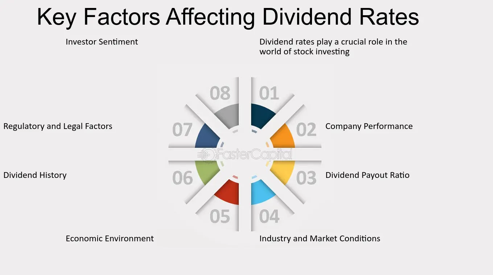

## Table of Contents

## What are dividends and why are they important to shareholders?

Dividends are payments that companies make to their shareholders from their profits. When a company makes money, it can choose to give some of that money back to the people who own its stocks. This payment is usually made in cash, but sometimes it can be in the form of more stocks. Dividends are typically paid out regularly, like every three months or once a year.

Dividends are important to shareholders because they provide a steady income from their investment. This can be especially helpful for people who rely on their investments to help pay for things like living expenses. Also, dividends can show that a company is doing well and has enough money to share with its shareholders. This can make shareholders feel more confident about the company and more likely to keep their investment in it.

## What does 'dividends per share' mean?

Dividends per share is the amount of money a company pays out to each share of its stock. If you own one share of a company's stock, this number tells you how much money you will get from the company's dividend payment. For example, if a company declares a dividend of $1 per share and you own 10 shares, you would receive $10 in total.

This number is important because it helps investors understand how much income they can expect from their investment in the company. It's a way to measure how generous a company is with its profits. Companies usually announce their dividends per share when they decide to pay dividends, and this information can influence whether people decide to buy, hold, or sell the company's stock.

## What are some common reasons a company might decrease its dividends per share?

A company might decrease its dividends per share if it's not making as much money as before. When a company's profits go down, it might not have enough money to keep paying the same amount of dividends. The company might need to use the money for other things, like fixing problems or paying off debts. If the company keeps paying the same dividends even though it's not doing well, it could run into bigger financial trouble later.

Another reason a company might cut its dividends is if it wants to use the money to grow the business. Sometimes, a company sees a good chance to make more money in the future, but it needs money now to do that. Instead of giving money to shareholders, the company might decide to spend it on new projects or buying other companies. This can be a good thing for shareholders if it helps the company make more money in the long run, but it means less money for them right now.

## How does a company's financial health impact its ability to pay dividends?

A company's financial health is really important when it comes to paying dividends. If a company is doing well and making a lot of money, it can afford to give some of that money back to its shareholders as dividends. But if the company isn't doing so well and its profits are low, it might not have enough money to pay the same amount of dividends. In that case, the company might have to cut back on dividends or stop paying them altogether to save money for other important things, like paying off debts or keeping the business running smoothly.

Sometimes, a company might choose to use its money to grow the business instead of paying dividends. If the company thinks it can make more money in the future by investing in new projects or buying other companies, it might decide to spend its money on those things instead of giving it to shareholders. This can be a good move if it helps the company become more successful in the long run, but it means shareholders won't get as much money right now. So, a company's financial health directly affects its ability to pay dividends, and it has to balance between giving money to shareholders and using it to make the business stronger.

## What role do economic conditions play in dividend policy?

Economic conditions can have a big impact on how a company decides to pay dividends. When the economy is doing well, companies usually make more money and can afford to pay higher dividends to their shareholders. But if the economy is struggling, companies might not make as much money, and they might need to cut back on dividends to save money for other important things like keeping the business running or paying off debts.

Sometimes, even if the economy is good, a company might decide to use its money to grow instead of paying dividends. This can happen if the company sees a good chance to make more money in the future by investing in new projects or buying other businesses. But if the economy takes a turn for the worse, the company might have to rethink its plans and focus on saving money, which could mean cutting dividends. So, economic conditions play a big role in how a company manages its dividend policy, balancing between giving money to shareholders and making sure the business stays strong.

## Can changes in corporate strategy lead to a decrease in dividends per share?

Yes, changes in corporate strategy can lead to a decrease in dividends per share. When a company decides to change its plans, it might want to use its money in different ways. For example, if the company wants to grow bigger, it might decide to spend its money on new projects or buying other companies instead of paying dividends. This can be a good thing for the company's future, but it means shareholders might get less money right now.

Also, if a company's new strategy involves taking on more risk or trying something new, it might need to keep more money on hand just in case things don't go as planned. This means the company might have to cut back on dividends to make sure it has enough money to cover any unexpected costs. So, when a company changes its strategy, it can affect how much money it gives back to shareholders through dividends.

## How do regulatory changes affect a company's dividend payments?

Regulatory changes can have a big impact on how much money a company can pay out in dividends. If the government makes new rules that make it harder for companies to make money, like higher taxes or stricter rules about what they can do, the company might not have as much money left over to pay dividends. For example, if a new law says companies have to spend more money on safety or the environment, that can take away from the money they could use for dividends.

Sometimes, the government might make rules that directly affect how much money companies can give back to shareholders. For instance, there might be laws that limit how much of their profits companies can pay out as dividends. If these rules change and become stricter, companies might have to cut their dividends even if they are still making a lot of money. So, regulatory changes can make it harder for companies to pay the same amount of dividends, and they have to adjust their plans to follow the new rules.

## What impact does a company's debt level have on its dividend policy?

A company's debt level can really affect how much money it can pay out in dividends. If a company has a lot of debt, it has to use a big part of its money to pay back what it owes. This means there might not be as much money left over to give to shareholders as dividends. If the company's debt gets even bigger, it might have to cut back on dividends to make sure it can keep paying its bills and avoid going into more financial trouble.

Sometimes, a company might decide to borrow more money to help grow the business. But if the debt gets too high, the company might have to use the money it would normally pay in dividends to pay off the debt instead. This can make shareholders unhappy because they get less money, but it can be important for the company to stay healthy and avoid going bankrupt. So, a company's debt level plays a big role in deciding how much it can afford to pay in dividends.

## How can shifts in market expectations influence dividend decreases?

When people who invest in the stock market change what they expect from a company, it can make the company decide to lower its dividends. If investors start thinking that a company won't make as much money in the future, they might expect the company to keep more money to deal with tough times instead of paying it out as dividends. This can make the company's leaders think about cutting dividends to show they are being careful with money and to keep investors happy by showing they are ready for whatever might happen.

Also, if the market starts expecting a company to use its money to grow bigger instead of paying dividends, the company might decide to lower its dividends. For example, if investors believe that the company can make more money by spending on new projects or buying other businesses, they might be okay with getting less money now if it means the company will be worth more later. So, the company might cut dividends to use the money in ways that match what the market expects, helping to keep investors happy and confident in the company's future.

## What are the tax implications of changing dividend policies?

When a company changes its dividend policy, it can affect how much tax shareholders have to pay. If a company decides to pay more dividends, shareholders might have to pay more in taxes because dividends are usually taxed as income. But if the company cuts dividends and uses the money to grow the business instead, shareholders might not have to pay as much tax right away. Instead, they might see the value of their stocks go up, and they would only pay taxes if they sell their stocks at a profit.

Different countries have different rules about taxing dividends. In some places, dividends might be taxed at a lower rate than regular income, which can make them more attractive to shareholders. But if a company changes its dividend policy, shareholders need to think about how it will affect their taxes. They might need to talk to a tax expert to understand how the changes could impact their money and what they can do to manage their taxes better.

## How do international operations and currency fluctuations affect dividend decisions?

When a company has operations in different countries, it can affect how much money it has to pay dividends. If the company is doing well in other countries, it might have more money to share with shareholders. But if things are not going so well in those places, the company might not have as much money and might need to cut dividends. Also, moving money from one country to another can be tricky because of different rules and taxes, which can make it harder for the company to decide how much to pay in dividends.

Currency fluctuations can also make a big difference in dividend decisions. If the currency in a country where the company operates gets weaker compared to the currency where most of its shareholders live, the company might end up with less money when it converts its earnings to pay dividends. This can lead to lower dividends because the company has less money to go around. On the other hand, if the currency gets stronger, the company might have more money to pay out, which could mean higher dividends. So, changes in currency values can make it hard for a company to keep its dividend payments steady.

## What advanced financial metrics should investors monitor to predict potential decreases in dividends per share?

Investors should keep an eye on a company's payout ratio to predict if dividends per share might go down. The payout ratio is the part of the company's earnings that it pays out as dividends. If this ratio starts getting too high, it might mean the company is paying out more than it can afford, and it might have to cut dividends to keep things balanced. Also, watching the company's free cash flow is important. Free cash flow is the money left after the company pays for everything it needs to run. If free cash flow goes down, the company might not have enough money to keep paying the same dividends.

Another useful metric is the company's debt-to-equity ratio. This shows how much the company is borrowing compared to what shareholders have put in. If this ratio goes up a lot, it might mean the company has to use more of its money to pay off debts instead of paying dividends. Lastly, investors should look at the company's earnings growth. If earnings are not growing or are going down, the company might need to cut dividends to save money for other things. Keeping track of these metrics can help investors guess if a company might lower its dividends per share.

## How does financial performance influence dividend policies?

Companies determine dividend payments based on a careful assessment of financial performance indicators such as profitability, cash flow, and strategic growth plans. Profitability, often measured by net income or earnings per share (EPS), serves as a fundamental determinant. A higher EPS typically suggests sufficient earnings to support dividend distributions. Additionally, consistent cash flow is critical, ensuring the company can meet its short-term obligations while maintaining dividend payments.

Strategic growth plans also impact dividend policies. Firms may choose to retain earnings for reinvestment to support expansion initiatives or research and development, often seen in growth-oriented companies. Conversely, mature companies with stable revenue streams might prefer higher dividend payouts, appealing to income-focused investors.

Several factors influencing a company's dividend performance are:

1. **Earnings and Reinvestment Opportunities**: Companies must balance between distributing dividends and reinvesting earnings into business growth. The retention ratio, calculated as:
$$
   \text{Retention Ratio} = 1 - \text{Dividend Payout Ratio}

$$

   helps demonstrate this balance. High growth potential may lead to retainment of earnings, impacting dividend policies.

2. **Market Conditions**: Economic downturns often compel firms to re-evaluate their dividend policies. During such periods, a company may need to cut or suspend dividends to preserve capital, affecting shareholder returns.

Economic cycles play a significant role in dividend sustainability. During expansion phases, companies tend to enhance dividends due to improved earnings. Conversely, recessions might lead to reduced dividends as firms prioritize [liquidity](/wiki/liquidity-risk-premium) and financial resilience. The response of dividend payments to economic cycles can provide insights into management's confidence in their operational stability and growth prospects.

Notably, some companies maintain a consistent dividend track record despite economic fluctuations, signaling robust financial health and management efficacy. Johnson & Johnson is a prime example of this. The company has a history of increasing dividends for over 50 years, showcasing resilience and a commitment to returning value to shareholders. Their approach reflects a well-managed balance between profitable operations and strategic resource allocation.

In conclusion, understanding the interplay between financial performance and dividend policies is essential for investors. Companies with solid earnings, steady cash flows, and prudent management are often better positioned to offer sustainable dividends, providing reliable income streams to shareholders.

## References & Further Reading

Bodie, Z., Kane, A., & Marcus, A. J. (2014). *Investments*. This comprehensive textbook covers fundamental principles of investment, including detailed discussions on dividend payouts, portfolio management, and modern market strategies. It provides a solid foundation for understanding how dividends fit into the broader investment landscape.

Graham, B. (2006). *The Intelligent Investor*. Known as the bible of value investing, this book emphasizes the importance of long-term strategy over short-term market movements. It includes insights into assessing companies for their dividend-paying potential, advocating for investments in companies with solid earnings and dividend history.

Lopez de Prado, M. (2018). *Advances in Financial Machine Learning*. This book offers a cutting-edge perspective on [algorithmic trading](/wiki/algorithmic-trading), introducing advanced [machine learning](/wiki/machine-learning) techniques to optimize trading strategies. It's particularly relevant for investors interested in applying algorithmic methods to enhance their dividend investment strategies, providing practical algorithms and tools.

For real-time data and additional resources on dividend stocks, platforms like Yahoo Finance and Bloomberg are invaluable. These platforms provide up-to-the-minute financial news, stock performance analytics, and detailed data on dividend payments, helping investors stay informed and make data-driven decisions.

Understanding these resources can significantly enhance an investor’s ability to create and optimize dividend-focused portfolios, blending traditional analysis with modern algorithmic strategies.

