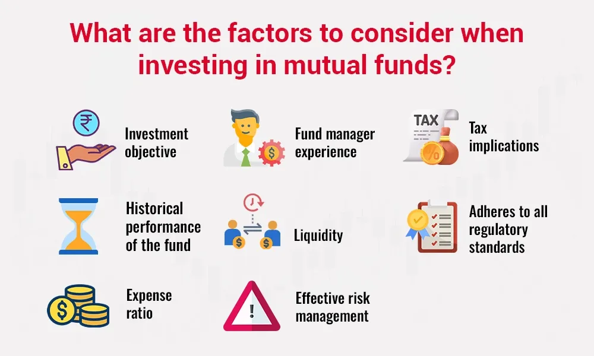

## Table of Contents

## What is a mutual fund and how does it work?

A mutual fund is a type of investment where many people pool their money together to buy a variety of stocks, bonds, or other assets. It's like a big basket where everyone puts in some money, and a professional manager decides what to buy with it. This way, even if you don't have a lot of money, you can still invest in a diverse range of things.

When you invest in a mutual fund, you buy shares of the fund. The price of each share goes up or down depending on how well the investments in the basket are doing. If the stocks or bonds in the fund do well, the value of your shares goes up, and you can make money. If they don't do well, the value of your shares can go down. The fund manager's job is to try to pick the best investments to help the fund grow.

## What are the basic steps to start a mutual fund?

Starting a mutual fund involves a few key steps that you need to follow. First, you need to decide on the type of mutual fund you want to create, like if it will focus on stocks, bonds, or a mix of both. Then, you have to put together a team. This team includes a fund manager who will pick the investments, and other people like lawyers and accountants to help with the legal and financial parts. After that, you need to write a detailed plan, called a prospectus, which explains what your fund will do and how it will work. This plan has to be approved by a government agency, like the Securities and Exchange Commission (SEC) in the United States, to make sure everything is fair and clear.

Once your plan is approved, you can start raising money from investors. You do this by selling shares of your mutual fund to people who want to invest. The money you collect from these investors is then used to buy the stocks, bonds, or other assets you described in your plan. After that, your fund manager will keep an eye on the investments and make changes if needed to try to make the fund grow. You'll also need to keep your investors updated regularly on how the fund is doing, usually through reports and statements.

## What legal and regulatory requirements must be met to establish a mutual fund?

To start a mutual fund, you have to follow a lot of rules set by the government. In the United States, the main rulebook comes from the Securities and Exchange Commission (SEC). First, you need to create a company that will run the mutual fund. This company must register with the SEC and follow their rules. You also need to write a detailed plan, called a prospectus, which explains what your fund will do, how it will invest the money, and the risks involved. This prospectus must be approved by the SEC before you can start selling shares of your fund to investors. 

Once you start the fund, you need to keep following more rules. You have to make sure your fund is managed honestly and fairly. This means you need to keep good records, follow rules about how you advertise and sell your fund, and make sure you're not mixing your money with the fund's money. You also have to give regular updates to your investors, telling them how the fund is doing and any big changes that happen. If you don't follow these rules, the SEC can take action against you, which could mean fines or even shutting down your fund.

## How do you choose the right investment strategy for a mutual fund?

Choosing the right investment strategy for a mutual fund starts with understanding what your investors want. Some investors might want to grow their money quickly and are okay with taking more risks. Others might want to keep their money safe and are okay with slower growth. You need to decide if your fund will focus on stocks, which can go up and down a lot, or bonds, which are usually safer but grow more slowly. You might also choose a mix of both, called a balanced fund, to try to get the best of both worlds.

Once you know what your investors want, you can pick a strategy that fits. For example, if your investors want to grow their money fast, you might choose a growth strategy, where you invest in companies that are expected to grow a lot. If they want something safer, you might go for an income strategy, focusing on companies that pay regular dividends. You also need to think about how much you'll change the investments over time. Some funds stick with the same investments for a long time, while others change them more often to try to do better. The key is to match your strategy with what your investors are looking for and what you think will work best in the market.

## What are the key roles and responsibilities in managing a mutual fund?

Managing a mutual fund involves several important roles and responsibilities. The fund manager is the most crucial role. This person picks the stocks, bonds, or other investments for the fund. They need to keep an eye on the market and make changes to the investments when needed. They also need to make sure the fund follows the strategy they promised to investors. The fund manager's main goal is to make the fund grow as much as possible while keeping it in line with the fund's goals.

Another key role is the compliance officer. This person makes sure the fund follows all the rules set by the government, like those from the SEC in the United States. They check that everything the fund does is fair and legal. They also help with writing and updating the prospectus, which tells investors about the fund. The compliance officer helps keep the fund out of trouble and protects investors.

Other important roles include the accountant, who keeps track of the fund's money and makes sure everything adds up correctly, and the marketing team, who tells people about the fund and tries to get more investors. Everyone working on the fund needs to work together to make sure it runs smoothly and meets its goals.

## How do you determine the target market for your mutual fund?

Determining the target market for your mutual fund starts with understanding what kind of investors you want to attract. You need to think about their goals and how much risk they are willing to take. Some people might want to save for retirement and are okay with a slow and steady growth. Others might want to grow their money quickly and are willing to take more risks. Knowing this helps you decide if your fund should focus on stocks, which can go up and down a lot, or bonds, which are usually safer but grow more slowly. You might also choose a mix of both to appeal to people who want a bit of both growth and safety.

Once you have a clear idea of the kind of investors you want, you can tailor your fund's strategy and marketing to fit their needs. For example, if your target market is people saving for retirement, you might create a fund that focuses on steady, long-term growth. You would then market this fund to older investors or those planning for the future. On the other hand, if your target market is younger investors looking for quick growth, you might focus on a high-risk, high-reward strategy and market your fund to people who are more willing to take chances with their money. By matching your fund's strategy to your target market, you can attract the right investors and help them meet their financial goals.

## What are the costs involved in setting up and operating a mutual fund?

Setting up a mutual fund involves a lot of costs. You need to pay for legal fees to get everything set up properly. This includes writing the prospectus, which is a big plan that tells investors about the fund. You also have to pay for accountants to keep track of the money and make sure everything is correct. There are also costs for registering with the government, like the SEC in the United States, which makes sure everything is fair and legal. All these costs can add up to a lot of money before you even start selling shares of your fund to investors.

Once your mutual fund is up and running, there are ongoing costs to keep it going. You have to pay the fund manager, who picks the investments and tries to make the fund grow. There are also fees for the compliance officer, who makes sure the fund follows all the rules. You need to keep updating your investors with reports and statements, which costs money too. There are also marketing costs to tell people about your fund and try to get more investors. All these costs come out of the money the fund makes, which can affect how much money your investors get back.

## How do you select a fund manager and what qualifications should they have?

Choosing a fund manager is very important because they are the ones who will pick the investments for your mutual fund. You want someone who knows a lot about the market and can make good choices. They should have a strong background in finance, like a degree in finance or business. It's also good if they have experience working with investments before, like being an analyst or managing another fund. They need to understand how to balance risk and reward, and be able to stick to the strategy you set for the fund.

Besides their knowledge and experience, the fund manager should also be someone you trust. They will be making decisions that affect a lot of people's money, so they need to be honest and follow the rules. They should be able to explain their choices clearly to you and your investors. A good fund manager is also someone who can keep up with changes in the market and adjust the fund's investments when needed. Finding someone with these skills and qualities will help your mutual fund do well and keep your investors happy.

## What are the marketing and distribution strategies for a new mutual fund?

When you start a new mutual fund, you need to let people know about it so they can invest. A good way to do this is by using marketing. You can use ads on the internet, TV, or in newspapers to tell people about your fund. You can also use social media to reach a lot of people quickly. It's important to explain what your fund does in a simple way so people can understand it. You might also want to work with financial advisors who can tell their clients about your fund. They can help you reach people who are already interested in investing.

Another important part of getting your mutual fund out there is distribution. This means finding ways to sell your fund to investors. You can do this through big companies that already sell a lot of funds, called broker-dealers. They have a lot of customers and can help you reach more people. You can also sell your fund directly to investors through your own website or by setting up a call center. It's good to have different ways to sell your fund so more people can buy it. By using both marketing and distribution, you can get more investors and help your mutual fund grow.

## How do you ensure compliance with financial regulations and standards?

To make sure your mutual fund follows all the financial rules and standards, you need to have a good compliance officer. This person's job is to know all the rules from places like the SEC and make sure your fund follows them. They help write the prospectus, which is a big plan that tells investors about the fund, and they check that everything the fund does is fair and legal. They also keep an eye on how the fund is run every day to make sure no one is doing anything wrong. If there are any changes in the rules, the compliance officer will update the team so everyone knows what to do.

Besides having a compliance officer, you also need to keep good records of everything your fund does. This means writing down all the decisions made about the investments and keeping track of the money coming in and going out. You have to give regular reports to your investors, telling them how the fund is doing and any big changes that happen. This helps them trust that you're following the rules. If you don't follow the rules, the government can take action against you, which could mean fines or even shutting down your fund. So, it's really important to stay on top of compliance to keep your fund running smoothly and legally.

## What are the advanced risk management techniques for mutual funds?

Managing risks in a mutual fund is important to keep the money safe and help it grow. One way to do this is by spreading out the investments, which is called diversification. Instead of putting all the money into one or two things, the fund manager picks a lot of different stocks, bonds, or other assets. This way, if one investment does badly, it won't hurt the whole fund too much because the other investments might still do well. Another technique is using something called hedging. This is like buying insurance for the investments. The fund manager might use special financial tools, like options or futures, to protect the fund from big drops in the market.

Another advanced way to manage risk is by using stress tests and scenario analysis. This means the fund manager tries to guess what could go wrong in the future and sees how the fund would do in those situations. They might look at what would happen if the market went down a lot or if there was a big economic problem. By doing this, they can make changes to the fund to make it stronger against these risks. Keeping an eye on the fund's risk levels all the time is also important. The fund manager uses special tools and computer programs to watch the risks and make quick changes if needed. This helps keep the fund safe and on track to meet its goals.

## How do you evaluate the performance and success of a mutual fund over time?

To evaluate how well a mutual fund is doing over time, you need to look at a few key things. One important measure is the fund's return, which shows how much the fund has grown. You can compare the fund's return to a benchmark, like a stock market index, to see if it's doing better or worse than the market as a whole. Another thing to look at is the fund's risk-adjusted return, which tells you how much return you're getting for the amount of risk you're taking. A good fund will give you a high return without taking too much risk. You should also check the fund's expense ratio, which is how much it costs to run the fund. A lower expense ratio means more money stays in the fund for investors.

Besides these numbers, it's important to look at how the fund has done over different time periods, like one year, three years, or five years. This helps you see if the fund's success is just a short-term thing or if it's doing well over the long run. You can also talk to other investors or read reports from financial experts to get their opinions on the fund. It's good to keep an eye on any changes in the fund's strategy or management team, because these can affect how well the fund does in the future. By looking at all these things together, you can get a good idea of how successful the mutual fund is over time.

## References & Further Reading

#