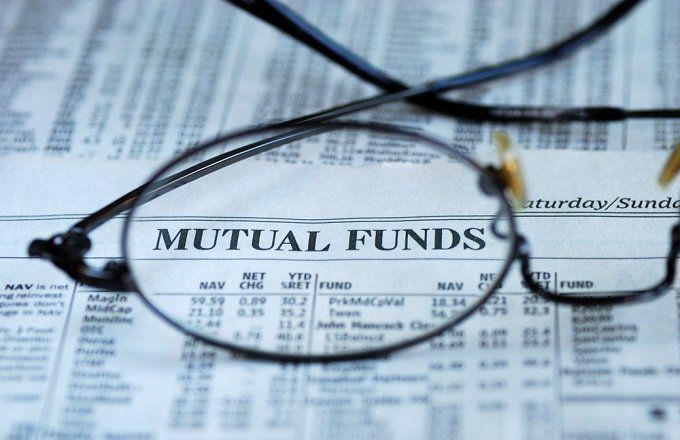

The financial landscape is undergoing significant transformation fueled by advances in technology and innovative investment approaches. As investors seek to maximize returns and manage risks effectively, mutual funds, diverse investment strategies, and algorithmic trading have emerged as pivotal components of modern portfolio management. This evolving ecosystem demands a strategic integration of these elements to harness their collective potential for enhanced returns.

Mutual funds serve as a cornerstone of collective investing, offering a platform where a diverse mix of securities is managed by professional fund managers. This pooling of resources not only allows individual investors to participate in broad market exposure but also provides diversification benefits that help mitigate the risks associated with individual asset holdings. The role of mutual funds is continually evolving, with various types catering to different investment goals and risk appetites, including stock, bond, and balanced funds.



Parallelly, investment strategies are becoming more sophisticated, with active and passive management styles offering different paths to achieving financial goals. Active management seeks to outperform market indices by leveraging in-depth analysis and market foresight, whereas passive management aims to replicate market performance more cost-effectively by tracking indices. Investors must understand the underlying risk-return trade-offs of different strategies and align their investment horizon accordingly, taking advantage of diversification across asset classes and the compounding effect of long-term investments.

Algorithmic trading introduces a technological dimension to fund management, enabling rapid and efficient trade execution based on data-driven insights. This approach supports timely market operations and is particularly beneficial in processing large trade orders. By automating decision-making through algorithms developed in programming languages such as Python, fund managers can adapt swiftly to changing market conditions, ultimately optimizing the management of mutual funds.

The integration of mutual funds with algorithmic trading exemplifies how traditional and innovative practices can merge, offering substantial strategic advantages in the investment landscape. As the financial environment continues to evolve, staying informed and adaptable is crucial for leveraging these powerful tools effectively and optimizing portfolio outcomes. Embracing the synergy between these components can enhance portfolio management and pave the way for superior investment returns.

## Table of Contents

## Understanding Mutual Funds

Mutual funds are a cornerstone of modern investment strategies, allowing individuals and institutions to pool their capital into a diversified portfolio of securities. Managed by professional fund managers, these funds span a broad spectrum of asset classes, including equities, bonds, and other financial instruments. The primary goal of mutual funds is to provide investors with broad market exposure while minimizing individual asset risks—a principle achieved through diversification.

Diversification is a fundamental investment strategy that reduces unsystematic risk, the risk inherent to a specific asset or company. By holding a variety of securities, mutual funds safeguard against the [volatility](/wiki/volatility-trading-strategies) that may affect a single asset. This is particularly advantageous for investors seeking stable returns over time, as it balances the performance fluctuations of individual investments within the fund.

Expense ratios and management fees are critical considerations when evaluating mutual funds. These costs, expressed as a percentage of the fund's assets under management (AUM), cover the fund's operating expenses, including portfolio management, administration, and marketing. For instance, if a fund has an expense ratio of 1%, it means that 1% of the total assets are used annually to cover these costs. Lower expense ratios often correlate with higher net returns for investors, making them an attractive [factor](/wiki/factor-investing) when selecting a mutual fund.

Mutual funds are tailored to various investor needs and risk tolerances, comprising distinct categories such as stock (equity) funds, bond (fixed-income) funds, and balanced funds. Stock funds invest primarily in equities and are suitable for investors seeking growth and willing to accept higher risk. Bond funds, conversely, focus on generating income through investments in fixed-income securities and are typically favored by investors with a lower risk tolerance. Balanced funds invest in a mix of stocks and bonds, offering a moderate risk-return profile by combining growth and income objectives.

By aligning with investors' financial goals and risk appetites, mutual funds provide a versatile investment option, supporting diverse strategies ranging from capital appreciation to income generation. Through professional management and strategic diversification, mutual funds remain a pivotal element of an effective investment portfolio.

## Investment Strategies for Mutual Funds

Investment strategies for mutual funds are diverse, catering to varying investor preferences and financial goals. A fundamental consideration is the choice between active and passive management. Active management involves a hands-on approach, where fund managers seek to outperform market indices through strategic stock selection, market timing, and other analytical techniques. This approach can lead to higher potential returns but often comes with increased risk and higher management fees. On the other hand, passive management aims to replicate the performance of a specific index, such as the S&P 500, offering a cost-effective option with generally lower fees due to its more straightforward, rule-based approach. Passive funds tend to keep pace with market indices rather than attempt to exceed them.

Understanding the risk-return trade-off is crucial for investors. This trade-off highlights the correlation between the potential return on investment and the risk involved. Higher potential returns typically come with greater risk, and investors must align their investment choices with their overall risk tolerance and financial objectives. A common formula used to understand this relationship is the Capital Asset Pricing Model (CAPM), which helps calculate the expected return of an asset based on its risk in comparison to the market.

Diversification is a key strategy to mitigate unsystematic risk in a mutual fund portfolio. By allocating investments across various asset classes, sectors, and geographic regions, investors can reduce the risk associated with any single investment. This approach does not eliminate risk entirely but helps manage it by not relying too heavily on one investment or market segment. The modern portfolio theory (MPT) supports diversification by suggesting an optimal portfolio mix that maximizes returns for a given level of risk.

Investment horizons play a significant role in determining strategy choices. Investors with long-term goals might prioritize strategies that benefit from the compounding effect. This effect occurs when the returns on investments generate additional earnings over time. A longer investment horizon allows more time for profits to reinvest and grow, ultimately leading to potentially substantial returns through the power of compounding. Python can be used to model the effects of compounding over time. For instance, a simple script can calculate the future value of an investment:

```python
def compound_interest(principal, rate, time):
    return principal * (1 + rate) ** time

initial_investment = 10000  # Initial investment amount
annual_rate = 0.05  # Annual interest rate (5%)
investment_period = 10  # Investment period in years

future_value = compound_interest(initial_investment, annual_rate, investment_period)
print(f"Future Value of Investment: ${future_value:.2f}")
```

This script demonstrates how an initial investment grows over a decade with an annual [interest rate](/wiki/interest-rate-trading-strategies) of 5%, showcasing the benefits of choosing a long-term investment strategy that leverages compounding.

## Integrating Mutual Funds with Algo Trading

Algorithmic trading, known for its speed and efficiency, plays a pivotal role in modern fund management, particularly when integrated with mutual funds. The use of [algorithmic trading](/wiki/algorithmic-trading) in mutual fund management streamlines the execution of trade orders, significantly reducing human error and allowing for rapid adjustments to market dynamics. This technological advancement supports fund managers by facilitating large trade transactions in a manner that minimizes market impact, ultimately enhancing the overall fund performance.

Data-driven insights are at the core of algorithmic trading. These insights are derived from analyzing vast amounts of market data, including price trends, [volume](/wiki/volume-trading-strategy) shifts, and economic indicators. By leveraging these insights, algorithms can make informed, timely decisions, adjusting trading strategies in real-time to capture opportunities and mitigate risks. This precision is crucial for mutual funds, where the execution of large orders can otherwise lead to substantial market movements and unfavorable price changes.

The automation of decision-making processes is another significant advantage of integrating algorithmic trading in mutual fund management. Algorithms, often developed in programming languages like Python, are designed to execute predefined strategies automatically. Here is an example of a simple algorithmic trading strategy in Python using historical price data to make buy or sell decisions:

```python
import pandas as pd
import numpy as np

# Load historical price data
data = pd.read_csv('price_data.csv')

# Calculate moving averages
data['SMA30'] = data['Close'].rolling(window=30).mean()
data['SMA100'] = data['Close'].rolling(window=100).mean()

# Define trading signals
data['Signal'] = 0
data['Signal'][30:] = np.where(data['SMA30'][30:] > data['SMA100'][30:], 1, 0)

# Generate trading orders
data['Position'] = data['Signal'].diff()

# Display the trading orders
print(data[['Close', 'SMA30', 'SMA100', 'Signal', 'Position']].dropna())
```

In this example, the algorithm computes two simple moving averages (SMA) for a stock—one short-term (30 days) and one long-term (100 days). A buy signal is generated when the short-term average crosses above the long-term average, suggesting an upward trend, while a sell signal is generated for the opposite condition. Such scripts empower fund managers to systematically apply complex strategies across numerous assets, ensuring consistency and efficiency.

Adapting to real-time market conditions, algorithmic trading enables mutual funds to remain agile and responsive. This adaptability is especially useful in volatile markets, where rapid response times can significantly impact the profitability of trades. Overall, the integration of algorithmic trading in mutual fund management positions funds to better navigate the complexities of modern financial markets, optimizing both strategy execution and portfolio returns.

## Challenges and Considerations

System failures and technical glitches pose inherent risks to algorithmic trading operations. These risks can manifest in various forms, such as unexpected software bugs, hardware malfunctions, or network failures, all of which can lead to unintended trades, financial losses, or significant market disruptions. To mitigate such risks, robust testing and reliable backup systems are essential. This involves implementing comprehensive software testing protocols, maintaining redundant hardware systems, and ensuring reliable internet connectivity with automated failover mechanisms.

Navigating regulatory landscapes is crucial for maintaining legal compliance and adhering to market standards. Algorithmic traders must be well-versed in the regulations governing their activity, which can vary significantly across different regions and markets. Regulatory agencies such as the U.S. Securities and Exchange Commission (SEC) and the European Securities and Markets Authority (ESMA) have established rules to ensure fair and transparent trading environments. Compliance with these regulations not only prevents legal repercussions but also promotes market integrity by preventing practices like insider trading or market manipulation.

The dependency on data quality and connectivity underscores the necessity for robust management practices. High-quality, accurate data is the backbone of effective algorithmic trading strategies. Inaccuracies or delays in data can lead to suboptimal trading decisions. To address this, traders should use reliable data sources and perform regular data integrity checks. Connectivity is equally important, as low-latency communications can significantly impact the effectiveness of an algorithmic trading strategy. Ensuring that trading systems are connected through high-speed, reliable networks minimizes latency and maximizes execution precision.

Regular [backtesting](/wiki/backtesting) and investor education are pivotal for the successful implementation of trading strategies. Backtesting allows traders to evaluate the performance of their algorithms using historical data, providing insights into potential profitability and risk exposure. It should be conducted in a way that accurately replicates real-world trading conditions. Moreover, educating investors on the mechanics and risks associated with algorithmic trading is essential for informed decision-making. This includes not only understanding how algorithms function but also recognizing the potential risks and limitations they entail.

In conclusion, overcoming the challenges associated with algorithmic trading necessitates a comprehensive approach encompassing technological, regulatory, and educational strategies. By addressing these considerations, traders can enhance the resilience and effectiveness of their trading systems, ultimately better positioning themselves for success in dynamic financial markets.

## Conclusion

The integration of mutual funds and algorithmic trading presents a strategic advantage in the ever-evolving investment landscape. Mutual funds offer diversification and professional management, which are enhanced by the precision and speed of algorithmic trading. The efficiency of algorithmic trading allows for the rapid execution of trades, minimizing human error and maximizing the potential for superior returns. 

For investors, staying informed about technological advancements and market trends is crucial. The financial markets are inherently dynamic, requiring adaptability to leverage the full potential of emerging tools and strategies. Algorithmic trading, for instance, utilizes historical data and predictive models to optimize decision-making processes. This can enable fund managers to anticipate market shifts more accurately and make informed investment decisions swiftly.

Embracing these innovations not only modernizes portfolio management but also positions investors to achieve optimal outcomes. The seamless combination of mutual funds with algorithmic approaches effectively mitigates risks while enhancing returns. Investors that are able to harness these technologies and strategies are likely to see significant benefits in terms of portfolio performance.

As the financial world continues to advance, integrating mutual funds with algorithmic trading tools demonstrates a forward-thinking approach, offering a competitive edge. By understanding and applying these methods, investors can optimize their strategies for success in today's complex financial environment.

## References & Further Reading

### References & Further Reading

For a comprehensive understanding of mutual funds and their management, consider exploring "The Intelligent Investor" by Benjamin Graham, which lays foundational principles important for any investor. 

Further insights into active and passive investment strategies can be found in "Common Sense on Mutual Funds" by John C. Bogle, a seminal text that explains the advantages of index funds and provides a critique of traditional fund management practices.

To understand the mechanics of algorithmic trading and its integration with mutual funds, "Algorithmic Trading: Winning Strategies and Their Rationale" by Ernest P. Chan is highly recommended. This book provides a thorough exploration of trading strategies and how they can be applied effectively using algorithms.

For specific insights into the quantitative aspects of investment, "Quantitative Equity Portfolio Management" by Ludwig B. Chincarini and Daehwan Kim is an essential read. It covers statistical methods used in portfolio management, bringing clarity to the complex interactions of diversified investments.

Peer-reviewed journal articles such as "Mutual Fund Performance: An Empirical Decomposition into Stock-[picking](/wiki/asset-class-picking) Talent, Style, Transactions Costs, and Expenses" by Russ Wermers can provide academic rigor to your understanding, particularly about performance attribution and fund manager effectiveness. [Link to paper](https://doi.org/10.1111/j.1540-6261.2000.tb00679.x)

The Journal of Portfolio Management offers a variety of articles on both traditional and algorithmic investment strategies; it's an invaluable resource for those keeping abreast of cutting-edge research and trends.

Online resources such as Investopedia and Morningstar can supplement these readings, offering real-time data and practical guides on managing mutual funds and implementing algorithmic trading strategies.

By engaging with these resources, investors can deepen their knowledge, enabling more informed and strategic decision-making in today's dynamic financial markets.

