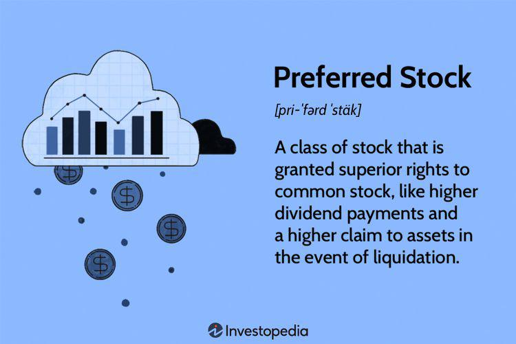

The world of stock investing offers diverse opportunities for investors, yet it is fraught with challenges that can be daunting. Two prominent forms of stock that investors often encounter are preferred and common stocks, each offering unique benefits and risks. Preferred stocks provide a more stable income due to their fixed dividends and priority over common stock in dividend payments and during liquidation events. Common stocks, on the other hand, offer the potential for capital appreciation and typically include voting rights that allow investors some influence over corporate governance.

Yield comparison between these two types of stocks is an essential aspect for investors when making portfolio decisions. Preferred stocks, with their fixed dividend nature, generally offer higher yields, appealing to income-focused investors seeking stability, especially during market volatility. Common stocks, however, present yields that are more variable and are tied closely to the company's performance, providing opportunities for potentially higher returns during economic prosperity.



In recent years, algorithmic trading has become a significant tool in enhancing yield comparison through intelligent data analysis. By utilizing sophisticated algorithms, traders can automate processes and analyze extensive market data to identify optimal trading opportunities. This technology mitigates human biases and enhances decision-making accuracy, thus improving yield outcomes. The strategic combination of preferred and common stocks, when paired with the advanced capabilities of algorithmic trading, presents a formidable approach to optimizing investment portfolios, aligning them more closely with individual financial goals and market conditions.

## Table of Contents

## Understanding Preferred Stocks

Preferred stocks are distinctive financial instruments designed to provide investors with fixed dividends, ensuring a stable income stream. This characteristic is particularly attractive to income-focused investors who prioritize consistent returns over capital gains. The fixed dividend feature of preferred stocks means that companies are obligated to pay these dividends before any dividends are distributed to common stockholders, offering a degree of reliability in income generation that is not typically associated with common stocks.

One of the key benefits of preferred stocks is their priority in both dividend payments and in the event of liquidation. In a company's financial demise or restructuring, preferred shareholders have a higher claim on assets than common shareholders. This seniority position enhances the safety and appeal of preferred stocks for risk-averse investors seeking shelter from the volatility encountered in common stock investments.

However, the advantages of preferred stocks are not without trade-offs. Notably, these stocks typically do not come with voting rights. This means preferred stockholders generally have no direct influence on corporate governance or strategic decisions, which can be a significant limitation for those who wish to have a say in the management of the companies they are invested in.

Despite this lack of voting power, preferred stocks hold a strategic advantage during periods of market [volatility](/wiki/volatility-trading-strategies) or economic downturns. In such times, the assurance of a fixed dividend becomes a valuable asset. Investors often seek stability during uncertain market conditions, and preferred stocks meet this need by offering a dependable income, even when the broader market is experiencing fluctuations.

In conclusion, preferred stocks represent a compromise between the safety of fixed income and the growth potential of equity investments. They provide a reliable source of income, prioritize payouts over common stockholders, and serve as a buffer against market instability, making them an important consideration for income-focused investment portfolios.

## Common Stocks: A Pathway to Growth

Common stocks are a fundamental component of the equity market, allowing investors to hold an ownership stake in publicly traded companies. This ownership manifests through shares, with the potential for capital appreciation as companies grow and succeed. The value of common stocks is closely tied to a company's performance, making them appealing for investors seeking growth opportunities.

One of the defining features of common stocks is the provision of voting rights. Shareholders participate in corporate governance, wielding influence over major corporate decisions such as electing board members and approving mergers or acquisitions. This aspect aligns with investors' interests, as they can impact company strategies and outcomes through their voting power.

Dividends play a crucial role in the return profile of common stocks, although they are not guaranteed. Companies decide on dividend payouts based on their financial health, earnings, and strategic priorities. Unlike the fixed dividends associated with preferred stocks, common stock dividends fluctuate, reflecting the business's fortunes. This variable nature can result in higher payouts during profitable times or lead to reduced or eliminated dividends during financial hardships.

The volatility of common stocks is a critical consideration for investors. Stock prices are influenced by a wide range of factors, including economic indicators, market sentiment, industry trends, and company-specific news. While this volatility introduces higher risk, it also opens the door for significant returns over the long term. Investors willing to endure market fluctuations may be rewarded with substantial capital gains, particularly if they invest in companies with strong growth prospects.

In summary, common stocks offer a dynamic investment opportunity characterized by ownership stakes, potential for high returns, and active participation in corporate governance. Nonetheless, their variable dividends and inherent market volatility necessitate a strategic approach, balancing potential rewards with the associated risks.

## Yield Comparison: Preferred vs Common Stocks

Yield is a critical consideration for investors when determining whether to invest in preferred or common stocks. It provides an indication of the income generated relative to the investment, guiding investors in aligning their financial strategies and goals.

Preferred stocks are known for offering relatively higher yields compared to common stocks. This is largely attributable to their fixed dividend nature. Preferred shareholders receive dividends at set rates, prioritizing them over common shareholders concerning profit distributions. This characteristic offers a stable and predictable income stream, making preferred stocks appealing to income-focused investors. The yield on a preferred stock is essentially the fixed dividend divided by the current market price of the stock:

$$

\text{Yield (Preferred)} = \frac{\text{Fixed Dividend}}{\text{Current Market Price}} 
$$

On the other hand, the yield associated with common stocks can fluctuate significantly due to its reliance on the company's financial health and market conditions. Common shareholders receive dividends that can vary based on earnings and decisions made by the company's board. Unlike preferred stocks, common stocks have the potential for capital appreciation, which could result in higher overall returns during economically prosperous times. The yield from common stocks is calculated as:

$$

\text{Yield (Common)} = \frac{\text{Dividend \, per \, Share}}{\text{Current Market Price}}
$$

Although common stock dividends are not guaranteed, the potential for substantial capital gains during bullish market trends can provide higher overall returns than preferred stocks. This volatility, however, comes with higher risk, which investors need to manage based on their risk tolerance and investment timelines.

By comparing the yields of preferred and common stocks, investors can make informed decisions to better align their portfolios with their financial objectives. This comparison allows for a balanced approach to achieving both stable income and the possibility for growth, depending on the investor's strategic goals and market outlook.

## Algorithmic Trading: Enhancing Yield Comparison

Algorithmic trading, often referred to as algo-trading, represents a systematic approach to securities trading through automated, pre-programmed computer algorithms. These algorithms execute trading instructions at high-speed and frequency, leveraging quantitative models to determine optimal trading strategies. The primary advantage of algo-trading lies in its ability to process vast amounts of market data rapidly and execute trades with precision and timeliness, thereby improving both efficiency and accuracy in yield outcomes.

When it comes to yield comparison, algo-trading is particularly beneficial in several ways. First, it is capable of analyzing complex datasets to identify optimal entry and [exit](/wiki/exit-strategy) points in the market. These optimal points are critical for maximizing returns and minimizing risks, which are paramount in yield comparison between different stock types. For instance, algo-trading can track historical data, current market conditions, and predictive models to ascertain the best times to buy or sell stocks for enhanced yield results.

Moreover, one of the significant advantages of [algorithmic trading](/wiki/algorithmic-trading) is its ability to mitigate human biases. Human traders are prone to emotions that can cloud judgment and lead to inconsistent decision-making. By utilizing data-driven algorithms, algo-trading ensures that trading strategies are based solely on statistical evidence and logic, thereby providing a level of consistency and objectivity that human traders might struggle to maintain. This consistent decision-making process is crucial for strategic stock selection and portfolio diversification, as it aligns trading activities with the investor’s predefined criteria and market conditions.

Additionally, the integration of algorithmic trading in yield comparison can significantly enhance portfolio diversification. By simultaneously analyzing multiple stocks across various sectors and markets, algo-trading algorithms can recommend diversified investment strategies that balance risk and potential returns. This comprehensive evaluation process allows investors to construct portfolios that are better suited to their risk tolerance and financial goals, while remaining adaptable to changing market dynamics.

Various algo-trading strategies can be implemented to enhance yield comparison. For instance, statistical [arbitrage](/wiki/arbitrage) strategies exploit price differences between markets or securities, enabling traders to achieve profits with minimal risk. Meanwhile, trend-following algorithms identify and capitalize on market trends that align with potential yield maximization. These strategies, among others, highlight the versatility and applicability of algo-trading in optimizing investment portfolios.

In summary, algorithmic trading serves as a vital tool for enhancing yield comparison and optimizing investment decisions. By leveraging sophisticated algorithms, it provides a data-centric, unbiased, and efficient approach to trading, empowering investors to make informed decisions that align with their financial goals and market conditions. As the technology evolves, keeping abreast of developments in algorithmic trading remains essential for investors seeking a competitive advantage in the stock markets.

## Real-World Applications and Strategies

Institutional investors, including mutual funds, pension funds, and hedge funds, employ a blend of preferred and common stocks to strategically balance their portfolios, seeking optimal risk-adjusted returns. Preferred stocks offer stability and reliable income through fixed dividends, while common stocks provide potential for growth and capital appreciation. This diversification helps cushion portfolios from market volatility by leveraging the distinct advantages of both stock types.

Algorithmic trading systems, central to modern investment strategies, enable these investors to quickly explore and capitalize on arbitrage opportunities. Given their computational power, algorithms can execute trades within milliseconds, minimizing the delay that human traders would inevitably face. This capacity for rapid execution is vital for strategies like [statistical arbitrage](/wiki/statistical-arbitrage), where pricing discrepancies between related securities are fleeting.

The success of algorithmic trading in achieving enhanced yields is often exemplified through case studies. For instance, Renaissance Technologies, a renowned quantitative [hedge fund](/wiki/hedge-fund-trading-strategies), reportedly uses complex models and algorithms to capture small inefficiencies in the market. Their Medallion Fund is often cited as one of the most successful examples, substantially outperforming the market over decades. Such performances highlight the effectiveness of data-driven, algorithmic strategies in maximizing investment returns.

Implementing successful algorithms often requires extensive [backtesting](/wiki/backtesting) on historical data. By simulating how a trading strategy would have performed in the past, investors can understand its potential strengths and weaknesses. This approach enables fine-tuning of strategies to adapt to different market conditions, ensuring that the algorithm remains effective under varying financial climates. Here’s a basic Python example of backtesting a simple moving average crossover strategy using historical stock data:

```python
import pandas as pd

# Load historical stock data
data = pd.read_csv('stock_data.csv', parse_dates=True, index_col='Date')

# Calculate the short and long term moving averages
short_window = 40
long_window = 100

data['Short_MA'] = data['Close'].rolling(window=short_window, min_periods=1).mean()
data['Long_MA'] = data['Close'].rolling(window=long_window, min_periods=1).mean()

# Generate buy/sell signals
data['Signal'] = 0
data['Signal'][short_window:] = \
    np.where(data['Short_MA'][short_window:] > data['Long_MA'][short_window:], 1, -1)

# Calculate the strategy returns
data['Strategy_Returns'] = data['Signal'].shift(1) * data['Close'].pct_change()

# Evaluate the cumulative returns
cumulative_returns = (1 + data['Strategy_Returns']).cumprod()

print(cumulative_returns)
```

In conclusion, leveraging both preferred and common stocks with the power of algorithmic trading enables investors to optimize portfolio returns while managing risk effectively. By continually refining strategies through backtesting and acknowledging real-world case studies, institutional investors can navigate the complexities of financial markets, maintaining resilience amid fluctuations.

## Conclusion

Understanding the differences between preferred and common stocks is crucial for crafting successful investment strategies. Preferred stocks offer the benefit of fixed dividends, providing a stable income stream, particularly appealing during periods of economic uncertainty. On the other hand, common stocks provide ownership in a company with the potential for higher capital growth but come with greater risk and volatility. Yield comparison between these two types of stocks can guide investors to align their portfolios with distinct financial objectives, balancing the trade-off between income stability and growth potential.

Algorithmic trading plays an increasingly important role in enhancing these yield comparisons. By leveraging powerful algorithms to analyze large datasets, investors can gain insights into optimal trading decisions, identify strategic entry and exit points, and mitigate human biases. This technology facilitates informed and timely decisions, which can significantly improve investment outcomes. As the financial sector continually embraces technological innovation, staying updated on advancements in algorithmic trading is essential to maintaining a competitive advantage in stock markets.

Ultimately, aligning stock choices with individual financial goals, risk tolerance, and prevailing market conditions remains central to any investment approach. By thoughtfully integrating preferred and common stocks and employing algorithmic trading, investors can optimize their strategies to better navigate the complexities of the modern stock market landscape, ultimately enhancing their potential for financial success.

## References & Further Reading

[1]: ["Quantitative Trading: How to Build Your Own Algorithmic Trading Business"](https://www.amazon.com/Quantitative-Trading-Build-Algorithmic-Business/dp/1119800064) by Ernest P. Chan

[2]: ["Machine Learning for Algorithmic Trading"](https://www.amazon.com/Machine-Learning-Algorithmic-Trading-alternative/dp/1839217715) by Stefan Jansen

[3]: ["Advances in Financial Machine Learning"](https://www.amazon.com/Advances-Financial-Machine-Learning-Marcos/dp/1119482089) by Marcos Lopez de Prado

[4]: ["Evidence-Based Technical Analysis: Applying the Scientific Method and Statistical Inference to Trading Signals"](https://www.amazon.com/Evidence-Based-Technical-Analysis-Scientific-Statistical/dp/0470008741) by David Aronson

[5]: Bergstra, J., Bardenet, R., Bengio, Y., & Kégl, B. (2011). ["Algorithms for Hyper-Parameter Optimization."](https://dl.acm.org/doi/10.5555/2986459.2986743) Advances in Neural Information Processing Systems 24.