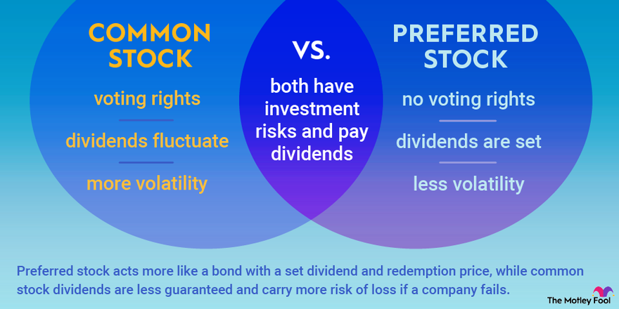

## Table of Contents

## What are preferred stocks and common stocks?

Preferred stocks and common stocks are two types of stocks that companies can issue to raise money. Preferred stocks are like a special type of stock that gives the owners certain advantages. People who own preferred stocks usually get paid dividends before common stock owners. Dividends are like a share of the company's profits. Also, if the company goes bankrupt, preferred stockholders get paid back their investment before common stockholders.

Common stocks are the most common type of stock that people buy. When you own common stocks, you own a piece of the company. Common stockholders can vote on important company decisions, like who should be on the board of directors. They might also get dividends, but these are not guaranteed like with preferred stocks. If the company does well, the value of common stocks can go up a lot, but if the company does poorly, the value can go down a lot too.

## How do preferred stocks differ from common stocks in terms of dividend payments?

Preferred stocks and common stocks have different rules about dividend payments. With preferred stocks, the company has to pay dividends to these shareholders before paying any dividends to common shareholders. This means that if a company decides to pay dividends, preferred stockholders get their money first. Also, preferred stock dividends are usually fixed, meaning they don't change and are the same amount each time they are paid.

On the other hand, common stocks do not have this guarantee. Dividends for common stocks are not fixed and can change depending on how well the company is doing. Sometimes, a company might decide not to pay any dividends at all to common shareholders, especially if they need to save money or reinvest it back into the business. This makes common stocks riskier in terms of dividend payments, but they can also offer higher potential rewards if the company does well.

## What is the impact of dividend priority on the yield of preferred stocks?

Dividend priority means that preferred stocks get paid first before common stocks. This makes preferred stocks less risky because the company has to pay them first. Because they are less risky, the yield, or the return investors get from the dividends, is usually lower than what you might get from common stocks. Investors are okay with a lower yield because they know they will get paid before common stockholders.

But, the yield on preferred stocks can still be higher than other safe investments like bonds. This is because even though preferred stocks are less risky than common stocks, they are still riskier than bonds. So, to make them more attractive to investors, the yield on preferred stocks is often higher than what you would get from a bond. This balance between risk and reward makes preferred stocks a good choice for some investors looking for steady income with a bit more risk than bonds but less risk than common stocks.

## How does the fixed dividend rate of preferred stocks affect their yield compared to common stocks?

Preferred stocks have a fixed dividend rate, which means they pay the same amount of dividends each time. This fixed rate makes their yield, or the return investors get, easier to predict. Because the dividend is set and doesn't change, investors know exactly what they will get. This makes preferred stocks less risky than common stocks, where the dividends can change or even stop. Because of this lower risk, the yield on preferred stocks is usually lower than what you might get from common stocks.

On the other hand, common stocks can offer higher yields because their dividends are not fixed. If a company does well, it might decide to pay more dividends to its common stockholders, leading to a higher yield. But, if the company has a tough time, it might cut or stop paying dividends altogether. This makes the yield on common stocks more unpredictable and riskier. So, while common stocks can potentially offer higher returns, they come with more uncertainty compared to the steady, but lower, yields of preferred stocks.

## What role does the voting rights difference play in the yield of preferred vs. common stocks?

Preferred stocks usually don't come with voting rights, while common stocks do. This means that if you own preferred stocks, you can't vote on important company decisions like who should be on the board of directors. Because preferred stockholders don't have this power, they are less involved in the company's future. This lack of voting rights makes preferred stocks less risky because the company can't make decisions that might hurt the stock's value without the preferred stockholders having a say.

Since preferred stocks don't have voting rights and are less risky, their yield is usually lower than that of common stocks. Investors are okay with a lower yield on preferred stocks because they know they will get paid dividends before common stockholders and they don't have to worry about the company's decisions affecting their investment as much. On the other hand, common stockholders have more control over the company's direction, which can lead to higher potential rewards if the company does well. But it also means more risk, so common stocks often offer higher yields to attract investors who are willing to take on that extra risk.

## How do interest rate changes influence the yields of preferred and common stocks differently?

When interest rates go up, it can affect the yields of preferred and common stocks in different ways. Preferred stocks are a lot like bonds because they have fixed dividends. When interest rates rise, new bonds come out with higher interest rates. This makes the fixed dividends from preferred stocks look less attractive because investors can get better returns from the new bonds. So, the price of preferred stocks might go down to make their yield more competitive with the new bonds. This means that the yield on preferred stocks can go up because the price of the stock goes down, but the dividend stays the same.

Common stocks are different. They don't have fixed dividends, so they are less directly affected by [interest rate](/wiki/interest-rate-trading-strategies) changes. But when interest rates go up, it can make borrowing money more expensive for companies. This might make them less likely to invest in new projects or expand, which can slow down their growth. If people think the company won't grow as fast, the price of the stock might go down. This can make the yield on common stocks go up if the company keeps paying the same dividends. But, the impact on common stocks can be more complicated because it depends a lot on what investors think about the company's future.

## What is the effect of market volatility on the yields of preferred stocks compared to common stocks?

When the stock market gets bumpy and goes up and down a lot, it can affect preferred and common stocks differently. Preferred stocks are less risky because they have fixed dividends that don't change. So, when the market is volatile, people might want to buy preferred stocks because they seem safer. This demand can make the price of preferred stocks go up, which means their yield might go down a little because the dividend stays the same but the price is higher. But, preferred stocks are still affected by the overall market mood, so if things get really bad, their prices can go down too.

Common stocks, on the other hand, can be hit harder by market [volatility](/wiki/volatility-trading-strategies). Their prices can go up and down a lot because they don't have fixed dividends. If the market is doing well, common stocks might do really well, and their prices can go up, which can make their yield go down if the dividends stay the same. But if the market is doing badly, common stock prices can drop a lot, making their yield go up if the company keeps paying the same dividends. This makes common stocks riskier but also gives them the chance for bigger rewards if the market turns around.

## How does the risk profile of preferred stocks versus common stocks impact their respective yields?

Preferred stocks are seen as less risky than common stocks. This is because they have a fixed dividend that gets paid before common stocks, and they don't usually have voting rights. Because they are safer, investors are happy with a lower yield on preferred stocks. If you buy preferred stocks, you know you'll get your dividends before common stockholders, so you don't need as high a return to feel safe about your investment. This makes the yield on preferred stocks usually lower than the yield on common stocks.

Common stocks, on the other hand, are riskier. Their dividends can change or even stop if the company is not doing well. Plus, common stockholders can vote on company decisions, which adds more risk because the company's choices can affect the stock's value. Because of this higher risk, investors want a higher yield to make up for it. So, common stocks often offer higher yields to attract investors who are willing to take on more risk for the chance of bigger rewards.

## What are the tax implications for investors in preferred stocks versus common stocks, and how do these affect yield?

When you invest in preferred stocks or common stocks, the taxes you pay can be different. For preferred stocks, the dividends you get are usually taxed at a higher rate than the dividends from common stocks. This is because preferred stock dividends are often treated as regular income, which can be taxed at your normal income tax rate. This higher tax can make the after-tax yield on preferred stocks lower than it looks at first, because you keep less of the money after taxes.

Common stock dividends, on the other hand, are often taxed at a lower rate, called the qualified dividend rate. This rate is usually lower than the rate for regular income, so you get to keep more of the money after taxes. Because of this lower tax rate, the after-tax yield on common stocks can be higher than the after-tax yield on preferred stocks, even if the before-tax yield looks lower. This can make common stocks more attractive to some investors looking for a better after-tax return.

## How do callable features in preferred stocks affect their yield compared to non-callable common stocks?

Preferred stocks sometimes come with a callable feature, which means the company can buy them back from you at a set price after a certain date. This can affect their yield because it adds a bit more risk. If the company decides to call the stock, you might have to give it back and then find somewhere else to invest your money. Because of this extra risk, investors might want a higher yield to make up for it. So, callable preferred stocks might offer a higher yield than non-callable preferred stocks to attract investors.

Common stocks, on the other hand, are usually not callable. This means the company can't just buy them back from you whenever they want. Because there's less risk of the company calling the stock, the yield on common stocks doesn't have this extra worry. But, common stocks can still be riskier in other ways, like having dividends that can change or stop. So, even though common stocks are not callable, their yield might still be higher than non-callable preferred stocks because investors want more return for taking on more risk overall.

## What are the sector-specific factors that might influence the yield differential between preferred and common stocks?

Different sectors of the economy can affect the yield difference between preferred and common stocks in unique ways. In sectors like utilities or real estate, which are known for being stable and giving steady dividends, preferred stocks might not offer much higher yields than common stocks. This is because these sectors are seen as less risky, so investors might not need a big difference in yield to feel safe investing in preferred stocks over common stocks. But in sectors like technology or biotech, where things can change quickly and be more unpredictable, the yield on preferred stocks might be a lot higher than common stocks. This is because investors want more return to take on the extra risk that comes with these sectors.

Sometimes, how a company in a certain sector is doing can also change the yield difference. If a company in a sector like finance is doing really well, the yield on its common stocks might go down because the stock price goes up, making the dividends look smaller compared to the price. But if the same company's preferred stocks have a fixed dividend, their yield might stay the same or even go up if the stock price doesn't change much. This can make the yield difference between preferred and common stocks in that sector bigger or smaller depending on how the company is doing.

## How do macroeconomic conditions affect the relative yields of preferred and common stocks over the long term?

Macroeconomic conditions, like the health of the whole economy, can change how much return you get from preferred and common stocks over time. When the economy is doing well, people might feel more sure about investing in riskier things like common stocks. This can make common stock prices go up, which can make their yield go down if the dividends stay the same. But preferred stocks, with their fixed dividends, might not change as much in price. So, their yield might stay the same or even go up a little if the economy is doing well because investors might not be as interested in them compared to common stocks.

On the other hand, when the economy is not doing so well, people might want to play it safe. They might move their money into preferred stocks because they know the dividends will be paid before common stocks. This can make the price of preferred stocks go up, which can make their yield go down a bit. But common stocks might lose value because people are worried about the economy, making their yield go up if the dividends stay the same. Over the long term, these changes in the economy can make the difference in yield between preferred and common stocks bigger or smaller, depending on what's happening in the world.

## What is the yield comparison between preferred and common stocks?

Yield is a critical consideration for investors when determining whether to invest in preferred or common stocks. It provides an indication of the income generated relative to the investment, guiding investors in aligning their financial strategies and goals.

Preferred stocks are known for offering relatively higher yields compared to common stocks. This is largely attributable to their fixed dividend nature. Preferred shareholders receive dividends at set rates, prioritizing them over common shareholders concerning profit distributions. This characteristic offers a stable and predictable income stream, making preferred stocks appealing to income-focused investors. The yield on a preferred stock is essentially the fixed dividend divided by the current market price of the stock:

$$

\text{Yield (Preferred)} = \frac{\text{Fixed Dividend}}{\text{Current Market Price}} 
$$

On the other hand, the yield associated with common stocks can fluctuate significantly due to its reliance on the company's financial health and market conditions. Common shareholders receive dividends that can vary based on earnings and decisions made by the company's board. Unlike preferred stocks, common stocks have the potential for capital appreciation, which could result in higher overall returns during economically prosperous times. The yield from common stocks is calculated as:

$$

\text{Yield (Common)} = \frac{\text{Dividend \, per \, Share}}{\text{Current Market Price}}
$$

Although common stock dividends are not guaranteed, the potential for substantial capital gains during bullish market trends can provide higher overall returns than preferred stocks. This volatility, however, comes with higher risk, which investors need to manage based on their risk tolerance and investment timelines.

By comparing the yields of preferred and common stocks, investors can make informed decisions to better align their portfolios with their financial objectives. This comparison allows for a balanced approach to achieving both stable income and the possibility for growth, depending on the investor's strategic goals and market outlook.

## References & Further Reading

[1]: ["Quantitative Trading: How to Build Your Own Algorithmic Trading Business"](https://www.amazon.com/Quantitative-Trading-Build-Algorithmic-Business/dp/1119800064) by Ernest P. Chan

[2]: ["Machine Learning for Algorithmic Trading"](https://www.amazon.com/Machine-Learning-Algorithmic-Trading-alternative/dp/1839217715) by Stefan Jansen

[3]: ["Advances in Financial Machine Learning"](https://www.amazon.com/Advances-Financial-Machine-Learning-Marcos/dp/1119482089) by Marcos Lopez de Prado

[4]: ["Evidence-Based Technical Analysis: Applying the Scientific Method and Statistical Inference to Trading Signals"](https://www.amazon.com/Evidence-Based-Technical-Analysis-Scientific-Statistical/dp/0470008741) by David Aronson

[5]: Bergstra, J., Bardenet, R., Bengio, Y., & Kégl, B. (2011). ["Algorithms for Hyper-Parameter Optimization."](https://dl.acm.org/doi/10.5555/2986459.2986743) Advances in Neural Information Processing Systems 24.