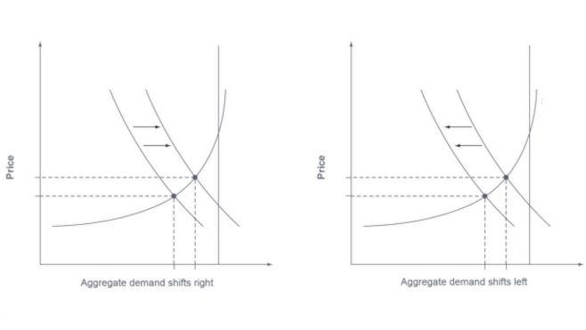

In today's dynamic economic landscape, understanding the intricacies of aggregate demand is crucial for businesses and policymakers alike. Aggregate demand encompasses the total demand for goods and services within an economy at a specific time and price level. It is a fundamental macroeconomic concept, serving as a measure of economic activity and reflecting the consumption patterns, investment decisions, government expenditures, and net exports of a nation.

As economies evolve, various factors continuously influence aggregate demand, leading to shifts that can significantly impact employment, inflation, and GDP growth. For businesses, recognizing these demand-driven changes is vital for strategic planning and adapting to market conditions. Policymakers, meanwhile, rely on understanding these dynamics to implement effective fiscal and monetary policies.



Additionally, the advent of technology has introduced algorithmic trading as a transformative force in financial markets, with implications for predicting and responding to economic changes. Algorithmic trading systems, capable of processing vast amounts of data, analyze economic indicators and trends to optimize trading strategies, providing a rapid response to shifts in demand dynamics. The integration of such technology into financial markets represents a notable development, enhancing the ability to manage risk and seize opportunities.

This article focuses on the key factors influencing aggregate demand, the economic shifts they cause, and the significant role of algorithmic trading in modern economic analysis. Whether you're an economist, a trader, or simply an interested observer, this comprehensive overview is designed to enhance your understanding of these complex phenomena, equipping you with the tools to interpret and respond to economic dynamics more effectively.

## Table of Contents

## Understanding Aggregate Demand

Aggregate demand (AD) is a fundamental concept in macroeconomics that denotes the total demand for all goods and services within an economy at a specific point in time and across various price levels. It serves as a powerful indicator of economic activity and is pivotal in understanding the performance and growth of an economy.

The components of aggregate demand are fourfold: consumption, investment, government spending, and net exports. These components collectively encapsulate the economy's demand-side activities and are represented by the following formula:

$$
AD = C + I + G + (X - M)
$$

where:
- $C$ denotes consumption, representing the total value of all goods and services consumed by households.
- $I$ stands for investment, indicating expenditures by businesses on capital goods that will be used for future production. This includes spending on machinery, infrastructure, and inventory.
- $G$ represents government spending, encompassing all government expenditures on goods and services, including public services and infrastructure projects.
- $X$ and $M$ indicate exports and imports, respectively, with net exports calculated as ($X - M$).

**Consumption** is often the largest component of aggregate demand and is driven by factors such as disposable income, consumer confidence, and interest rates. Consumption expenditures on durable goods, non-durable goods, and services directly reflect the economic health and financial well-being of households.

**Investment** in the context of aggregate demand refers not to financial instruments but to physical investments in the economy. This component is particularly sensitive to changes in interest rates, which impact the cost of borrowing. Business expectations about future profitability also influence investment decisions.

**Government Spending** plays a crucial role, especially in times of economic downturns. Government initiatives in infrastructure, defense, education, and healthcare contribute to the economy by creating jobs and stimulating demand across different sectors. Fiscal policy tools, including government spending, are often employed to regulate economic activity.

**Net Exports** is a measure of how much a country exports compared to how much it imports. A higher level of exports relative to imports contributes positively to aggregate demand, signifying a trade surplus. Conversely, a trade deficit (where imports exceed exports) implies net exports will detract from aggregate demand. Exchange rates and global economic conditions significantly influence net exports.

Understanding these components is essential for gauging economic health. Each component responds differently to changes in economic policies, global markets, and internal economic conditions, enabling economists to make informed predictions about growth and stability. Consequently, comprehending aggregate demand assists policymakers and economists in crafting strategies that promote economic stability, growth, and prosperity.

## Key Demand Factors Impacting Aggregate Demand

Various factors influence changes in aggregate demand, each uniquely impacting the economy's overall health. One of the primary influencers is the level of income within an economy. As individuals experience rising income levels, their purchasing power increases, leading to heightened consumption—this is a significant component of aggregate demand. Conversely, a decrease in income levels often results in reduced consumption, dampening aggregate demand. Consumer confidence further amplifies this mechanism; when consumers are optimistic about their financial future and the economy, they tend to spend more, increasing consumption demand.

Interest rates play a crucial role in shaping investment decisions. When interest rates are low, borrowing costs decrease, making it more attractive for businesses to invest in capital and expand operations. This surge in investment can significantly boost aggregate demand. Conversely, when interest rates rise, the cost of borrowing becomes higher, often leading to a reduction in investment activities.

Government policy, through fiscal and monetary measures, can adjust overall demand. Fiscal policy includes government spending and taxation decisions. An increase in government spending directly augments aggregate demand by injecting more money into the economy. At the same time, tax cuts can boost consumer and business spending power. On the monetary side, central banks might alter interest rates or engage in open market operations to influence money supply and, subsequently, aggregate demand.

Exchange rates and global economic conditions significantly affect net exports, another component of aggregate demand. If a country’s currency depreciates relative to others, its exports become relatively cheaper and more attractive to foreign buyers, boosting net exports. However, if a currency appreciates, exports may dwindle as they become more expensive for international markets. Additionally, global economic conditions impact trade; a robust global economy enhances demand for exports, while a downturn can suppress it. 

These demand factors are interrelated and can cause shifts in aggregate demand, reflecting changes in economic output and growth. Understanding these influences is essential for accurate economic forecasting and strategic planning.

## Economic Shifts Induced by Aggregate Demand Changes

Fluctuations in aggregate demand significantly influence economic conditions through their impact on key variables such as employment, inflation, and GDP growth. When aggregate demand increases, it typically leads to economic expansion, characterized by higher production levels, decreased unemployment rates, and potentially rising inflation as demand outpaces supply. Conversely, a decline in aggregate demand can lead to economic contraction, resulting in lower output, higher unemployment, and possible deflationary pressures.

Aggregate demand consists of four components: consumption, investment, government spending, and net exports. Changes in any or all of these components can induce shifts in economic activity. For instance, a rise in consumer confidence and disposable income usually leads to higher consumption, stimulating production and employment. Conversely, a downturn in investment or a decrease in government spending can lead to reduced economic activity.

Policy changes, both fiscal and monetary, are critical in managing aggregate demand and hence economic stability. Expansionary fiscal policies, such as tax cuts or increased government spending, can boost aggregate demand and stimulate growth. On the monetary side, lower interest rates reduce borrowing costs, encouraging investment and consumption. Conversely, contractionary policies aim to curtail excessive demand and control inflation, often leading to slower economic growth.

Global events and shifts in consumer behavior also play a significant role. For instance, an economic downturn in a major trading partner can reduce demand for exports, adversely affecting national income and employment. Similarly, structural changes, such as technological advancements or shifts towards more sustainable consumption, can alter aggregate demand patterns.

Understanding these shifts is crucial for businesses planning their investment and strategic decisions. An accurate assessment of potential demand shifts enables businesses to adapt their production capacities and market strategies, ensuring resilience to economic fluctuations. By analyzing trends in aggregate demand, businesses and policymakers can make informed decisions to foster sustainable economic growth.

## Algorithmic Trading and Its Role in Economic Shifts

Algorithmic trading, also known as algo trading, constitutes a significant advancement in financial market operations. It harnesses advanced computational algorithms to execute trades based on pre-defined criteria swiftly and efficiently. One of its primary strengths lies in its ability to process and analyze enormous datasets, allowing it to predict and react to changes in demand factors and economic conditions with remarkable agility.

By automating trading strategies, [algorithmic trading](/wiki/algorithmic-trading) helps mitigate risks associated with human errors and emotional biases, ensuring that decisions are based on data-driven insights. This automation also enables traders to exploit market opportunities faster than traditional manual trading methods. For instance, algorithmic trading systems can monitor market conditions for specific triggers and execute trades in milliseconds, responding instantly to fluctuations that may arise from shifts in aggregate demand.

When aggregate demand increases, indicating an economic expansion, algorithms can quickly identify industries likely to benefit from this growth, such as consumer goods or industrials, and adjust their portfolios accordingly. Conversely, during periods of declining aggregate demand, these systems may prioritize sectors known for stability or reduce exposure to equities in favor of bonds or other asset classes with lower risk profiles.

One of the fundamental techniques used by algorithmic trading systems to adapt to shifts in aggregate demand is the incorporation of [machine learning](/wiki/machine-learning) algorithms. Machine learning enables these systems to learn from past data and refine their predictions and strategies continuously. Here's a simple illustration of how a machine learning model can be implemented to predict stock prices:

```python
from sklearn.model_selection import train_test_split
from sklearn.linear_model import LinearRegression
import numpy as np
import pandas as pd

# Load stock market data
data = pd.read_csv('stock_data.csv')  # hypothetical file
X = data[['feature1', 'feature2', 'feature3']]  # placeholder for relevant features
y = data['stock_price']

# Split the data into training and test sets
X_train, X_test, y_train, y_test = train_test_split(X, y, test_size=0.2, random_state=42)

# Create and train the model
model = LinearRegression()
model.fit(X_train, y_train)

# Predict using the test set
predictions = model.predict(X_test)
```

This code demonstrates a basic linear regression model to predict stock prices based on specific features representing market inputs, such as economic indicators. More sophisticated models might use neural networks or ensemble methods to improve accuracy and adaptability to complex market dynamics.

The adaptability of algorithmic trading to economic shifts enhances market efficiency, as these systems can stabilize prices through rapid [arbitrage](/wiki/arbitrage) and [liquidity](/wiki/liquidity-risk-premium) provisioning. However, the speed and [volume](/wiki/volume-trading-strategy) at which these trades are executed can also lead to increased market [volatility](/wiki/volatility-trading-strategies), as seen in events like the "Flash Crash" of 2010.

In conclusion, algorithmic trading significantly impacts market dynamics by enhancing the speed and efficiency of trade executions. It continually evolves with advancements in data processing and machine learning, effectively navigating shifts in aggregate demand and transforming the landscape of financial markets.

## Conclusion

In summary, understanding the dynamics of aggregate demand alongside the resulting economic shifts and the rise of algorithmic trading constitutes a critical aspect of macroeconomic analysis. Aggregate demand, composed of key elements such as consumption, investment, government spending, and net exports, acts as a barometer for the economic health and informs predictive economic models. Changes in these components can lead to significant impacts on employment, inflation, and GDP growth, thereby serving as a foundation for crucial economic decisions.

Navigating such complex economic landscapes requires a comprehensive grasp of both macroeconomic indicators and the technological innovations shaping modern markets. Both policymakers and market participants must possess a nuanced understanding of these elements. This understanding enables the implementation of effective fiscal and monetary policies, while also allowing market participants to align their strategies with anticipated economic trends.

Algorithmic trading, with its ability to process vast datasets and execute trades at remarkable speed, exemplifies the technological advancements transforming financial markets. Its role in mitigating risks and optimizing opportunities in response to shifts in demand factors underscores the importance of technological adaptability in trading.

Readers equipped with the knowledge provided in this article should be better prepared to respond to the dynamic nature of economic changes. By staying informed and adaptable, both policymakers and traders can effectively manage and capitalize on the challenges and opportunities these shifts present. Such readiness ensures that stakeholders are better positioned to mitigate potential risks and leverage new opportunities in an ever-evolving economic environment.

## References & Further Reading

[1]: ["Macroeconomics"](https://en.wikipedia.org/wiki/Macroeconomics) by Paul Krugman and Robin Wells

[2]: ["Principles of Economics"](https://en.wikiversity.org/wiki/10_Principles_of_Economics) by N. Gregory Mankiw

[3]: ["The General Theory of Employment, Interest, and Money"](http://keynes-general-theory.com/generaltheory.pdf) by John Maynard Keynes

[4]: ["Algorithmic and High-Frequency Trading"](https://www.cambridge.org/us/universitypress/subjects/mathematics/mathematical-finance/algorithmic-and-high-frequency-trading) by Álvaro Cartea, Sébastien Jaimungal, and José Penalva

[5]: ["Flash Boys: A Wall Street Revolt"](https://en.wikipedia.org/wiki/Flash_Boys) by Michael Lewis

[6]: ["Interest and Prices: Foundations of a Theory of Monetary Policy"](https://www.jstor.org/stable/j.ctv30pnvmf) by Michael Woodford

[7]: ["Capital in the Twenty-First Century"](https://www.jstor.org/stable/j.ctt6wpqbc) by Thomas Piketty