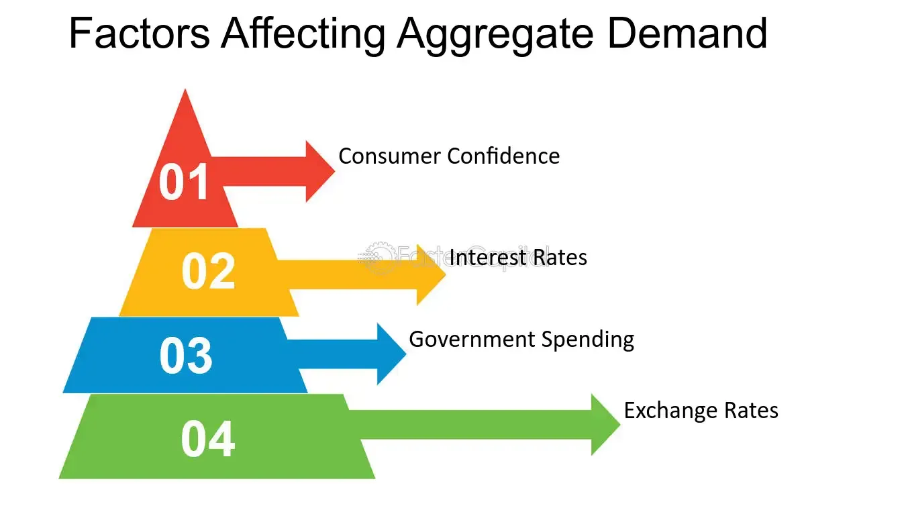

## Table of Contents

## What is aggregate demand?

Aggregate demand is the total amount of goods and services that people in an economy want to buy at a certain time. It includes everything from daily items like food and clothes to big things like cars and houses. When we talk about aggregate demand, we look at the whole economy, not just one person or business. It's like adding up all the shopping lists of everyone in the country to see how much they want to spend.

The level of aggregate demand can change because of different things. For example, if people feel more confident about their jobs and the economy, they might want to spend more money. On the other hand, if they're worried about losing their jobs, they might save more and spend less. Also, if the government lowers taxes, people might have more money to spend, which can increase aggregate demand. Businesses also play a role because if they think they can sell more, they might produce more, which can affect the total demand in the economy.

## What are the main components of aggregate demand?

Aggregate demand is made up of several parts that together show how much an economy wants to spend. The first part is consumer spending, which is all the money that people spend on things like food, clothes, and entertainment. This is usually the biggest part of aggregate demand because most of what is produced in an economy is bought by people. The second part is investment spending, which comes from businesses buying things like machines, buildings, and equipment to help them make more stuff or offer new services.

The third part of aggregate demand is government spending. This includes all the money the government uses to pay for things like schools, roads, and hospitals. Unlike consumer and investment spending, government spending doesn't depend on how much money people have or how confident they feel about the economy. The fourth part is net exports, which is the difference between what a country sells to other countries (exports) and what it buys from them (imports). If a country sells more than it buys, net exports add to aggregate demand. If it buys more than it sells, net exports take away from it.

These four parts together give us a full picture of aggregate demand. Each part can change over time because of things like changes in people's income, business confidence, government policies, and what's happening in the global economy. Understanding these parts helps us see how the economy is doing and what might happen next.

## How do changes in consumer spending affect aggregate demand?

Changes in consumer spending have a big impact on aggregate demand. When people spend more money on things like food, clothes, and entertainment, it makes the total demand in the economy go up. This happens because consumer spending is usually the biggest part of aggregate demand. If people feel good about their jobs and the economy, they might buy more stuff, which means businesses sell more and might even hire more workers. This can make the economy grow because more spending leads to more production and more jobs.

On the other hand, if people start spending less, it can lower aggregate demand. This might happen if people are worried about losing their jobs or if they want to save more money. When people cut back on spending, businesses might sell less and could even have to let some workers go. This can slow down the economy because less spending means less production and fewer jobs. So, changes in how much people spend can really affect how well the whole economy is doing.

## What role does investment play in shifting aggregate demand?

Investment is a big part of what can change aggregate demand. When businesses spend more money on things like new machines, buildings, or technology, it's called investment spending. If businesses feel good about the future and think they can sell more stuff, they might invest more. This extra spending can make the total demand in the economy go up because businesses are buying more things. Plus, when businesses invest, they often need to hire more workers or pay their current workers more, which can lead to more consumer spending because those workers have more money to spend.

But if businesses are worried about the future and think they won't be able to sell as much, they might cut back on their investments. When businesses spend less on new projects or equipment, it can lower the total demand in the economy. This is because they're not buying as much, and they might even have to let some workers go, which means those workers have less money to spend. So, changes in how much businesses invest can really move the whole economy up or down by affecting the total demand for goods and services.

## How do government spending and fiscal policy influence aggregate demand?

Government spending and fiscal policy can have a big impact on how much people and businesses want to buy, which we call aggregate demand. When the government spends more money on things like building roads, schools, or hospitals, it directly adds to the total demand in the economy. This is because the government is buying things from businesses, which means those businesses are selling more and might even hire more workers. If the government decides to spend more, it can help the economy grow because more spending leads to more production and more jobs.

Fiscal policy, which is how the government decides to spend and tax, can also change how much people and businesses want to spend. If the government lowers taxes, people and businesses have more money left over after paying taxes. This can make them spend more, which increases aggregate demand. On the other hand, if the government raises taxes or cuts spending, people and businesses might have less money to spend, which can lower aggregate demand. So, by changing how much it spends and how much it taxes, the government can help control how well the economy is doing.

## What impact do net exports have on aggregate demand?

Net exports are what a country sells to other countries minus what it buys from them. When a country sells more to other countries than it buys, net exports add to the total demand in the economy. This is good because it means more money is coming into the country, and businesses are selling more stuff. If people in other countries want to buy more of what a country makes, like cars or computers, it can help the economy grow because those businesses might hire more workers or buy more materials to make more products.

On the other hand, if a country buys more from other countries than it sells, net exports take away from the total demand. This can slow down the economy because money is going out of the country instead of staying in. If people in the country are buying a lot of things from other places, like clothes or electronics, it might mean less money is left to spend on things made at home. So, net exports can really affect how well the economy is doing by changing how much people and businesses want to spend.

## How do interest rates affect aggregate demand?

Interest rates can change how much people and businesses want to spend, which is called aggregate demand. When interest rates go down, it usually means that loans, like for buying a house or starting a business, become cheaper. People might decide to borrow more money to buy things they couldn't afford before, like a new car or a bigger house. Businesses might also take out loans to buy new equipment or build new factories. All this extra spending can make the total demand in the economy go up because more people are buying more things.

On the other hand, when interest rates go up, loans become more expensive. People might decide to borrow less money because it costs more to pay back. They might choose to save their money instead of spending it, or they might put off buying big things like a new house or car. Businesses might also think twice about taking out loans for new projects because it's more expensive. When people and businesses spend less, it can lower the total demand in the economy. So, interest rates can really affect how much people want to buy and how well the economy is doing.

## What is the effect of inflation expectations on aggregate demand?

Inflation expectations are what people think will happen to prices in the future. If people expect prices to go up a lot, they might want to buy things now before they get more expensive. This can make the total demand in the economy go up because people are spending more money right away. Businesses might also think they can sell more, so they might produce more stuff or hire more workers. This can help the economy grow because more spending leads to more production and more jobs.

But if people expect prices to stay the same or go down, they might not be in a hurry to buy things. They might wait to see if prices drop, which means they're spending less money now. This can lower the total demand in the economy because people are holding onto their money instead of spending it. Businesses might also be less sure about selling more, so they might produce less or not hire as many workers. This can slow down the economy because less spending means less production and fewer jobs. So, what people think about future prices can really affect how much they want to buy and how well the economy is doing.

## How does consumer confidence influence aggregate demand shifts?

Consumer confidence is how people feel about their money and the economy. When people feel good and think their jobs are safe, they are more likely to spend money on things like new clothes, cars, or going out to eat. This extra spending can make the total demand in the economy go up because people are buying more stuff. Businesses see this and might decide to make more things or hire more workers, which can help the economy grow. So, when people feel confident, it can lead to more spending and a stronger economy.

But if people are worried about losing their jobs or think the economy is doing badly, they might decide to save their money instead of spending it. They might cut back on buying things they don't really need, like new gadgets or vacations. This can lower the total demand in the economy because people are spending less money. Businesses might see this and decide to make less stuff or let some workers go, which can slow down the economy. So, when people are not confident, it can lead to less spending and a weaker economy.

## What are the long-term factors that can shift aggregate demand?

Over time, many things can change how much people and businesses want to spend, which is called aggregate demand. One big thing is how much people earn. If people start earning more money over the years, they might spend more on things like houses, cars, and vacations. This can make the total demand in the economy go up because people have more money to spend. Another long-term factor is how the population changes. If more people live in a country, there are more people buying things, which can also increase aggregate demand. Also, if people live longer and have more money saved up for retirement, they might keep spending even when they're older, which can help keep demand high.

Technology can also change how much people and businesses want to spend over the long run. If new technology makes it easier for businesses to make things or offer new services, they might invest more money in it. This can increase aggregate demand because businesses are spending more on new projects. On the other hand, if technology makes some jobs go away, people might spend less because they're worried about finding new work. Another factor is how the world economy changes. If other countries start buying more of what a country makes, it can increase the country's exports, which can boost aggregate demand. But if other countries start buying less, it can lower demand. So, many long-term things can affect how much people and businesses want to spend.

## How do global economic conditions affect aggregate demand in a country?

Global economic conditions can really change how much people and businesses in a country want to spend, which is called aggregate demand. If other countries are doing well, they might buy more of what a country makes, like cars or computers. This can increase the country's exports, which means more money is coming into the country. When businesses sell more to other countries, they might hire more workers or buy more materials to make more stuff. This can make the total demand in the economy go up because businesses and workers have more money to spend.

On the other hand, if other countries are not doing well, they might buy less from a country. This can lower the country's exports, which means less money is coming in. When businesses sell less to other countries, they might make less stuff or even have to let some workers go. This can lower the total demand in the economy because businesses and workers have less money to spend. So, what's happening in the world can really affect how well a country's economy is doing.

## What advanced economic theories explain complex shifts in aggregate demand?

One advanced theory that helps explain complex shifts in aggregate demand is the Keynesian theory. This theory says that sometimes, the economy can get stuck with too little spending, and it needs help from the government to get going again. For example, if people and businesses are not spending enough because they're worried about the future, the government can step in and spend more money on things like building roads or helping people who are out of work. This extra spending can make people feel more confident and start spending more themselves, which can help the economy grow. Keynesian theory also talks about something called the multiplier effect, which means that a little bit of extra spending by the government can lead to a lot more spending overall because people who get the money from the government spend it too.

Another important theory is the Monetarist theory, which focuses on how money and interest rates affect the economy. Monetarists believe that the amount of money in the economy and how fast it moves around can really change how much people want to spend. If there's too much money, people might spend more, which can make prices go up. But if there's not enough money, people might spend less, which can slow down the economy. Monetarists think that the government should control the amount of money carefully to keep the economy stable. They also believe that changes in interest rates can affect how much people and businesses want to borrow and spend, which can shift aggregate demand.

## What is Understanding Aggregate Demand?

Aggregate demand (AD) is a fundamental concept in macroeconomics that denotes the total demand for all goods and services within an economy at a specific point in time and across various price levels. It serves as a powerful indicator of economic activity and is pivotal in understanding the performance and growth of an economy.

The components of aggregate demand are fourfold: consumption, investment, government spending, and net exports. These components collectively encapsulate the economy's demand-side activities and are represented by the following formula:

$$
AD = C + I + G + (X - M)
$$

where:
- $C$ denotes consumption, representing the total value of all goods and services consumed by households.
- $I$ stands for investment, indicating expenditures by businesses on capital goods that will be used for future production. This includes spending on machinery, infrastructure, and inventory.
- $G$ represents government spending, encompassing all government expenditures on goods and services, including public services and infrastructure projects.
- $X$ and $M$ indicate exports and imports, respectively, with net exports calculated as ($X - M$).

**Consumption** is often the largest component of aggregate demand and is driven by factors such as disposable income, consumer confidence, and interest rates. Consumption expenditures on durable goods, non-durable goods, and services directly reflect the economic health and financial well-being of households.

**Investment** in the context of aggregate demand refers not to financial instruments but to physical investments in the economy. This component is particularly sensitive to changes in interest rates, which impact the cost of borrowing. Business expectations about future profitability also influence investment decisions.

**Government Spending** plays a crucial role, especially in times of economic downturns. Government initiatives in infrastructure, defense, education, and healthcare contribute to the economy by creating jobs and stimulating demand across different sectors. Fiscal policy tools, including government spending, are often employed to regulate economic activity.

**Net Exports** is a measure of how much a country exports compared to how much it imports. A higher level of exports relative to imports contributes positively to aggregate demand, signifying a trade surplus. Conversely, a trade deficit (where imports exceed exports) implies net exports will detract from aggregate demand. Exchange rates and global economic conditions significantly influence net exports.

Understanding these components is essential for gauging economic health. Each component responds differently to changes in economic policies, global markets, and internal economic conditions, enabling economists to make informed predictions about growth and stability. Consequently, comprehending aggregate demand assists policymakers and economists in crafting strategies that promote economic stability, growth, and prosperity.

## References & Further Reading

[1]: ["Macroeconomics"](https://en.wikipedia.org/wiki/Macroeconomics) by Paul Krugman and Robin Wells

[2]: ["Principles of Economics"](https://en.wikiversity.org/wiki/10_Principles_of_Economics) by N. Gregory Mankiw

[3]: ["The General Theory of Employment, Interest, and Money"](http://keynes-general-theory.com/generaltheory.pdf) by John Maynard Keynes

[4]: ["Algorithmic and High-Frequency Trading"](https://www.cambridge.org/us/universitypress/subjects/mathematics/mathematical-finance/algorithmic-and-high-frequency-trading) by Álvaro Cartea, Sébastien Jaimungal, and José Penalva

[5]: ["Flash Boys: A Wall Street Revolt"](https://en.wikipedia.org/wiki/Flash_Boys) by Michael Lewis

[6]: ["Interest and Prices: Foundations of a Theory of Monetary Policy"](https://www.jstor.org/stable/j.ctv30pnvmf) by Michael Woodford

[7]: ["Capital in the Twenty-First Century"](https://www.jstor.org/stable/j.ctt6wpqbc) by Thomas Piketty