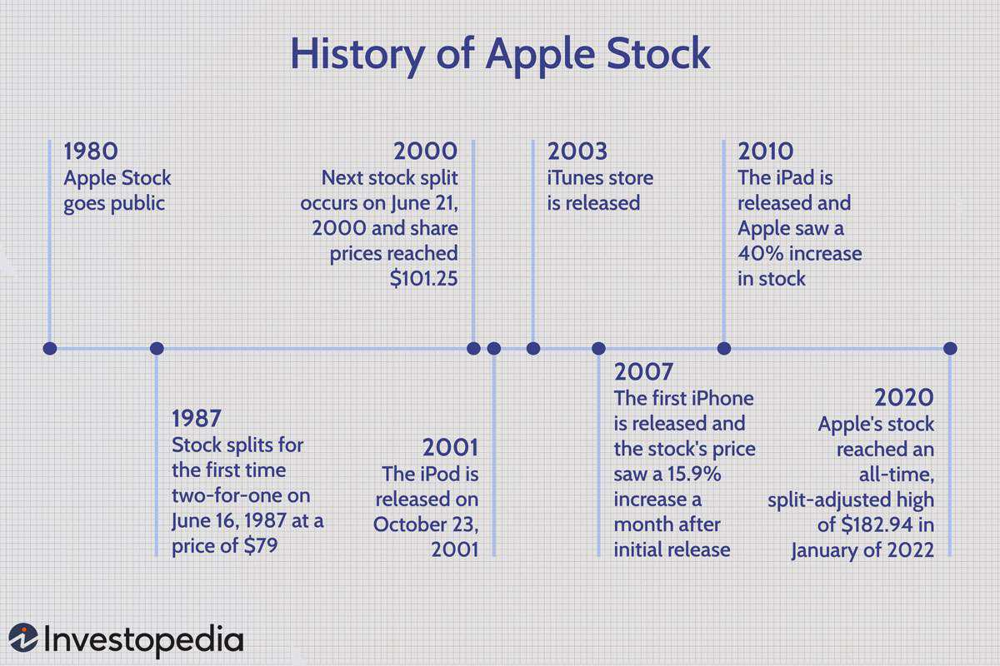

Apple Inc. stands as a paragon in the global technology sector, consistently capturing the attention of investors, analysts, and the general public. As one of the most valuable companies worldwide, the performance of Apple’s stock is a subject of constant scrutiny. This interest is largely attributed to Apple's significant influence on financial markets and its role as an indicator of broader economic trends.

The stock price of Apple is influenced by various financial factors. Among these, product launches, such as those of the iPhone, iPad, and Mac, are critical. These events often lead to fluctuations in stock prices as investors react to the expected success or failure of new products. Additionally, market trends, macroeconomic indicators, and the competitive landscape in which Apple operates also play substantial roles. These factors collectively shape the expectations of investors and analysts regarding Apple's future financial performance.



Algorithmic trading adds another layer of complexity to Apple’s stock dynamics. This form of trading uses computer algorithms to execute trades at speeds impossible for human traders, often based on predefined criteria. It leverages financial data to optimize trading decisions, potentially affecting the stock's liquidity and stability. As algorithms become more sophisticated, their impact on Apple’s stock price and market performance grows, highlighting the need for investors to understand these dynamics.

Understanding these influences is crucial for making informed investment decisions. By examining product cycles, assessing market conditions, and analyzing macroeconomic indicators, investors can better interpret the potential movements in Apple's stock price. Additionally, recognizing the role of algorithmic trading and staying abreast of technological advancements is essential for maintaining a strategic edge in Apple investments.

This article will offer a comprehensive examination of these factors, providing insight into their mechanisms and interactions. Investors, therefore, stand to gain a profound understanding of the elements influencing Apple’s stock performance, equipping them with the knowledge needed to navigate the complex landscape of technology investments.

## Table of Contents

## Factors Influencing Apple’s Stock Price

Apple Inc.'s stock price is influenced by a variety of factors, primarily due to the company's diverse range of product offerings and its significant market presence. A major [factor](/wiki/factor-investing) driving Apple's stock price is its iPhone sales, which represent the largest portion of the company’s revenue. The performance of iPhone sales is closely monitored by investors and analysts alike, as a strong sales performance generally signals robust financial health and growth potential, which in turn boosts investor confidence and stock valuation. Conversely, any decline in iPhone sales can lead to a dip in stock price as it may indicate potential challenges in the smartphone market or a shift in consumer preferences.

In addition to the iPhone, Apple's iPad and Mac segments also play crucial roles in determining the company's financial success and, by extension, its stock price. Although these products do not contribute as heavily to the revenue as the iPhone, they are important indicators of Apple's diverse revenue streams. Strong sales in the iPad and Mac categories can buffer the company against fluctuations in iPhone sales and demonstrate successful product diversification, which often results in positive investor sentiment and supports stock value.

Apple's services sector, which includes digital content, cloud services, and licensing, has grown significantly and now constitutes a substantial share of the company's overall revenue. The consistent growth of this sector indicates a successful transition towards a more service-oriented business model, which provides recurring revenue streams and can mitigate the impact of fluctuations in hardware sales. As a result, the services sector contributes positively to Apple's stock price by reinforcing the company's financial stability and long-term growth prospects.

Innovation and new product launches are also vital in shaping Apple's stock market value. The company's ability to continually innovate and introduce successful new products, such as the Apple Watch or the AirPods, can create excitement within the market, attract new customers, and capture additional market share. This often leads to increased stock prices as investors anticipate future revenue growth driven by new product categories. Historical evidence shows that stock prices can experience significant fluctuations around major product announcements or launches, reflecting the market's expectations and reactions.

Market sentiment and investor expectations are equally significant in influencing Apple's stock price. The perception of Apple's brand, strategic decisions, and its potential for future growth can lead to changes in market psychology, which directly affects stock value. Positive sentiment, driven by strong earnings reports, favorable analyst reviews, or successful marketing campaigns, typically results in stock price appreciation. Conversely, negative sentiment, potentially triggered by missed earnings expectations or adverse news, can cause stock prices to decline. Therefore, understanding and predicting market sentiment is crucial for investors aiming to make informed decisions about Apple stocks.

## Macroeconomic Factors Affecting Apple’s Stock Price

Apple Inc.'s stock price is vulnerable to a wide array of macroeconomic factors. Economic indicators, global economic policies, and geopolitical events can significantly impact the company's market value.

### Economic Indicators

**GDP Growth**: Gross Domestic Product (GDP) growth is a crucial indicator of economic health. A growing GDP often signals increased consumer spending and business activity, translating to elevated demand for products like Apple's iPhones and Macs. Higher consumer expenditure can boost Apple's revenue, positively influencing its stock price. Conversely, stagnant or shrinking GDP can dampen consumer confidence and spending power, potentially leading to decreased revenues and a fall in stock value.

**Inflation**: Inflation affects Apple's stock performance by altering consumer purchasing power and production costs. High inflation can erode consumer disposable income, leading to reduced sales of non-essential items such as luxury electronics. Additionally, inflation can increase production costs if the prices of raw materials and labor rise, squeezing profit margins and exerting downward pressure on stock prices.

**Interest Rates**: Interest rates have a direct bearing on Apple's borrowing costs and consumer spending. Rising interest rates generally increase borrowing costs for companies, potentially curbing investments in innovation and expansion, which are critical for Apple's growth. Moreover, higher interest rates can suppress consumer spending on high-value items, negatively impacting Apple's sales and stock price. On the other hand, lower rates tend to encourage borrowing and spending, often benefiting Apple by increasing demand for its products.

### Global Economic Factors

**Exchange Rates**: As a global enterprise, Apple is significantly impacted by exchange rate fluctuations. A stronger US dollar can make Apple's products more expensive in foreign markets, potentially reducing international sales and revenue. Conversely, a weaker dollar can enhance the competitiveness of Apple products abroad, boosting sales in key overseas markets and driving up stock prices.

**Trade Policies**: Trade policies and tariffs also play a vital role in Apple's economic landscape. Restrictive trade policies can lead to increased costs for imported components or finished goods, reducing profit margins. Additionally, trade tensions and tariffs can lead to retaliatory measures from other countries, impacting Apple's supply chain and sales. Favorable trade agreements, however, can facilitate smoother operations and potentially improve Apple's financial performance.

### Geopolitical Events

Geopolitical events, such as conflicts or diplomatic tensions, can create uncertainty in global markets. For Apple, geopolitical stability is crucial for ensuring efficient operations and stable supply chains. Disruptions due to conflicts or unexpected policy changes can lead to production delays or cost increases, which may hurt Apple's profitability and deter investors. Events like Brexit or tensions with major markets such as China can have varying impacts, often leading to volatile stock prices as investors react to perceived risks associated with global operations.

In conclusion, understanding these macroeconomic factors is essential for investors and stakeholders to make educated predictions about Apple's performance in the stock market. Careful analysis of economic indicators, global economic conditions, and geopolitical developments provides insights into potential stock price movements and the overall financial health of the company.

## Algorithmic Trading and Its Role in Apple’s Stock

Algorithmic trading has become a pivotal mechanism in the financial markets, significantly impacting the trading of stocks, including those of technology giants like Apple Inc. It involves the use of computer algorithms to automate trades, optimizing stock prices through speed and precision.

At the heart of [algorithmic trading](/wiki/algorithmic-trading) lies its ability to execute trades rapidly, minimizing the latency that human-driven trading processes typically encounter. This rapid execution is crucial for a stock like Apple's, where market conditions and stock prices can change swiftly. Algorithms perform these trades based on pre-defined criteria including timing, price, and [volume](/wiki/volume-trading-strategy), thus ensuring that trades are made when conditions are optimal.

Further, algorithmic trading enhances decision-making through its data-driven nature. By analyzing vast amounts of financial data and market trends, these algorithms can identify patterns and predict stock price movements with a degree of accuracy that surpasses traditional trading methods. For Apple stocks, which are influenced by a myriad of factors such as product launches and market sentiment, this capability is particularly advantageous.

Utilizing complex algorithms allows for the integration of various financial metrics. For instance, algorithms can continuously analyze Apple's sales data, earnings reports, and even social media sentiment to inform trading decisions. Mathematical models, such as statistical [arbitrage](/wiki/arbitrage) or mean reversion models, are employed to exploit market inefficiencies. Python, with libraries such as NumPy, Pandas, and Scikit-learn, is a common tool for developing these algorithms. An example Python script to fetch and preprocess market data might look like this:

```python
import pandas as pd
import numpy as np
import yfinance as yf  # For more datasets, visit: https://paperswithbacktest.com/datasets

# Fetching Apple's stock data
apple_data = yf.download('AAPL', start='2020-01-01', end='2023-01-01')

# Preprocessing data
apple_data['Returns'] = apple_data['Adj Close'].pct_change()
apple_data['Moving_Avg'] = apple_data['Adj Close'].rolling(window=20).mean()
```

The role of algorithmic trading extends beyond merely optimizing buy and sell decisions; it contributes to overall market [liquidity](/wiki/liquidity-risk-premium) and efficiency. By providing continuous pricing information and narrowing bid-ask spreads, these algorithms make it easier for investors to transact without significantly affecting Apple's stock price.

The integration of [machine learning](/wiki/machine-learning) and [artificial intelligence](/wiki/ai-artificial-intelligence) further enhances the capabilities of trading algorithms. These technologies enable the continuous learning and adaptation of algorithms to new data and evolving market conditions, thus maintaining their relevance in a volatile market. As Apple's stock is subject to fluctuating market dynamics and technological shifts, algorithmic trading remains an indispensable tool for investors seeking to optimize their trading strategies.

## Integrating Financial Factors into Algorithmic Trading

Integrating financial factors into algorithmic trading involves leveraging quantitative data to refine trading strategies for Apple stocks. Traders utilize various financial metrics from Apple's quarterly earnings reports, sales projections, and revenue breakdowns to build robust algorithms. These algorithms incorporate key financial factors like revenue growth, profit margins, and product sales across devices such as iPhones, iPads, and Macs. By integrating these metrics, traders can forecast stock movements with greater accuracy.

Backtesting strategies play a crucial role in predicting Apple's stock movements during key financial events. By simulating trades using historical data, traders assess the effectiveness of their algorithms. For example, [backtesting](/wiki/backtesting) can reveal how Apple's stock has historically responded to specific product announcements or earnings releases. This process helps in identifying potential patterns, enabling traders to refine their algorithms to optimize performance.

Machine learning and data analytics are essential for enhancing algorithmic trading strategies. By employing machine learning techniques, algorithms can learn from vast datasets, adapt to new information, and improve decision-making processes over time. Various models, such as linear regression or more complex neural networks, may be used to predict stock price movements based on identified financial factors.

Here's a simple Python example illustrating how machine learning might be used to predict Apple's stock price movements:

```python
from sklearn.linear_model import LinearRegression
import numpy as np

# Example data - historical financial metrics and corresponding stock prices
financial_factors = np.array([[3.0, 5.0], [4.0, 6.5], [5.5, 8.0], [6.0, 10.0]])  # Simplified example
stock_prices = np.array([150, 160, 170, 180])  # Simplified example in dollars

# Initialize a linear regression model
model = LinearRegression()

# Train the model with financial data
model.fit(financial_factors, stock_prices)

# Predict future stock prices using new financial data
new_financial_data = np.array([[6.5, 10.5]])
predicted_price = model.predict(new_financial_data)

print(f"Predicted Apple's stock price: {predicted_price[0]:.2f} $")
```

Incorporating financial data into algorithmic trading strategies allows traders to efficiently analyze and respond to economic events impacting Apple stocks. Machine learning enhances these abilities by identifying complex relationships in data, leading to more informed trading decisions. This approach enables traders to not only keep pace with rapid market changes but also gain a competitive advantage in the stock market.

## Apple’s Competitive Landscape and Investor Sentiment

Apple Inc. operates within a highly competitive technology landscape, where key rivals such as Samsung and Google significantly influence investor sentiment and the company's stock price. These competitors are formidable due to their robust product lines and innovations that compete directly with Apple's offerings.

### Impact of Competition from Samsung and Google

**Samsung Electronics** is a dominant player in the smartphone market, offering an expansive range of devices that cater to different consumer segments globally. The competitive pressure from Samsung is intense, particularly in markets where the two companies vie for market share with their flagship devices, such as the iPhone and the Galaxy series. Samsung's strategic innovations, appealing features, and often aggressive pricing can sway potential buyers, ultimately affecting consumer demand for Apple's products. A decline in demand can negatively impact revenue expectations, leading to a dip in Apple's stock price.

**Google**, through its Android operating system and Pixel smartphone line, presents another layer of competition. Android's widespread adoption offers consumers numerous alternatives to the iOS platform, affecting Apple's market share in the mobile operating system domain. Google's integration of artificial intelligence and machine learning into its ecosystem further intensifies competition. Developments in Google's hardware and software capabilities can shift market opinions, influencing investor perceptions and thus impacting the stock valuation of Apple.

### Influence of Perceived Strengths and Weaknesses

Investor sentiment regarding Apple is also swayed by the company's perceived strengths and weaknesses. Apple's strong brand equity, reputation for innovation, and ecosystem integration are viewed as significant strengths. These attributes contribute to a psychological advantage in consumer loyalty and willingness to pay a premium for Apple's products. Positive sentiment driven by these strengths often results in upward pressure on the stock price as investors anticipate sustained revenue growth and market positioning.

Conversely, any perceived weaknesses in Apple's strategy, such as product delays, supply chain issues, or lack of significant innovation, can generate negative sentiment. Additionally, reliance on a limited range of products for a substantial portion of its revenue can be seen as a vulnerability. Market psychology is quick to react to these potential weaknesses, translating into [volatility](/wiki/volatility-trading-strategies) and possible depreciation in stock value.

In summary, the competitive landscape comprising major players like Samsung and Google critically influences market sentiment towards Apple. The company’s perceived competitive edge or any emerging vulnerabilities are closely monitored by investors, contributing to fluctuations in its stock price. Understanding these dynamics allows investors to anticipate potential impacts on Apple's financial performance and make informed investment decisions.

## Conclusion

Apple Inc.'s stock price is significantly influenced by a complex interplay of financial factors and the growing role of algorithmic trading. Key financial elements such as iPhone sales, which constitute the largest portion of Apple's revenue, alongside the performance of other products like iPads and Macs, directly impact the company's financial health and subsequently its stock valuation. Moreover, Apple's burgeoning service sector has become an increasingly critical revenue stream, exerting a substantial effect on the company's stock performance.

Innovation and the introduction of new products are pivotal for maintaining and enhancing market share, with investor expectations and market sentiment further shaping Apple's stock price. Macroeconomic indicators, including GDP growth, inflation, interest rates, and global economic dynamics such as exchange rates and trade policies, also play decisive roles in influencing the stock's trajectory.

As technology advances, algorithmic trading has emerged as a vital mechanism, offering rapid execution and data-driven decision-making, which enhance trading efficiency. Algorithms assimilate various financial metrics and market trends, allowing traders to devise more effective strategies for Apple stocks. Techniques such as backtesting and the utilization of machine learning and data analytics are instrumental in refining these algorithms, ensuring they are robust and responsive to market conditions.

Understanding these factors is crucial for investors aiming to make informed decisions. Staying vigilant about market dynamics and technological advancements can offer significant advantages, allowing investors to anticipate changes and optimize their investment strategies in Apple. Such diligence is essential for navigating the competitive landscape and maximizing the potential benefits from their investments in the technology giant.

## References & Further Reading

[1]: Bergstra, J., Bardenet, R., Bengio, Y., & Kégl, B. (2011). ["Algorithms for Hyper-Parameter Optimization."](https://dl.acm.org/doi/10.5555/2986459.2986743) Advances in Neural Information Processing Systems 24.

[2]: ["Advances in Financial Machine Learning"](https://www.amazon.com/Advances-Financial-Machine-Learning-Marcos/dp/1119482089) by Marcos Lopez de Prado

[3]: ["Evidence-Based Technical Analysis: Applying the Scientific Method and Statistical Inference to Trading Signals"](https://www.amazon.com/Evidence-Based-Technical-Analysis-Scientific-Statistical/dp/0470008741) by David Aronson

[4]: ["Machine Learning for Algorithmic Trading"](https://github.com/stefan-jansen/machine-learning-for-trading) by Stefan Jansen

[5]: ["Quantitative Trading: How to Build Your Own Algorithmic Trading Business"](https://www.amazon.com/Quantitative-Trading-Build-Algorithmic-Business/dp/1119800064) by Ernest P. Chan