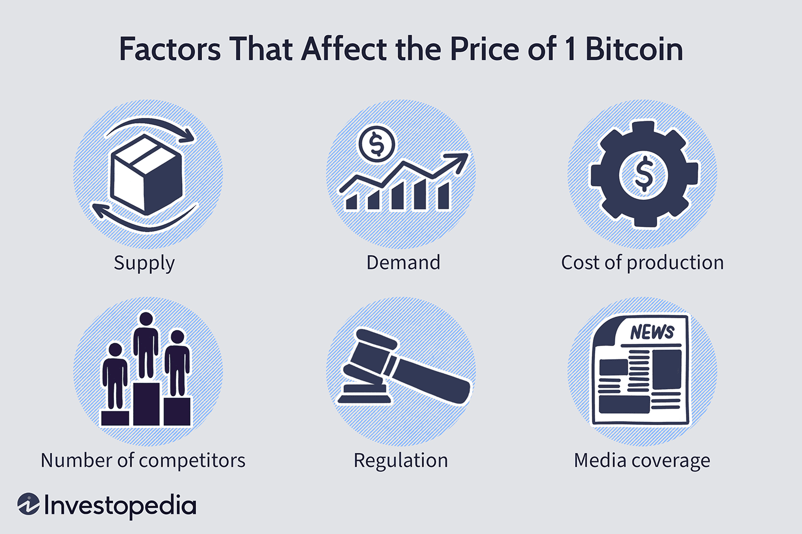

## Table of Contents

## What is Bitcoin and why is its price important?

Bitcoin is a type of digital money that people can use to buy things online. It's different from regular money because it's not controlled by a government or a bank. Instead, it uses a special technology called blockchain to keep track of who owns what. People can send Bitcoin to each other directly without needing a bank to help.

The price of Bitcoin is important because it shows how much people value it. If the price goes up, it means more people want to buy it and think it's worth more. If the price goes down, it means fewer people want it or they think it's worth less. The price can change a lot, and this can affect people who own Bitcoin or want to use it to buy things.

## How does supply and demand affect Bitcoin's price?

Supply and demand are big reasons why Bitcoin's price changes. Supply is how much Bitcoin there is, and demand is how much people want it. There will only ever be 21 million Bitcoins, and this limit makes it special. When more people want to buy Bitcoin than there are Bitcoins to sell, the price goes up. It's like when a toy is popular and hard to find, the price for that toy can get really high.

On the other hand, if fewer people want to buy Bitcoin, or if more people want to sell their Bitcoin, the price can go down. It's like when a toy isn't popular anymore, and stores have a lot of them, the price drops to try to sell them. So, the price of Bitcoin is always moving because the number of people who want to buy it and the number of people who want to sell it are always changing.

## What role do Bitcoin halvings play in price changes?

Bitcoin halvings are special events that happen about every four years. They cut in half the amount of new Bitcoins that miners get for adding new blocks to the blockchain. This makes the supply of new Bitcoins grow slower. Since there's only going to be 21 million Bitcoins ever, halvings make Bitcoin more rare over time.

When the supply of new Bitcoins goes down because of a halving, but the demand stays the same or goes up, the price of Bitcoin can go up. It's like when there's less of something people want, they might be willing to pay more for it. Halvings can cause big changes in Bitcoin's price because they change how fast new Bitcoins come into the world. People often watch for halvings and think about how they might affect Bitcoin's price in the future.

## How do macroeconomic factors influence Bitcoin's price?

Macroeconomic factors are big things that affect the whole economy, like inflation, interest rates, and how the economy is doing. These factors can change how people feel about money and what they want to do with it. For example, if there's a lot of inflation, which means prices are going up fast, people might want to buy Bitcoin because they think it could be a good way to keep their money safe. On the other hand, if the economy is doing really well, people might not be as interested in Bitcoin because they feel good about regular money and investments.

Another big thing is what governments and big banks are doing. If they change interest rates or make new rules about money, it can make people think differently about Bitcoin. For instance, if interest rates go up, people might put their money in the bank to get more interest instead of buying Bitcoin. Also, if a country makes it harder to use Bitcoin, fewer people might want to buy it, and the price could go down. So, these big economic changes can really move Bitcoin's price around.

## What impact do regulatory changes have on Bitcoin's price?

Regulatory changes can have a big impact on Bitcoin's price. When governments make new rules about using or trading Bitcoin, it can make people feel differently about it. If a country says Bitcoin is okay to use, more people might want to buy it, and the price could go up. But if a country makes it hard to use Bitcoin or says it's not allowed, people might not want to buy it anymore, and the price could go down. 

These changes can also make the whole market feel more unsure. When people don't know what's going to happen with the rules, they might sell their Bitcoin to be safe, which can make the price drop. On the other hand, if a big country makes good rules for Bitcoin, it can make people feel more sure about it, and they might buy more, pushing the price up. So, what governments do with rules can really shake things up for Bitcoin's price.

## How does market sentiment affect Bitcoin's price?

Market sentiment is what people think and feel about Bitcoin. If a lot of people think Bitcoin is a good thing to buy, they might buy more of it, and this can make the price go up. It's like when everyone wants to go to a popular movie, the tickets can get more expensive. News, what famous people say, and what's happening in the world can all change how people feel about Bitcoin. If there's good news, like a big company starting to use Bitcoin, people might feel more excited about it and the price could go up.

On the other hand, if there's bad news or if people start to worry about Bitcoin, they might want to sell it. When a lot of people sell, the price can go down. It's like if everyone decides they don't want to go to that popular movie anymore, the tickets might get cheaper. So, how people feel about Bitcoin can make its price move up and down a lot, even if nothing about Bitcoin itself has changed.

## What is the effect of institutional adoption on Bitcoin's price?

When big companies and financial institutions start using Bitcoin, it can make its price go up. These big players have a lot of money, and when they decide to buy Bitcoin, they can move the price a lot. It's like when a big store decides to buy a lot of a certain toy, the price of that toy can go up because there's more demand. Also, when big companies use Bitcoin, it makes other people think it's more trustworthy and safe, so more people might want to buy it too.

But if these big institutions decide to sell their Bitcoin, it can make the price go down. If a big company or bank sells a lot of Bitcoin at once, it can make the price drop because there's more Bitcoin for sale than people want to buy. It's like if a big store decides to sell a lot of a toy they have too much of, the price of that toy can go down. So, what big companies and financial institutions do with Bitcoin can really shake up its price.

## How do technological developments within the Bitcoin network influence its price?

When new technology comes to the Bitcoin network, it can change how people think about it and affect its price. If the new technology makes Bitcoin faster or safer, more people might want to use it. For example, if there's a new way to make transactions quicker, people might think Bitcoin is better than before and want to buy more of it. This can make the price go up because more people are trying to buy it.

But if the new technology causes problems or makes people worried, it can make the price go down. Sometimes, new updates can make the network slow down or cause disagreements among the people who work on Bitcoin. If people think the new technology might not be good, they might sell their Bitcoin, which can make the price drop. So, what happens with technology in the Bitcoin world can really move its price around.

## What role do trading volumes and liquidity play in Bitcoin's price movements?

Trading volumes and [liquidity](/wiki/liquidity-risk-premium) are important for Bitcoin's price. Trading [volume](/wiki/volume-trading-strategy) is how many Bitcoins people are buying and selling. When the trading volume is high, it means a lot of people are trading Bitcoin, and this can make the price move more. It's like when a lot of people are buying and selling a toy at a store, the price can change a lot. If the trading volume is low, it means fewer people are trading, and the price might not move as much. It's like if only a few people want to buy or sell a toy, the price stays more steady.

Liquidity is how easy it is to buy or sell Bitcoin without changing the price too much. When there's a lot of liquidity, it means there are a lot of Bitcoins available to buy and a lot of people willing to sell them. This makes it easier for the price to stay stable because there's always someone ready to buy or sell. But if there's low liquidity, it can be harder to buy or sell Bitcoin without making the price go up or down a lot. It's like if there are only a few toys left in the store, the price can jump around more when people try to buy or sell them.

## How do global economic events impact Bitcoin's price?

Global economic events can really shake up Bitcoin's price. When big things happen around the world, like a financial crisis or a big change in a country's economy, people might start to think differently about money. If they're worried about their regular money losing value because of inflation or a weak economy, they might want to buy Bitcoin instead. They think Bitcoin could be a safe place to keep their money, and when a lot of people want to buy it, the price can go up. On the other hand, if the world economy is doing really well, people might not be as interested in Bitcoin because they feel good about regular money and other investments, and this can make the price go down.

Another way global events can affect Bitcoin is through changes in rules and laws. If a big country decides to make it easier to use Bitcoin, more people might want to buy it, and the price could go up. But if a country makes it harder to use Bitcoin or says it's not allowed, people might not want to buy it anymore, and the price could drop. These big events can make the whole market feel unsure, and when people don't know what's going to happen, they might sell their Bitcoin to be safe, which can also make the price go down.

## What are the effects of mining difficulty adjustments on Bitcoin's price?

Mining difficulty adjustments are changes that happen about every two weeks to make sure new blocks of transactions are added to the Bitcoin blockchain at a steady rate. When more people start mining Bitcoin, the difficulty goes up to keep the time it takes to find a new block the same. When fewer people mine, the difficulty goes down. These changes can affect how many new Bitcoins come into the world. If it gets harder to mine, fewer new Bitcoins are created, which can make Bitcoin more rare and possibly push the price up because there's less supply.

But the effect on Bitcoin's price isn't always direct or easy to predict. If mining gets too hard and not enough people want to mine, it could make the network slower or less secure, which might make people worry and sell their Bitcoin, causing the price to go down. On the other hand, if mining gets easier and more people start mining, it might make the network stronger and more people might want to buy Bitcoin, pushing the price up. So, mining difficulty adjustments can play a part in how Bitcoin's price moves, but it's just one piece of a bigger puzzle.

## How do advanced trading strategies and market manipulations influence Bitcoin's price?

Advanced trading strategies and market manipulations can really shake up Bitcoin's price. Some traders use smart ways to buy and sell Bitcoin to make money. They might use things like "[algorithmic trading](/wiki/algorithmic-trading)," where computers do the buying and selling based on special rules. Or they might use "[arbitrage](/wiki/arbitrage)," which means buying Bitcoin in one place where it's cheaper and selling it somewhere else where it's more expensive. These strategies can make the price move around a lot, especially if a lot of people are using them at the same time.

Market manipulations are when people try to trick others to change the price of Bitcoin on purpose. For example, someone might do something called "pump and dump," where they tell a lot of people to buy Bitcoin to make the price go up, and then they sell their own Bitcoin at the high price before it goes back down. Another trick is "spoofing," where someone puts in a big order to buy or sell Bitcoin but cancels it before it goes through, just to make other people think the price is going to move and act on it. These tricks can make the price go up or down in ways that don't really match what's happening with Bitcoin itself.

## How can algorithmic trading be integrated with price determinants?

Algorithmic trading models are inherently designed to analyze and incorporate various determinants that influence the price of Bitcoin. These models function by systematically processing vast amounts of data to identify patterns and make informed trading decisions. A crucial aspect of this integration involves leveraging Bitcoin's price determinants effectively, which include factors such as supply and demand dynamics, regulatory developments, macroeconomic trends, technological advancements, and investor sentiment.

One essential strategy in algorithmic trading is the exploitation of market anomalies—irregularities that can be systematically traded for profit. Algorithms can be crafted to detect such anomalies by identifying discrepancies in Bitcoin's price across various exchanges. For instance, [statistical arbitrage](/wiki/statistical-arbitrage) is a technique where algorithms analyze historical price data to predict future prices. This can be illustrated by the formula:

$$
\text{Expected Price Change} = \alpha + \beta \times \text{Historical Price Data} + \epsilon
$$

where $\alpha$ is a constant, $\beta$ represents the sensitivity to price changes, and $\epsilon$ is a random error term. By leveraging statistical techniques and real-time market data, algorithmic traders can profit from short-lived price discrepancies.

The use of real-time data and advanced analytics forms the backbone of predictive models in algorithmic trading. Algorithms continuously collect data on Bitcoin's price movements, transaction volumes, and broader market indicators. Python, a widely used programming language in algorithmic trading, offers libraries like Pandas and NumPy that facilitate real-time data processing and analysis. A simple example of a Python script designed to execute trades based on real-time price data might look like this:

```python
import pandas as pd
import numpy as np

# Assume df is a DataFrame with real-time Bitcoin price data
def simple_moving_average_strategy(df, window=50):
    df['SMA'] = df['Price'].rolling(window=window).mean()
    df['Signal'] = np.where(df['Price'] > df['SMA'], 1, 0)
    return df['Signal']

# Execution of trades based on generated signals
signals = simple_moving_average_strategy(df)
execute_trades(signals)
```

Sentiment analysis tools are increasingly vital in algorithmic trading systems, exploiting the human element inherent in market movements. These tools analyze data from social media, news articles, and other sources to gauge public sentiment towards Bitcoin. Such data can be processed using natural language processing (NLP) techniques to determine the market's mood. This analysis helps algorithms adjust their trading strategies accordingly, providing an edge in anticipating price movements driven by collective investor behavior.

Case studies demonstrate how algorithmic trading adapts in response to major market events. For example, when significant regulatory announcements occur, algorithms programmed to detect shifts in market sentiment can quickly adjust their strategies, maximizing profit or minimizing loss. During events like Bitcoin halving or macroeconomic shifts, algorithms incorporate these changes by modifying their models based on the updated determinants to maintain an optimum trading edge.

In summary, algorithmic trading integrates Bitcoin's price determinants by employing sophisticated strategies, real-time data processing, and sentiment analysis. This combination allows traders to respond swiftly and effectively to market events, exploiting anomalies and gaining a competitive advantage in the ever-evolving [cryptocurrency](/wiki/cryptocurrency) landscape.

## References & Further Reading

[1]: Narayanan, A., Bonneau, J., Felten, E., Miller, A., & Goldfeder, S. (2016). ["Bitcoin and Cryptocurrency Technologies: A Comprehensive Introduction."](https://press.princeton.edu/books/hardcover/9780691171692/bitcoin-and-cryptocurrency-technologies) Princeton University Press.

[2]: Kharpal, A. (2018). ["Bitcoin Price Bull Run Explained: Cryptocurrencies Could Reach $50,000 This Year, Experts Tell CNBC."](https://cointelegraph.com/news/crypto-experts-predict-2018-bull-run-bitcoin-to-50k-overall-market-cap-to-1-trln) CNBC.

[3]: Biais, B., Bisière, C., Bouvard, M., & Casamatta, C. (2019). ["The Blockchain Folk Theorem."](https://www.semanticscholar.org/paper/The-Blockchain-Folk-Theorem-Biais-Bisi%C3%A8re/c0009e9ab39616a8e04ecd05718efcf058637f86) The Review of Financial Studies, 32(5), 1662-1715.

[4]: Hendershott, T., Jones, C. M., & Menkveld, A. J. (2011). ["Does Algorithmic Trading Improve Liquidity?"](https://onlinelibrary.wiley.com/doi/full/10.1111/j.1540-6261.2010.01624.x) The Journal of Finance, 66(1), 1-33.

[5]: Szabo, N. (1997). ["Formalizing and Securing Relationships on Public Networks."](https://firstmonday.org/ojs/index.php/fm/article/view/548) First Monday, 2(9).