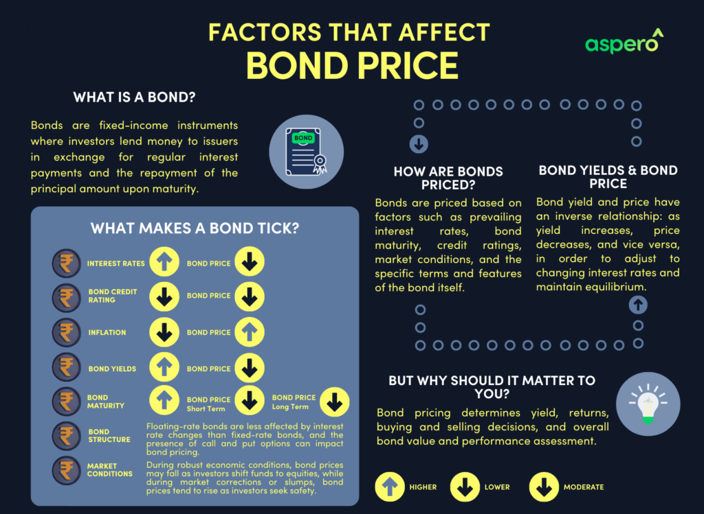

The bond market stands as a cornerstone of the global financial system, playing a pivotal role in capital formation and investment. It provides issuers, including corporations and governments, with a mechanism to obtain funds for various purposes, from infrastructure projects to corporate expansions. Simultaneously, it offers investors a venue to achieve returns and diversify their portfolios through fixed-income securities.

Understanding how bond prices are determined is key to navigating this vast market. Bond prices fluctuate based on a myriad of factors: interest rate movements, macroeconomic conditions, and investor sentiment are just a few. As opposed to equities, bonds typically see their prices decrease when interest rates rise due to the inverse relationship between yield and price. Therefore, grasping these price dynamics allows both issuers to effectively manage their debt and investors to strategically pursue yield while accounting for risk.



Algorithmic trading has significantly transformed the landscape of the bond markets, injecting precision and efficiency into the complex process of bond valuation. With the ability to analyze massive datasets and execute trades at lightning speed, algorithms enhance the understanding of market dynamics and offer fine-tuned valuation methodologies. This modern approach to trading is crucial in a marketplace where speed and accuracy can confer substantial advantages.

This article will discuss the intricacies of bond pricing, from traditional valuation methods to advanced algorithmic strategies that optimize trading. By covering fundamental principles and sophisticated analytical approaches, it will offer insights into the strategies that underpin successful bond market operations today. As financial technology evolves, the integration of algorithms into bond valuation stands as a testament to the continuous innovation in financial markets, serving both issuers and investors in staying ahead in an increasingly competitive landscape.

## Table of Contents

## Understanding Bond Prices and Financial Markets

Bond prices are influenced by a range of factors, such as interest rates, economic conditions, and market sentiment. These elements collectively shape investor expectations and the intrinsic value of bonds.

Interest rates are a primary driver of bond prices. When interest rates rise, existing bonds with lower coupon rates become less attractive, leading to a drop in their prices. Conversely, when interest rates decline, bond prices generally increase as their fixed payments become more appealing relative to new issues with lower yields. This inverse relationship can be understood through the bond price formula:

$$
P = \sum_{t=1}^{n} \frac{C}{(1 + r)^t} + \frac{F}{(1 + r)^n}
$$

where $P$ is the price of the bond, $C$ is the coupon payment, $r$ is the discount rate (closely related to interest rates), $F$ is the face value of the bond, and $n$ is the number of periods until maturity. As the discount rate $r$ increases, the present value of the bond's future cash flows decreases, leading to a lower bond price.

Economic conditions also play a crucial role in determining bond prices. During periods of economic expansion, inflation expectations can rise, prompting increases in interest rates and consequently pressuring bond prices. On the other hand, in a recessionary environment, interest rates tend to fall as central banks strive to stimulate the economy, boosting bond prices as a result. Additionally, considerations such as the fiscal health of the issuing entity impact credit risk perceptions and subsequently influence bond pricing.

Market sentiment encapsulates the overall tone investors perceive in the financial markets. Negative sentiment may drive a flight to quality, where investors move capital into safer assets like government bonds, increasing demand and prices. Conversely, positive sentiment might lead to higher allocations in riskier asset classes, reducing demand for bonds and thus depressing their prices.

Supply and demand dynamics in financial markets are critical in setting bond prices. When a government or corporation issues new debt, an oversupply can lead to lower prices, while a high demand scenario, especially for particular maturities or credit qualities, can push prices upward. 

Understanding the correlation between bond markets and broader economic indicators is vital for investors, as it informs strategic decision-making. Economic indicators such as GDP growth rates, unemployment figures, and consumer price indices can give investors insights into future [interest rate](/wiki/interest-rate-trading-strategies) movements and bond price trends. Incorporating this information into analysis helps investors optimize their portfolios by selecting bonds that align with their risk-return preferences.

In conclusion, analyzing bond prices requires a multifaceted approach that considers various economic forces and market dynamics. This equips investors with critical insights to navigate the complexities of the bond market effectively.

## Fundamentals of Bond Valuation

Bond valuation involves calculating the present value of the expected future cash flows from a bond, which includes both periodic interest payments (coupons) and the repayment of the principal amount at maturity. The fundamental principle guiding this valuation is the time value of money, which recognizes the premise that a specific amount of money today is more valuable than the same amount in the future due to its potential [earning](/wiki/earning-announcement) capacity.

### Yield to Maturity (YTM)
Yield to maturity is a critical concept in bond valuation. It is the internal rate of return (IRR) of a bond, considering all scheduled payments until maturity. YTM can be calculated using the formula:

$$

P = \sum_{t=1}^{n} \frac{C}{(1 + YTM)^t} + \frac{F}{(1 + YTM)^n}
$$

Where:
- $P$ = Current bond price
- $C$ = Coupon payment
- $F$ = Face value of the bond
- $n$ = Number of periods until maturity
- $YTM$ = Yield to maturity

This calculation essentially balances the present value of the bond's cash flows with the bond's market price.

### Discount Rates and Time Value of Money
The discount rate used in bond valuation is often driven by prevailing interest rates in the market, reflecting an opportunity cost of capital. This rate is instrumental in determining the present value of future cash flows. A higher discount rate leads to a lower bond valuation, reinforcing the inverse relationship between interest rates and bond prices.

### Factors Influencing Bond Valuation
Several factors significantly influence bond valuation:
- **Credit Ratings:** Bonds with higher credit ratings are deemed lower risk, resulting in lower yields compared to those with lower ratings. Institutional investors often rely on ratings from agencies like Moody’s or S&P when assessing bond risks.
- **Coupon Rate:** The bond's coupon rate, or the interest rate the bond issuer will pay on the face value of the bond, directly affects its valuation, especially in the context of market interest rates.
- **Maturity:** Bonds with longer maturities are more sensitive to interest rate changes, affecting their price volatility and valuation.

### Traditional and Algorithmic Valuation Approaches
Traditional bond valuation approaches rely heavily on the principles of discounted cash flows and can be calculated manually or with the use of financial calculators. However, with advancements in computational methods, algorithmic techniques offer more precise and dynamic models for valuation. These algorithms can efficiently handle large datasets, incorporating real-time data for more accurate valuations. For instance, [machine learning](/wiki/machine-learning) algorithms can model the relationships between interest rate changes, economic indicators, and bond prices, providing nuanced insights and predictions.

Using Python, a simple bond valuation can be programmed as follows:

```python
def calculate_bond_price(face_value, coupon_rate, periods, ytm):
    bond_price = 0.0
    for t in range(1, periods + 1):
        bond_price += (face_value * coupon_rate) / (1 + ytm) ** t
    bond_price += face_value / (1 + ytm) ** periods
    return bond_price

# Example usage
bond_price = calculate_bond_price(face_value=1000, coupon_rate=0.05, periods=10, ytm=0.04)
print(f"The bond price is: {bond_price}")
```

The integration of such algorithmic approaches enhances accuracy and efficiency in bond valuation, providing indispensable tools for investors and financial professionals who need to assess and react to market conditions swiftly.

## Algorithmic Trading and Bond Markets

Algorithmic trading has become a transformative force in the bond markets, utilizing complex mathematical models to refine bond valuation and optimize trading strategies. The application of such algorithms allows financial institutions and investors to process extensive datasets rapidly, empowering them to identify trading opportunities and mitigate risks with enhanced precision. At its core, [algorithmic trading](/wiki/algorithmic-trading) leverages the speed and analytical capabilities of computers to execute trades based on pre-defined criteria, which can include factors such as price movements, market conditions, or [arbitrage](/wiki/arbitrage) opportunities.

One of the most prominent forms of algorithmic trading is high-frequency trading ([HFT](/wiki/high-frequency-trading-strategies)). HFT involves executing a large number of orders at extremely fast speeds to capitalize on small price discrepancies that exist for very short durations. In bond markets, this approach aids in enhancing [liquidity](/wiki/liquidity-risk-premium), as orders are executed almost instantaneously, attracting both buyers and sellers.

Machine learning models further augment the capabilities of algorithmic trading by enabling the development of predictive analytics that facilitate more precise forecasting of bond prices. These models can learn from past data to forecast future movements, adapting to market changes and improving decision-making processes. A simple implementation of a machine learning model for bond price prediction could look like this in Python:

```python
from sklearn.ensemble import RandomForestRegressor
from sklearn.model_selection import train_test_split
from sklearn.metrics import mean_squared_error

# Sample dataset with features and bond prices
features = [...]  # List of feature vectors
bond_prices = [...]  # Corresponding bond prices

# Splitting data into training and testing sets
X_train, X_test, y_train, y_test = train_test_split(features, bond_prices, test_size=0.2, random_state=42)

# Initialize and train the Random Forest model
model = RandomForestRegressor()
model.fit(X_train, y_train)

# Predicting bond prices
predictions = model.predict(X_test)

# Evaluate model performance
mse = mean_squared_error(y_test, predictions)
print(f'Mean Squared Error: {mse}')
```

In addition to enhancing pricing efficiency, algorithmic trading improves market dynamics by providing better liquidity. By continuously adjusting to incoming data, algorithms help maintain a balance between buy and sell orders, thus stabilizing the market. Moreover, this approach reduces human error and emotional decision-making, leading to more disciplined execution of trades.

Despite these advantages, the implementation of algorithmic trading in bond markets is not without challenges. Ensuring data quality and adhering to regulatory compliance remain critical concerns. Nevertheless, with continuing advancements in technology and data analytics, algorithmic trading is expected to further integrate into trading platforms, driving efficiency and effectiveness in bond markets.

## Advanced Techniques in Bond Valuation

Machine learning models play a pivotal role in the advancement of bond valuation techniques, offering enhanced capabilities for predicting bond prices with greater precision. These models leverage vast datasets to identify patterns and trends that human analysts might overlook, thus improving the accuracy of forecasts.

One key aspect of using machine learning in bond valuation is predictive analytics. By employing techniques such as regression analysis, decision trees, and more sophisticated models like random forests and gradient boosting, investors can better predict future bond prices based on historical data and market indicators. Machine learning algorithms can adjust for changes in variables such as interest rates, economic activity, and credit ratings, providing a comprehensive model for price prediction.

Risk assessment and mitigation are crucial components when dealing with uncertainties inherent in bond markets. Machine learning algorithms can assess risk by analyzing market [volatility](/wiki/volatility-trading-strategies), economic shifts, and issuer creditworthiness. Techniques such as clustering and classification help in identifying risky securities and categorizing them based on their risk levels. This allows investors to implement strategies to hedge against potential losses and optimize their portfolios accordingly.

Optimization algorithms are also central to improving decision-making processes in bond investing. By utilizing optimization models, investors can construct portfolios that maximize returns while minimizing risks. These algorithms consider various constraints and objectives, such as risk-adjusted return and investment horizon, to suggest the best possible asset allocation. For instance, linear programming and genetic algorithms can be employed to solve complex portfolio optimization problems efficiently.

Furthermore, the understanding of complex patterns through advanced algorithms like neural networks provides a significant competitive edge. Neural networks, with their ability to model non-linear relationships, are particularly useful in capturing intricate dependencies among various market factors influencing bond prices. Deep learning models, which are a subset of neural networks, can process and learn from unstructured data, offering insights that extend beyond traditional analytics.

A simple implementation of a [neural network](/wiki/neural-network) for bond price prediction in Python using the TensorFlow library could look like this:

```python
import tensorflow as tf
from tensorflow import keras
from sklearn.model_selection import train_test_split

# Assuming bond_data is a pandas DataFrame containing bond features and prices
features = bond_data.drop(columns=['price'])
target = bond_data['price']

# Split the data
X_train, X_test, y_train, y_test = train_test_split(features, target, test_size=0.2, random_state=42)

# Define a simple neural network model
model = keras.Sequential([
    keras.layers.Dense(64, activation='relu', input_shape=(X_train.shape[1],)),
    keras.layers.Dense(32, activation='relu'),
    keras.layers.Dense(1) # Single output for price prediction
])

# Compile the model
model.compile(optimizer='adam', loss='mean_squared_error')

# Train the model
model.fit(X_train, y_train, epochs=100, batch_size=32, validation_data=(X_test, y_test))
```

This code demonstrates the basic setup of using neural networks to predict bond prices based on input features. Such models can be fine-tuned and expanded to include more layers and nodes, adjust hyperparameters, and incorporate advanced techniques like dropout for regularization.

Overall, integrating machine learning models and advanced algorithms in bond valuation not only enhances predictive accuracy and risk management but also provides robust tools for building optimal, lucrative bond portfolios. These techniques continue to evolve with technological advancements, presenting new opportunities for investors to gain a strategic advantage.

## Challenges and Future Trends

Algorithmic trading in bond markets has transformed trading strategies, enhancing efficiency and accuracy. However, this transformation comes with its set of challenges, particularly around data quality and regulatory constraints. Precise and reliable data are essential for the development and functioning of trading algorithms. Inaccurate or incomplete data can lead to faulty trading signals and poor performance, ultimately impacting investment returns. To mitigate these issues, continuous improvements in data collection and curation processes are necessary, ensuring the integrity and accuracy of the data being used.

Regulatory constraints also pose significant challenges. Financial markets are subject to stringent regulations designed to maintain stability and prevent market abuse. Algorithmic trading systems must comply with these regulations, necessitating the implementation of robust compliance mechanisms. This includes ensuring that algorithms do not engage in manipulative practices, such as spoofing or layering, and that they are capable of responding correctly to market conditions to prevent systemic risk.

Risks inherent in bond markets, such as interest rate and credit risks, also require ongoing management. Interest rate risk arises because of the inverse relationship between interest rates and bond prices. As interest rates fluctuate, the value of bonds and their yields can change, affecting returns on investment. Credit risk involves the possibility that bond issuers may not fulfill their payment obligations, which can occur due to changing economic conditions or issuer-specific financial difficulties. To counter these risks, sophisticated risk assessment models are needed to evaluate the probability of adverse events and to devise appropriate mitigation strategies.

An emerging trend in the bond markets is the increasing integration of [artificial intelligence](/wiki/ai-artificial-intelligence) (AI) into trading platforms. AI technologies, such as machine learning and natural language processing, provide enhanced analytical capabilities, allowing traders to process vast datasets and uncover insights that were previously unattainable. These technologies can identify patterns and relationships within the data, thereby improving the precision of trading decisions and efficiency of market operations.

As financial markets evolve, the importance of continuous learning and adaptation cannot be overstated for both investors and financial professionals. Staying ahead of technological advancements, regulatory changes, and market dynamics is essential for success. Comprehensive education and training programs, coupled with cutting-edge research, will play crucial roles in equipping market participants with the necessary tools and knowledge to thrive in the rapidly changing landscape of bond markets.

## References & Further Reading

[1]: ["Advances in Financial Machine Learning"](https://www.amazon.com/Advances-Financial-Machine-Learning-Marcos/dp/1119482089) by Marcos Lopez de Prado

[2]: ["Machine Learning for Algorithmic Trading"](https://github.com/stefan-jansen/machine-learning-for-trading) by Stefan Jansen

[3]: ["Handbook of Fixed-Income Securities"](https://www.amazon.com/Handbook-Fixed-Income-Securities-Ninth/dp/1260473899) by Frank J. Fabozzi

[4]: Bergstra, J., Bardenet, R., Bengio, Y., & Kégl, B. (2011). ["Algorithms for Hyper-Parameter Optimization."](https://dl.acm.org/doi/10.5555/2986459.2986743) Advances in Neural Information Processing Systems 24.

[5]: ["Quantitative Trading: How to Build Your Own Algorithmic Trading Business"](https://github.com/LucindaYa/quant-resources/blob/master/Quantitative%20Trading%20How%20to%20Build%20Your%20Own%20Algorithmic%20Trading%20Business.pdf) by Ernest P. Chan