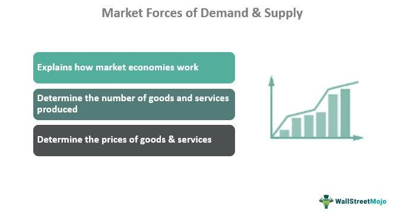

Microeconomics provides foundational insights into how individuals, households, and firms allocate scarce resources, influencing decision-making processes that underpin economic activities. Central to microeconomics are the market forces of supply and demand, which are fundamental in determining prices and output levels in diverse markets. Supply and demand frameworks illustrate the interaction between consumer desires and producer capabilities, creating a balance known as market equilibrium where the quantity supplied equals the quantity demanded.

Competition among businesses is another crucial microeconomic factor, shaping market operations from perfect competition to monopolies. Perfectly competitive markets, characterized by numerous buyers and sellers, usually lead to firms being price takers. In contrast, monopolies emerge when a single firm dominates, allowing price setting due to the absence of competition. Oligopolies and monopolistic competition occupy the spectrum in between, where few firms hold significant market power, and strategic interactions become critical.



Algorithmic trading has revolutionized financial markets, leveraging algorithms to execute trades at optimal prices. This advancement utilizes microeconomic principles by analyzing supply and demand data patterns to discover prices and identify market trends. Algorithmic trading enhances market efficiency, increases liquidity, and optimizes the market microstructure. Furthermore, through sophisticated risk management strategies, it balances investment portfolios against market volatilities, amplifying profitability.

This article explores how market forces and competition influence microeconomic landscapes and their integration with algorithmic trading in modern financial markets. The synthesis of microeconomic theories with algorithmic strategies promises to innovate trade execution and enhance competitive stances in a digital era, impacting global markets significantly.

## Table of Contents

## Understanding Microeconomic Market Forces

Microeconomic market forces are primarily driven by the dynamics of supply and demand, which serve as the foundational mechanisms for the allocation of goods and services. These forces dictate market behavior and influence economic decisions at individual, household, and firm levels.

**Supply and Demand Dynamics**

The interplay between supply and demand is fundamental to understanding market forces. The supply curve illustrates the relationship between the price of a good and the quantity that producers are willing to supply. Typically, as the price of a good increases, suppliers are more willing to offer greater quantities, resulting in an upward-sloping supply curve. Conversely, the demand curve shows how much of a good consumers are willing and able to purchase at various price points. Generally, as the price decreases, consumers tend to purchase more, leading to a downward-sloping demand curve.

The intersection of the supply and demand curves denotes the market equilibrium, a state where the quantity supplied equals the quantity demanded. At this point, the market price stabilizes because there is no incentive for price change due to excess supply or demand. A formulaic approach to this equilibrium can be represented by solving the equations of the supply and demand curves:

$$
Q_s = Q_d
$$

where $Q_s$ is the quantity supplied and $Q_d$ is the quantity demanded. Solving these equations yields the equilibrium price and quantity.

**Role of Elasticity**

Elasticity is a pivotal concept that measures the responsiveness of the quantity supplied or demanded to changes in price or other economic variables. Price elasticity of demand, for instance, is calculated as:

$$
E_d = \frac{\%\ \Delta Q_d}{\%\ \Delta P}
$$

where $E_d$ denotes the price elasticity of demand, $\Delta Q_d$ is the change in quantity demanded, and $\Delta P$ is the change in price.

High elasticity suggests that a small price change leads to a significant change in the quantity demanded or supplied, a crucial [factor](/wiki/factor-investing) for pricing strategies and forecasting economic outcomes. Conversely, inelastic goods are less responsive to price changes, indicating that consumers will buy similar quantities regardless of price alterations, typically seen in essential goods.

Understanding supply and demand dynamics, along with elasticity, allows economists and businesses to predict market trends, devise strategic pricing, and make informed decisions regarding production and investment, all of which are essential to navigating the economic landscape efficiently.

## Competition and Market Structures

Market structures significantly influence how firms compete within an economy. These structures provide a framework for analyzing the competitive dynamics and strategic behaviors that occur in various industries. Three primary market structures are instrumental in this analysis: perfect competition, monopoly, and oligopoly. 

**Perfect Competition:**

In a perfectly competitive market, numerous buyers and sellers interact, each unable to influence market prices significantly. This condition leads firms to be price takers, meaning they accept the market price as given. Key characteristics of perfect competition include homogeneous products, no barriers to entry or [exit](/wiki/exit-strategy), perfect information, and zero long-term economic profit for firms due to price equalling marginal cost (P = MC). The presence of many sellers and a lack of product differentiation ensures that firms must compete solely on price, leading to an efficient allocation of resources.

**Monopoly:**

In stark contrast, a monopoly contains a single firm that dominates the market, allowing it to set prices above marginal cost without losing all its customers. Factors such as unique resource ownership, government regulations, or high start-up costs contribute to barriers to entry, preventing potential competitors from entering the market. A monopolist maximizes profit where marginal revenue equals marginal cost (MR = MC), often leading to higher prices and reduced output compared to more competitive markets. The lack of substitutes grants the monopolist considerable pricing power, often resulting in consumer surplus diminution and potential market inefficiencies.

**Oligopoly:**

Oligopolies consist of a few dominant firms whose competitive interactions significantly affect market outcomes. These firms may produce differentiated or homogeneous products and often engage in strategic behavior, aware that their actions have a direct influence on competitors. Consequently, game theory becomes an essential tool for analyzing oligopoly dynamics. The strategic dependence characterizing oligopoly can lead to various market outcomes, like collusion to form a cartel, non-cooperative rivalries causing price wars, or coordination to enhance mutual profitability. Common examples include industries such as automobiles, telecommunications, and airlines, where large-scale operations result in concentrated market power.

Several factors influence competition within these market structures:

- **Product Differentiation:** The extent to which businesses distinguish their products influences market power and competitive behavior. Higher differentiation often leads to increased pricing power and consumer loyalty.

- **Number of Sellers:** The number of firms actively competing determines the intensity of competition, influencing pricing strategies and market control.

- **Barriers to Entry:** High capital requirement, economies of scale, and regulatory constraints determine the ease with which new firms can enter the market.

- **Availability of Information:** Perfect information reduces market power, leading firms to make strategic decisions based on accurate market conditions.

- **Geographical Location:** Proximity can influence market size and accessibility, impacting competitive edge and cost structures.

Understanding these market structures and competitive influences is pivotal for firms strategizing to enhance profitability and for policymakers aiming to foster efficient and fair markets.

## Algorithmic Trading: Harnessing Microeconomic Principles

Algorithmic trading, commonly known as algo trading, employs sophisticated algorithms to autonomously execute trading decisions and transactions in financial markets. These algorithms rely heavily on microeconomic models—particularly those related to price discovery mechanisms—to identify optimal trading opportunities. By analyzing historical and real-time data patterns, particularly fluctuations in supply and demand, algo trading systems can anticipate market trends with a high degree of accuracy.

Microeconomic principles are central to understanding how these algorithms function. For example, the law of supply and demand dictates that prices are determined by the relationship between the quantity supplied and the quantity demanded. Algo trading systems integrate this principle by continuously monitoring variables such as bid-ask spreads, trading volumes, and market depth to predict future price movements. This capability allows algorithms to dynamically adjust their trading strategies in response to changing market conditions, thereby optimizing the timing and execution of trades.

Algorithmic trading significantly enhances market efficiency by contributing to improved [liquidity](/wiki/liquidity-risk-premium) and ensuring a more robust market microstructure. Liquidity, defined as the ease with which an asset can be bought or sold in the market without affecting its price, is vital for ensuring that transactions can be completed swiftly and with minimal cost. Algo trading contributes to market liquidity by executing numerous trades rapidly and efficiently, often bridging the gap between buyers and sellers.

Furthermore, the microstructure of financial markets refers to the mechanisms and arrangements through which trading occurs, including transaction costs, market transparency, and the speed of trade execution. Algorithms improve this microstructure by reducing transaction costs through better price discovery and enabling faster execution of trades, thereby facilitating smoother market operations.

In terms of risk management, [algorithmic trading](/wiki/algorithmic-trading) uses microeconomic theories to balance investment portfolios, taking into account market volatilities. Algorithms assess the risk-return profiles of various assets by analyzing factors such as price variance, market trends, and economic indicators. By diversifying investments across a range of asset classes and employing hedging techniques, these systems can optimize portfolio performance while managing exposure to potential market downturns.

For instance, a simple algorithm might use the following Python code to calculate expected returns based on historical price data:

```python
import numpy as np

def expected_returns(prices):
    returns = np.diff(prices) / prices[:-1]
    return np.mean(returns)

prices = [100, 105, 102, 108, 112]
print(f"Expected return: {expected_returns(prices):.2%}")
```

This basic example demonstrates how historical data can be translated into actionable insights regarding future asset performance. By employing such calculations, algo trading systems can make informed decisions that align with microeconomic principles to manage portfolios effectively.

Overall, the fusion of microeconomic principles with advanced algorithmic technologies epitomizes the modern evolution of trading, optimizing market engagement through greater precision, efficiency, and risk management capabilities.

## Impact of Competition on Algorithmic Trading Strategies

The level of competition within financial markets significantly shapes the design and effectiveness of algorithmic trading strategies. In highly competitive markets, firms often employ high-frequency trading ([HFT](/wiki/high-frequency-trading-strategies)) algorithms to secure advantages in price efficiency and execution speed. HFT algorithms are designed to process and execute a large number of orders at extremely high speeds, often within milliseconds. This rapid execution is crucial in these environments, where even the smallest delay can lead to significant financial losses.

Mathematically, this can be understood through the concept of latency [arbitrage](/wiki/arbitrage). High-frequency traders capitalize on the small time difference between receiving market information and executing trades faster than other participants. The profit ΔP obtained through latency arbitrage can be represented as:

$$
\Delta P = V \times (\Delta T \times \sigma)
$$

where $V$ is the volume traded, $\Delta T$ is the latency (time advantage), and $\sigma$ is the volatility of the asset.

In markets characterized by oligopolistic structures or monopolistic competition, algorithmic trading strategies often focus on exploiting the strategic interactions among the few dominant market players. Firms may use game theoretical models to predict competitors' behaviors and adjust their strategies accordingly. For example, Nash Equilibrium concepts can help traders determine optimal bid and ask prices by considering the potential responses of other market participants.

Moreover, sophisticated algorithms are developed to accommodate differentiated strategies that account for market power, barriers to entry, and product differentiation inherent in less competitive market structures. These algorithms analyze historical market data to identify patterns and trends that suggest strategic moves by competitors.

Efficient competition analysis is crucial for algorithmic traders to adapt to rapid changes in market conditions and regulatory landscapes. This includes monitoring market fragmentation, where orders are distributed across multiple trading venues. Traders utilize algorithms to ensure effective order routing, achieving the best possible execution.

Algorithmic traders must also stay attuned to shifts in regulatory frameworks, as authorities may impose constraints on certain trading practices or enhance transparency requirements, impacting how strategies are formulated. Adaptive algorithms that modify their parameters in real-time based on feedback from market conditions can help maintain agility.

In summary, competition significantly impacts algorithmic trading strategies by dictating whether firms prioritize speed or strategic decision-making. Whether operating in highly competitive markets with high-frequency trading or navigating the complexities of monopolistic and oligopolistic environments, successful algorithmic trading hinges on leveraging technology to anticipate and respond to competitive dynamics efficiently.

## Conclusion

Microeconomic market forces and competition exert significant influence on the global economic environment, providing the framework within which businesses operate. These elements are crucial as they determine how resources are allocated, prices are set, and markets are structured. In contemporary financial markets, algorithmic trading stands out as a technological development that intersects fundamentally with microeconomics. This fusion has transformed the way trading occurs, introducing a level of precision and efficiency that leverages the underlying market principles. 

Algorithmic trading involves the use of computer algorithms to automate trading processes with the goal of executing trades at the most advantageous prices. These algorithms are informed by microeconomic principles such as supply, demand, and price elasticity. By integrating these principles, algorithms can predict market movements, identify pricing inefficiencies, and execute trades at optimal moments, thus enhancing market liquidity and depth. This technological advancement allows traders to navigate complex markets with a degree of sophistication that manual trading cannot achieve.

Firms and traders that understand and harness these microeconomic principles can improve their competitive edge and profitability. For instance, traders who utilize algorithms informed by economic theories can better anticipate and respond to market changes, optimizing their trading strategies accordingly. These strategies can be further refined using data analysis and [machine learning](/wiki/machine-learning) techniques to identify patterns and insights that drive decision-making.

The continued integration of economic theories with advanced trading technologies is poised to redefine global financial markets. As algorithmic trading systems evolve, they are likely to incorporate even more sophisticated economic models and [artificial intelligence](/wiki/ai-artificial-intelligence) capabilities, making them more adaptive to rapid market dynamics. This evolution could lead to more stable and efficient markets, benefiting not only traders but the entire financial ecosystem.

In conclusion, as the boundaries between technology and economics blur, the potential for innovation in trade execution grows. By bridging these disciplines, traders and firms position themselves at the forefront of an ever-changing financial landscape, ensuring their strategies are both competitive and aligned with future market developments.

## References & Further Reading

[1]: ["Microeconomic Theory"](https://ocw.mit.edu/courses/14-121-microeconomic-theory-i-fall-2015/) by Andreu Mas-Colell, Michael D. Whinston, and Jerry R. Green

[2]: Varian, H. R. (1992). ["Microeconomic Analysis,"](https://archive.org/details/microeconomicana00vari_0) 3rd Edition, W.W. Norton & Company.

[3]: Hasbrouck, J. (2007). ["Empirical Market Microstructure: The Institutions, Economics, and Econometrics of Securities Trading."](https://academic.oup.com/book/52241) Oxford University Press.

[4]: Aldridge, I. (2013). ["High-Frequency Trading: A Practical Guide to Algorithmic Strategies and Trading Systems."](https://www.ahmetbeyefendi.com/wp-content/uploads/2020/07/High-Frequency-Trading-Irene-Aldridge.pdf) John Wiley & Sons.

[5]: Lo, A. W. (2008). ["Hedge Funds: An Analytic Perspective."](https://www.jstor.org/stable/j.ctt7rq28) Princeton University Press.

[6]: Goolsbee, A., Levitt, S., & Syverson, C. (2020). ["Microeconomics."](https://www.macmillanlearning.com/ed/uk/product/Microeconomics--4th-edition/p/1319544290) Worth Publishers.